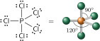

# A estrutura molecular

As estruturas de Lewis mostram os elos entre os átomos e a presença de pares isolados. Porém, exceto em casos simples, estas estruturas não dizem nada sobre como os átomos estão arranjados no espaço. Neste tópico, as ideias de Lewis são discutidas para ajudá-lo a predizer a forma de moléculas simples.

## O modelo VSEPR básico

Considere uma molécula formada por um átomo central ao qual os outros átomos estão ligados. Muitas dessas moléculas têm a forma das figuras geométricas apresentadas na Figura 1. Assim, $\ce{CH4}$ é um tetraedro, $\ce{SF6}$ é um octaedro e $\ce{PCl5}$ é uma bipirâmide trigonal.

Em muitos casos, os **ângulos de ligação**, isto é, os ângulos entre ligações adjacentes (as linhas retas que unem os núcleos ao átomo central), são fixados pela simetria da molécula. Esses ângulos de ligação são mostrados na Figura 1. Assim, o ângulo $\ce{H-C-H}$ de $\ce{CH4}$ é $\pu{109,5}^\circ$ (o *ângulo do tetraedro*), os ângulos $\ce{F-S-F}$ de $\ce{SF6}$ são $\pu{90}^\circ$ e $\pu{180}^\circ$ , e os ângulos $\ce{Cl-P-Cl}$ do $\ce{PCl5}$ são $\pu{90}^\circ$, $\pu{120}^\circ$ e $\pu{180}^\circ$. Os ângulos de ligação de moléculas que não são determinados pela simetria têm e ser determinados experimentalmente. O ângulo de ligação $\ce{H-O-H}$ da molécula angular $\ce{H2O}$, por exemplo, é, experimentalmente, igual a $\pu{104,5}^\circ$, e o ângulo $\ce{H-N-H}$ da molécula $\ce{NH3}$, uma pirâmide trigonal, é $\pu{107}^\circ$. A principal técnica experimental para determinar os ângulos de ligação de moléculas pequenas é a espectroscopia, especialmente as espectroscopias rotacional e vibracional. A difração de raios X é usada para moléculas maiores. Conhecer as formas das moléculas e os seus ângulos de ligação é essencial no projeto de um novo fármaco utilizando técnicas computacionais.

As estruturas de Lewis (Tópico 1D) mostram apenas como os átomos estão ligados e como os elétrons estão arranjados em torno deles. O **modelo da repulsão dos pares de elétrons da camada de valência** (modelo VSEPR) amplia a teoria da ligação química de Lewis incluindo regras para explicar as formas das moléculas e os ângulos de ligação:

- **Regra 1**: As regiões de altas concentrações de elétrons (ligações e pares isolados do átomo central) se repelem e, para reduzir essa repulsão, elas tendem a se afastar o máximo possível, mantendo a mesma distância do átomo central (Figura 1).

Estas localizações *mais distantes* descrevem a configuração eletrônica da molécula. Após a identificação deste arranjo, a posição dos átomos é determinada e a forma da molécula é estabelecida com base na Figura 1. Observe que, para nomear a forma da molécula, apenas a posição dos átomos é considerada. Os pares isolados que possam estar presentes no átomo central são ignorados, mesmo que afetem esta forma.

A molécula do $\ce{BeCl2}$ tem apenas dois átomos ligados ao átomo central. Não existem pares isolados de elétrons no átomo central. A posição na qual os pares ligantes estão mais afastados é quando eles se encontram em lados opostos do átomo de $\ce{Br}$ e o arranjo dos elétrons é linear. Os átomos de $\ce{Cl}$ estão, portanto, em lados opostos do átomo de $\ce{Be}$ e o modelo VSEPR prediz a forma linear para a molécula de $\ce{BeCl2}$, com um ângulo de ligação igual a $\pu{180}^\circ$:

A molécula do trifluoreto de boro, $\ce{BF3}$, tem três pares ligantes no átomo central e nenhum par isolado. De acordo com o modelo VSEPR, para ficarem o mais afastados possível, os três pares ligantes têm de estar nos vértices de um triângulo equilátero. O arranjo de elétrons é trigonal planar. Como um átomo de flúor liga-se a um dos pares de elétrons, a molécula $\ce{BF3}$ é trigonal planar e os três ângulos $\ce{F-B-F}$ são iguais a $\pu{120}^\circ$:

O metano, $\ce{CH4}$, tem quatro pares ligantes no átomo central. Para ficarem o mais afastados possível, os quatro pares devem estar em um arranjo tetraédrico em torno do átomo de $\ce{C}$. Como o arranjo de elétrons é tetraédrico e um átomo de $\ce{H}$ liga-se a cada um dos pares de elétrons, o modelo VSEPR prediz que a molécula seja tetraédrica, com ângulos de ligação de $\pu{109,5}^\circ$:

Na molécula de pentacloreto de fósforo, $\ce{PCl5}$, existem cinco pares ligantes e nenhum par isolado no átomo central. De acordo com o modelo VSEPR, os cinco pares e os átomos a que eles se ligam devem estar afastados o máximo possível em um arranjo de bipirâmide trigonal. Nesse arranjo, três átomos (os átomos **equatoriais**) estão nos vértices de um triângulo equilátero, com ângulos de ligação iguais a  $\pu{120}^\circ$. Os outros dois átomos (os átomos **axiais**) estão acima e abaixo do plano do triângulo, em ângulos de $\pu{90}^\circ$ em relação aos átomos equatoriais. A forma prevista da molécula é bipirâmide trigonal:

A molécula de hexafluoreto de enxofre, $\ce{SF6}$, tem seis átomos ligados ao átomo central de $\ce{S}$, que não tem pares isolados. De acordo com o modelo VSEPR, o arranjo de elétrons octaédrico, com quatro pares nos vértices de um quadrado planar e os dois outros pares acima e abaixo do plano do quadrado. Um átomo de $\ce{F}$ está ligado a cada par de elétrons, o que indica que a molécula é octaédrica, com ângulos de ligação de $\pu{90}^\circ$ e $\pu{180}^\circ$:

:::warning

### Atenção

Os seis átomos terminais são equivalentes em uma molécula octaédrica regular.

:::

A segunda regra do modelo VSEPR diz respeito ao tratamento de ligações múltiplas:

- **Regra 2**: Uma ligação múltipla é tratada como uma única região de alta concentração de elétrons.

Dito de outra forma, os dois pares de elétrons de uma ligação dupla permanecem juntos e repelem outras ligações ou pares isolados como se fossem uma unidade. Os três pares de elétrons de uma ligação tripla também ficam juntos e agem como uma única região de alta concentração de elétrons. Assim, a molécula de dióxido de carbono, $\ce{CO2}$, tem estrutura semelhante à da molécula de $\ce{BeCl2}$, mesmo com as ligações duplas: 

No íon carbonato, $\ce{CO3^{2-}}$, os dois pares de elétrons da ligação dupla são tratados como uma unidade, e a forma resultante é trigonal planar: 

Seja simples ou múltipla, toda ligação age como uma unidade. Portanto, para contar o número de regiões de alta concentração de elétrons, basta contar o número de átomos ligados ao átomo central e adicionar o número de pares isolados.

## As moléculas com pares isolados no átomo central

Qualquer coisa

## As moléculas polares

# A teoria da ligação de valência

A **teoria da ligação de valência** (teoria VB) é a descrição da ligação covalente em termos dos orbitais atômicos. Concebida por Walter Heitler, Fritz London, John Slater e Linus Pauling no final da década de 1920, a teoria VB é um modelo quantomecânico da distribuição dos elétrons pelas ligações que vai além da teoria de Lewis e do modelo VSEPR e permite o cálculo numérico dos ângulos e dos comprimentos de ligação. Os conceitos e a linguagem em que ela se baseia são utilizados em toda a química.

O modelo de Lewis das ligações covalentes (Tópico 1D) pressupõe que cada par de elétrons ligantes está localizado entre dois átomos ligados --- é um modelo de elétrons localizados. No entanto, a posição de um elétron em um átomo não pode ser descrita de forma precisa, mas somente em termos da probabilidade de encontrá-lo em algum lugar do espaço definido pelo orbital (Tópico 1B). A teoria da ligação de valência leva em conta a natureza ondulatória dos elétrons.

## As ligações sigma e pi

> Segundo a teoria da ligação de valência, as ligações se formam quando os elétrons dos orbitais atômicos da camada de valência formam pares; os orbitais atômicos se sobrepõem cabeça‑cabeça para formar ligações σ ou lateralmente para formar ligações $\pi$.

## A promoção de elétrons e a hibridação de orbitais

> A promoção de elétrons só ocorrerá se o resultado for o abaixamento da energia provocado pela formação de novas ligações. Os orbitais híbridos são formados em um átomo para reproduzir o arranjo dos elétrons que é característico da forma experimental determinada para a molécula.

## Os tipos comuns de hibridação

## As características das ligações múltiplas

> Nas ligações múltiplas, um átomo forma uma ligação $\sigma$, usando um orbital híbrido $\mathrm{sp}$ ou $\mathrm{sp^2}$, e uma ou mais ligações $\pi$, usando orbitais $\mathrm{p}$ não hibridados. A superposição lateral que produz uma ligação $\pi$ restringe a rotação das moléculas, resulta em ligações mais fracas do que as ligações $\sigma$ e impede que átomos com raios maiores formem ligações múltiplas

