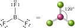

# A estrutura molecular

As estruturas de Lewis mostram os elos entre os átomos e a presença de pares isolados. Porém, exceto em casos simples, estas estruturas não dizem nada sobre como os átomos estão arranjados no espaço. Neste tópico, as ideias de Lewis são discutidas para ajudá-lo a predizer a forma de moléculas simples.

## O modelo VSEPR básico

Considere uma molécula formada por um átomo central ao qual os outros átomos estão ligados. Muitas dessas moléculas têm a forma das figuras geométricas apresentadas na Figura 1. Assim, $\ce{CH4}$ é um tetraedro, $\ce{SF6}$ é um octaedro e $\ce{PCl5}$ é uma bipirâmide trigonal.

Em muitos casos, os **ângulos de ligação**, isto é, os ângulos entre ligações adjacentes (as linhas retas que unem os núcleos ao átomo central), são fixados pela simetria da molécula. Esses ângulos de ligação são mostrados na Figura 1. Assim, o ângulo $\ce{H-C-H}$ de $\ce{CH4}$ é $\pu{109,5}^\circ$ (o *ângulo do tetraedro*), os ângulos $\ce{F-S-F}$ de $\ce{SF6}$ são $\pu{90}^\circ$ e $\pu{180}^\circ$ , e os ângulos $\ce{Cl-P-Cl}$ do $\ce{PCl5}$ são $\pu{90}^\circ$, $\pu{120}^\circ$ e $\pu{180}^\circ$. Os ângulos de ligação de moléculas que não são determinados pela simetria têm e ser determinados experimentalmente. O ângulo de ligação $\ce{H-O-H}$ da molécula angular $\ce{H2O}$, por exemplo, é, experimentalmente, igual a $\pu{104,5}^\circ$, e o ângulo $\ce{H-N-H}$ da molécula $\ce{NH3}$, uma pirâmide trigonal, é $\pu{107}^\circ$. A principal técnica experimental para determinar os ângulos de ligação de moléculas pequenas é a espectroscopia, especialmente as espectroscopias rotacional e vibracional. A difração de raios X é usada para moléculas maiores. Conhecer as formas das moléculas e os seus ângulos de ligação é essencial no projeto de um novo fármaco utilizando técnicas computacionais.

As estruturas de Lewis (Tópico 1D) mostram apenas como os átomos estão ligados e como os elétrons estão arranjados em torno deles. O **modelo da repulsão dos pares de elétrons da camada de valência** (modelo VSEPR) amplia a teoria da ligação química de Lewis incluindo regras para explicar as formas das moléculas e os ângulos de ligação:

- **Regra 1**: As regiões de altas concentrações de elétrons (ligações e pares isolados do átomo central) se repelem e, para reduzir essa repulsão, elas tendem a se afastar o máximo possível, mantendo a mesma distância do átomo central (Figura 1).

Estas localizações *mais distantes* descrevem a configuração eletrônica da molécula. Após a identificação deste arranjo, a posição dos átomos é determinada e a forma da molécula é estabelecida com base na Figura 1. Observe que, para nomear a forma da molécula, apenas a posição dos átomos é considerada. Os pares isolados que possam estar presentes no átomo central são ignorados, mesmo que afetem esta forma.

A molécula do $\ce{BeCl2}$ tem apenas dois átomos ligados ao átomo central. Não existem pares isolados de elétrons no átomo central. A posição na qual os pares ligantes estão mais afastados é quando eles se encontram em lados opostos do átomo de $\ce{Br}$ e o arranjo dos elétrons é linear. Os átomos de $\ce{Cl}$ estão, portanto, em lados opostos do átomo de $\ce{Be}$ e o modelo VSEPR prediz a forma linear para a molécula de $\ce{BeCl2}$, com um ângulo de ligação igual a $\pu{180}^\circ$:

A molécula do trifluoreto de boro, $\ce{BF3}$, tem três pares ligantes no átomo central e nenhum par isolado. De acordo com o modelo VSEPR, para ficarem o mais afastados possível, os três pares ligantes têm de estar nos vértices de um triângulo equilátero. O arranjo de elétrons é trigonal planar. Como um átomo de flúor liga-se a um dos pares de elétrons, a molécula $\ce{BF3}$ é trigonal planar e os três ângulos $\ce{F-B-F}$ são iguais a $\pu{120}^\circ$:

O metano, $\ce{CH4}$, tem quatro pares ligantes no átomo central. Para ficarem o mais afastados possível, os quatro pares devem estar em um arranjo tetraédrico em torno do átomo de $\ce{C}$. Como o arranjo de elétrons é tetraédrico e um átomo de $\ce{H}$ liga-se a cada um dos pares de elétrons, o modelo VSEPR prediz que a molécula seja tetraédrica, com ângulos de ligação de $\pu{109,5}^\circ$:

Na molécula de pentacloreto de fósforo, $\ce{PCl5}$, existem cinco pares ligantes e nenhum par isolado no átomo central. De acordo com o modelo VSEPR, os cinco pares e os átomos a que eles se ligam devem estar afastados o máximo possível em um arranjo de bipirâmide trigonal. Nesse arranjo, três átomos (os átomos **equatoriais**) estão nos vértices de um triângulo equilátero, com ângulos de ligação iguais a  $\pu{120}^\circ$. Os outros dois átomos (os átomos **axiais**) estão acima e abaixo do plano do triângulo, em ângulos de $\pu{90}^\circ$ em relação aos átomos equatoriais. A forma prevista da molécula é bipirâmide trigonal:

A molécula de hexafluoreto de enxofre, $\ce{SF6}$, tem seis átomos ligados ao átomo central de $\ce{S}$, que não tem pares isolados. De acordo com o modelo VSEPR, o arranjo de elétrons octaédrico, com quatro pares nos vértices de um quadrado planar e os dois outros pares acima e abaixo do plano do quadrado. Um átomo de $\ce{F}$ está ligado a cada par de elétrons, o que indica que a molécula é octaédrica, com ângulos de ligação de $\pu{90}^\circ$ e $\pu{180}^\circ$:

:::warning

### Atenção

Os seis átomos terminais são equivalentes em uma molécula octaédrica regular.

:::

A segunda regra do modelo VSEPR diz respeito ao tratamento de ligações múltiplas:

- **Regra 2**: Uma ligação múltipla é tratada como uma única região de alta concentração de elétrons.

Dito de outra forma, os dois pares de elétrons de uma ligação dupla permanecem juntos e repelem outras ligações ou pares isolados como se fossem uma unidade. Os três pares de elétrons de uma ligação tripla também ficam juntos e agem como uma única região de alta concentração de elétrons. Assim, a molécula de dióxido de carbono, $\ce{CO2}$, tem estrutura semelhante à da molécula de $\ce{BeCl2}$, mesmo com as ligações duplas: 

No íon carbonato, $\ce{CO3^{2-}}$, os dois pares de elétrons da ligação dupla são tratados como uma unidade, e a forma resultante é trigonal planar: 

Seja simples ou múltipla, toda ligação age como uma unidade. Portanto, para contar o número de regiões de alta concentração de elétrons, basta contar o número de átomos ligados ao átomo central e adicionar o número de pares isolados.

## As moléculas com pares isolados no átomo central

Qualquer coisa

> Nas moléculas que têm pares isolados ou um elétron desemparelhado no átomo central, os elétrons de valência contribuem para o arranjo de elétrons em volta do átomo central, mas só os átomos ligados são considerados na identificação da forma. Os pares isolados distorcem a forma da molécula para reduzir as repulsões entre pares isolados e pares ligantes.

## As moléculas polares

Uma ligação covalente polar, na qual os elétrons não estão igualmente distribuídos pelos átomos ligados, tem momento de dipolo diferente de zero (Tópico 2E). Uma **molécula polar** é uma molécula com momento de dipolo diferente de zero. Uma molécula diatômica é polar se sua ligação for polar. Uma molécula de $\ce{HCl}$ com sua ligação covalente polar é uma molécula polar:
$$
    \ce{ ^{$\delta +$}H-Cl^{$\delta -$} }
$$
Seu momento de dipolo, igual a $\pu{1,1 D}$, é típico de moléculas diatômicas polares. Todas as moléculas diatômicas formadas por átomos de elementos diferentes têm alguma polaridade. Uma **molécula não polar** é uma molécula cujo momento de dipolo elétrico é igual a zero. Todas as **moléculas diatômicas homonucleares**, formadas por átomos do mesmo elemento, como $\ce{O2}$, $\ce{N2}$ ou $\ce{Cl2}$, são não polares devido a suas ligações não polares.

Uma molécula poliatômica pode ser não polar mesmo se suas ligações forem polares. Por exemplo, os dois momentos de dipolo do dióxido de carbono, uma molécula linear, apontam para direções opostas e se cancelam. Por essa razão, o $\ce{CO2}$ é uma molécula não polar. No caso da água, os dois dipolos formam um ângulo de $104,5^\circ$ entre si e não se cancelam. Por isso, $\ce{H2O}$ é uma molécula polar. A polaridade é uma das razões pelas quais a água é um solvente tão bom para compostos iônicos.

Na comparação entre o $\ce{CO2}$ e a $\ce{H2O}$, você viu que a forma de uma molécula poliatômica define sua polaridade. O mesmo é válido para moléculas mais complexas. Por exemplo, os átomos e as ligações são os mesmos no *cis*-dicloroeteno e no *trans*-dicloroeteno; mas, neste último, as ligações $\ce{C-Cl}$ apontam para direções opostas e os dipolos (que estão sobre as ligações $\ce{C-Cl}$) se cancelam. Assim, enquanto o *cis*-dicloroeteno é polar, o trans-dicloroeteno é não polar.

Se os quatro átomos ligados ao átomo central de uma molécula tetraédrica forem iguais, como no tetraclorometano (tetracloreto de carbono), $\ce{CCl4}$, os momentos de dipolo se cancelam e a molécula é não polar. Entretanto, se um ou mais átomos terminais forem substituídos por átomos diferentes, como no triclorometano (clorofórmio), $\ce{CHCl3}$, ou por pares isolados, como no caso do $\ce{NH3}$, então os momentos de dipolo associados às ligações não se cancelam. Por isso, a molécula $\ce{CHCl3}$ é polar.

> Uma molécula diatômica é polar se sua ligação for polar. Uma molécula poliatômica é polar se tiver ligações polares orientadas no espaço de maneira que os momentos de dipolo associados às ligações não se cancelem.

# A teoria da ligação de valência

A **teoria da ligação de valência** (teoria VB) é a descrição da ligação covalente em termos dos orbitais atômicos. Concebida por Walter Heitler, Fritz London, John Slater e Linus Pauling no final da década de 1920, a teoria VB é um modelo quantomecânico da distribuição dos elétrons pelas ligações que vai além da teoria de Lewis e do modelo VSEPR e permite o cálculo numérico dos ângulos e dos comprimentos de ligação. Os conceitos e a linguagem em que ela se baseia são utilizados em toda a química.

O modelo de Lewis das ligações covalentes (Tópico 1D) pressupõe que cada par de elétrons ligantes está localizado entre dois átomos ligados --- é um modelo de elétrons localizados. No entanto, a posição de um elétron em um átomo não pode ser descrita de forma precisa, mas somente em termos da probabilidade de encontrá-lo em algum lugar do espaço definido pelo orbital (Tópico 1B). A teoria da ligação de valência leva em conta a natureza ondulatória dos elétrons.

## As ligações sigma e pi

Consideremos, inicialmente, a formação de $\ce{H2}$, a molécula mais simples. Cada átomo de hidrogênio no estado fundamental tem um elétron no orbital $\mathrm{1s}$ (Tópico 1B). A teoria da ligação de valência supõe que, quando os dois átomos $\ce{H}$ se aproximam, o par de elétrons $\mathrm{1s}$ e os orbitais atômicos se fundem:
$$
\begin{aligned}
    \ce{H} \;\;
    \overset{ \mathrm{1s^1} }{ \boxed{ \uparrow \hspace{5pt} } } & \\
    \Big| \sigma \\
    \underset{ \mathrm{1s^1} }{ \boxed{ \hspace{5pt} \downarrow } } & 
     \;\; \ce{H}
\end{aligned}
$$
A distribuição de elétrons resultante apresenta a forma de uma salsicha, tem densidade eletrônica acumulada entre os núcleos e é chamada de *ligação $\sigma$* (ligação sigma). Em linguagem técnica:

- Uma **ligação $\sigma$** é simetricamente cilíndrica (é igual em todas as direções ao longo do eixo) e não tem planos nodais contendo o eixo internuclear.

A fusão dos dois orbitais atômicos é chamada de **superposição** de orbitais. Um ponto importante a ter em mente é que quanto maior for a superposição dos orbitais, mais forte é a ligação.

Ligações semelhantes, do tipo $\sigma$, ocorrem nos halogenetos de hidrogênio. Por exemplo, antes da combinação dos átomos $\ce{H}$ e $\ce{F}$ para formar o fluoreto de hidrogênio, um elétron desemparelhado do átomo de flúor ocupa um orbital $2\mathrm{p}_z$ e o elétron desemparelhado do átomo de hidrogênio ocupa um orbital $\mathrm{1s}$:
$$
\begin{aligned}
    \ce{F} \;\; 
    \overset{ \mathrm{1s^2} }{ \boxed{ \uparrow \downarrow } } \;\;
    \overset{ \mathrm{2s^2} }{ \boxed{ \uparrow \downarrow } } \;\;
    \overset{ \mathrm{2p}_x^2 }{ \boxed{ \uparrow \downarrow } }\hspace{-0.4pt}
    \overset{ \mathrm{2p}_y^2 }{ \boxed{ \uparrow \downarrow } }\hspace{-0.4pt}
    \overset{ \mathrm{2p}_z^1 }{\boxed{ \uparrow \hspace{5pt} } } & \\
    \Big| \sigma \\
    \underset{ \mathrm{1s^2} }{ \boxed{ \hspace{5pt} \downarrow } } & 
    \;\; \ce{H}
\end{aligned}
$$
Estes elétrons se emparelham para formar uma ligação quando os orbitais que ocupam se superpõem e se fundem em uma nuvem que se espalha pelos dois átomos. Vista de lado, a ligação resultante tem forma mais complicada do que a das ligações $\sigma$ no $\ce{H2}$. No entanto, a ligação $\sigma$ no $\ce{HF}$, a qual compartilha muitas das características da ligação $\sigma$ do $\ce{H2}$, tem simetria cilíndrica ao longo do eixo internuclear ($z$) e não tem planos nodais contendo o eixo internuclear. Portanto, ela também é uma ligação $\sigma$. Todas as ligações covalentes são ligações $\sigma$.

A molécula do nitrogênio, $\ce{N2}$, apresenta um tipo diferente de ligação. Ela tem um elétron desemparelhado em cada um dos três orbitais $\mathrm{2p}$ de cada átomo:
$$
\begin{aligned}
    \ce{N} \;\; 
    \overset{ \mathrm{1s^2} }{ \boxed{ \uparrow \downarrow } } \;\;
    \overset{ \mathrm{2s^2} }{ \boxed{ \uparrow \downarrow } } \;\;
    \overset{ \mathrm{2p}_x^1 }{ \boxed{ \uparrow \hspace{5pt} } }\hspace{-0.4pt}
    \overset{ \mathrm{2p}_y^1 }{ \boxed{ \uparrow \hspace{5pt} } }\hspace{-0.4pt}
    \overset{ \mathrm{2p}_z^1 }{\boxed{ \uparrow \hspace{5pt} } } & \\
    \Big| \pi \hspace{6pt} \Big| \pi  \hspace{6pt} \Big| \sigma \\
    \underset{ \mathrm{2p}_x^1 }{ \boxed{ \hspace{5pt} \downarrow } }\hspace{-0.4pt}
    \underset{ \mathrm{2p}_y^1 }{ \boxed{ \hspace{5pt} \downarrow } }\hspace{-0.4pt}
    \underset{ \mathrm{2p}_z^1 }{\boxed{ \hspace{5pt} \downarrow } } &
    \;\; \underset{ \mathrm{2s^2} }{ \boxed{ \downarrow \uparrow } } 
    \;\; \underset{ \mathrm{1s^2} }{ \boxed{ \downarrow \uparrow } }
    \;\; \ce{N}
\end{aligned}
$$
Todavia, somente um dos três orbitais de cada átomo, que está no orbital $\mathrm{2p}_z$, consegue se sobrepor frontalmente para formar uma ligação $\sigma$. Dois dos orbitais $\mathrm{2p}$ de cada átomo ($\mathrm{2p}_x$ e $\mathrm{2p}_y$) são perpendiculares ao eixo internuclear e cada um deles contém um elétron desemparelhado. Quando esses elétrons, um de cada orbital $\mathrm{p}$ de um átomo de $\ce{N}$, se emparelham, seus orbitais só podem se sobrepor lado a lado. Esse tipo de superposição leva a uma *ligação $\pi$*, uma ligação em que os dois elétrons estão em dois lobos, um de cada lado do eixo internuclear. Mais formalmente:

- Uma **ligação $\pi$** tem um único plano nodal que contém o eixo internuclear.

Embora uma ligação $\pi$ tenha densidade eletrônica nos dois lados do eixo internuclear, existe só uma ligação em que a nuvem de elétrons tem dois lobos, como acontece com o orbital $\mathrm{p}$, que é um orbital com dois lobos. Em uma molécula com duas ligações $\pi$, como $\ce{N2}$, as densidades eletrônicas das duas ligações $\pi$ se fundem, e os dois átomos parecem rodeados por um cilindro de densidade eletrônica

:::think

### Ponto para pensar

Como se forma uma ligação $\delta$ (delta)?

:::

De modo geral, a teoria da ligação de valência pode ser usada nestes casos para descrever as ligações covalentes:

- Uma **ligação simples** é uma ligação $\sigma$.
- Uma **ligação dupla** é uma ligação $\sigma$ mais uma ligação $\pi$.
- Uma **ligação tripla** é uma ligação $\sigma$ mais duas ligações $\pi$.

> Segundo a teoria da ligação de valência, as ligações se formam quando os elétrons dos orbitais atômicos da camada de valência formam pares; os orbitais atômicos se sobrepõem cabeça‑cabeça para formar ligações $\sigma$ ou lateralmente para formar ligações $\pi$.

## A promoção de elétrons e a hibridação de orbitais

Algumas dificuldades são observadas quando a teoria VB é aplicada ao metano. O átomo de carbono tem a configuração $\ce{[He]}\,\mathrm{2s^2 2p_\mathnormal{x}^1 2p_\mathnormal{y}^1}$ com quatro elétrons de valência: 
$$
    \ce{C} \;\; 
    \underset{ \mathrm{2s^2} }{ \boxed{ \uparrow \downarrow } } \;\; 
    \underset{ \mathrm{2p^2} }{ \boxed{ \uparrow \hspace{5pt} }\hspace{-0.4pt}\boxed{ \uparrow \hspace{5pt} }\hspace{-0.4pt}\boxed{ \phantom{\uparrow \downarrow} } }
$$
No entanto, dois elétrons já estão emparelhados e somente os dois orbitais $\mathrm{2p}$ incompletos do átomo de carbono estão disponíveis para a ligação. A impressão que se tem é de que o carbono deveria ter valência 2 e formar somente duas ligações perpendiculares. Porém, sabemos que o carbono quase sempre tem valência 4 (normalmente é *tetravalente*) e no $\ce{CH4}$ o arranjo de ligações é tetraédrico.

Um átomo de carbono tem quatro elétrons desemparelhados disponíveis para a ligação quando um elétron é promovido, isto é, realocado em um orbital de energia mais alta. Quando um elétron $\mathrm{2s}$ é promovido a um orbital $\mathrm{2p}$ vazio, o átomo de carbono adquire a configuração $\ce{[He]}\,\mathrm{2s^1 2p_\mathnormal{x}^1 2p_\mathnormal{y}^1 2p_\mathnormal{z}^1}$ e pode formar quatro ligações:
$$
    \ce{C} \;\; 
    \underset{ \mathrm{2s^2} }{ \boxed{ \uparrow \hspace{5pt} } } \;\; 
    \underset{ \mathrm{2p^2} }{ \boxed{ \uparrow \hspace{5pt} }\hspace{-0.4pt}\boxed{ \uparrow \hspace{5pt} }\hspace{-0.4pt}\boxed{ \uparrow \hspace{5pt} } }
$$
O caráter tetravalente do carbono deve-se à pequena energia de promoção de um átomo de carbono. Ela é pequena porque um elétron $\mathrm{2s}$ é transferido de um orbital que ele partilha com outro elétron para um orbital $\mathrm{2p}$ vazio. Embora o elétron fique em um orbital de maior energia, ele sofre menos repulsão de outros elétrons do que antes da promoção. Como resultado, somente uma pequena quantidade de energia é necessária para promover o elétron. O nitrogênio, vizinho do carbono, não pode utilizar a promoção para elevar o número de ligações que pode formar, porque a promoção não aumenta o número de elétrons desemparelhados que ele tem:
$$
    \ce{N} \;\; 
    \underset{ \mathrm{2s^2} }{ \boxed{ \uparrow \downarrow } } \;\; 
    \underset{ \mathrm{2p^2} }{ \boxed{ \uparrow \hspace{5pt} }\hspace{-0.4pt}\boxed{ \uparrow \hspace{5pt} }\hspace{-0.4pt}\boxed{ \uparrow \hspace{5pt} } }
$$
O mesmo ocorre com o oxigênio e o flúor. A promoção de um elétron é possível se a carga total, levando em conta todas as contribuições para a energia e, especialmente, o maior número de ligações que podem se formar, está na direção da menor energia. O boro, $\ce{[He]} \, \mathrm{2s^2 2p^1}$, como o carbono, é um elemento em que a promoção de um elétron pode levar à formação de mais ligações (três, no boro), e geralmente ele forma três ligações.

Neste ponto, parece que a promoção de um elétron leva a dois tipos de ligação no metano: uma resultante da superposição de um orbital $\mathrm{1s}$ do hidrogênio com um orbital $\mathrm{2s}$ do carbono e três ligações resultantes da superposição de um orbital $\mathrm{1s}$ de cada hidrogênio com cada um dos três orbitais $\mathrm{2p}$ do carbono. A superposição com os orbitais $\mathrm{2p}$ deveria levar a três ligações $\sigma$ a $90^\circ$ entre si. Este modelo, todavia, não corresponde à estrutura tetraédrica conhecida do metano com quatro ligações equivalentes.

O modelo é melhorado lembrando que os orbitais $\mathrm{s}$ e $\mathrm{p}$ são ondas de densidade eletrônica centradas no núcleo do átomo. Imagine que os quatro orbitais interferem uns nos outros e produzem novos arranjos quando se cruzam, como ondas na água. Quando as funções de onda são todas positivas ou todas negativas, as amplitudes aumentam pela interferência e quando as funções de onda têm sinais opostos, as amplitudes se reduzem e eventualmente se cancelam. Por essa razão, a interferência entre orbitais atômicos origina novos padrões, chamados de orbitais híbridos. Cada um dos orbitais híbridos, denominados hi, forma-se pela combinação linear de quatro orbitais atômicos:
$$
\begin{aligned}
    h_1 = \mathrm{s + p_\mathnormal{x} + p_\mathnormal{y} + p_\mathnormal{z}} \\
    h_2 = \mathrm{s - p_\mathnormal{x} - p_\mathnormal{y} + p_\mathnormal{z}} \\
    h_3 = \mathrm{s - p_\mathnormal{x} + p_\mathnormal{y} - p_\mathnormal{z}} \\
    h_4 = \mathrm{s + p_\mathnormal{x} - p_\mathnormal{y} - p_\mathnormal{z}}
\end{aligned}
$$
Em $h_1$, por exemplo, os orbitais $\mathrm{s}$ e $\mathrm{p}$ têm os sinais usuais e suas amplitudes se adicionam porque eles são todos positivos. Em $h_2$, porém, os sinais de $\mathrm{p}_x$ e $\mathrm{p}_y$ são invertidos, logo, o padrão de interferência resultante é diferente. Esses quatro orbitais híbridos são chamados de **híbridos** $\mathrm{sp^3}$ porque são formados a partir de um orbital $\mathrm{s}$ e três orbitais $\mathrm{p}$. Eles diferem na orientação, cada um apontando para o vértice de um tetraedro. Em todos os outros aspectos eles são idênticos.

Em um diagrama de energia de orbitais, a hibridação é representada como a formação de quatro orbitais de igual energia. Esta energia é intermediária entre as energias dos orbitais $\mathrm{s}$ e $\mathrm{p}$ com os quais eles são formados:
$$
    \ce{C} \;\; 
    \underset{ \mathrm{sp^3} }{ \boxed{ \uparrow \hspace{5pt} }\hspace{-0.4pt}\boxed{ \uparrow \hspace{5pt} }\hspace{-0.4pt}\boxed{ \uparrow \hspace{5pt} }\hspace{-0.4pt}\boxed{ \uparrow \hspace{5pt} } }
$$
Os orbitais híbridos $\mathrm{sp^3}$ têm dois lobos, mas um dos lobos se estende além do orbital $\mathrm{p}$ original e o outro é mais curto. O fato de que os orbitais híbridos têm suas amplitudes concentradas em um lado do núcleo permite que eles se estendam e se sobreponham mais efetivamente com outros orbitais e, como resultado, formam ligações mais fortes do que se não ocorresse hibridação.

As ligações no metano agora podem ser explicadas. No átomo hibridado com um elétron promovido, os quatro orbitais híbridos $\mathrm{sp^3}$ podem formar um par com o elétron do orbital $\mathrm{1s}$ de um hidrogênio. As superposições formam quatro ligações $\sigma$ que apontam para os vértices de um tetraedro regular. Agora é possível ver que a descrição dada pela teoria da ligação de valência é coerente com a forma conhecida da molécula.

Quando existe mais de um átomo *central* na molécula, a hibridação de cada átomo é ajustada à forma obtida usando o modelo VSEPR. No etano, $\ce{C2H6}$, por exemplo, os dois átomos de carbono são considerados *centrais*. De acordo com o modelo VSEPR, os quatro pares de elétrons de cada átomo de carbono assumem um arranjo tetraédrico. Esse arranjo sugere a hibridação $\mathrm{sp^3}$ para os átomos de carbono, como no metano. Cada átomo de $\ce{C}$ tem um elétron desemparelhado em cada um dos quatro orbitais híbridos $\mathrm{sp^3}$ e pode formar quatro ligações $\sigma$ dirigidas aos vértices de um tetraedro regular. A ligação $\ce{C-C}$ é formada pelo emparelhamento dos spins de dois elétrons um em cada orbital híbrido $\mathrm{sp^3}$ de um átomo de $\ce{C}$. Chamamos essa ligação de $\sigma(\ce{C}\mathrm{2sp^3},\ce{C}\mathrm{2sp^3})$ para descrever sua composição: $\ce{C}\mathrm{2sp^3}$ significa um orbital híbrido $\mathrm{sp^3}$ composto por orbitais $\mathrm{2s}$
e $\mathrm{2p}$ de um átomo de carbono, e os parênteses mostram quais orbitais de cada átomo estão se sobrepondo. Cada ligação $\ce{C-H}$ se forma quando um elétron em um dos orbitais $\mathrm{sp^3}$ restantes se emparelha com um elétron do orbital $\mathrm{1s}$ de um átomo de hidrogênio (representado por $\ce{H}\mathrm{1s}$). Essas ligações são representadas por $\sigma(\ce{C}\mathrm{2sp^3},\ce{H}\mathrm{1s})$.

> A promoção de elétrons só ocorrerá se o resultado for o abaixamento da energia provocado pela formação de novas ligações. Os orbitais híbridos são formados em um átomo para reproduzir o arranjo dos elétrons que é característico da forma experimental determinada para a molécula.

## Outros tipos comuns de hibridação

Diferentes esquemas de hibridação são usados para descrever outros arranjos de pares de elétrons. Para explicar um arranjo trigonal planar, como o do $\ce{BF3}$ e de cada átomo de carbono do eteno, um orbital $\mathrm{s}$ e dois orbitais $\mathrm{p}$ são misturados para produzir três orbitais híbridos $\mathrm{sp^2}$. Os três orbitais, que são idênticos (exceto pela orientação espacial) estão no mesmo plano e apontam para os vértices de um triângulo equilátero.
$$
    \ce{B} \;\; 
    \underset{ \mathrm{sp^2} }{ \boxed{ \uparrow \hspace{5pt} }\hspace{-0.4pt}\boxed{ \uparrow \hspace{5pt} }\hspace{-0.4pt}\boxed{ \uparrow \hspace{5pt} } } \;\; 
    \underset{ \mathrm{p} }{ \boxed{ \phantom{\uparrow \downarrow} } } 
$$

Um arranjo linear de pares de elétrons requer dois orbitais híbridos, então um orbital $\mathrm{s}$ é misturado com um orbital $\mathrm{p}$ para produzir dois orbitais híbridos $\mathrm{sp}$. Estes dois orbitais sp híbridos apontam para direções opostas, formando um ângulo de $180^\circ$. Esta é a configuração do $\ce{BeCl2}$:
$$
    \ce{Be} \;\; 
    \underset{ \mathrm{sp} }{ \boxed{ \uparrow \hspace{5pt} }\hspace{-0.4pt}\boxed{ \uparrow \hspace{5pt} } } \;\; 
    \underset{ \mathrm{p} }{ \boxed{ \phantom{\uparrow \downarrow} }\hspace{-0.4pt}\boxed{ \phantom{\uparrow \downarrow} } } 
$$

Alguns dos elementos do Período 3 e posteriores podem acomodar cinco pares de elétrons ou mais, como em $\ce{PCl5}$. Estes tipos de ligação são descritos por um esquema de hibridação que usa os orbitais $\mathrm{d}$ do átomo central. Para explicar um arranjo de bipirâmide trigonal com cinco pares de elétrons, pressupõe-se que um orbital $\mathrm{d}$ se misture com os orbitais $\mathrm{s}$ e $\mathrm{p}$ do átomo. Os cinco orbitais resultantes são chamados de orbitais híbridos $\mathrm{sp^3d}$.

São necessários seis orbitais para acomodar os seis pares de elétrons ao redor do átomo em um arranjo octaédrico, como em $\ce{SF6}$ e $\ce{XeF4}$. Assim, pressupomos que dois orbitais $\mathrm{d}$ se misturam aos orbitais $\mathrm{s}$ e $\mathrm{p}$ para gerar seis orbitais híbridos $\mathrm{sp^3d^2}$. Esses orbitais idênticos apontam para os seis vértices de um octaedro regular.

A Tabela 1 resume as relações entre o arranjo de elétrons e o tipo de hibridação. Observe que o número de orbitais híbridos é sempre igual ao número de orbitais atômicos usado na sua construção:

- $N$ orbitais atômicos sempre produzem $N$ orbitais híbridos.

:::displaytable

#### Hibridação e forma molecular

| **Arranjo dos elétrons** |  $N$  |   **Hibridação**   |
| :----------------------- | :---: | :----------------: |
| Linear                   |  $2$  |   $\mathrm{sp}$    |
| Trigonal planar          |  $3$  |  $\mathrm{sp^2}$   |
| Tetraédrico              |  $4$  |  $\mathrm{sp^3}$   |
| Bipirâmide trigonal      |  $5$  |  $\mathrm{sp^3d}$  |
| Octaédrico               |  $6$  | $\mathrm{sp^3d^2}$ |

:::

Até agora, os átomos terminais, como os átomos de cloro no $\ce{PCl5}$, não foram considerados hibridados. Dados espectroscópicos e cálculos sugerem que os orbitais $\mathrm{s}$ e $\mathrm{p}$ dos átomos terminais participam das ligações e é razoável supor que seus orbitais são hibridados. O modelo mais simples é imaginar que os três pares de elétrons e o par de elétrons da ligação estão em um arranjo tetraédrico e que os átomos de cloro ligam-se ao átomo de fósforo por orbitais híbridos $\mathrm{sp^3}$.

> O esquema de hibridação é adotado para corresponder ao arranjo de elétrons de uma molécula. A expansão do octeto implica o envolvimento de orbitais $\mathrm{d}$.

## As características das ligações múltiplas

Os átomos dos elementos do Período 2, $\ce{C}$, $\ce{N}$ e $\ce{O}$, formam ligações duplas uns com os outros, entre si e (especialmente o oxigênio) com átomos de elementos de períodos posteriores. Entretanto, ligações duplas são raras entre os elementos do Período 3 e posteriores porque os átomos e, consequentemente, as distâncias de ligações são muito grandes para que a superposição lateral dos orbitais $\ce{p}$ seja eficiente.

O padrão observado no eteno, $\ce{CH2=CH2}$, é utilizado para descrever outras ligações duplas carbono-carbono. Os dados experimentais indicam que os seis átomos do eteno estão no mesmo plano, com ângulos de ligação $\ce{H-C-H}$ e $\ce{C-C-H}$ iguais a $120^\circ$. Esse ângulo sugere um arranjo trigonal planar para os elétrons e hibridação $\mathrm{sp^2}$ para os átomos de $\ce{C}$:
$$
    \ce{C} \;\; 
    \underset{ \mathrm{2sp^2} }{ \boxed{ \uparrow \hspace{5pt} }\hspace{-0.4pt}\boxed{ \uparrow \hspace{5pt} }\hspace{-0.4pt}\boxed{ \uparrow \hspace{5pt} } } \;\; 
    \underset{ \mathrm{2p} }{ \boxed{ \uparrow \hspace{5pt} } } 
$$
Cada orbital híbrido do átomo de $\ce{C}$ tem um elétron disponível para ligação. O quarto elétron de valência de cada átomo de $\ce{C}$ ocupa o orbital $\mathrm{2p}$, não hibridado, perpendicular ao plano formado pelos híbridos. Os dois átomos de carbono formam uma ligação sigma por superposição de um orbital híbrido $\mathrm{sp^2}$ de cada átomo. Os átomos de $\ce{C}$ formam ligações sigma com os lobos remanescentes dos híbridos $\mathrm{sp^2}$. Os elétrons dos dois orbitais $\mathrm{2p}$ não hibridados formam uma ligação $\pi$ por superposição lateral.

No benzeno, os átomos de $\ce{C}$ e os de $\ce{H}$ ligados a eles estão no mesmo plano e os átomos de $\ce{C}$ formam um anel hexagonal. Para descrever as ligações das estruturas de Kekulé do benzeno (Tópico 2D) nos termos da teoria VB, os orbitais híbridos nos átomos de $\ce{C}$ precisam reproduzir os ângulos de ligação de $120^\circ$ do anel hexagonal. Portanto, os átomos de carbono são considerados hibridados em $\mathrm{sp^2}$, como no eteno. Existe um elétron em cada um dos três orbitais híbridos e um elétron no orbital $\mathrm{2p}$, não hibridado, perpendicular ao plano dos híbridos. Dois orbitais híbridos $\mathrm{sp^2}$ de cada átomo de carbono se sobrepõem aos de seus vizinhos, resultando em seis ligações $\sigma$ entre eles. O orbital híbrido $\mathrm{sp^2}$ restante se sobrepõe a um orbital $\mathrm{1s}$ do hidrogênio para formar seis ligações carbono-hidrogênio. Por fim, a superposição lateral do orbitais $\mathrm{2p}$ de cada átomo de carbono resulta em uma ligação $\pi$ com um dos vizinhos. O resultado é que as ligações $\pi$ correspondem às duas estruturas de Kekulé, e a estrutura final é um híbrido de ressonância das duas. Essa ressonância garante que os elétrons das ligações $\pi$ se espalhem por todo o anel.

A presença de uma ligação dupla carbono-carbono influencia fortemente a forma da molécula porque impede a rotação de uma parte da estrutura em relação à outra. A ligação dupla do eteno, por exemplo, torna a molécula planar. Os dois orbitais $\mathrm{2p}$ se sobrepõem melhor se os dois grupos $\ce{CH2}$ estiverem no mesmo plano. Para que ocorresse rotação em torno da ligação dupla, a ligação $\pi$ teria de se quebrar e se formar novamente.

As ligações duplas e sua influência sobre a forma das moléculas são extremamente importantes para os organismos vivos. A visão depende da forma de uma molécula chamada retinal, que existe na retina do olho. O cis-retinal mantém-se rígido por força de suas ligações duplas. Quando a luz encontra o olho, ela excita um elétron da ligação $\pi$, indicada pela seta. A ligação dupla se enfraquece e a molécula pode rodar em torno da ligação $\sigma$ remanescente. Quando o elétron excitado retorna ao orbital original, a molécula é congelada na forma trans. Essa mudança de forma dispara um sinal que é transportado pelo nervo óptico até o cérebro, onde é interpretado como uma sensação de visão.

Vejamos, agora, os alquinos, hidrocarbonetos com ligações triplas. A estrutura de Lewis da molécula linear do etino (acetileno) é $\ce{H-C#C-H}$. Uma molécula linear tem dois orbitais equivalentes separados por um ângulo de $180^\circ$, o que caracteriza hibridação $\mathrm{sp}$. Cada átomo de $\ce{C}$ tem um elétron em cada um dos dois orbitais híbridos $\mathrm{sp}$ e um elétron em cada um dos dois orbitais perpendiculares $\mathrm{2p}$ não hibridados:
$$
    \ce{C} \;\; 
    \underset{ \mathrm{2sp^2} }{ \boxed{ \uparrow \hspace{5pt} }\hspace{-0.4pt}\boxed{ \uparrow \hspace{5pt} }} \;\; 
    \underset{ \mathrm{2p} }{ \boxed{ \uparrow \hspace{5pt} }\hspace{-0.4pt}\boxed{ \uparrow \hspace{5pt} }  } 
$$
Os elétrons de um dos orbitais híbridos sp em cada átomo de carbono se emparelham e formam uma ligação $\sigma$ carbono-carbono. Os elétrons dos orbitais híbridos $\mathrm{sp}$ restantes se emparelham com os elétrons $\mathrm{1s}$ do hidrogênio e formam duas ligações $\sigma$ carbono-hidrogênio. Os elétrons dos dois conjuntos de orbitais $\mathrm{2p}$ perpendiculares se emparelham por superposição lateral, formando duas ligações $\pi$ em $90^\circ$. Como na molécula do $\ce{N2}$, a densidade eletrônica nas ligações $\pi$ forma um cilindro em torno do eixo da ligação $\ce{C-C}$.

A teoria da ligação de valência explica por que uma ligação dupla carbono-carbono é mais forte do que uma ligação simples carbono-carbono, porém mais fraca do que a soma de duas ligações simples (Tópico 2E), e por que uma ligação tripla carbono-carbono é mais fraca do que a soma de três ligações simples. Uma ligação simples $\ce{C-C}$ é uma ligação $\sigma$, mas as ligações adicionais de uma ligação múltipla são ligações $\pi$. Uma razão para a diferença de força está na superposição lateral dos orbitais $\mathrm{p}$, que é menor e mais fraca em uma ligação $\pi$ do que a superposição cabeça-cabeça que leva a uma ligação $\sigma$. A superposição lateral também explica por que raramente são encontradas ligações duplas nos átomos dos elementos dos períodos posteriores ao Período 3. Os átomos são muito grandes para se sobrepor de maneira eficiente e formar uma ligação.

> Nas ligações múltiplas, um átomo forma uma ligação $\sigma$, usando um orbital híbrido $\mathrm{sp}$ ou $\mathrm{sp^2}$, e uma ou mais ligações $\pi$, usando orbitais $\mathrm{p}$ não hibridados. A superposição lateral que produz uma ligação $\pi$ restringe a rotação das moléculas, resulta em ligações mais fracas do que as ligações $\sigma$ e impede que átomos com raios maiores formem ligações múltiplas

