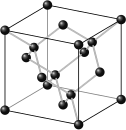
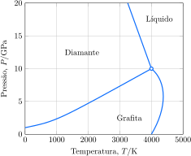
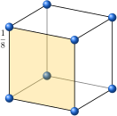
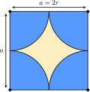
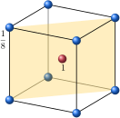
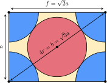
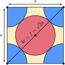
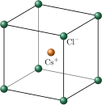

# Os sólidos

Quando a temperatura é tão baixa que as moléculas de uma substância não têm energia suficiente para escapar, ainda que parcialmente, de seus vizinhos, ela se solidifica. A natureza do sólido depende do tipo de forças que mantêm juntos átomos, íons ou moléculas. O entendimento dos sólidos em termos das propriedades de seus átomos vai ajudá-lo a compreender, por exemplo, por que os metais podem permanecer em formas diferentes mas os cristais de sais quebram-se e por que os diamantes são tão duros.

## A classificação dos sólidos

Em um **sólido cristalino**, átomos, íons ou moléculas estão dispostos em um arranjo ordenado. Os sólidos cristalinos têm *ordem de longo alcance*. Nos **sólidos amorfos**, átomos, íons ou moléculas estão dispostos em um arranjo desordenado e aleatório, como na manteiga, na borracha e no vidro. A estrutura de um sólido amorfo é muito semelhante à de um líquido congelado no tempo. Os sólidos cristalinos, em geral, têm superfícies planas bem definidas, chamadas de faces do cristal, em ângulos bem definidos uns em relação aos outros. Essas faces são formadas por camadas ordenadas de átomos. Os sólidos amorfos não têm faces bem definidas, a menos que tenham sido moldados ou cortados. O arranjo de átomos, íons e moléculas no interior de um cristal é determinado por difração de raios X.

Os sólidos cristalinos são classificados segundo as ligações que mantêm seus átomos, íons ou moléculas em suas posições:

- **Sólidos moleculares** são conjuntos de moléculas discretas mantidas em suas posições por forças intermoleculares.
- **Sólidos reticulares** são formados por átomos ligados a seus vizinhos por covalências em todo o sólido.
- **Sólidos metálicos**, ou simplesmente metais, são formados por cátions unidos por um *mar de elétrons*.
- **Sólidos iônicos** são construídos pela atração mútua de cátions e ânions.

Os sólidos são formas densas da matéria porque seus átomos, íons e moléculas são empacotados. Os sólidos reticulares (como o diamante) têm pontos de ebulição muito altos, porque suas ligações covalentes são muito fortes. Os metais também têm pontos de ebulição altos e muitos são densos porque seus átomos estão muito próximos. A ligação metálica é relativamente forte. O resultado é que a maior parte dos metais têm pontos de fusão elevados e são usados como materiais resistentes de construção. Os sólidos iônicos têm pontos de fusão tipicamente mais elevados do que os sólidos moleculares porque as forças interiônicas são muito mais fortes do que as forças intermoleculares.

> Os sólidos cristalinos têm um arranjo interno regular de átomos ou íons. Os sólidos amorfos, não. Os sólidos são classificados como moleculares, reticulares, metálicos ou iônicos.

## Os sólidos moleculares

Os sólidos moleculares são moléculas mantidas juntas por forças intermoleculares (Tópico 1G) e suas propriedades físicas dependem das energias dessas forças. Os sólidos moleculares amorfos podem ser macios como a graxa de parafina, que é uma mistura de hidrocarbonetos de cadeia longa. Essas moléculas se juntam de forma desordenada e as forças entre elas são tão fracas que elas mudam facilmente de lugar. Muitos outros sólidos moleculares têm estrutura cristalina e forças intermoleculares intensas que os tornam rígidos e quebradiços. Por exemplo, as moléculas de sacarose, $\ce{C12H22O11}$, ficam juntas devido às ligações hidrogênio que ocorrem entre seus muitos grupos $\ce{-OH}$. A ligação hidrogênio entre as moléculas de sacarose é tão forte que, antes de atingir o ponto de fusão (em $\pu{184 \degree C}$), as moléculas começam a se decompor. A mistura parcialmente decomposta de produtos, chamada de caramelo, é usada para acrescentar sabor e cor aos alimentos. Alguns sólidos moleculares são muito resistentes. Por exemplo, o *polietileno de densidade ultraelevada* é formado por cadeias longas de hidrocarbonetos mantidas bem próximas em um arranjo cilíndrico muito denso: o material resultante é tão liso e resistente que é usado para fazer vestimentas à prova de  balas e próteses articulares ortopédicas.

Como as moléculas têm formas muito variadas, elas se empilham de muitas maneiras. No gelo, por exemplo, cada átomo de $\ce{O}$ é cercado por quatro átomos de $\ce{H}$ em um arranjo tetraédrico. Dois desses átomos de $\ce{H}$ estão ligados ao átomo de $\ce{O}$ por ligações $\sigma$. Os outros dois pertencem às moléculas de $\ce{H2O}$ vizinhas e estão em ligação hidrogênio com o átomo de $\ce{O}$. Como resultado, a estrutura do gelo é uma rede aberta de moléculas de $\ce{H2O}$ mantidas por ligações hidrogênio. Algumas das ligações hidrogênio quebram-se quando o gelo derrete e, à medida que o arranjo ordenado entra em colapso, as moléculas se empacotam de maneira menos uniforme, porém mais compacta. A abertura da rede do gelo em comparação com a estrutura do líquido explica por que ele tem densidade mais baixa do que a água líquida ($\pu{0,92 g.cm-3}$ e $\pu{1,00 g.cm-3}$, respectivamente, em $\pu{0 \degree C}$). O benzeno sólido e o tetraclorometano, por outro lado, têm densidades superiores às de seus líquidos. Suas moléculas são mantidas no lugar por forças de London muito menos direcionais do que as ligações hidrogênio e, por isso, elas podem se empacotar melhor no sólido do que no líquido.

> Os sólidos moleculares normalmente são macios e fundem em temperaturas baixas.

## Os sólidos reticulares

Enquanto nos sólidos moleculares as moléculas são mantidas juntas por forças intermoleculares relativamente fracas, nos sólidos reticulares os átomos são mantidos por ligações covalentes fortes, que formam uma rede que se estende por todo o cristal. Para desfazer um cristal de um sólido reticular, ligações covalentes, que são muito mais fortes do que as forças intermoleculares, devem ser quebradas. Portanto, os sólidos reticulares são materiais rígidos muito duros, com pontos de ebulição e de fusão elevados.

O diamante e a grafita são sólidos reticulares elementares. Essas duas formas de carbono são **alótropos**, isto é, são formadas pelo mesmo elemento e diferem na forma de ligação dos átomos. Cada átomo de $\ce{C}$ no diamante forma uma ligação covalente com quatro vizinhos por meio de ligações $\sigma$ hibridadas $\mathrm{sp^3}$ (Figura 1). O arranjo tetraédrico estende-se por todo o sólido, como a estrutura de aço de um prédio muito grande. Essa estrutura explica a dureza excepcional do sólido. O diamante é um sólido rígido e transparente. De fato, é a substância mais dura conhecida e o melhor condutor de calor, sendo cerca de cinco vezes melhor do que o cobre. A elevada condutividade térmica do diamante explica por que filmes muito finos do material são usados como base de circuitos integrados e revestimentos de ferramentas de corte para evitar o superaquecimento.

Na natureza, o diamante é encontrado incrustado em uma rocha mole chamada *kimberlita*. Essa rocha cresce em colunas a partir do interior da Terra, onde os diamantes são formados sob intensa pressão. Um método para fabricar diamantes industriais sintéticos é comprimir a grafita em pressões superiores a $\pu{80 kbar}$ e temperaturas acima de $\pu{1500 \degree C}$ (Figura 2). Pequenas quantidades de cromo e ferro são adicionadas à grafita. Os metais fundidos aparentemente dissolvem a grafita e, quando esfriam, depositam cristais de diamante, que são menos solúveis do que a grafita no metal fundido. Outro método, mais comum, usado para produzir diamantes sintéticos é a decomposição térmica do metano. Nesta técnica, os átomos de carbono depositam-se em uma superfície fria como grafita e diamante. Entretanto, como os átomos de hidrogênio produzidos na decomposição reagem mais rapidamente com a grafita para formar hidrocarbonetos voláteis, obtém-se mais diamante do que grafita.

A grafita, o componente mais importante da *mina* dos lápis, é um sólido negro, lustroso e condutor elétrico, que vaporiza em $\pu{3700 \degree C}$. Ele é formado por folhas planas de átomos de carbono hibridados $\mathrm{sp^2}$ ligados por covalência em hexágonos, lembrando as telas de arame de cercas de galinheiro. Existem, também, ligações fracas entre as folhas. Os elétrons se espalham na rede $\pi$ deslocalizada que se estende ao longo do plano. Esta deslocalização explica o fato de o grafite ser um sólido preto, lustroso e condutor de eletricidade. Na verdade, a grafita é muito usada como condutor elétrico na indústria e como eletrodo em células eletroquímicas e baterias. Os elétrons podem se mover nas folhas de grafita, mas com mais dificuldade de uma folha para outra. Logo, a grafita conduz melhor a eletricidade na direção paralela às folhas do que na direção perpendicular.

A grafita é um material moderadamente duro, mas as formas disponíveis no mercado contêm diversas impurezas, como o nitrogênio e o oxigênio do ar, que ficam presas entre as folhas do material. Estas impurezas enfraquecem as ligações entre as folhas e permitem que elas deslizem umas sobre as outras com facilidade. Logo, a grafita impura é lisa, e é usada como lubrificante seco. Nos lápis, a grafita é misturada com argila. A marca deixada no papel por um lápis é formada por camadas de grafita espalhadas na superfície.

:::think

### Ponto para pensar

Por que a grafita não é adequada como lubrificante espacial?

:::

Cada folha de hexágonos de átomos de carbono da grafita é chamada de folha de grafeno. O grafeno, uma única folha de grafita, é um novo material excepcionalmente promissor na indústria eletrônica. Folhas de grafeno podem ser preparadas em um estado muito puro e depois empilhadas com moléculas de água que agem como uma espécie de cola entre elas. O resultado é um material muito forte e flexível, mas muito fino e por vezes quase transparente, como o papel, que conduz eletricidade, mas é mais resistente do que o diamante. A absorção de moléculas de gás muda suas propriedades elétricas, o que torna o grafeno um bom detector para gases.

Muitos materiais **cerâmicos** são óxidos inorgânicos não cristalinos com uma superfície reticular produzida por tratamento térmico de um pó. Estes materiais incluem muitos silicatos minerais, como o quartzo (o dióxido de silício, de fórmula empírica $\ce{SiO2}$), e supercondutores em alta temperatura. Os materiais cerâmicos são muito resistentes e estáveis, porque suas ligações iônicas têm forte caráter covalente e precisam ser rompidas para que o cristal sofra alguma deformação. O resultado é que os materiais cerâmicos expostos a tensão tendem a se despedaçar em vez de ceder.

> Os sólidos reticulares normalmente são duros e rígidos por conta das ligações covalentes que os unem. Esses materiais têm pontos de fusão e de ebulição elevados.

## Os sólidos metálicos

Um sólido metálico é composto por cátions unidos mediante sua interação com o mar de seus elétrons móveis. O metal prata, por exemplo, é formado por íons $\ce{Ag^+}$ mantidos juntos por elétrons que se espalham pelo sólido, com um elétron para cada cátion. O brilho característico dos metais é devido à mobilidade dos elétrons que formam o *mar*. Quando uma onda de luz incidente atinge a superfície do metal, o campo elétrico da radiação empurra os elétrons móveis para a frente e para trás. Os elétrons que oscilam irradiam luz e vemos isso como brilho --- essencialmente uma reemissão da luz incidente. Os elétrons oscilam de acordo com a luz  incidente, logo, geram luz da mesma frequência. Em outras palavras, a luz vermelha refletida em uma superfície metálica é vermelha e a luz azul é refletida como luz azul. É por isso que a imagem em um espelho --- uma camada fina de metal sobre vidro --- mostra um retrato fiel do objeto refletido.

A mobilidade dos elétrons também explica a **maleabilidade** dos metais, a capacidade de adquirir diferentes formas sob pressão, e sua **ductilidade**, a capacidade de se transformar em fios. Como os cátions estão cercados por um *mar* de elétrons, as ligações metálicas têm muito pouco caráter direcional. O resultado é que um cátion pode ser empurrado além dos vizinhos, em qualquer direção, sem muito esforço. Uma batida de martelo pode deslocar um grande número de cátions. O *mar* de elétrons imediatamente se ajusta, logo, os átomos movem-se com relativa facilidade para suas novas posições.

Como a interação entre os íons e os elétrons é a mesma em todas as direções, um bom modelo para o arranjo dos cátions é considerá-los esferas rígidas empilhadas. Um modelo de ligação que explica as estruturas e propriedades de muitos metais é a estrutura de empacotamento compacto, na qual esferas representando os cátions estão muito próximas. A distância entre elas é mínima, como você vê em uma pilha de laranjas em um supermercado (Fig. 3H.11)

# As células unitárias

Uma estrutura reticular pode ser representada por uma pequena região do cristal que se repete. As pequenas unidade ilustradas nas Figuras 2, 4 e 6 são exemplos de **células unitárias**, a menor unidade que, quando empilhada repetidamente sem lacunas nem rotações, pode reproduzir o cristal inteiro.

## A estrutura cúbica primitiva

Uma estrutura cúbica primitiva tem um átomo em cada vértice de um cubo. As esferas representando os átomos estão em contato ao longo das arestas (Figura 2). Essa estrutura só é conhecida para um elemento, o polônio: as forças covalentes são tão fortes nesse metaloide que superam a tendência ao empacotamento compacto característico das ligações de metais

Olá

## A estrutura cúbica de corpo centrado

Olá

Olá

## A estrutura cúbica de face centrada

Olá

Olá

## A estrutura dos sólidos iônicos

As estruturas dos sólidos iônicos se baseiam nos mesmos tipos de arranjos de esferas, como nos elementos metálicos, mas são mais complexas devido à necessidade de levar em conta a presença de íons de cargas opostas e tamanhos distintos. Por exemplo, você pode criar um modelo da estrutura do cloreto de sódio empilhando esferas com carga positiva e raio de $\pu{102 pm}$, que representam os íons $\ce{Na^+}$, e esferas com carga negativa e raio de $\pu{181 pm}$, que representam os íons $\ce{Cl^-}$, de maneira a obter a menor energia possível. Como o cristal é eletricamente neutro, cada célula unitária deve refletir a estequiometria do composto e ser, também, eletricamente neutra.

Um ponto de partida útil é começar com uma das estruturas de empacotamento compacto. Como, em geral, os ânions são maiores do que os cátions que os acompanham, é possível imaginar os ânions formando uma versão ligeiramente expandida de uma estrutura de empacotamento compacto, com os cátions menores ocupando alguns dos buracos aumentados da célula expandida. Um buraco tetraédrico ligeiramente aumentado é relativamente pequeno e só pode acomodar cátions pequenos. Os buracos octaédricos são maiores e podem acomodar cátions maiores.

A estrutura de **sal-gema** é uma estrutura iônica comum, cujo nome deve-se à forma mineral do cloreto de sódio. Nela, os íons $\ce{Cl^-}$ ficam nos vértices e nos centros das faces de um cubo, formando um cubo de face centrada (Figura 8). Esse arranjo é semelhante a um arranjo cfp expandido: a expansão mantém os ânions fora do contato uns com os outros e reduz a repulsão, abrindo buracos suficientemente grandes para acomodar os íons $\ce{Na^+}$. Esses íons ocupam os buracos octaédricos entre os íons $\ce{Cl^-}$. Como existe um buraco octaédrico para ada cátion no arranjo de empacotamento compacto, todos os buracos octaédricos estão ocupados. Se você examinar a estrutura com atenção, perceberá que cada ânion é cercado por seis cátions e que cada cátion é cercado por seis ânions. O modelo se repete continuamente e cada íon é cercado por seis outros íons de carga oposta. O cristal do cloreto de sódio é um arranjo tridimensional de um número muito grande desses pequenos cubos.

Em um sólido iônico, o **número de coordenação** significa o número de íons de carga oposta na vizinhança imediata de determinado íon. Na estrutura de sal-gema, os números de coordenação dos cátions e dos ânions são ambos 6, e a estrutura, no geral, é descrita como tendo *coordenação-(6,6)*. Nessa notação, o primeiro número é o número de coordenação do cátion, e o segundo, o do ânion. A estrutura de sal-gema é encontrada em muitos outros minerais com íons de carga igual, como $\ce{KBr}$, $\ce{RbI}$, $\ce{CaO}$ e $\ce{AgCl}$. Ela é muito comum sempre que os cátions e ânions têm raios muito diferentes, caso em que os cátions menores podem ocupar os buracos octaédricos de um arranjo de ânions cúbico de face centrada. A **razão entre os raios**, $\rho$, que é definida como
$$
    \rho 
        = \dfrac{ r_\text{menor} }{ r_\text{maior} } 
$$
é uma indicação do tipo de estrutura que podemos esperar. Embora existam muitas exceções, uma estrutura de sal-gema é possível quando a razão entre os raios está no intervalo $\pu{0,4}$ a $\pu{0,7}$. Por exemplo, o raio do íon $\ce{Mg^{2+}}$ é $\pu{72 pm}$ e o do íon $\ce{O^{2-}}$ é $\pu{140 pm}$. Portanto, para $\ce{MgO}$,
$$
    \rho 
        = \dfrac{ \pu{72 pm} }{ \pu{140 pm} }
        = \pu{0,51}
$$
Esta razão é coerente com a estrutura de sal-gema e é, aliás, observada nos cristais de $\ce{MgO}$.

Quando os raios dos cátions e dos ânions são semelhantes e $\rho > \pu{0,7}$, um número maior de ânions pode se ajustar em redor de cada cátion. Os íons podem, então, adotar a estrutura do cloreto de césio, da qual o cloreto de césio, $\ce{CsCl}$, é o modelo típico (Figura 9). O raio do íon $\ce{Cs^+}$ é $\pu{167 pm}$ e o do íon $\ce{Cl^-}$ é $\pu{181 pm}$, o que dá a razão entre os raios $\pu{0,92}$, isto é, os dois íons têm quase o mesmo tamanho. Nessa estrutura, os ânions formam um arranjo cúbico primitivo expandido, com um íon $\ce{Cl^-}$ nos oito vértices de cada célula unitária cúbica. Existe um grande buraco *cúbico* no centro da célula e o íon $\ce{Cs^+}$ se encaixa nele. De modo análogo, cada íon $\ce{Cl^-}$ está no centro de uma célula unitária cúbica, a qual tem oito íons $\ce{Cs^+}$ nos vértices. O número de coordenação de cada tipo de íon é 8 e a estrutura, como um todo, tem *coordenação-(8,8)*. A estrutura do cloreto de césio é muito menos comum do que a estrutura de sal-gema, mas ela também é encontrada no $\ce{CsBr}$, no $\ce{CsI}$, no $\ce{TlCl}$ e no $\ce{TlBr}$.

Quando a razão entre os raios de um composto iônico é inferior a cerca de $\pu{0,4}$, correspondendo a cátions significativamente menores do que os ânions, os buracos tetraédricos podem ser preenchidos. Um exemplo desse tipo de estrutura é a estrutura blenda de zinco (também chamada de estrutura esfalerita), denominada a partir de uma das formas do mineral ZnS (Figura 10). Essa estrutura baseia-se em um retículo cúbico de empacotamento compacto expandido para os volumosos ânions $\ce{S^{2-}}$, com os pequenos cátions $\ce{Zn^{2+}}$ ocupando metade dos buracos tetraédricos. Cada íon $\ce{Zn^{2+}}$ está cercado por quatro íons $\ce{S^{2-}}$, e cada íon $\ce{S^{2-}}$, por quatro íons $\ce{Zn^{2+}}$; portanto, a estrutura blenda de zinco tem *coordenação-(4,4)*.

O modelo básico de um sólido iônico, como coleção de esferas rígidas de determinados raios empilhadas segundo um arranjo que tem a menor energia total, pode cair por terra se as ligações não forem totalmente iônicas. Nesses casos, o modelo precisa ser adaptado para incluir outros arranjos. Quando a ligação tem um forte caráter covalente, algumas orientações são favorecidas em detrimento de outras e os íons se posicionarão em locais específicos em torno uns dos outros. Um exemplo é o arseneto de níquel, $\ce{NiAs}$. Neste sólido, os pequenos cátions $\ce{Ni^{3+}}$ polarizam os volumosos ânions $\ce{As^{3-}}$ (como vimos no Tópico 1E). O empacotamento dos íons é bem diferente do modelo de empacotamento de esferas puramente iônico. Conhecida a estrutura de um composto iônico, sua densidade pode ser estimada de modo semelhante ao que usamos para metais.

> Os íons se agrupam na estrutura cristalina que corresponde à mais baixa energia. A estrutura adotada depende da razão entre os raios do cátion e do ânion. O caráter covalente de uma ligação iônica restringe a direção das ligações.

