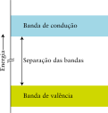
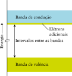
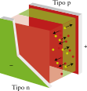
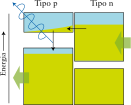

# Os materiais inorgânicos

Os materiais usados na tecnologia, na medicina e na construção são classificados grosseiramente como *duros* ou *moles*. A matéria dura consegue resistir a forças intensas sem deformação e a matéria mole reage mais prontamente à aplicação de uma força. De modo geral, a matéria dura é inorgânica e a mole é tipicamente orgânica.

## As ligas

As **ligas** são criadas misturando dois ou mais metais fundidos e permitindo que esfriem. A Tabela 1 lista algumas ligas comuns. Suas propriedades dependem de sua composição, de sua estrutura cristalina, e do tamanho e da textura dos grãos que as formam. Em uma **liga homogênea**, os átomos dos elementos usados se distribuem uniformemente, como ocorre em compostos. São exemplos o latão, o bronze e as ligas usadas em cunhagem. Uma **liga heterogênea** é formada por misturas de fases cristalinas com composições diferentes. São exemplos a solda estanho-chumbo e o amálgama de mercúrio-prata que era usado pelos dentistas. Diferentemente dos metais puros, que têm pontos de fusão distintos, as ligas normalmente fundem e solidificam ao longo de um intervalo de temperaturas.

:::displaytable

#### Composição de ligas típicas

| **Liga**       | **Composição mássica**                      |
| :------------- | :------------------------------------------ |
| Latão          | até 40% de zinco em cobre                   |
| Bronze         | outro metal que não zinco ou nível em cobre |
| Solda          | estanho em chumbo                           |
| Aço inoxidável | acima de 12% de cromo em ferro              |

:::

Uma liga na qual os átomos de um metal substituem os de outro é denominada liga substitucional. Os raios atômicos dos elementos que podem formar ligas substitucionais não diferem em mais de 15%. Um exemplo é a liga de cobre e zinco usada em moedas de *cobre*. Como o tamanho dos átomos de zinco é muito semelhante ao dos átomos de cobre (seus raios são $\pu{133 pm}$ e $\pu{128 pm}$, respectivamente), os átomos de zinco podem substituir alguns átomos de cobre no cristal. Em função das pequenas diferenças de tamanho e estrutura eletrônica, os átomos menos abundantes em uma liga substitucional distorcem a forma do retículo dos átomos mais abundantes do metal hospedeiro, dificultando o fluxo de elétrons e o espalhamento do movimento térmico. Portanto, uma mistura substitucional tem condutividade térmica e elétrica mais baixa do que o elemento puro. Como o retículo está distorcido, o deslizamento de planos de átomos é mais difícil de um plano em relação ao outro. Consequentemente, uma liga substitucional é mais forte e mais dura do que o metal puro.

O aço é uma liga homogênea baseada no ferro que contém até 2% em massa de carbono. Os átomos de carbono ($\pu{77 pm}$) são muito menores do que os átomos de ferro ($\pu{124 pm}$) e não podem, portanto, substituí-los no retículo cristalino. Eles são tão pequenos que podem se acomodar nos **interstícios**, ou buracos, do retículo do ferro. O material resultante é denominado **liga intersticial**. Para dois elementos formarem uma liga intersticial, o raio atômico do elemento que é o soluto deve ser inferior a 60% do raio atômico do elemento hospedeiro. Os átomos intersticiais interferem na condutividade elétrica e no movimento dos átomos que formam o retículo. Esse movimento restrito torna a liga mais dura e mais forte do que o metal hospedeiro puro.

Uma das ligas mais antigas é o bronze. A fusão do cobre ocorre em uma temperatura muito elevada ($\pu{1083 \degree C}$), logo, é muito difícil de trabalhar em fornos de carvão. O estanho funde em temperatura baixa ($\pu{232 \degree C}$), logo, não pode ser usado na fabricação de panelas. Ambos os metais são muito macios e, portanto, não fazem boas ferramentas. O bronze, porém, funde em uma temperatura intermediária, entre os pontos de fusão do cobre e do estanho e, quanto maior for a proporção do cobre, maior é a temperatura de fusão. Além disso, o bronze é muito mais resistente do que o cobre e o estanho e mais resistente à corrosão do que os dois metais puros.

O bronze é uma liga substitucional homogênea de cobre e zinco que possui boa resistência à corrosão. A percentagem de zinco no latão varia, mas em geral fica em torno de 30%. O estanho, o arsênio e o antimônio podem ser adicionados ao bronze para melhorar a resistência à corrosão, ao passo que o ferro aumenta a dureza.

O bismuto e o cádmio formam uma liga heterogênea. Quando uma mistura fundida de bismuto e cádmio solidifica, o sólido torna-se uma mistura de pequenos cristais de bismuto puro e de cádmio puro. Quando uma mistura fundida, rica em bismuto, esfria, o bismuto se deposita e a composição do líquido restante se modifica, ficando mais rica em cádmio. Quando uma mistura fundida, rica em cádmio, esfria, o cádmio se deposita e a composição do líquido restante fica rica em bismuto. Devido às composições que mudam, a liga funde e solidifica em uma faixa de temperaturas. Contudo, existe uma composição na qual toda a amostra congela e funde em uma única temperatura fixa, que é inferior ao ponto de fusão dos metais puros. Uma mistura que se comporta desse jeito é chamada de **eutético** (das palavras gregas para *facilmente fundido*).

> As ligas de metais tendem a ser mais resistentes e ter menor condutividade elétrica do que o metal puro. Nas ligas substitucionais, os átomos do metal soluto substituem alguns átomos de um metal de raio atômico semelhante. Nas ligas intersticiais, os átomos do elemento soluto entram nos interstícios do retículo formado por átomos do metal que tem o maior raio atômico.

## O carbonato de cálcio, o cimento e o concreto

Os compostos iônicos de cálcio são frequentemente utilizados como materiais estruturais em organismos, em edifícios e na engenharia civil, devido à rigidez de suas estruturas. Essa rigidez vem da força com que o cátion Ca21, pequeno e de alta carga, interage com seus vizinhos. Como o íon carbonato também tem carga dois, o carbonato de cálcio, $\ce{CaCO3}$ tem uma energia de rede relativamente alta (Tópico 1E). É por isso que um dos materiais de construção mais antigos foi o calcário, uma forma impura de carbonato de cálcio, que toma sua cor amarelada de impurezas como os íons $\ce{Fe^{2+}}$. Em sua forma comprimida e dura, temos o mármore e, em sua forma menos compacta, temos o *giz*.

As duas formas mais comuns de carbonato de cálcio cristalino são a *calcita* e a *aragonita*. Embora a aragonita seja mais dura e densa do que a calcita, ela é menos abundante e menos estável. Além disso, ela se converte em calcita em temperaturas elevadas.

A natureza fez uso intensivo da capacidade do cálcio em formar estruturas rígidas. Ele é encontrado na forma de carbonato de cálcio nas conchas dos moluscos e de fosfato de cálcio nos ossos. Na verdade, grandes depósitos de calcário provêm de conchas e micro-organismos que se acumularam no leito dos oceanos há milhões de anos. As conchas e os ossos são muito mais resistentes do que os sais de cálcio puros porque têm a estrutura de um compósito, com carbonatos ou fosfatos incrustados em uma matriz resistente.

Os tijolos usados na construção civil normalmente são unidos por aglomerantes chamados de argamassas. A argamassa de cimento Portland é formada por cerca de uma parte de cimento e três partes de areia (principalmente sílica, $\ce{SiO2}$). Contendo cimento Portland, cal (hidróxido de cálcio) e areia, a argamassa de cal tem cura rápida. Ela se transforma em uma massa dura quando a cal reage com o dióxido de carbono do ar para formar o carbonato. O concreto também é muito usado na construção de pisos e paredes. Sua formulação inclui um aglomerante (que costuma ser um cimento, em geral o Portland) e um aglomerado (rocha triturada).

> Os compostos de cálcio são materiais comuns de construção porque o íon $\ce{Ca^{2+}}$, pequeno e rígido, forma estruturas rígidas. O cimento Portland se forma quando uma mistura de calcário, argila e outras substâncias é aquecida em alta temperatura. Ela endurece quando se adiciona água, formando um retículo de hidratos.

# Os materiais poliméricos

As cadeias de átomos de carbono dos compostos orgânicos podem chegar a ter comprimentos muito grandes formando macromoléculas, moléculas que contêm centenas e, às vezes, milhares de átomos. Os polímeros, como o propileno e o politetrafluoroetileno (comercializado como Teflon), são compostos macromoleculares formados por cadeias ou redes de pequenas unidades repetidas. Embora os polímeros possam ser grandes e complexos, suas propriedades podem ser entendidas quando os grupos funcionais que contêm são conhecidos.

Os polímeros são feitos por dois tipos principais de reações, as reações de adição e as reações de condensação. O tipo de reação que ocorre depende dos grupos funcionais existentes nos materiais de partida. Muitos desses materiais vêm do petróleo, mas alguns polímeros são feitos a partir de produtos agrícolas como o milho e a soja

## Os polímeros de adição e condensação

Os alquenos podem reagir entre si para formar longas cadeias, em um processo chamado **polimerização por adição**. Por exemplo, uma molécula de eteno pode ligar-se a outra molécula de eteno, outra molécula de eteno pode juntar-se à nova molécula e assim por diante, formando uma longa cadeia de hidrocarboneto. O alqueno original, neste caso o eteno, é chamado de **monômero**. Cada monômero torna-se uma **unidade repetitiva**, isto é, a estrutura que se repete muitas vezes para produzir a cadeia do polímero. O produto, uma cadeia de unidades repetitivas ligadas por covalência, é o polímero. O polímero de adição mais simples é o polietileno, $\ce{-(CH2CH2)_n-}$ feito pela polimerização do eteno e formado por longas cadeias de unidades repetitivas $\ce{-CH2CH2-}$.

A indústria de plásticos desenvolveu polímeros a partir de muitos monômeros de fórmula $\ce{CHX=CH2}$, em que $\ce{X}$ é um átomo (como o $\ce{Cl}$ no cloreto de vinila, $\ce{CHCl=CH2}$) ou
um grupo de átomos (como o $\ce{CH3}$ no propeno). Esses etenos substituídos dão polímeros de fórmula $\ce{-(CHXCH2)_n-}$ e incluem o cloreto de polivinila (PVC),
$\ce{-(CHClCH2)_n-}$ e o polipropileno, $\ce{-(CH(CH3)CH2)_n-}$. Eles diferem em aparência, rigidez, transparência e resistência às intempéries.

Nos **polímeros por condensação**, os monômeros ligam-se por reações de condensação, como as usadas para formar ésteres ou amidas. Os polímeros formados pela ligação de monômeros que têm grupos ácidos carboxílicos com os que têm grupos álcool são chamados de poliésteres. Os polímeros desse tipo são muito usados na fabricação de fibras artificiais. Um poliéster típico é o PET, um polímero produzido pela esterificação do ácido tereftálico com etilenoglicol (1,2-etanodiol, $\ce{HOCH2CH2OH}$). Seu nome técnico é poli(tereftalato de etileno).

A polimerização por condensação de aminas com ácidos carboxílicos leva às poliamidas, substâncias mais comumente conhecidas como náilons. Uma poliamida comum é o náilon-66, que é um polímero de 1,6-diamino-hexano, $\ce{H2N(CH2)6NH2}$, e ácido adípico, $\ce{HOOC(CH2)4COOH}$. O 66 do nome corresponde ao número de átomos de carbono dos dois monômeros.

> Os alquenos sofrem polimerização por adição. Os polímeros de condensação normalmente são produzidos por condensação de um ácido carboxílico com um álcool para formar um poliéster ou com uma amina para formar uma poliamida.

## Os copolímeros e materiais compósitos

Os copolímeros são polímeros formados por mais de um tipo de unidade repetitiva. Um exemplo é o náilon-66, no qual as unidades repetitivas são o 1,6-diamino-hexano, $\ce{H2N(CH2)6NH2}$, e o ácido adípico, $\ce{HOOC(CH2)4COOH}$. Eles formam um copolímero alternado, no qual os monômeros ácido e amina se alternam.

Em um **copolímero em bloco**, um longo segmento, no qual a unidade repetitiva é um dos monômeros, é seguido por um segmento que só contém o outro monômero. Um exemplo é o copolímero em bloco formado pelo estireno e o butadieno. O poliestireno puro é um material transparente e quebradiço, isto é, que se parte facilmente. O polibutadieno é uma borracha sintética muito resistente, porém mole. Um dos copolímeros em bloco dos dois monômeros é o *poliestireno de alto impacto*, um material durável e resistente, e um plástico transparente. Uma formulação diferente dos dois polímeros produz a borracha *estireno-butadieno* (SBR), que é usada principalmente em pneus de automóveis e calçados para corrida, e, também, nas gomas de mascar.

Em um **copolímero aleatório**, monômeros diferentes ligam-se sem nenhuma ordem em particular. Um **copolímero graftizado** é formado por cadeias longas de um monômero com cadeias laterais formadas pelo outro monômero. Por exemplo, o polímero usado para fazer lentes de contato rígidas é um hidrocarboneto apolar que repele água. O polímero usado para fazer lentes de contato moles é um copolímero graftizado com cadeias de monômeros apolares e cadeias laterais de um monômero que absorve a água. As cadeias laterais absorvem tanta água que $50\%$ do volume da lente de contato é água, o que torna as lentes flexíveis, macias e mais confortáveis do que as lentes de contato rígidas.

Um **material compósito** consiste em duas ou mais substâncias combinadas em um material homogêneo, sem perderem suas características individuais. As conchas do mar são formadas por compósitos naturais que devem sua resistência a uma matriz orgânica rígida e sua dureza aos cristais de carbonato de cálcio incorporados na matriz. Alguns compósitos leves, como o compósito de grafita usado em raquetes de tênis nos quais as fibras do material estão incorporadas em uma matriz polimérica, podem ter uma razão resistência densidade três vezes maior do que a do aço. Um material compósito contendo flocos cerâmicos em um polímero ácido poliláctico é usado como solda rápida para ossos fraturados. O material é injetado em forma de pasta no osso fraturado, onde ele solidifica na temperatura do corpo, formando uma estrutura que atua como tecido ósseo e promove a solda, com a formação de novas células ósseas na região adjacente.

> Os copolímeros e compósitos combinam as vantagens de mais de um material componente.

## As propriedades físicas dos polímeros
 
Um polímero pode ser projetado para ter as propriedades necessárias para uma aplicação. O primeiro aspecto a considerar é o comprimento da cadeia. Como as moléculas dos polímeros sintéticos têm comprimentos diferentes, eles não têm massas moleculares definidas. Você pode falar apenas da massa molecular *média* e do comprimento *médio* da cadeia de um polímero. Os polímeros também não têm pontos de fusão definidos. Eles amolecem gradualmente à medida que a temperatura aumenta. A viscosidade de um polímero, isto é, sua capacidade de fluir quando fundido (Tópico 1F), depende do comprimento da cadeia. Quanto mais longas são as cadeias, mais emaranhadas elas estão, e o fluxo torna-se mais lento.

A resistência mecânica de um polímero aumenta quando as interações entre as cadeias aumentam. Portanto, quanto maiores forem as cadeias, maior será a resistência mecânica de um polímero. Quanto mais fortes forem as forças intermoleculares para cadeias de mesmo tamanho, mais forte será a resistência mecânica. A natureza dos grupos funcionais ligados ou que compõem uma parte do esqueleto do polímero afeta a intensidade das forças intermoleculares e contribui para a resistência mecânica. Por exemplo, o náilon é uma poliamidas e seus grupos $\ce{-NH-}$ e $\ce{-CO-}$ podem participar de ligações hidrogênio e, em consequência, o náilon é um polímero resistente. Ele também é higroscópico (absorve água), porque as moléculas de água são atraídas pelos grupos polares do polímero. Em contraste, o polietileno é um hidrocarboneto que só contém ligações $\ce{C-C}$ e $\ce{C-H}$, que são hidrofóbicas. Em consequência, enquanto o polietileno repele a água, a água pode penetrar os tecidos de náilon porque as moléculas de $\ce{H2O}$ podem migrar quando formam e quebram ligações hidrogênio com as moléculas do polímero.

Os arranjos de empacotamento das cadeias que aumentam o contato intermolecular resultam em maior resistência, bem como maior densidade. Cadeias longas sem ramificações podem se alinhar umas às outras, como espaguete cru, e formar regiões cristalinas que aumentam as interações e resultam em materiais fortes e densos. Cadeias poliméricas ramificadas não podem se acomodar tão bem e formam materiais mais fracos e menos densos. Uma armadura flexível e leve foi desenvolvida usando conjuntos de fibras de polietileno longas, alinhadas na mesma direção e muito próximas, e sujeitas a forças intermoleculares muito fortes. Essa armadura é cerca de 15 vezes mais resistente do que o aço, mas é tão pouco densa que flutua em água. Ela é macia e flexível, logo é de uso confortável.

A elasticidade de um polímero é sua capacidade de voltar à forma original após ser esticado. A borracha natural tem cadeias longas com baixa elasticidade e é facilmente amolecida por aquecimento. No entanto, a **vulcanização** da borracha aumenta sua elasticidade. Na vulcanização, a borracha é aquecida com enxofre. Os átomos de enxofre formam ligações cruzadas entre as cadeias de poliisopreno e produzem uma rede tridimensional de átomos. Como as cadeias estão ligadas, a borracha vulcanizada não amolece tanto quanto a borracha natural quando a temperatura aumenta. Ela é também muito mais resistente à deformação quando esticada, porque as ligações cruzadas puxam-na de volta. Materiais poliméricos que voltam à forma original após o estiramento são chamados de elastômeros. No entanto, quando o número de ligações cruzadas aumenta muito, forma-se uma rede rígida que resiste ao estiramento. Por exemplo, altas concentrações de enxofre levam a um grande número de ligações cruzadas e ao material duro chamado ebonite, que é usado na fabricação de canetas-tinteiro e bolas de boliche.

Os plásticos podem ser distinguidos por sua reação ao calor. Um **polímero termoplástico** pode ser amolecido novamente após ter sido moldado. Um **polímero termorrígido** adquire uma forma permanente no molde e não amolece sob aquecimento. Muitos materiais termoplásticos são feitos por polimerização por adição e podem ser reciclados por fusão e reprocessamento. Exemplos são o polietileno e o tereftalato de polietileno. Plásticos termorrígidos são usados quando a resistência ao calor é importante. Por exemplo, a borracha vulcanizada de pneus e a espuma de ureia-formaldeído usada na produção de compensados são plásticos termorrígidos.

Os* silicones* são materiais poliméricos sintéticos baseados no silício e não no carbono. Eles são formados por longas cadeias $\ce{-O-Si-O-Si-}$ com as duas posições restantes dos
átomos de $\ce{Si}$ ligadas a grupos orgânicos, como o grupo metila, $\ce{CH3}$. Os silicones são usados para impermeabilizar tecidos porque os átomos de oxigênio ligam-se ao tecido, deixando os grupos metila, hidrofóbicos (repelem água), para fora da superfície do tecido. Os silicones são materiais flexíveis que têm aplicações variadas em medicina, como implantes e liberação de fármacos no organismo. Eles são também usados nas indústrias aeroespacial e eletrônica como adesivos e isolantes resistentes ao calor.

Como são compostos moleculares, os polímeros normalmente não conduzem eletricidade. Entretanto, os polímeros que têm ligações duplas alternadas na cadeia podem ser usados para conduzir eletricidade

> Os polímeros fundem‑se em uma faixa de temperaturas. Os polímeros formados por cadeias longas tendem a ter alta viscosidade. A resistência dos polímeros aumenta com o aumento do comprimento das cadeias e das regiões de cristalização. Os polímeros termoplásticos são recicláveis.

# Os materiais para novas tecnologias

A química está na base da infraestrutura material do mundo moderno. Ela permite produzir as substâncias utilizadas na miniaturização dos materiais eletrônicos de chips de computador, cada um dos quais podendo conter bilhões de componentes. O estudo da química também possibilita desenvolver materiais que geram luz e são usados para exibir informações de todos os tipos em dispositivos compactos e eficientes no consumo de energia. Além disso, a química permite a produção de materiais magnéticos usados para armazenar informações de forma compacta e prontamente disponível.

## A condução eletrônica nos sólidos

Uma corrente elétrica é o fluxo de uma carga elétrica. Na condução eletrônica, a carga é levada pelos elétrons. A condução eletrônica é o mecanismo de condução nos metais e na grafita. Na condução iônica, a carga é levada por íons. Um eletrólito sólido é um condutor iônico. A condução iônica é o mecanismo de condução eletrônica em um sal fundido ou uma solução de eletrólito. Como os íons são muito volumosos para viajar facilmente pela maior parte dos sólidos, o fluxo de carga é, quase sempre, resultado da condução eletrônica. Entretanto, existem eletrólitos sólidos que permitem que os íons se movam por sua rede e, por isso, são materiais importantes usados em baterias recarregáveis. Um isolante é uma substância que tem uma resistência muito alta e não conduz eletricidade.

Os sólidos são classificados de acordo com sua resistência elétrica e o modo como ela
varia com a temperatura:

- Um **condutor metálico** é um condutor eletrônico com uma resistência que *cresce* quando a temperatura aumenta.
- Um **semicondutor** é um condutor eletrônico com uma resistência que *diminui* quando
a temperatura aumenta.
- Um **supercondutor** é um condutor eletrônico que conduz eletricidade com resistência
igual a zero, geralmente em temperaturas muito baixas.

Na maior parte dos casos, um condutor metálico tem resistência muito menor do que um semicondutor, mas é a dependência da resistência em relação à temperatura que diferencia os dois tipos de condutores, não a magnitude da condutividade.

A teoria dos orbitais moleculares explica as propriedades elétricas dos condutores eletrônicos, dos semicondutores e dos isolantes tratando-os como uma enorme molécula e supondo que seus elétrons de valência ocupam orbitais deslocalizados que se espalham pelo sólido. Em vez dos poucos orbitais moleculares muito separados, típicos de moléculas pequenas, os inúmeros orbitais moleculares de um sólido estão tão próximos em energia que eles formam uma banda quase contínua.

Uma banda vazia ou incompleta de orbitais moleculares é conhecida como banda de condução. Como os orbitais vizinhos dos sólidos ficam tão próximos em energia, muito pouca energia adicional é necessária para excitar os elétrons dos orbitais preenchidos superiores para os orbitais vazios da banda de condução. Com isso, os elétrons podem mover-se livremente pelo sólido e, assim, transportar corrente elétrica. A resistência do metal aumenta com a temperatura porque, quando aquecido, os átomos vibram mais vigorosamente e impedem a migração de elétrons.

Em um isolante, os elétrons de valência preenchem os orbitais moleculares disponíveis para dar uma banda chamada **banda de valência**. Existe uma **separação de bandas** substancial, uma faixa de energias na qual não existem orbitais, antes que a banda de condução, composta por orbitais vazios, comece (Figura 1). Os elétrons da banda de valência podem ser excitados até a banda de condução somente se uma grande quantidade de energia for usada. Como a banda de valência está cheia e a banda de condução está separada pela grande diferença de energia, os elétrons não são móveis e o sólido é um isolante.

Os semicondutores revolucionaram a indústria eletrônica porque dispositivos semicondutores muito pequenos podem ser usados para controlar o fluxo da corrente elétrica. Em um **semicondutor intrínseco**, uma banda de condução vazia e uma banda de valência completa têm energias próximas. Em temperaturas comuns, embora a maior parte dos elétrons esteja na banda de valência, alguns ocupam a banda de condução adjacente e são móveis. À medida que aumenta a temperatura do sólido, aumenta também o número de elétrons excitados da banda de valência para a banda de condução. Por isso, a resistência de um semicondutor diminui com o aumento da temperatura. Em linguagem técnica, todos os isolantes são, na verdade, semicondutores intrínsecos, mas a separação de bandas em um isolante é tão grande que sua condutividade elétrica permanece muito baixa nas temperaturas normais.

A capacidade de um semicondutor de transportar corrente elétrica também pode ser ampliada pela adição de elétrons à banda de condução ou pela remoção de elétrons da banda de valência. Essa modificação é feita quimicamente pela **dopagem** do sólido, isto é, pela inclusão na estrutura de pequenas quantidades de impurezas, formando o que se conhece como **semicondutor extrínseco**. Um exemplo é a adição de uma quantidade muito pequena de um elemento do grupo 15, como o arsênio, ao silício de alta pureza. O arsênio aumenta o número de elétrons no sólido: cada átomo de Si (Grupo 14) tem quatro elétrons de valência e cada átomo de As (Grupo 15) tem cinco. Os elétrons adicionais ocupam a banda de condução do silício, normalmente vazia, permitindo que o sólido conduza corrente elétrica (Figura 2). Esse tipo de material é chamado de **semicondutor do tipo n** porque ele contém excesso de elétrons de carga negativa.

Quando o silício (Grupo 14) é dopado com índio (Grupo 13) no lugar do arsênio, o sólido tem menos elétrons de valência do que o silício puro e a banda de valência não está completamente preenchida (Fig. 3). Dizemos que a banda de valência, neste caso, contém *buracos*. Como a banda de valência não está completa, ela funciona como uma banda de condução, permitindo o fluxo da corrente elétrica. Esse tipo de semicondutor é chamado de **semicondutor do tipo p**, porque a ausência de elétrons, com carga negativa, equivale à presença de *buracos* com carga positiva.

Dispositivos eletrônicos de estado sólido, como diodos, transistores e circuitos integrados, contêm junções p-n, nas quais um semicondutor do tipo p está em contato com um semicondutor do tipo n (Figura 4 e 5). A estrutura de uma junção p-n permite que a corrente flua em uma só direção. Quando o eletrodo que está ligado ao semicondutor do tipo p tem carga negativa, os buracos do semicondutor do tipo p são atraídos a ele, os elétrons do semicondutor tipo n são atraídos para o outro eletrodo (positivo) e a corrente não flui. 

Quando a polaridade é invertida, com o eletrodo negativo ligado ao semicondutor do tipo n, os elétrons fluem desse semicondutor através do semicondutor do tipo p para o eletrodo positivo.

> A ligação nos sólidos pode ser descrita em termos de bandas de orbitais moleculares. Nos metais, as bandas de condução são formadas por orbitais não completamente preenchidos que permitem o fluxo de elétrons. Nos isolantes, as bandas de valência estão completas e a grande separação de bandas impede a passagem dos elétrons para os orbitais vazios. Nos semicondutores, os níveis vazios estão próximos em energia dos níveis completos.

## Os materiais luminescentes

**Incandescência** é a luz emitida por um corpo aquecido, como o filamento de uma lâmpada ou as partículas de fuligem aquecidas da chama de uma vela. **Luminescência** é a emissão de luz por um processo diferente da incandescência. Por exemplo, quando o peróxido de hidrogênio reage com cloro, o $\ce{O2}$ formado pela oxidação de $\ce{H2O2}$ é produzido em estados energeticamente excitados e emite luz quando volta ao estado fundamental. Esse processo é um exemplo de **quimioluminescência**, a emissão de luz por produtos que se formam em estados energeticamente excitados em uma reação química. Os bastões de luz usados para a iluminação de emergência brilham com a luz de um processo quimioluminescente. A *bioluminescência* é uma forma de quimioluminescência produzida por organismos vivos. Por exemplo, a enzima luciferase catalisa a oxidação da luciferina em vaga-lumes e algumas bactérias, produzindo oxiluciferina em um estado excitado.
 
A fluorescência e a fosforescência são a emissão de luz por moléculas excitadas por radiação de alta frequência, como a luz visível emitida quando uma substância é iluminada com radiação ultravioleta. A **fluorescência** dura apenas alguns nanossegundos depois que cessa a iluminação. Na **fosforescência**, a iluminação persiste, às vezes por segundos ou muito mais, como no caso do elemento fósforo, do qual o fenômeno recebe o seu nome. A diferença crucial no mecanismo é que a fluorescência retém a orientação do spin do elétron excitado, enquanto na fosforescência o elétron torna-se desemparelhado e leva algum tempo até que o spin se inverta novamente.

Os materiais fluorescentes são muito importantes na indústria eletrônica em que tubos finos de luz fluorescente do tamanho de um lápis são usados para fornecer a luz de fundo para os dispositivos LCD em computadores portáteis e televisores de tela plana. A radiação ultravioleta gerada no tubo excita o material fluorescente que recobre a superfície interior do tubo e ilumina a tela. Como os materiais fluorescentes podem ser ativados por radioatividade, eles também são usados em detectores de cintilação para medir a radiação.

Os tubos de raios catódicos muito usados no passado na produção de televisores e monitores de computador e as telas de plasma que (ao lado dos monitores de cristal líquido) os substituíram utilizam **fósforos**, materiais fluorescentes que brilham quando excitados pelo impacto de elétrons ou radiação ultravioleta.

Em um diodo emissor de luz, também conhecido pela sigla em inglês LED (*light emitting diode*), um material luminescente gera luz quando uma corrente elétrica é aplicada a uma junção p-n (Figuras 6 e 7).

O circuito ligado a um LED é disposto de forma que os elétrons da fonte fluem para o interior da banda de condução do lado n e são forçados para a banda de condução do lado p. Assim que os elétrons estão na banda de alta energia do lado p, eles voltam para a banda de menor energia e emitem a diferença de energia como luz. Os compostos usados para produzir luzes de cores diferentes variam, mas usa-se comumente arseneto de alumínio e gálio para LEDs vermelhos, nitreto de gálio e índio para LEDs verdes e seleneto de zinco para LEDs azuis. Quando pequenos LEDs dessas três cores são agrupados em uma tela, pode-se gerar qualquer cor dependendo de quais das três cores são ativadas. LEDs brancos normalmente são formados a partir de LEDs amarelos e azuis misturados em proporções diversas.

Os diodos orgânicos emissores de luz (OLED) usam um filme de polímero orgânico que conduz eletricidade para gerar luz de cores diferentes. Embora os dispositivos LCD, que usam
cristais líquidos (Tópico 1G), sejam mais comuns, os monitores LED não exigem iluminação de fundo e, portanto, podem ser muito mais finos. Os LEDs estão sendo introduzidos em muitas aplicações, porque usam muito menos energia do que as lâmpadas incandescentes e são muito mais duradouros.

> Os materiais luminescentes liberam energia na forma de luz quando retornam dos estados excitados para estados de menor energia.

## Os materiais magnéticos

O paramagnetismo é a tendência que uma substância tem de ser atraída por um campo magnético. A propriedade é uma consequência da presença no átomo ou na molécula de pelo menos um elétron desemparelhado que se alinha com o campo aplicado. Entretanto, como os spins de átomos ou moléculas vizinhos se alinham quase que ao acaso, o paramagnetismo é muito fraco e o alinhamento dos elétrons se perde quando o campo magnético é removido. No caso de alguns metais d, porém, os elétrons desemparelhados de muitos átomos vizinhos podem se alinhar uns aos outros sob a ação de um campo magnético, o que produz o efeito muito mais forte do **ferromagnetismo**. As regiões dos spins alinhados, chamadas de **domínios**, sobrevivem mesmo depois que o campo magnético foi retirado.

O ferromagnetismo é muito mais forte do que o paramagnetismo, assim, os materiais ferromagnéticos são usados na fabricação de ímãs permanentes e no revestimento de discos rígidos de computador. As cabeças eletromagnéticas de gravação alinham grande número de spins quando o disco passa por elas e o alinhamento dos spins nos domínios permanece por anos. Em um **material antiferromagnético**, spins vizinhos são presos em um arranjo antiparalelo, de forma que o momento magnético é cancelado. O manganês é antiferromagnético. Em um **material ferrimagnético**, os spins dos átomos vizinhos são diferentes e, embora eles estejam presos em um arranjo antiparalelo, os dois momentos magnéticos não se cancelam completamente. O ferromagnetismo também ocorre em ligas como alnico e alguns compostos de metais d, como óxidos de ferro e cromo.

Os **ferrofluidos** são líquidos ferromagnéticos formados por suspensões de magnetita finamente pulverizada, $\ce{Fe3O4}$, em um líquido oleoso (como óleo mineral) contendo um sabão ou detergente. As partículas de óxido de ferro não se depositam, porque elas são atraídas pela extremidade polar das moléculas do detergente, que formam aglomerados compactos (um tipo de micela) em volta das partículas. As pontas não polares das moléculas de detergente apontam para fora, o que permite que as micelas formem uma suspensão coloidal no óleo. Quando um ímã se aproxima de um fluido de ferro, as partículas que estão no líquido tentam alinhar-se com o campo magnético, mas são mantidas no lugar pelo óleo. Como resultado, é possível controlar o fluxo e a posição do fluido de ferro pela aplicação de um campo magnético. Uma das aplicações dos fluidos de ferro é no sistema de freio de aparelhos de ginástica. Quanto mais forte for o campo magnético, maior será a resistência ao movimento.

> Os materiais magnéticos podem ser paramagnéticos, ferrimagnéticos, ferromagnéticos ou antiferromagnéticos. Nos materiais ferromagnéticos, grandes domínios de elétrons estão aprisionados na mesma orientação.
