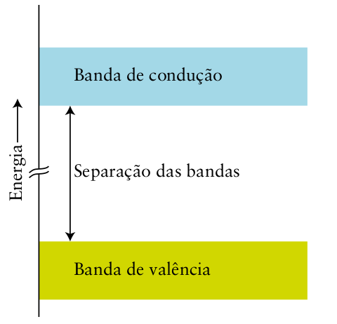

# Os materiais inorgânicos

Os materiais usados na tecnologia, na medicina e na construção são classificados grosseiramente como *duros* ou *moles*. A matéria dura consegue resistir a forças intensas sem deformação e a matéria mole reage mais prontamente à aplicação de uma força. De modo geral, a matéria dura é inorgânica e a mole é tipicamente orgânica.

## As ligas

As ligas são criadas misturando dois ou mais metais fundidos e permitindo que esfriem. A Tabela 3I.1 lista algumas ligas comuns. Suas propriedades dependem de sua composição,
de sua estrutura cristalina, e do tamanho e da textura dos grãos que as formam. Em uma liga
homogênea, os átomos dos elementos usados se distribuem uniformemente, como ocorre
em compostos. São exemplos o latão, o bronze e as ligas usadas em cunhagem. Uma liga he-
terogênea é formada por misturas de fases cristalinas com composições diferentes (Fig. 3I.1).
São exemplos a solda estanho-chumbo e o amálgama de mercúrio-prata que era usado pelos
dentistas. Diferentemente dos metais puros, que têm pontos de fusão distintos, as ligas nor-
malmente fundem e solidificam ao longo de um intervalo de temperaturas.

> As ligas de metais tendem a ser mais resistentes e ter menor condutividade elétrica do que o metal puro. Nas ligas substitucionais, os átomos do metal soluto substituem alguns átomos de um metal de raio atômico semelhante. Nas ligas intersticiais, os átomos do elemento soluto entram nos interstícios do retículo formado por átomos do metal que tem o maior raio atômico.

## Os silicatos

> As estruturas dos silicatos baseiam‑se em unidades tetraédricas $\ce{SiO4}$ com diferentes cargas negativas e números diferentes de átomos de O compartilhados.

## O carbonato de cálcio

> Os compostos de cálcio são materiais comuns de construção porque o íon $\ce{Ca^{2+}}$, pequeno e rígido, forma estruturas rígidas.

## O cimento e o concreto

> O cimento Portland se forma quando uma mistura de calcário, argila e outras substâncias é aquecida em alta temperatura. Ela endurece quando se adiciona água, formando um retículo de hidratos.

# Os materiais poliméricos

As cadeias de átomos de carbono dos compostos orgânicos podem chegar a ter comprimentos muito grandes formando macromoléculas, moléculas que contêm centenas e, às vezes, milhares de átomos. Os polímeros, como o propileno e o politetrafluoroetileno (comercializado como Teflon), são compostos macromoleculares formados por cadeias ou redes de pequenas unidades repetidas. Embora os polímeros possam ser grandes e complexos, suas propriedades podem ser entendidas quando os grupos funcionais que contêm são conhecidos.

Os polímeros são feitos por dois tipos principais de reações, as reações de adição e as reações de condensação. O tipo de reação que ocorre depende dos grupos funcionais existentes nos materiais de partida. Muitos desses materiais vêm do petróleo, mas alguns polímeros são feitos a partir de produtos agrícolas como o milho e a soja

## Os polímeros de adição e condensação

Os alquenos podem reagir entre si para formar longas cadeias, em um processo chamado **polimerização por adição**. Por exemplo, uma molécula de eteno pode ligar-se a outra molécula de eteno, outra molécula de eteno pode juntar-se à nova molécula e assim por diante, formando uma longa cadeia de hidrocarboneto. O alqueno original, neste caso o eteno, é chamado de **monômero**. Cada monômero torna-se uma **unidade repetitiva**, isto é, a estrutura que se repete muitas vezes para produzir a cadeia do polímero. O produto, uma cadeia de unidades repetitivas ligadas por covalência, é o polímero. O polímero de adição mais simples é o polietileno, $\ce{-(CH2CH2)_n-}$ feito pela polimerização do eteno e formado por longas cadeias de unidades repetitivas $\ce{-CH2CH2-}$.

A indústria de plásticos desenvolveu polímeros a partir de muitos monômeros de fórmula $\ce{CHX=CH2}$, em que $\ce{X}$ é um átomo (como o $\ce{Cl}$ no cloreto de vinila, $\ce{CHCl=CH2}$) ou
um grupo de átomos (como o $\ce{CH3}$ no propeno). Esses etenos substituídos dão polímeros de fórmula $\ce{-(CHXCH2)_n-}$ e incluem o cloreto de polivinila (PVC),
$\ce{-(CHClCH2)_n-}$ e o polipropileno, $\ce{-(CH(CH3)CH2)n-}$. Eles diferem em aparência, rigidez, transparência e resistência às intempéries.

Nos **polímeros por condensação**, os monômeros ligam-se por reações de condensação, como as usadas para formar ésteres ou amidas. Os polímeros formados pela ligação de monômeros que têm grupos ácidos carboxílicos com os que têm grupos álcool são chamados de poliésteres. Os polímeros desse tipo são muito usados na fabricação de fibras artificiais. Um poliéster típico é o PET, um polímero produzido pela esterificação do ácido tereftálico com etilenoglicol (1,2-etanodiol, $\ce{HOCH2CH2OH}$). Seu nome técnico é poli(tereftalato de etileno).

A polimerização por condensação de aminas com ácidos carboxílicos leva às poliamidas, substâncias mais comumente conhecidas como náilons. Uma poliamida comum é o náilon-66, que é um polímero de 1,6-diamino-hexano, $\ce{H2N(CH2)6NH2}$, e ácido adípico, $\ce{HOOC(CH2)4COOH}$. O 66 do nome corresponde ao número de átomos de carbono dos dois monômeros.

> Os alquenos sofrem polimerização por adição. Os polímeros de condensação normalmente são produzidos por condensação de um ácido carboxílico com um álcool para formar um poliéster ou com uma amina para formar uma poliamida.

## Os copolímeros e materiais compósitos

Os copolímeros são polímeros formados por mais de um tipo de unidade repetitiva. Um exemplo é o náilon-66, no qual as unidades repetitivas são o 1,6-diamino-hexano, $\ce{H2N(CH2)6NH2}$, e o ácido adípico, $\ce{HOOC(CH2)4COOH}$. Eles formam um copolímero alternado, no qual os monômeros ácido e amina se alternam.

Em um **copolímero em bloco**, um longo segmento, no qual a unidade repetitiva é um dos monômeros, é seguido por um segmento que só contém o outro monômero. Um exemplo é o copolímero em bloco formado pelo estireno e o butadieno. O poliestireno puro é um material transparente e quebradiço, isto é, que se parte facilmente. O polibutadieno é uma borracha sintética muito resistente, porém mole. Um dos copolímeros em bloco dos dois monômeros é o *poliestireno de alto impacto*, um material durável e resistente, e um plástico transparente. Uma formulação diferente dos dois polímeros produz a borracha *estireno-butadieno* (SBR), que é usada principalmente em pneus de automóveis e calçados para corrida, e, também, nas gomas de mascar.

Em um **copolímero aleatório**, monômeros diferentes ligam-se sem nenhuma ordem em particular. Um **copolímero graftizado** é formado por cadeias longas de um monômero com cadeias laterais formadas pelo outro monômero. Por exemplo, o polímero usado para fazer lentes de contato rígidas é um hidrocarboneto apolar que repele água. O polímero usado para fazer lentes de contato moles é um copolímero graftizado com cadeias de monômeros apolares e cadeias laterais de um monômero que absorve a água. As cadeias laterais absorvem tanta água que $50\%$ do volume da lente de contato é água, o que torna as lentes flexíveis, macias e mais confortáveis do que as lentes de contato rígidas.

Um **material compósito** consiste em duas ou mais substâncias combinadas em um material homogêneo, sem perderem suas características individuais. As conchas do mar são formadas por compósitos naturais que devem sua resistência a uma matriz orgânica rígida e sua dureza aos cristais de carbonato de cálcio incorporados na matriz. Alguns compósitos leves, como o compósito de grafita usado em raquetes de tênis nos quais as fibras do material estão incorporadas em uma matriz polimérica, podem ter uma razão resistência densidade três vezes maior do que a do aço. Um material compósito contendo flocos cerâmicos em um polímero ácido poliláctico é usado como solda rápida para ossos fraturados. O material é injetado em forma de pasta no osso fraturado, onde ele solidifica na temperatura do corpo, formando uma estrutura que atua como tecido ósseo e promove a solda, com a formação de novas células ósseas na região adjacente.

> Os copolímeros e compósitos combinam as vantagens de mais de um material componente.

## As propriedades físicas dos polímeros
 
Um polímero pode ser projetado para ter as propriedades necessárias para uma aplicação. O primeiro aspecto a considerar é o comprimento da cadeia. Como as moléculas dos polímeros sintéticos têm comprimentos diferentes, eles não têm massas moleculares definidas. Você pode falar apenas da massa molecular *média* e do comprimento *médio* da cadeia de um polímero. Os polímeros também não têm pontos de fusão definidos. Eles amolecem gradualmente à medida que a temperatura aumenta. A viscosidade de um polímero, isto é, sua capacidade de fluir quando fundido (Tópico 1F), depende do comprimento da cadeia. Quanto mais longas são as cadeias, mais emaranhadas elas estão, e o fluxo torna-se mais lento.

A resistência mecânica de um polímero aumenta quando as interações entre as cadeias aumentam. Portanto, quanto maiores forem as cadeias, maior será a resistência mecânica de um polímero. Quanto mais fortes forem as forças intermoleculares para cadeias de mesmo tamanho, mais forte será a resistência mecânica. A natureza dos grupos funcionais ligados ou que compõem uma parte do esqueleto do polímero afeta a intensidade das forças intermoleculares e contribui para a resistência mecânica. Por exemplo, o náilon é uma poliamidas e seus grupos $\ce{-NH-}$ e $\ce{-CO-}$ podem participar de ligações hidrogênio e, em consequência, o náilon é um polímero resistente. Ele também é higroscópico (absorve água), porque as moléculas de água são atraídas pelos grupos polares do polímero. Em contraste, o polietileno é um hidrocarboneto que só contém ligações $\ce{C-C}$ e $\ce{C-H}$, que são hidrofóbicas. Em consequência, enquanto o polietileno repele a água, a água pode penetrar os tecidos de náilon porque as moléculas de $\ce{H2O}$ podem migrar quando formam e quebram ligações hidrogênio com as moléculas do polímero.

Os arranjos de empacotamento das cadeias que aumentam o contato intermolecular resultam em maior resistência, bem como maior densidade. Cadeias longas sem ramificações podem se alinhar umas às outras, como espaguete cru, e formar regiões cristalinas que aumentam as interações e resultam em materiais fortes e densos. Cadeias poliméricas ramificadas não podem se acomodar tão bem e formam materiais mais fracos e menos densos. Uma armadura flexível e leve foi desenvolvida usando conjuntos de fibras de polietileno longas, alinhadas na mesma direção e muito próximas, e sujeitas a forças intermoleculares muito fortes. Essa armadura é cerca de 15 vezes mais resistente do que o aço, mas é tão pouco densa que flutua em água. Ela é macia e flexível, logo é de uso confortável.

A elasticidade de um polímero é sua capacidade de voltar à forma original após ser esticado. A borracha natural tem cadeias longas com baixa elasticidade e é facilmente amolecida por aquecimento. No entanto, a **vulcanização** da borracha aumenta sua elasticidade. Na vulcanização, a borracha é aquecida com enxofre. Os átomos de enxofre formam ligações cruzadas entre as cadeias de poliisopreno e produzem uma rede tridimensional de átomos. Como as cadeias estão ligadas, a borracha vulcanizada não amolece tanto quanto a borracha natural quando a temperatura aumenta. Ela é também muito mais resistente à deformação quando esticada, porque as ligações cruzadas puxam-na de volta. Materiais poliméricos que voltam à forma original após o estiramento são chamados de elastômeros. No entanto, quando o número de ligações cruzadas aumenta muito, forma-se uma rede rígida que resiste ao estiramento. Por exemplo, altas concentrações de enxofre levam a um grande número de ligações cruzadas e ao material duro chamado ebonite, que é usado na fabricação de canetas-tinteiro e bolas de boliche.

Os plásticos podem ser distinguidos por sua reação ao calor. Um **polímero termoplástico** pode ser amolecido novamente após ter sido moldado. Um **polímero termorrígido** adquire uma forma permanente no molde e não amolece sob aquecimento. Muitos materiais termoplásticos são feitos por polimerização por adição e podem ser reciclados por fusão e reprocessamento. Exemplos são o polietileno e o tereftalato de polietileno. Plásticos termorrígidos são usados quando a resistência ao calor é importante. Por exemplo, a borracha vulcanizada de pneus e a espuma de ureia-formaldeído usada na produção de compensados são plásticos termorrígidos.

Os* silicones* são materiais poliméricos sintéticos baseados no silício e não no carbono. Eles são formados por longas cadeias $\ce{-O-Si-O-Si-}$ com as duas posições restantes dos
átomos de $\ce{Si}$ ligadas a grupos orgânicos, como o grupo metila, $\ce{CH3}$. Os silicones são usados para impermeabilizar tecidos porque os átomos de oxigênio ligam-se ao tecido, deixando os grupos metila, hidrofóbicos (repelem água), para fora da superfície do tecido. Os silicones são materiais flexíveis que têm aplicações variadas em medicina, como implantes e liberação de fármacos no organismo. Eles são também usados nas indústrias aeroespacial e eletrônica como adesivos e isolantes resistentes ao calor.

Como são compostos moleculares, os polímeros normalmente não conduzem eletricidade. Entretanto, os polímeros que têm ligações duplas alternadas na cadeia podem ser usados para conduzir eletricidade

> Os polímeros fundem‑se em uma faixa de temperaturas. Os polímeros formados por cadeias longas tendem a ter alta viscosidade. A resistência dos polímeros aumenta com o aumento do comprimento das cadeias e das regiões de cristalização. Os polímeros termoplásticos são recicláveis.

# Os materiais para novas tecnologias

## A condução eletrônica nos sólidos

> A ligação nos sólidos pode ser descrita em termos de bandas de orbitais moleculares. Nos metais, as bandas de condução são formadas por orbitais não completamente preenchidos que permitem o fluxo de elétrons. Nos isolantes, as bandas de valência estão completas e a grande separação de bandas impede a passagem dos elétrons para os orbitais vazios.

## Os semicondutores

## Os materiais luminescentes

## Os materiais magnéticos

> Os materiais magnéticos podem ser paramagnéticos, ferrimagnéticos, ferromagnéticos ou antiferromagnéticos. Nos materiais ferromagnéticos, grandes domínios de elétrons estão aprisionados na mesma orientação.
