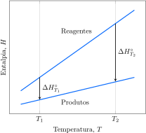

# A energia interna

A **termodinâmica** é o estudo das transformações da energia. Dois conceitos fundamentais da termodinâmica são calor e trabalho. As transferências de energia como trabalho ou calor são uma maneira de alterar a energia interna de um sistema. 

## O sistema e a vizinhança

Para acompanhar as mudanças de energia na termodinâmica, dividimos o mundo, por conveniência, em duas partes. A região de interesse, como um frasco contendo um gás, uma mistura de reação ou uma fibra muscular, é chamada de sistema. Tudo o mais, como o banho-maria em que a mistura de reação está imersa, é chamado de vizinhança. A vizinhança inclui a área onde são feitas as observações sobre a energia transferida para o sistema ou retirada do sistema. O sistema e a vizinhança formam o universo. Porém, com frequência a única parte do universo que é afetada em um processo é formada pela amostra, pelo frasco que a contém e por um banho-maria. Nestes casos, que incluem a maior parte dos processos deste livro, somente as mudanças na amostra e em sua vizinhança imediata precisam ser monitoradas. Existem três tipos de sistema:

- Um **sistema aberto** pode trocar matéria e energia com a vizinhança.
- Um **sistema fechado** tem uma quantidade fixa de matéria, mas pode trocar energia com a vizinhança.
- Um **sistema isolado** não pode trocar matéria nem energia.

São exemplos de sistemas abertos os motores de automóveis e o corpo humano. São exemplos de sistemas fechados as bolsas de gelo usadas no tratamento de lesões de atletas. Um sistema isolado é considerado completamente selado por paredes isolantes térmicas. Uma boa aproximação de um sistema isolado é o café quente dentro de uma garrafa térmica.

> Em termodinâmica, o universo é formado por um sistema e sua vizinhança. Um sistema aberto pode trocar matéria e energia com a vizinhança. Um sistema fechado só pode trocar energia. Um sistema isolado não pode trocar nada.

## O trabalho

A propriedade mais fundamental da termodinâmica é o **trabalho**, isto é, o processo de realizar movimento contra uma força oposta. Um sistema pode realizar dois tipos de trabalho. O **trabalho de expansão** é o provocado por uma mudança no volume de um sistema. O **trabalho de não expansão** é o que não envolve variação de volume. Uma reação química em uma bateria executa trabalho de não expansão quando provoca um fluxo de corrente elétrica, e seu corpo também executa trabalho de não expansão quando se move.

**Energia** é a capacidade de um sistema de executar um trabalho. Se um sistema pode executar muito trabalho, dizemos que ele tem muita energia. Um gás quente e comprimido pode realizar mais trabalho do que o mesmo gás quando sofreu expansão e esfriou, logo, ele tem mais energia no começo do processo. Uma mola comprimida consegue realizar mais trabalho do que uma mola distendida, o que significa que a mola comprimida tem mais energia. Quando um sistema executa trabalho na vizinhança, sua capacidade de executar trabalho se reduz e dizemos que sua energia diminuiu. Se o trabalho é realizado *sobre* um sistema, como ao comprimir uma mola, aumentamos sua capacidade de executar trabalho, portanto, podemos dizer que sua energia aumentou.

O conteúdo total de energia de um sistema é chamado de **energia interna**, $U$. Não podemos medir o valor absoluto da energia interna de um sistema porque ele inclui as energias de todos os átomos, de seus elétrons e dos componentes dos núcleos. O melhor que podemos fazer é medir as variações de energia. Por exemplo, se um sistema realiza um trabalho de $\pu{15 J}$ (e nenhuma outra mudança foi feita), ele consumiu uma parte da energia armazenada e dizemos que sua energia interna diminuiu $\pu{15 J}$, e escrevemos $\Delta U = -15 J$.

O exemplo mais simples de trabalho de expansão é dado por um gás em um cilindro equipado com um pistão. A pressão externa que age na face externa do pistão fornece a força que se opõe à expansão. Primeiro, vamos supor que a pressão externa seja constante, como ocorre quando a atmosfera pressiona o pistão. O trabalho realizado quando o sistema se expande por $\Delta V$ e a pressão externa constante é $P_\mathrm{ext}$ é
$$
    W = P_\text{ext} \Delta V
\tag{1}
$$
Esta expressão se aplica a todos os sistemas. Em um gás, o processo é mais fácil de visualizar, mas a expressão também se aplica a líquidos e sólidos. Contudo, a Equação 1 só é aplicável quando a pressão externa é constante durante a expansão.

:::warning

### Atenção

Se a pressão externa é $0$ ($P_\mathrm{ext} = 0$, o vácuo), a Equação 1 afirma que $W = 0$; isto é, um sistema não realiza trabalho de expansão quando se expande no vácuo, porque não existem forças que se oponham. Não há trabalho realizado quando se empurra alguma coisa mas não há resistência. A expansão contra a pressão zero é denominada **expansão livre**.

:::

> Trabalho é a transferência de energia para um sistema por um processo equivalente ao aumento ou ao abaixamento de um peso. Para o trabalho executado sobre um sistema, $W$ é negativo, e para o trabalho executado pelo sistema, $W$ é positivo. A energia interna de um sistema pode ser alterada pela realização de trabalho: $\Delta U = - W$.

## O calor

A energia interna de um sistema, isto é, sua capacidade de realizar trabalho, também pode ser alterada pela troca de energia com a vizinhança na forma de calor. Por exemplo, um gás em temperatura alta pode esfriar e, como resultado, ser capaz de realizar menos trabalho. *Calor* é um termo comum, mas que, em termodinâmica, adquire um significado específico. Em termodinâmica, **calor** é a energia transferida em consequência de uma diferença de temperatura. A energia na forma de calor flui de uma região de temperatura alta para uma região de temperatura baixa. Portanto, se um sistema (cujas paredes não são isolantes térmicos) está mais frio do que a vizinhança, a energia flui da vizinhança para o sistema. A energia transferida para um sistema é representada por $q$. Quando a energia interna de um sistema se altera por transferência de energia na forma de calor (sem que outro processo ocorra, inclusive expansão ou contração), $\Delta U = q$. Se energia entra em um sistema como calor, a energia interna do sistema aumenta e $q$ é positivo. Se energia deixa o sistema como calor, a energia interna do sistema diminui e $q$ é negativo. Assim, se $\pu{10 J}$ entram no sistema como calor, escreva $q = \pu{+10 J}$ e (desde que nenhum trabalho seja feito no sistema ou pelo sistema) $\Delta U = \pu{+10 J}$. Do mesmo modo, se $\pu{10 J}$ deixam o sistema, escreva $q = \pu{-10 J}$ e (se nenhum outro processo ocorre) $\Delta U = \pu{-10 J}$.

:::think

### Ponto para pensar

Como a transferência de calor entre objetos frios e quentes ocorre em nível atômico?

:::

Um processo que libera calor para a vizinhança é chamado de **processo exotérmico**. As reações mais comuns --- e todas as combustões, como as usadas nos meios de transporte e no aquecimento --- são exotérmicas. As reações que absorvem calor da vizinhança são menos comuns. Um processo que absorve calor é chamado de **processo endotérmico**. Certos processos físicos comuns são endotérmicos. Um exemplo é a vaporização, que é endotérmica porque é necessário fornecer calor para afastar as moléculas de um líquido umas das outras. A dissolução de nitrato de amônio em água também é endotérmica. Aliás, esse é o processo empregado nas ataduras frias usadas em ferimentos de atletas.

Existem dois tipos de limites entre um sistema e sua vizinhança:

- Uma parede **adiabática** não permite a transferência de energia como calor, mesmo que exista uma diferença de temperatura entre o sistema e a vizinhança.
- Uma parede **diatérmica** permite a transferência de energia como calor entre o sistema e a vizinhança.

Um sistema com paredes adiabáticas não é necessariamente um sistema isolado: as paredes podem ser flexíveis e a energia pode ser transferida do ou para o sistema na forma de trabalho de expansão. No caso de um recipiente diatérmico, contanto que o sistema não perca energia na forma de trabalho, o influxo de energia pelas suas paredes normalmente aumenta a temperatura do sistema. Logo, o acompanhamento da mudança de temperatura é um modo de medir o calor transferido e, portanto, de estimar a mudança da energia interna.

Para converter uma mudança de temperatura em energia transferida como calor, você precisa conhecer a capacidade calorífica, $C$, isto é, a razão entre o calor fornecido e o aumento de temperatura que ele provoca:
$$
    C = \dfrac{q}{\Delta T}
\tag{2}
$$

A transferência de energia na forma de calor é medida com um **calorímetro**, um dispositivo no qual a energia transferida é monitorada pela variação de temperatura produzida por um processo em seu interior. Um calorímetro pode ser simplesmente um vaso isolado termicamente e imerso em um banho de água, equipado com um termômetro. Uma versão mais sofisticada é o *calorímetro de bomba*. A reação ocorre dentro de um vaso selado de um metal resistente e de volume constante (a bomba), que fica imerso em água, e o aumento de temperatura do conjunto é monitorado. A capacidade calorífica é medida inicialmente fornecendo uma quantidade de calor conhecida e registrando o aumento de temperatura observado. Esse processo é chamado de *calibração* do calorímetro. É importante lembrar que a perda de calor em uma reação é ganha pelo calorímetro; isto é, $Q_\mathrm{cal} = -Q$. O calor  pelo calorímetro é encontrado usando a fórmula 
$$
     q = -Q_\mathrm{cal} = -C_\mathrm{cal} \Delta T
$$
em que $C_\mathrm{cal}$ é a capacidade calorífica do calorímetro (às vezes chamada de *constante do calorímetro*). Observe que, se $\Delta T$ é positivo, indicando que a temperatura do calorímetro subiu, então $Q$ é negativo, mostrando que a energia foi liberada na forma de calor pela reação.

:::example

### Cálculo da energia interna de reação a partir de dados calorimétricos em volume constante

Um calorímetro de volume constante foi calibrado com uma reação que libera $\pu{2 kJ}$ de calor em $\pu{0,1 L}$ de uma solução colocada no calorímetro, resultando em um aumento de temperatura de $\pu{4 \degree C}$. 

Em um experimento posterior, $\pu{50 mL}$ de uma solução $\pu{0,2 M}$ de $\ce{HCl}$ e $\pu{50 mL}$ de uma solução $\pu{0,2 M}$ de NaOH foram misturados no mesmo calorímetro e a temperatura subiu $\pu{1,2 \degree C}$. 

**Calcule** a variação de energia interna no segundo experimento.

#### Calibração. Calcule a capacidade calorífica do calorímetro.

De $Q = -Q_\mathrm{cal} = -C_\mathrm{cal} \Delta T$, no primeiro experimento:
$$
    C_\mathrm{cal} = \dfrac{ \pu{2 kJ} }{ \pu{4 \degree C} } 
        = \pu{0,5 kJ.K-1}
$$

#### Calcule a energia interna de reação.

Como nenhum trabalho é realizado, $\Delta U = Q$. 

De $Q = -Q_\mathrm{cal} = -C_\mathrm{cal} \Delta T$, no segundo experimento:
$$
    \Delta U = Q
        = - (\pu{0,5 kJ//K}) \times \pu{1,2 K} 
        = \boxed{ \pu{-0,6 kJ} }
$$

:::

> Calor é a transferência de energia que ocorre em consequência de uma diferença de temperatura. Quando energia é transferida na forma de calor e nenhum outro processo ocorre, $\Delta U = Q$. Quando energia entra em um sistema na forma de calor, $Q$ é positivo; e quando energia sai de um sistema na forma de calor, $Q$ é negativo.

## A primeira lei

Quando um sistema realiza apenas trabalho, $W$, a variação da energia interna (a energia total do sistema) é $\Delta U = -W$, e que quando um sistema troca energia apenas na forma de calor, $Q$, então $\Delta U = Q$. Em geral, a variação de energia interna de um sistema fechado é o resultado dos dois tipos de transferência. Assim, podemos escrever
$$
    \Delta U = Q - W
\tag{3}
$$
Essa expressão resume o fato experimental de que o calor e o trabalho são formas de transferência de energia e, portanto, de variação da energia interna de um sistema. Um aspecto essencial é que o *trabalho e o calor são equivalentes* no sentido de serem modos de transferência de energia. Se $Q$ e $W$ têm o mesmo valor numérico, não há diferença na variação da energia interna que eles acarretam. Um sistema é como um banco de energia, cujas reservas são medidas como energia interna, e os depósitos e as retiradas ocorrem como calor ou trabalho.

A Equação 3 é uma declaração **completa** de como variações da energia interna de um sistema fechado de composição constante podem ser obtidas: a única forma de mudar a energia interna de um sistema fechado é transferir energia para ele na forma de calor ou trabalho. Se o sistema está isolado, nem isso é possível, e a energia interna não pode mudar. Esta conclusão é denominada **primeira lei da termodinâmica**. Ela diz que:

- A energia interna de um sistema isolado é constante.

> Trabalho e calor são modos equivalentes de um sistema trocar energia. A primeira lei da termodinâmica afirma que a energia interna de um sistema isolado é constante.

## As funções de estado

De acordo com a primeira lei, se um sistema isolado tem uma dada energia interna em um dado momento e se for examinado novamente algum tempo depois, a energia interna será a mesma, independentemente do tempo que passou. Mesmo que o sistema passe por uma série de mudanças, a energia interna se manterá invariável quando ele retornar a seu estado inicial. Resumimos essas declarações dizendo que a energia interna é uma **função de estado**, uma propriedade cujo valor depende somente do estado atual do sistema e não da maneira como o estado foi atingido. A pressão, o volume, a temperatura e a densidade de um sistema também são funções de estado.

A importância das funções de estado na termodinâmica é que, como elas só dependem do estado atual do sistema, qualquer alteração de valor é independente do modo como a mudança foi feita. Uma função de estado é como a altitude em uma montanha. Podemos escolher vários caminhos diferentes entre dois pontos da montanha, mas a mudança de altitude entre os dois pontos será sempre a mesma, independentemente do caminho. Da mesma forma, se você aumentar a temperatura de $\pu{100 g}$ de água, originalmente em $\pu{25 \degree C}$, até $\pu{60 \degree C}$, a energia interna variará de uma certa quantidade. Se, todavia, você aquecer a mesma massa de água de $\pu{25 \degree C}$ até a temperatura de fervura, deixando vaporizar toda a água, condensar o vapor e resfriar o condensado até $\pu{60 \degree C}$, a variação total da energia interna é exatamente a mesma do processo anterior.

Como a energia interna é uma função de estado, qualquer caminho conveniente entre os estados inicial e final de um sistema pode ser escolhido, e é possível calcular $\Delta U$ para aquele caminho. O resultado terá o mesmo valor de $\Delta U$ que teria o caminho real entre os dois estados, mesmo que este último seja tão complicado que não permita o cálculo direto de $\Delta U$. Em alguns casos, seus conhecimentos intuitivos sobre o comportamento das moléculas vão ajudá-lo a identificar a variação de energia interna de um processo sem ter de calculá-la. Por exemplo, quando um gás ideal se expande isotermicamente, suas moléculas continuam a se mover na mesma velocidade média. Como não existem forças entre as moléculas, sua energia potencial total também permanece a mesma, ainda que a separação média tenha aumentado. Como a energia cinética total e a energia potencial total não mudam, a energia interna do gás também não muda. Isto é, 

- $\Delta U = 0$ para a expansão (ou compressão) isotérmica de um gás ideal.

Portanto, quando o volume de uma amostra de um gás ideal muda, por qualquer caminho entre dois estados, desde que a temperatura dos estados inicial e final seja a mesma, sabemos imediatamente que $\Delta U = 0$.

> Uma função de estado depende somente do estado em que se encontra o sistema. A mudança na função de estado entre dois estados é independente do caminho entre eles. A energia interna é uma função de estado. O trabalho e o calor não são.

# A entalpia 

Se o sistema tem paredes rígidas, seu volume permanece constante mesmo quando ocorrem outras mudanças, logo, nenhum trabalho de expansão é executado. Se você também sabe que nenhum trabalho de não expansão é realizado (um trabalho elétrico, por exemplo), então a variação na energia interna do sistema é igual à energia fornecida a ele como calor. Em química, entretanto, a maior parte das reações químicas ocorre em recipientes abertos para a atmosfera e, portanto, em pressão constante de cerca de $\pu{1 atm}$. Esses sistemas podem se expandir ou contrair livremente. Se um gás se forma, ele trabalha contra a atmosfera para ocupar espaço. Embora nenhum pistão esteja envolvido, trabalho é realizado. Nesse sentido, uma função de estado que medisse as variações de energia em pressão constante considerando automaticamente as perdas de energia como trabalho de expansão durante a transferência de calor seria muito útil.

## As transferências de calor sob pressão constante

A função de estado que permite medir as perdas de energia na forma de trabalho de expansão durante a transferência de calor em pressão constante (e o ganho de energia se o processo é uma compressão) é chamada de **entalpia**, $H$. A entalpia é definida como
$$
    H = U + PV
\tag{4}
$$
em que $U$, $P$ e $V$ são a energia interna, a pressão e o volume do sistema. A entalpia é uma função de estado porque, a exemplo de $U$ (da primeira lei), $P$ e $V$ são funções de estado, assim, $H$ também tem de ser uma função de estado. É possível mostrar que uma consequência dessa definição é que a variação da entalpia de um sistema é igual ao calor liberado ou absorvido em pressão constante.

:::derivation

### Como isso é feito?

Imagine um sistema em pressão constante, no qual a variação de energia interna é $\Delta U$ e a do volume é $\Delta V$. Da definição de entalpia na Equação 4, temos que a variação de entalpia é
$$
    \Delta H = \Delta U + P \Delta V
$$
Agora, escreva $\Delta U = Q - W$, em que $Q$ é a energia fornecida ao sistema na forma de calor e $W$ é a energia fornecida na forma de trabalho:
$$
    \Delta H = Q - W + P \Delta V
$$
Agora, suponha que o sistema não consiga realizar trabalho, a não ser de expansão. Nesse caso $W = P_\mathrm{ext}\Delta V$, portanto
$$
    \Delta H = Q - P_\mathrm{ext}\Delta V + P \Delta V
$$
Por fim, como o sistema está aberto para a atmosfera ou em um recipiente que permite a mudança de volume, a pressão é igual à pressão externa, isto é, $P_\mathrm{ext} = P$, e os últimos dois termos se cancelam para dar $\Delta H = Q$.

:::

Você viu que, para um sistema que só consegue realizar trabalho de expansão contra uma pressão constante,
$$
    \Delta H = Q_P
\tag{5}
$$
Onde $Q_P$ representa o calor trocado em pressão constante. Isso significa que, como as reações químicas geralmente ocorrem em pressão constante em reatores abertos para a atmosfera, o calor que elas fornecem ou utilizam pode ser igualado à variação de entalpia do sistema. Logo, se uma reação é estudada em um calorímetro aberto para a atmosfera, o aumento de temperatura observado pode ser usado como medida da variação de entalpia que acompanha a reação. Se, por exemplo, uma reação libera $\pu{1 kJ}$ de calor nesse tipo de calorímetro, então $\Delta H = Q_P = \pu{1 kJ}$.

Quando energia é transferida na forma de calor a um sistema em pressão constante, a entalpia do sistema *aumenta* dessa mesma quantidade. Quando energia deixa um sistema em pressão constante na forma de calor, a entalpia do sistema *diminui* dessa mesma quantidade. Por exemplo, a formação de iodeto de zinco a partir de seus elementos é uma reação exotérmica que (em pressão constante) libera $\pu{208 kJ}$ de calor para a vizinhança por mol de $\ce{ZnI2}$ formado. Portanto, $\Delta H = \pu{-208 kJ.mol-1}$, porque a entalpia da mistura de reação diminuiu em $\pu{208 kJ}$ nessa reação. Como um processo endotérmico absorve calor, então, quando nitrato de amônio se dissolve em água, a entalpia do sistema aumenta. Isto é, em pressão constante:

- Reações exotérmicas: $\Delta H < 0$
- Reações endotérmicas: $\Delta H > 0$

## As capacidades caloríficas

O aumento de temperatura e, portanto, a capacidade calorífica dependem das condições de aquecimento, porque, em pressão constante, parte do calor é usada para realizar o trabalho de expansão e para elevar a temperatura do sistema. A definição de capacidade calorífica tem de ser mais precisa.

Desde que não seja realizado trabalho de não expansão e que nenhuma outra mudança ocorra, o calor transferido em volume constante pode ser identificado com a variação da energia interna, $\Delta U = Q_V$. Esta igualdade pode ser combinada com $C = q/\Delta T$ para dar a **capacidade calorífica em volume constante**, $C_V$, como
$$
    C_V = \dfrac{ \Delta U }{ \Delta T } 
\tag{6a}
$$
Do mesmo modo, como o calor transferido sob pressão constante pode ser identificado com a variação de entalpia, $\Delta H$, é possível definir a **capacidade calorífica em pressão constante**, $C_P$, como
$$
    C_P = \dfrac{ \Delta H }{ \Delta T } 
\tag{6b}
$$
As capacidades caloríficas molares correspondentes são essas quantidades divididas pela quantidade de substância e são representadas por $C_{V,\mathrm{m}}$ e $C_{P,\mathrm{m}}$.

As capacidades caloríficas em volume constante e em pressão constante de um sólido têm valores comparáveis. O mesmo ocorre com os líquidos, mas não com os gases. A diferença reflete o fato de que os gases se expandem muito mais do que os sólidos e líquidos quando aquecidos, assim, um gás perde mais energia quando aquecido sob pressão constante do que um sólido ou um líquido. É possível obter uma relação quantitativa simples entre $C_{V,\mathrm{m}}$ e $C_{P,\mathrm{m}}$ para um gás ideal.

:::derivation

### Como isso é feito?

Para um gás ideal, o termo $PV$ da equação $H = U + PV$ pode ser substituído por $nRT$, então, $H = U + nRT$. Quando uma amostra de um gás ideal é aquecida, a entalpia, a energia interna e a temperatura mudam, e
$$
    \Delta H = \Delta U + nR \Delta T
$$
A capacidade calorífica em pressão constante pode ser expressa como
$$
    C_P = \dfrac{ \Delta H }{ \Delta T }
        = \dfrac{ \Delta U + nR \Delta T }{ \Delta T }
        = \dfrac{ \Delta U }{ \Delta T } + nR
        = C_V + nR
$$
Para obter a relação entre as duas capacidades caloríficas molares, basta dividir esta expressão por $n$.

:::

O cálculo mostra que as duas capacidades caloríficas molares de um gás ideal estão relacionadas pela expressão
$$
    C_{V,\mathrm{m}} = C_{P,\mathrm{m}} + R
\tag{7}
$$
A capacidade calorífica em pressão constante é maior do que em volume constante porque em pressão constante nem todo o calor fornecido é usado para aumentar a temperatura: parte volta à vizinhança como trabalho de expansão e $C = q/\Delta T$ é maior (porque $\Delta T$ é menor) do que em volume constante (quando toda a energia é usada para aumentar a temperatura do sistema).

> A capacidade calorífica molar de um gás ideal em pressão constante é maior do que em volume constante.

## A entalpia das transformações físicas

As moléculas de um sólido ou de um líquido ficam juntas devido às atrações intermoleculares. Mudanças de fase em que as atrações entre moléculas são reduzidas, como a fusão ou a vaporização, requerem energia e são, portanto, endotérmicas. Mudanças de fase que aumentam o contato entre as moléculas, como a condensação ou a solidificação, são exotérmicas porque energia é liberada quando as moléculas se aproximam e podem interagir mais entre si. Quando as transições de fase ocorrem, como é mais comum, em pressão constante, a transferência de calor que acompanha a mudança de fase é igual à variação de entalpia da substância.

Em uma dada temperatura, a fase vapor de uma substância tem mais energia e, portanto, maior entalpia do que a fase líquido. A diferença de entalpia molar entre os estados líquido e vapor de uma substância é chamada de **entalpia de vaporização**, $\Delta H_\mathrm{vap}$:
$$
    \Delta H_\mathrm{vap} 
        = \Delta H_\text{gás} - \Delta H_\text{líquido}
\tag{8}
$$
A entalpia de vaporização da maior parte das substâncias muda pouco com a temperatura. No caso da água no ponto de ebulição, $\pu{100 \degree C}$, $\Delta H_\mathrm{vap} = \pu{41 kJ.mol-1}$ e, em $\pu{25 \degree C}$, $\Delta H_\mathrm{vap} = \pu{44 kJ.mol-1}$. Este último valor significa que, para vaporizar $\pu{1 mol}$ de $\ce{H2O}$, que corresponde a $\pu{18 g}$ de água, em $\pu{25 \degree C}$ e pressão constante, devemos fornecer $\pu{44 kJ}$ de energia na forma de calor.

Todas as entalpias de vaporização são positivas, por isso, por convenção, não é necessário escrever o sinal. Compostos com interações intermoleculares fortes, como ligações hidrogênio, tendem a ter as mais altas entalpias de vaporização. Isso é fácil de explicar, porque a entalpia de vaporização mede a energia necessária para separar moléculas que sofrem atrações relativamente fortes no estado líquido e levá-las a um estado livre no vapor.

A variação de entalpia molar que acompanha o derretimento (em linguagem química, a fusão) é chamada de **entalpia de fusão**, $\Delta H_\mathrm{fus}$, da substância:
$$
    \Delta H_\mathrm{fus} 
        = \Delta H_\text{líquido} - \Delta H_\text{sólido}
\tag{9}
$$
A fusão, com uma única exceção conhecida (hélio), é endotérmica, logo, todas as entalpias de fusão (com a exceção mencionada) são positivas e não é preciso escrever o sinal positivo. A entalpia de fusão da água em $\pu{0 \degree C}$ é $\pu{6 kJ.mol-1}$. Vaporizar a mesma quantidade de água requer muito mais energia (acima de $\pu{40 kJ}$). Na fusão, as moléculas podem se mover mais facilmente, mas permanecem próximas e, portanto, as interações entre elas são quase tão fortes como as do sólido.

A **entalpia de solidificação** é a variação de entalpia molar quando um líquido se transforma em sólido. Como a entalpia é uma função de estado, a entalpia de solidificação de uma amostra de água deve ser a mesma depois de congelada e fundida como estava antes. Portanto, a entalpia de solidificação de uma substância é o negativo da entalpia de fusão. Para a água, em $\pu{0 \degree C}$, a entalpia de solidificação é $\pu{-6 kJ.mol-1}$, porque $\pu{6 kJ}$ de calor são liberados quando $\pu{1 mol}$ de $\ce{H2O(l)}$ se solidifica. Em geral, para obter a variação de entalpia para o inverso de qualquer processo, utilize o valor negativo da variação de entalpia para o processo direto:
$$
    \Delta H_\text{inverso} = - \Delta H_\text{direto}
$$

A sublimação é a conversão direta de um sólido em vapor. A geada desaparece em uma manhã seca e fria, à medida que o gelo sublima diretamente até vapor de água. O dióxido de carbono sólido também sublima e, por isso, é chamado de gelo seco. A cada inverno, em Marte, ocorrem depósitos de dióxido de carbono na forma de gelo polar, que sublima quando o fraco verão chega. A entalpia de sublimação, $\Delta H_\mathrm{sub}$, é a variação de entalpia molar que ocorre quando o sólido sublima:
$$
    \Delta H_\mathrm{fus} 
        = \Delta H_\text{vapor} - \Delta H_\text{sólido}
$$
Como a entalpia é uma função de estado, a entalpia de sublimação de uma substância é a mesma, tanto se a transição ocorre em uma etapa (diretamente de sólido a gás) quanto em duas etapas (primeiro de sólido a líquido, depois de líquido a gás). A entalpia de sublimação de uma substância deve ser igual, portanto, à soma das entalpias de fusão e de vaporização medidas na mesma temperatura:
$$
    \Delta H_\mathrm{sub}
        = \Delta H_\mathrm{fus} + \Delta H_\mathrm{vap} 
$$

> A variação de entalpia de uma reação inversa é o negativo da variação de entalpia da reação direta. As variações de entalpia podem ser somadas para obter a entalpia de um processo mais geral.

# A termoquímica

Os mesmos princípios usados para discutir as variações de entalpia em processos físicos são válidos para as transformações químicas. As entalpias das reações químicas são importantes em muitas áreas da química, como a seleção de materiais para bons combustíveis, o projeto de instalações químicas e o estudo dos processos bioquímicos. Em muitos casos, é importante conhecer a capacidade de uma reação de produzir calor (como na queima de um combustível). A termoquímica é o estudo da demanda de calor das reações químicas.

## A entalpia de reação

Qualquer reação química é acompanhada por transferência de energia, comumente na forma de calor. A reação completa com o oxigênio, por exemplo, é chamada de **combustão**, como na combustão do metano, o componente principal do gás natural. A calorimetria mostra que a queima de $\pu{1 mol}$ de $\ce{CH4(g)}$ produz $\pu{890 kJ}$ de calor em $\pu{298 K}$ e $\pu{1 bar}$. Esse valor é expresso da seguinte forma:
$$
    \ce{ CH4(g) + 2 O2(g) -> CO2(g) + 2 H2O(l) }\quad \Delta H = \pu{-890 kJ}
$$
Essa expressão completa é uma **equação termoquímica** e consiste em uma equação química associada à expressão da **entalpia de reação**, isto é, a variação de entalpia do processo correspondente. Os coeficientes estequiométricos indicam o número de mols de cada reagente que dá a variação de entalpia registrada. No caso apresentado, a variação de entalpia é a que resulta da reação completa de $\pu{1 mol}$ de $\ce{CH4}$ e $\pu{2 mol}$ de $\ce{O2}$. Se a mesma reação for escrita
com todos os coeficientes multiplicados por 2, então a variação de entalpia seria duas vezes maior, porque a equação representaria a combustão do dobro da quantidade de metano:
$$
    \ce{ 2 CH4(g) + 4 O2(g) -> 2 CO2(g) + 4 H2O(l) }\quad \Delta H = \pu{-1790 kJ}
$$
Observe que, embora a queima ocorra em temperaturas elevadas, o valor de $\Delta H$ dado aqui é determinado pela diferença de entalpia entre produtos e reagentes, medida em $\pu{298 K}$.

A primeira lei da termodinâmica diz que, como a entalpia é uma função de estado, a variação de entalpia do processo inverso (uma reação química, por exemplo) é o negativo da variação de entalpia do processo direto. Para a reação inversa:
$$
    \ce{ CO2(g) + 2 H2O(l) -> CH4(g) + 2 O2(g) }\quad \Delta H = \pu{+890 kJ}
$$

:::example

### Cálculo da entalpia de reação a partir de dados calorimétricos em pressão constante

Uma amostra de $\pu{0,117 g}$ de benzeno, $\ce{C6H6}$, foi queimada com excesso de oxigênio em um calorímetro de pressão constante calibrado cuja capacidade calorífica é $\pu{600 J.K-1}$. A temperatura do calorímetro aumentou $\pu{8 \degree C}$.

**Calcule** a entalpia de combustão do benzeno.

#### Escreva a reação de combustão do benzeno.

$$
    \ce{ C6H6(l) + 15/2 O2(g) -> 12 CO2(g) + 6 H2O(l) }
$$

#### Calcule o calor transferido para o calorímetro.

De $q = -Q_\mathrm{cal} = -C_\mathrm{cal} \Delta T$
$$
    q = - (\pu{600 J//K}) \times (\pu{8 K})
        = \pu{-4,8 kJ}
$$

#### Calcule a quantidade de benzeno que reagiu.

De $n = m/M$
$$
    n = \dfrac{ \pu{0,117 g} }{ \pu{78 g//mol} } 
        = \pu{1,5 mmol}
$$

#### Calcule a entalpia de combustão por mol de benzeno.

$$
    \Delta H 
        = - \dfrac{ \pu{-4,8 kJ} }{ \pu{1,5 mmol} }
        = \boxed{ \pu{-3,2 MJ.mol-1} }
$$
A variação na entalpia é negativa, o que é esperado dado que as reações de combustão são exotérmicas.

:::

> Uma equação termoquímica é a representação de uma equação química e da entalpia de reação correspondente, a variação de entalpia das quantidades estequiométricas das substâncias na equação química.

## A relação entre entalpia e energia interna de reação

Um calorímetro de pressão constante e um calorímetro de bomba medem variações de funções de estado diferentes: em volume constante, a transferência de calor é interpretada como $\Delta U$ e, em pressão constante, como $\Delta H$. Pode vir a ser necessário converter o valor medido de $\Delta U$ em $\Delta H$. Por exemplo, é fácil medir o calor liberado pela combustão da glicose em um calorímetro de bomba, que tem volume constante, mas para usar essa informação no cálculo de variações de energia no metabolismo, que ocorre em pressão constante, é necessário usar a entalpia de reação.

No caso de reações em que gases não são produzidos nem consumidos, a diferença entre $\Delta H$ e $\Delta U$ é desprezível e podemos considerar $\Delta H \approx \Delta U$. Entretanto, se um gás é formado na reação, muito trabalho é realizado para dar lugar aos produtos gasosos, de modo que a diferença pode ser significativa. Uma vez mais, se os gases se comportam idealmente, a lei dos gases ideais pode ser usada para relacionar os valores de $\Delta H$ e $\Delta U$.

:::derivation

### Como isso é feito?

Comece com a definição $H = U + PV$. Suponha que a quantidade de moléculas reagentes do gás ideal seja $n_{\text{gás}, 1}$. Como para um gás ideal $PV = nRT$, a entalpia inicial é
$$
    H_1 = U_1 + P_1V_1 = U_1 + n_{\text{gás}, 1} RT
$$
Depois que a reação se completou, a quantidade de moléculas de gás ideal produzidas é $n_{2, \ce{g}}$. A entalpia é, portanto
$$
    H_2 = U_2 + P_2V_2 = U_2 + n_{\text{gás}, 2} RT
$$
A diferença é
$$
    \overbrace{ H_2 - H_1 }^{ \Delta H } 
        =  \overbrace{ U_2 - U_1 }^{ \Delta U } + \overbrace{( n_{\text{gás}, 2} - n_{\text{gás}, 1} )}^{ \Delta n_\text{gás} } RT
$$
E, portanto,
$$
    \Delta H = \Delta U + \Delta n_\text{gás} RT
$$

:::

Você viu que
$$
    \Delta H = \Delta U + \Delta n_\text{gás} RT 
\tag{10}
$$
em que $\Delta n_\text{gás} = n_{\text{gás}, 2} - n_{\text{gás}, 1}$ é a variação da quantidade de moléculas de gás na reação (positiva para a formação de gás, negativa para o consumo de gás). Observe que $\Delta H$ é menos negativo (mais positivo) do que $\Delta U$ nas reações exotérmicas que geram gases. Em outras palavras, menos energia pode ser obtida na forma de calor sob pressão constante do que em volume constante, porque o sistema tem de usar energia para expandir o volume e acomodar os gases produzidos. No caso das reações em que não há mudança na quantidade de gás, as duas quantidades são aproximadamente iguais.

:::example

### Cálculo da entalpia de reação a partir de dados calorimétricos em volume constante

Uma amostra de $\pu{1 mmol}$ de glicose, $\ce{C6H12O6}$, foi queimada com excesso de oxigênio em um calorímetro de volume constante. A reação gerou $\pu{2,6 kJ}$ de calor em $\pu{400 K}$.

**Calcule** a entalpia de combustão da glicose.

#### Escreva a reação de combustão da glicose.

$$
    \ce{ C6H12O6(s) + 6 O2(g) -> 6 CO2(g) + 6 H2O(g) }
$$

#### Calcule a energia interna de combustão por mol de glicose.

$$
    \Delta U = - \dfrac{ \pu{-2,6 J} }{ \pu{1 mmol} } = \pu{-2600 kJ}
$$
A variação na energia interna é negativa, o que é esperado dado que as reações de combustão são exotérmicas.

#### Calcule a variação no número de mols de gás por mol de reação.

$$
    \Delta n_\text{gás} = 12 - 6 = 6
$$

#### Calcule a entalpia de combustão por mol de glicose.

De $\Delta H = \Delta U + \Delta n_\text{gás} RT$
$$
\begin{aligned}
    \Delta H 
        &= (\pu{-2600 kJ//mol}) + \pu{6} \times (\pu{8,3e-3 kJ//K.mol}) \times (\pu{400 K}) \\
        &= \boxed{ \pu{-2585 kJ.mol-1} }
\end{aligned}
$$

:::

> A entalpia de reação é menos negativa (mais positiva) do que a energia interna de reação nas reações que geram gases. Nas reações em que a quantidade de gás não varia, as duas quantidades são praticamente iguais.

## As entalpias padrão de reação

Como o calor liberado ou absorvido em uma reação depende dos estados físicos dos reagentes e produtos, é necessário especificar o estado de cada substância. Por exemplo, ao descrever a combustão do eteno, podemos escrever duas equações termoquímicas diferentes para dois conjuntos diferentes de produtos:
$$
\begin{aligned}
    \ce{ C2H4(g) + 3 O2(g) &-> 2 CO2(g) + 2 H2O(g) } && \Delta H = \pu{-1323 kJ} \\
    \ce{ C2H4(g) + 3 O2(g) &-> 2 CO2(g) + 2 H2O(l) } && \Delta H = \pu{-1411 kJ}
\end{aligned}
$$
Na primeira reação, a água é produzida como vapor, e na segunda, como líquido. O calor
produzido é diferente nos dois casos. A entalpia do vapor de água é $\pu{44 kJ.mol-1}$ maior do que a da água líquida, em $\pu{25 \degree C}$. Como resultado, um excesso de $\pu{88 kJ.mol-1}$ (para $\pu{2 mol}$ de $\ce{H2O}$) permanece armazenado no sistema se vapor de água é formado. Se a água subsequentemente condensa, o excesso de $\pu{88 kJ.mol-1}$ é liberado na forma de calor.

A entalpia de reação depende também das condições (como a pressão). A menos que seja especificado de outra forma, todas as tabelas deste livro fornecem dados para reações nas quais os reagentes e produtos estão no **estado padrão**, isto é, na sua forma pura, em exatamente $\pu{1 bar}$. O estado padrão da água líquida é o da água pura sob $\pu{1 bar}$. O estado padrão do gelo é gelo puro sob $\pu{1 bar}$. Um soluto está em seu estado padrão quando sua concentração é $\pu{1 mol.L-1}$. A entalpia padrão de reação, $\Delta H^\circ$, é a entalpia de reação quando os reagentes, em seus estados padrão, transformam-se em produtos, também em seus estados padrão.

A maior parte dos dados termodinâmicos é registrada para $\pu{25 \degree C}$ (mais precisamente, para $\pu{298 K}$). A temperatura não faz parte da definição dos estados padrão. Um estado padrão pode ser definido em qualquer temperatura; $\pu{298 K}$ é somente a temperatura mais comumente usada nas tabelas de dados. Todas as entalpias de reação usadas neste texto referem-se a $\pu{298 K}$, a menos que outra temperatura seja indicada.

Um tipo especial de reação que desempenha um papel importante na termodinâmica, assim como no mundo real, é a combustão. Conhecer o calor que pode ser obtido com a queima de um combustível é importante na avaliação de fontes de energia. A **entalpia padrão de combustão**, $\Delta H_\mathrm{c}^\circ$, é a variação da entalpia por mol de uma substância queimada em uma reação de combustão em condições padrão. 

:::warning

### Atenção 

Os produtos da combustão de um composto orgânico são o dióxido de carbono gasoso e a água no estado líquido. O nitrogênio presente é liberado como $\ce{N2}$, a menos que outros produtos sejam especificados --- como o $\ce{NO(g)}$ e o $\ce{NO2(g)}$. 

:::

Na prática, é preciso considerar a massa de combustível que um veículo precisa transportar ou o volume que ela ocupa. Para considerar a carga associada à massa do combustível, é comum usar a **entalpia específica**, a entalpia padrão de combustão de uma amostra do combustível dividida pela massa da amostra. Quando o volume ocupado por um combustível é importante, o parâmetro usado é a **densidade de entalpia**, isto é, a entalpia de combustão da amostra dividida por seu volume.

Conhecida a entalpia da reação, a variação da entalpia e, portanto, o calor liberado ou necessário em pressão constante pode ser calculado para qualquer quantidade, massa ou volume de reagentes consumidos ou produtos formados em condições padrão, mesmo que a reação não possa ser realizada na prática. É preciso fazer um cálculo estequiométrico, considerando o calor como se fosse um reagente ou um produto.

:::example

### Cálculo do calor liberado por um combustível

**Calcule** a massa de oxigênio necessária para fornecer $\pu{330 kJ}$ de calor por combustão com butano.

- $\Delta H_\mathrm{c}(\ce{C4H10}) = \pu{-2860 kJ.mol-1}$

#### Escreva a reação de combustão do butano.

$$
    \ce{ C4H10(g) + 13/2 O2(g) -> 8 CO2(g) + 10 H2O(l) }
$$

#### Converta o calor liberado necessário na quantidade de oxigênio.

$$
    n = \dfrac{13}{2} \times \dfrac{ \pu{330 kJ} }{ \pu{2860 kJ//mol} } = \pu{0,75 mol}
$$

#### Converta a quantidade de oxigênio em massa.

De $m = n M$
$$
    m = \pu{0,75 mol} \times  \pu{32 g.mol-1} = \boxed{ \pu{24 g} }
$$

:::

> As entalpias padrão de reação indicam reações nas quais os reagentes e produtos estão em seus estados padrão, a forma pura em $\pu{1 bar}$. Elas são normalmente registradas para a temperatura de $\pu{298 K}$. O calor absorvido ou liberado por uma reação pode ser tratado como um reagente ou um produto em um cálculo estequiométrico.

## A combinação das entalpias de reação: lei de Hess

A entalpia é uma função de estado, logo, o valor de $\Delta H$ é independente do caminho entre os estados inicial e final. Vimos que a variação de entalpia de um processo físico (sublimação) é expressa como a soma das variações de entalpia de uma série de duas etapas (fusão e vaporização). A mesma regra aplica-se a reações químicas e, nesse contexto, ela é conhecida como **lei de Hess**:

- A entalpia total da reação é a soma das entalpias de reação das etapas em que a reação
pode ser dividida.

A lei de Hess aplica-se mesmo que as reações intermediárias ou a reação total não possam
ser realizadas na prática. Isto é, elas podem ser *hipotéticas*. Conhecidas as equações balanceadas de cada etapa e sabendo que a soma dessas equações é igual à equação da reação de interesse, a entalpia de reação pode ser calculada a partir de qualquer sequência conveniente de reações

Como exemplo da lei de Hess, considere a oxidação do carbono, na forma de grafita, representado por $\ce{C(gr)}$, a dióxido de carbono
$$
    \ce{ C(gr) + O2(g) -> CO2(g) }
$$
Pode-se imaginar que essa reação aconteça em duas etapas. A primeira é a oxidação do carbono a monóxido de carbono:
$$
    \ce{ C(gr) + 1/2 O2(g) -> CO(g) }\quad \Delta H = \pu{-110 kJ}
$$
A segunda etapa é a oxidação do monóxido de carbono a dióxido de carbono:
$$
    \ce{ CO(g) + 1/2 O2(g) -> CO2(g) }\quad \Delta H = \pu{-280 kJ}
$$
Esse processo em duas etapas é um exemplo de uma sequência de reações, uma série de reações em que os produtos de uma reação são os reagentes de outra reação. A equação da reação total, o resultado final da sequência, é a soma das equações das etapas intermediárias:
$$
\begin{aligned}
    \ce{ C(gr) + 1/2 O2(g) &-> CO(g) } && \Delta H = \pu{-110 kJ} \\
    \ce{ CO(g) + 1/2 O2(g) &-> CO2(g) } && \Delta H = \pu{-280 kJ} \\[1ex] 
    \hline \\[-2ex]
    \ce{ C(gr) + O2(g) &-> CO2(g) } && \Delta H = \pu{-390 kJ}
\end{aligned}
$$
O mesmo procedimento é usado no cálculo das entalpias de reações que não podem ser medidas diretamente em laboratório.

:::example

### Cálculo da entalpia de reação usando a lei de Hess

A gasolina, que contém octano, pode queimar até monóxido de carbono se o fornecimento de ar for reduzido.

**Calcule** a entalpia de combustão incompleta do octano líquido formando monóxido de carbono e água líquida.

- $\Delta H^\circ_\mathrm{c}(\ce{C8H18, l}) = \pu{-5500 kJ.mol-1}$
- $\Delta H^\circ_\mathrm{c}(\ce{CO, g}) = \pu{-280 kJ.mol-1}$

#### Escreva a reação de interesse como uma composição das reações fornecidas.

$$
\begin{aligned}
    \ce{  C8H18(l) + 25/2 O2(g) &-> 8 CO2(g) + 9 H2O(l) }  \\
    \ce{ 8 CO2(g) &-> 8 CO(g) + 4 O2(g) }  \\[1ex]
    \hline \\[-2ex]
    \ce{ C8H18(l) + 17/2 O2(g) &-> 8 CO(g) + 9 H2O(l) }
\end{aligned}
$$

#### Calcule a entalpia de reação.

$$
\begin{aligned}
    \Delta H^\circ_\mathrm{r}
        &= \Big\{ (\pu{-5500}) - 8 (\pu{-280}) \Big\} \, \pu{kJ//mol} \\
        &= \boxed{ \pu{-3260 kJ.mol-1} }
\end{aligned}
$$

:::

> De acordo com a lei de Hess, as equações termoquímicas das etapas de uma sequência de reações podem ser combinadas para dar a equação termoquímica da reação total.

## As entalpias padrão de formação

Existem milhões de reações possíveis, e seria impraticável listar cada uma com sua entalpia padrão de reação. Os químicos, porém, inventaram uma alternativa engenhosa. Inicialmente, eles registram a *entalpia padrão de formação* das substâncias. Depois, combinam essas quantidades para obter a entalpia da reação desejada.

A entalpia padrão de formação, $\Delta H_\mathrm{f}^\circ$, de uma substância é a entalpia padrão da reação por mol de fórmula unitária da formação de uma substância a partir de seus elementos na sua *forma mais estável*, como na reação de formação do etanol:
$$
    \ce{ 2 C(gr) + 3 H2(g) + 1/2 O2(g) -> C2H5OH(l) }\quad \Delta H^\circ = \pu{-278 kJ}
$$
em que $\ce{C(gr)}$ significa grafita, a forma mais estável do carbono na temperatura normal. A equação química que corresponde à entalpia padrão de formação de uma substância tem um só produto com o coeficiente estequiométrico igual a 1 (o que implica a formação de $\pu{1 mol}$ de substância). Algumas vezes, como aqui, coeficientes fracionários são necessários para os reagentes. Como as entalpias padrão de formação são expressas em quilojoules por mol da substância de interesse, neste caso $\Delta H_\mathrm{f}^\circ (\ce{C2H5OH, l}) = \pu{-278 kJ.mol-1}$. Observe também como a variação da entalpia é informada, de maneira que uma espécie e seu estado (líquido, neste caso) sejam representadas na forma correta.

A partir da definição anterior, temos que a entalpia padrão de formação de um elemento
na sua forma mais estável é zero. Por exemplo, a entalpia padrão de formação de $\ce{C(gr)}$ é zero porque $\ce{ C(gr) -> C(gr) }$ é uma *reação vazia* (isto é, nada muda). Neste caso, $\Delta H_\mathrm{f}^\circ (\ce{C, gr}) = 0$. A entalpia de formação de um elemento em uma forma que não é a mais estável, entretanto, é diferente de zero. Por exemplo, a conversão do carbono da grafita (a forma mais estável) em diamante é endotérmica:
$$
    \ce{ C(gr) -> C(diamante) }\quad \Delta H^\circ  = \pu{+1,9 kJ}
$$
A entalpia padrão de formação do diamante é, portanto, registrada como $\Delta H_\mathrm{f}^\circ (\ce{C, diamante}) = \pu{+1,9 kJ.mol-1}$.

:::displaytable

#### Formas mais estáveis dos elementos a $\pu{25 \degree C}$ e $\pu{1 bar}$

| **Elemento**                          | **Forma mais estável** |
| :------------------------------------ | :--------------------- |
| $\ce{H2}, \ce{O2}, \ce{Cl2}, \ce{Xe}$ | Gás                    |
| $\ce{Br2}, \ce{Hg}$                   | Líquido                |
| $\ce{C}$                              | Grafite                |
| $\ce{Na}, \ce{Fe}, \ce{I2}$           | Sólido                 |

:::

Para saber como combinar entalpias padrão de formação a fim de obter uma entalpia padrão de reação, imagine que, para executar a reação, os reagentes são antes convertidos nos elementos em suas formas mais estáveis e, depois, os produtos são formados a partir desses elementos. A entalpia padrão de reação da primeira etapa é o valor negativo das entalpias padrão de formação de todos os reagentes (os reagentes estão sendo *decompostos* em seus elementos constituintes), e da segunda etapa é a soma das entalpias padrão de formação de todos os produtos, ambas em função da quantidade presente:
$$
    \Delta H^\circ 
        = \sum_\text{produtos} n \Delta H^\circ_\mathrm{f} 
        - \sum_\text{reagentes} n \Delta H^\circ_\mathrm{f}
\tag{11}
$$
Nessa expressão, os valores de $n$ são os coeficientes estequiométricos da equação química.

:::example

### Cálculo da entalpia padrão de reação a partir das entalpias padrão de formação

A produção de aço a partir do minério de ferro é representada pela reação:
$$
   \ce{ 2 Fe2O3(s) + 3 C(s) -> 4 Fe(s) + 3 CO2(g) }
$$

**Calcule** a entalpia padrão de redução do óxido de ferro.

- $\Delta H^\circ_\mathrm{f}(\ce{Fe2O3, s}) = \pu{-824 kJ.mol-1}$
- $\Delta H^\circ_\mathrm{f}(\ce{CO2, g}) = \pu{-394 kJ.mol-1}$

#### Calcule a entalpia padrão de reação.

De $\Delta H_\mathrm{r}^\circ = \sum_\text{produtos} n \Delta H^\circ_\mathrm{f} - \sum_\text{reagentes} n \Delta H^\circ_\mathrm{f}$ 
$$
   \Delta H_\mathrm{r}^\circ 
      = 3 \Delta H^\circ_{\mathrm{f}, \ce{CO2(g)}} 
         - 2 \Delta H^\circ_{\mathrm{f}, \ce{Fe2O3(s)}}
$$
logo,
$$
\begin{aligned}
   \Delta H_\mathrm{r}^\circ
      &= \Big\{ 3 (\pu{-394}) -  2 (\pu{-824}) \Big\}\,\pu{kJ//mol} \\
      &= \boxed{ \pu{+466 kJ.mol-1} }
\end{aligned}
$$

:::

As entalpias padrão de formação são comumente determinadas a partir de dados de
combustão.

> As entalpias padrão de formação podem ser combinadas para dar a entalpia padrão de qualquer reação.

## A variação da entalpia com a temperatura

Em alguns casos, você conhece a entalpia de reação de uma temperatura mas precisa do valor para outra temperatura. Por exemplo, a temperatura do corpo humano é cerca de $\pu{37 \degree C}$, mas os dados termodinâmicos referem-se a $\pu{25 \degree C}$. Será que um aumento de $\pu{12 \degree C}$ faz muita diferença para a entalpia de reação de um processo metabólico?

As entalpias dos reagentes e produtos aumentam com a temperatura. Se a entalpia total dos reagentes aumenta mais do que a dos produtos quando a temperatura se eleva, então a entalpia de reação de uma reação exotérmica fica mais negativa (Figura 1). Por outro lado, se a entalpia dos produtos aumenta mais do que a dos reagentes quando a temperatura se eleva, então a entalpia de reação fica menos negativa. O aumento de entalpia de uma substância quando a temperatura cresce depende de sua capacidade calorífica sob pressão constante, $C_P = \Delta H/\Delta T$. 

Para calcular a entalpia de reação em uma temperatura diferente, podemos aproveitar o fato de que a entalpia é função de estado para propor um caminho alternativo:

1. Levar os reagentes da temperatura de interesse até $\pu{298 K}$.
2. Conduzir a reação em $\pu{298 K}$.
3. Levar os produtos de $\pu{298 K}$ até a temperatura de interesse.

Como os estados inicial e final são os reagentes e produtos na temperatura de interesse, esse processo possui a mesma variação de entalpia do que a reação na temperatura de interesse. Esse cálculo é resumido pela lei de Kirchhoff:
$$
    \Delta H_{T_2}^\circ = \Delta H_{T_1}^\circ + (T_2 - T_1) \times \Delta C_P
$$
em que $\Delta C_P$ é a diferença entre as capacidades caloríficas em pressão constante dos produtos e reagentes:
$$
    \Delta C_P = \sum_\text{produtos} n C_P - \sum_\text{reagentes} n C_P
$$

:::warning

Como a diferença entre $\Delta H_{T_2}^\circ$ e $\Delta H_{T_1}^\circ$ depende da diferença das capacidades caloríficas dos reagentes e produtos --- uma diferença que normalmente é pequena --- na maior parte dos casos, a entalpia de reação varia muito pouco com a temperatura e, para pequenas diferenças de temperatura, pode ser tratada como constante.

:::

:::example

### Cálculo da entalpia de reação em uma temperatura diferente

A entalpia padrão de formação da amônia,
$$
    \ce{ N2(g) + 3 H2(g) -> 2 NH3(g) }
$$
é $\pu{-92 kJ.mol-1}$ em $\pu{298 K}$. 

A síntese industrial da amônia ocorre em $\pu{425 \degree C}$.

**Calcule** a entalpia de síntese de amônia a $\pu{425 \degree C}$.

#### Calcule a entalpia para resfriar os reagentes até $\pu{25 \degree C}$.

$$
\begin{aligned}
    \Delta H_1^\circ
        &= \Big\{ C_{P, \ce{N2}} + 3 C_{P, \ce{H2}} \Big\} \times \Delta T\\
        &= (\pu{120 J//K.mol}) \times (\pu{298 K} - \pu{698 K}) \\
        &= \pu{-24 kJ.mol-1}
\end{aligned}
$$

#### Calcule a entalpia para aquecer os produtos até $\pu{425 \degree C}$.

$$
\begin{aligned}
    \Delta H_2^\circ
        &= 2 C_{P, \ce{NH3}} \times \Delta T\\
        &= (\pu{70 J//.K.mol}) \times (\pu{698 K} - \pu{298 K}) \\
        &= \pu{14 kJ.mol-1}
\end{aligned}
$$

#### Calcule a entalpia de reação $\pu{425 \degree C}$.

De $\Delta H_{\pu{425 \degree C}}^\circ = \Delta H_1^\circ + \Delta H_{\pu{25 \degree C}}^\circ + \Delta H_2^\circ$
$$
\begin{aligned}
    \Delta H_{\pu{425 \degree C}}^\circ 
        &= \Big\{ (\pu{-24}) + (\pu{-92}) + (\pu{14}) \Big\} \, \pu{kJ//mol} \\
        &= \boxed{ \pu{-102 kJ.mol-1} }
\end{aligned}
$$

:::

> A variação da entalpia padrão de reação com a temperatura é dada pela lei de Kirchhoff, em função da diferença das capacidades caloríficas molares em pressão constante entre os produtos e os reagentes.

