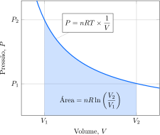
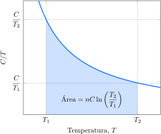

# A entropia

A primeira lei da termodinâmica diz que, se uma reação ocorre, a energia total do universo (o sistema e sua vizinhança) permanece inalterada. A primeira lei não trata, porém, das questões que estão por trás do *se*. Por que algumas reações têm tendência a ocorrer e outras não? Por que algo acontece? Para responder a essas perguntas essenciais sobre o mundo, é preciso recorrer a uma segunda lei.

## A mudança reversível

Na linguagem comum, um processo reversível é aquele que pode ocorrer em qualquer direção. Este uso comum é refinado na ciência: na termodinâmica, um **processo reversível** é aquele que pode ser revertido por uma mudança *infinitamente pequena* (uma mudança *infinitesimal*) de uma variável. Por exemplo, se a pressão externa é exatamente igual à pressão do gás no sistema, o pistão não se move. Se a pressão externa aumentar uma quantidade infinitesimal, o pistão se move para dentro. Se, porém, a pressão externa diminuir uma quantidade infinitesimal, o pistão se move para fora. A expansão contra uma pressão externa que difere da pressão do sistema por um valor mensurável é um processo irreversível, no sentido de que uma mudança infinitesimal de pressão externa não inverte a direção do movimento do pistão. Por exemplo, se a pressão do sistema é $\pu{2 atm}$ em um determinado momento da expansão e a pressão externa é $\pu{1 atm}$, então, uma mudança infinitesimal nesta última não converte expansão em compressão. Os processos reversíveis têm importância considerável na termodinâmica porque, como você verá, o trabalho que um sistema pode executar é máximo em um processo reversível.

O tipo mais simples de mudança reversível que podemos considerar é a expansão isotérmica (em temperatura constante), reversível, de um gás ideal. A temperatura do gás é mantida constante ao garantir o contato térmico do sistema com um banho de água em temperatura constante durante toda a expansão. Em uma expansão isotérmica, a pressão do gás diminui à medida que ele se expande, logo, para que a expansão isotérmica seja reversível, a pressão externa deve reduzir-se gradualmente com a variação de volume de modo que, em cada ponto, ela seja igual à pressão do gás. Para calcular o trabalho, é preciso levar em conta a redução gradual da pressão externa e, em consequência, a força contrária que muda.

:::derivation

### Como isso é feito?

Em cada estágio da expansão, a pressão do gás está relacionada a seu volume pela lei dos gases ideais, $PV = nRT$. Assim, a curva de uma isoterma é dada por:
$$
    P = nRT \times \dfrac{1}{V}
$$
O trabalho total realizado é a soma destas contribuições durante as variações de volume entre o valor inicial, $V_1$, e o valor final, $V_2$. Isto é, a área do gráfico de pressão por volume.

o trabalho é obtido ao calcular a área limitada pelo volume inicial e final:
$$
    W = nRT \ln\left( \dfrac{V_2}{V_1} \right)
$$

:::

O resultado final do cálculo é que o trabalho de uma expansão isotérmica reversível de um gás ideal de $V_1$ a $V_2$ é
$$
    W = nRT \ln\left( \dfrac{V_2}{V_1} \right)
\tag{1}
$$
Se a pressão externa aumentasse infinitesimalmente em qualquer momento da expansão, o pistão iria mover-se para dentro e não para fora. Logo, o trabalho executado durante a expansão reversível de um gás é o trabalho de expansão máximo possível. Este ponto geral é muito importante:

- O trabalho máximo é realizado em um processo que ocorre de forma reversível.

A transferência de energia como calor ocorre de forma reversível (no sentido termodinâmico) se as temperaturas do sistema e de sua vizinhança são idênticas. Com um aumento infinitesimal da temperatura da vizinhança, energia entraria no sistema; com uma redução de mesma magnitude, energia sairia do sistema para a vizinhança. Quando as temperaturas são idênticas, a energia flui como calor em ambas as direções na mesma velocidade. Nessa situação, o sistema e a vizinhança estão em equilíbrio térmico. Um ponto muito importante é que equilíbrio não significa *estacionado*. O equilíbrio é dinâmico, uma vez que os processos moleculares continuam ocorrendo, mas em velocidades iguais. A grande importância de um equilíbrio ser dinâmico está no fato de ele reagir às alterações na vizinhança. Todos os equilíbrios na química são dinâmicos por serem vivos, com capacidade de reação.

> Um processo reversível é um processo que pode ser invertido pela mudança infinitesimal de uma variável. O maior trabalho é realizado por um processo que ocorre de forma reversível.

## A mudança espontânea

Uma **mudança espontânea** é uma mudança que tende a ocorrer sem a necessidade de indução externa. Um exemplo simples é o resfriamento de um bloco de metal quente até alcançar a temperatura da vizinhança. A mudança inversa, um bloco de metal que, espontaneamente, esquenta mais do que a vizinhança, nunca foi observada. A expansão de um gás no vácuo também é espontânea: um gás não tende a se contrair espontaneamente em uma parte do recipiente.

Uma mudança espontânea não precisa ser necessariamente rápida. O melaço tem tendência espontânea a escorrer quando a lata é inclinada, mas, em temperaturas baixas, o fluxo pode ser muito lento. O hidrogênio e o oxigênio têm tendência a reagir para formar água --- a reação é espontânea no sentido termodinâmico ---, mas a mistura dos dois gases pode ser estocada por séculos, desde que não seja ativada por uma faísca. Os diamantes têm a tendência natural de se transformarem em grafita, mas permanecem inalterados por incontáveis anos --- na escala humana, os diamantes são, na prática, eternos. Um processo espontâneo tem a tendência natural de ocorrer. Isso não necessariamente acontece em uma velocidade significativa. Sempre que estivermos investigando a termodinâmica das mudanças, devemos nos lembrar de que estamos explorando apenas a tendência de um processo ocorrer. Se essa tendência ocorre na prática, depende da velocidade. As velocidades estão fora do domínio da termodinâmica.

As mudanças podem ser induzidas em uma direção *não natural*. Por exemplo, podemos forçar a passagem de corrente elétrica através de um bloco metálico para aquecê-lo até uma temperatura superior à da vizinhança. Um gás pode ser forçado a ocupar um volume menor quando se empurra um pistão. Porém, para produzir uma mudança não espontânea, é preciso conceber uma maneira de forçar o acontecimento, influenciando de fora o sistema. Em resumo, *uma mudança não espontânea só pode ser efetuada quando se exerce trabalho contra o sistema*.

> Um processo é espontâneo se ele tem a tendência de ocorrer sem estar sendo induzido por uma influência externa. Mudanças espontâneas não são necessariamente rápidas.

## A entropia a a desordem

Quais são as tendências comuns a todas as mudanças espontâneas? Considere dois cenários. No primeiro, o resfriamento de um bloco de metal quente ocorre porque a energia dos átomos que vibram vigorosamente tende a se espalhar pela vizinhança (o ar e o aparelho que envolvem o bloco). Os átomos do metal movem-se vigorosamente e colidem com os átomos e as moléculas mais lentos, transferindo para eles parte de sua energia durante as colisões. A mudança inversa é muito improvável porque exigiria que a energia migrasse do ambiente mais frio para se concentrar em um pequeno bloco de metal aquecido. Um processo como esse exigiria que os átomos que se movem menos vigorosamente na vizinhança colidissem com os átomos que se movem mais vigorosamente do metal e os fizessem mover-se ainda mais vigorosamente. As moléculas de um gás movem-se aleatoriamente e espalham-se por todo o recipiente. É muito improvável que o movimento aleatório leve todas elas, ao mesmo tempo, para um canto do recipiente. O padrão que começa a emergir é que a *energia e a matéria tendem a ficar mais desordenadas*.

Na linguagem da termodinâmica, essa ideia simples é expressa como **entropia**, $S$, uma medida da desordem. *Entropia baixa significa pouca desordem e entropia alta significa muita desordem*. Portanto, o padrão pode ser expresso como a **segunda lei da termodinâmica**:

- A entropia de um sistema isolado aumenta durante uma mudança espontânea.

Assim, o resfriamento do metal quente é acompanhado pelo aumento da entropia quando a energia se espalha pela vizinhança. O *sistema isolado*, neste caso, é o bloco e sua vizinhança imediata. Do mesmo modo, a expansão de um gás é acompanhada pelo aumento de entropia quando as moléculas se espalham pelo vaso. A direção natural do sistema e sua vizinhança (que juntos formam o *universo*) é ir da ordem para a desordem, do organizado para o aleatório, da menor para a maior entropia.

Se a temperatura for constante, a variação de entropia de um sistema pode ser calculada pela seguinte expressão:
$$
    \Delta S = \dfrac{ Q_\mathrm{rev} }{ T }
\tag{2}
$$
em que $\Delta S$ é a variação da entropia do sistema, $q$ é a energia transferida na forma de calor e $T$ é a temperatura (absoluta) na qual ocorre a transferência. O subscrito $\mathrm{rev}$ em $q$ significa que a energia tem de ser transferida reversivelmente. Em uma transferência reversível de energia na forma de calor, as temperaturas da vizinhança e do sistema são infinitesimalmente diferentes e ambas precisam ser constantes. Quando o calor é medido em joules e a temperatura em kelvin, a mudança de entropia (e a própria entropia) é medida em joules por kelvin.

:::info

### O que esta equação revela?

Se muita energia é transferida na forma de calor ($Q_\mathrm{rev}$ grande), ocorre grande aumento da desordem no sistema e você pode esperar um grande aumento correspondente na entropia. Para uma dada transferência de energia, você deve esperar um maior aumento da desordem quando a temperatura é baixa do que quando ela é alta. A energia introduzida altera mais as moléculas de um sistema frio (com pouco movimento térmico) mais claramente do que as de um sistema mais quente em que as moléculas já estão em um movimento vigoroso. (Pense em como um espirro em uma biblioteca silenciosa atrairá mais atenção do que um espirro em uma rua barulhenta, que provavelmente passará despercebido.)

:::

:::example

### Cálculo da variação de entropia quando um sistema é aquecido reversivelmente

O sapo-boi é um animal de sangue frio, o que significa que libera no ambiente o excesso de calor gerado pelo metabolismo. Um sapo-boi sedentário está sendo estudado no aquário de um laboratório mantido na temperatura constante de $\pu{27 \degree C}$. O animal transferiu $\pu{150 J}$ de energia de forma reversível à água em $\pu{27 \degree C}$. 

**Calcule** a variação de entropia da água.

#### Calcule a variação de entropia.

De $\Delta S = Q_\mathrm{rev}/T$
$$
    \Delta S 
        = \dfrac{ \pu{150 J} }{ \pu{300 K} } 
        = \boxed{ \pu{+0,5 J.K-1} }
$$

:::

Uma característica muito importante da entropia, que não é imediatamente óbvia na Equação 2, mas pode ser provada usando a termodinâmica, é que a entropia é uma função de estado. Esta propriedade é consistente com o fato de a entropia ser uma medida da desordem, porque o estado da ordem de um sistema depende somente do momento atual e independe de como esse estado foi atingido.

Como a entropia é uma função de estado, a variação de entropia de um sistema não depende do caminho entre os estados inicial e final. Isso significa que, para calcular a variação de entropia entre dois estados ligados por um caminho irreversível, um caminho reversível deve ser descoberto entre os mesmos dois estados e, então, usar a Equação 2. Suponha, por exemplo, que um gás ideal sofra uma expansão livre (irreversível) em temperatura constante. Para calcular a variação de entropia, imagine que o mesmo gás realiza uma expansão isotérmica reversível entre os mesmos volumes inicial e final, calcule o calor absorvido no processo e use a Equação 2. Como a entropia é uma função de estado, a variação de entropia calculada por este caminho reversível é igual à calculada para a expansão livre entre os mesmos dois estados.

> A entropia é uma medida da desordem. De acordo com a segunda lei da termodinâmica, a entropia de um sistema isolado aumenta em qualquer processo espontâneo. A entropia é uma função de estado.

## A entropia e o volume

A entropia cresce quando uma determinada quantidade de matéria se expande até um volume maior ou se mistura com outra substância. Esses processos espalham as moléculas da substância por um volume maior e aumentam a **desordem de posição**, isto é, a desordem associada às posições relativas das moléculas. A variação da entropia que acompanha a expansão isotérmica de um gás ideal ilustra este aspecto. Ela é calculada utilizando os conceitos da primeira lei da termodinâmica.

:::derivation

### Como isso é feito?

Para entender como a entropia de um gás ideal depende de seu volume durante uma expansão (ou compressão) isotérmica, $T$ deve ser constante para que a Equação 2 possa ser usada. Como $\Delta U = Q - W$ e $\Delta U = 0$ para a expansão isotérmica de um gás ideal, $Q = W$. Isso significa que a energia que o sistema perde no trabalho de expansão é substituída pela entrada de energia na forma de calor, assim, a energia interna permanece constante.

A mesma relação se aplica se a transformação é feita reversivelmente;
$Q_\mathrm{rev} = W_\mathrm{rev}$. Portanto, para obter $Q_\mathrm{rev}$, basta calcular o trabalho realizado quando um gás ideal se expande reversível e isotermicamente. 

De $W_\mathrm{rev} = nRT\ln(V_2/V_1)$
$$
    \Delta S 
        = \dfrac{ Q_\mathrm{rev} }{ T }
        = \dfrac{ W_\mathrm{rev} }{ T }
        = \dfrac{ nRT\ln(V_2/V_1) }{ T }
        = nR \ln\left( \dfrac{V_2}{V_1}  \right)
$$

:::

O cálculo mostra que a variação de entropia de um gás ideal, quando ele se expande isotermicamente de um volume $V_1$ até um volume $V_2$, é
$$
    \Delta S = nR \ln\left( \dfrac{V_2}{V_1}  \right)
\tag{3a}
$$
em que $n$ é a quantidade de moléculas de gás (em mols) e $R$ é a constante dos gases (em joules por kelvin por mol). Como esperado, quando o volume final é maior do que o volume inicial ($V_2 > V_1$), a variação de entropia é positiva e corresponde a um aumento de entropia.

Embora a mudança de entropia tenha sido calculada para um caminho reversível (a entropia é uma função de estado), a Equação 3 é também a variação de entropia de um gás que se expande *irreversivelmente* entre os mesmos dois estados em temperatura constante. Porém, não pressuponha que não exista diferença entre os processos reversível e irreversível: no momento, estamos levando em conta apenas a variação de entropia do sistema. As mudanças na vizinhança não foram consideradas.

:::example

### Cálculo da variação de entropia quando há expansão isotérmica de um gás ideal

Uma amostra contendo $\pu{1 mol}$ de gás nitrogênio se expande isotermicamente de $\pu{22 L}$ até $\pu{44 L}$.

**Calcule** a variação de entropia do gás.

#### Calcule a variação de entropia.

De $\Delta S = nR \ln (V_2/V_1)$
$$
\begin{aligned}
    \Delta S 
        &= (\pu{1 mol}) 
            \times (\pu{8,3 J//K.mol}) 
            \times \ln\left(\dfrac{ \pu{44 L} }{ \pu{22 L} } \right) \\
        &= \boxed{ \pu{+5,76 J.K-1} }
\end{aligned}
$$
A mudança é positiva (um aumento), como esperado, já que o volume aumenta.

:::

A variação de entropia que acompanha a compressão ou a expansão isotérmica de um gás ideal pode ser expressa em termos das pressões inicial e final. Para fazer isso, a lei do gás ideal é usada para expressar a razão entre os volumes na Equação 3 em termos das pressões inicial e final. Como a pressão é inversamente proporcional ao volume, em temperatura constante, $V_2/V_1 = P_1/P_2$. Portanto,
$$
    \Delta S = nR \ln\left( \dfrac{P_1}{P_2}  \right)
\tag{3b}
$$

> A entropia de um sistema aumenta quando o volume aumenta.

## A entropia e a temperatura
 
A desordem de um sistema aumenta quando ele é aquecido porque o fornecimento de energia aumenta o movimento térmico das moléculas. O aquecimento aumenta a desordem térmica, a desordem proveniente dos movimentos térmicos das moléculas. A Equação 2 pode ser adaptada para calcular a variação na entropia quando a temperatura de um sistema muda.

:::derivation

### Como isso é feito?

Para calcular a variação de entalpia em um sistema devida a uma mudança de temperatura, é preciso reconhecer que a Equação 2 só pode ser aplicada quando a temperatura permanece constante durante o fluxo de calor para o sistema. Em cada estágio do aquecimento reversível, o calor está relacionado com a temperatura por $Q_\mathrm{rev} = C \Delta T$. Assim, a variação de entropia é dada por:
$$
    \Delta S 
        = \dfrac{ Q_\mathrm{rev} }{ T } 
        = \dfrac{ C \Delta T }{ T }
$$

A variação de entropia total é a soma destas contribuições durantes as variações de temperatura entre o valor inicial, $T_1$, e o valor final, $T_2$.

A variação de entropia é obtida ao calcular a área limitada pela temperatura inicial e final.
$$
    \Delta S = C \ln \left( \dfrac{T_2}{T_1} \right)
$$

:::

O cálculo mostrou que, se a capacidade calorífica pode ser tratada como constante na faixa de temperatura de interesse, a variação de entropia que ocorre durante o aquecimento de um sistema de $T_1$ até $T_2$ é dada por
$$
    \Delta S = nC \ln \left( \dfrac{T_2}{T_1} \right)
\tag{4}
$$
em que $C$ é a capacidade calorífica do sistema ($C_V$ se o volume é constante e $C_P$ se a pressão é constante).

:::info

### O que esta equação revela?

Se $T_2$ é maior do que $T_1$, então, $T_2/T_1 > 1$, o logaritmo da razão é positivo e, portanto, $\Delta S$ também é positivo, o que corresponde ao aumento esperado de entropia quando a temperatura aumenta. Quanto maior for a capacidade calorífica da substância, maior será o aumento de entropia para uma dada mudança de temperatura.

:::

:::example

### Cálculo da variação de entropia quando há mudança na temperatura.

A temperatura de um cilindro de $\pu{20 L}$ de gás nitrogênio a $\pu{5 kPa}$ aumenta de $\pu{27 \degree C}$ até $\pu{327 \degree C}$.

**Calcule** a variação de entropia do gás.

**Dados**

- $C_V(\ce{N2}) = \pu{20 J.K-1.mol-1}$

#### Calcule a quantidade de gás.

De $PV = nRT$
$$
\begin{aligned}
    n 
        &= \dfrac{ (\pu{5 kPa}) \times (\pu{20 L}) }{ (\pu{8,3 L.kPa//K.mol}) \times (\pu{300 K}) }
        &= \pu{0,04 mol}
\end{aligned}
$$

#### Calcule a variação de entropia.

De $\Delta S = nC_V \ln(T_2/T_1)$ 
$$
\begin{aligned}
    \Delta S 
        &= (\pu{0,04 mol}) 
            \times (\pu{20 J//K.mol}) 
            \times \ln\left(\dfrac{ \pu{600 K} }{ \pu{300 K} }\right) \\
        &= \boxed{ \pu{+0,87 J.K-1} }
\end{aligned}
$$
A mudança é positiva (um aumento), como esperado, já que a temperatura aumenta.

:::

A estratégia de identificar um percurso reversível entre os estados inicial e final pode ser aplicada a qualquer mudança, até nos casos em que uma ou mais variáveis se alteram.

:::example

### Cálculo da variação de entropia quando há mudança na temperatura e no volume de um gás ideal.

Em um experimento, $\pu{1 mol}$ de gás oxigênio foi comprimido rapidamente (e irreversivelmente) de $\pu{5 L}$ até $\pu{1 L}$ por um pistão e, no processo, sua temperatura aumentou de $\pu{27 \degree C}$ para $\pu{127 \degree C}$.

**Calcule** a variação de entropia do gás.

**Dados**

- $C_V(\ce{O2}) = \pu{20 J.K-1.mol-1}$

#### Calcule a variação de entropia devido à variação no volume.

De $\Delta S = nR \ln (V_2/V_1)$
$$
\begin{aligned}
    \Delta S_1 
        &= (\pu{1 mol}) 
            \times (\pu{8,3 J//K.mol}) 
            \times \ln\left(\dfrac{ \pu{1 L} }{ \pu{5 L} } \right) \\
        &= \pu{-13,4 J.K-1}
\end{aligned}
$$

#### Calcule a variação de entropia devido à variação na temperatura.

De $\Delta S = nC_V \ln(T_2/T_1)$ 
$$
\begin{aligned}
    \Delta S_2 
        &= (\pu{1 mol}) 
            \times (\pu{20 J//K.mol}) 
            \times \ln\left(\dfrac{ \pu{400 K} }{ \pu{300 K} }\right) \\
        &= \pu{+5,8 J.K-1}
\end{aligned}
$$

#### Adicione as variações de entropia das duas etapas.

De $\Delta S = \Delta S_1 + \Delta S_2$
$$
    \Delta S 
        = \Big\{ (\pu{-13,4}) + (\pu{+5,75}) \Big\}\,\pu{J//K}
        = \boxed{ \pu{-7,6 J.K-1} }
$$

:::

> A entropia de um sistema aumenta quando a temperatura aumenta.

## A entropia e o estado físico

Quando um sólido funde, a desordem entre suas moléculas aumenta e elas formam um líquido. Portanto, você deve esperar que a entropia aumente. Do mesmo modo, você deve esperar um aumento maior da entropia quando o líquido vaporiza e suas moléculas, em movimento altamente caótico, passam a ocupar um volume muito maior. Para usar a Equação 2 no cálculo da variação de entropia de uma substância que sofre transição de uma fase para outra em sua temperatura de transição, você precisa observar três aspectos:

- Na temperatura de transição (como o ponto de ebulição, no caso da vaporização), a temperatura da substância permanece constante à medida que o calor é fornecido.

Toda energia fornecida é usada para realizar a transição de fase, como na conversão de líquido em vapor, e não para aumentar a temperatura. O $T$ no denominador da Equação 2 é, portanto, constante e pode ser igualado à temperatura de transição (em kelvins). A temperatura na qual um sólido funde na pressão de $\pu{1 atm}$ é o seu ponto **normal de fusão**. A temperatura na qual um líquido ferve na pressão de $\pu{1 atm}$ é seu **ponto normal de ebulição**. 

- Na temperatura de transição de fase, a transferência de calor é reversível.

Se a pressão externa permanecer fixa (em $\pu{1 atm}$, por exemplo), o aumento infinitesimal da temperatura da vizinhança leva à vaporização completa, e a diminuição da temperatura, à condensação completa.

- Como a transição ocorre em pressão constante (por exemplo, $\pu{1 atm}$), o calor fornecido é igual à variação de entalpia da substância.

Decorre que $Q_\mathrm{rev}$ pode ser substituído pelo $\Delta H$ da transferência de fase na expressão da variação de entropia.

A **entropia de vaporização**, $\Delta S_\mathrm{vap}$, é a variação de entropia por mol de moléculas quando uma substância passa de líquido a vapor. O calor por mol necessário para vaporizar o líquido em pressão constante é a entalpia de vaporização, $\Delta H_\mathrm{vap}$. Fazendo $Q_\mathrm{rev} = \Delta H_\mathrm{vap}$ na Equação 2, tem-se que, na temperatura de ebulição, $T_\mathrm{b}$
$$
    \Delta S_\mathrm{vap} 
        = \dfrac{ \Delta H_\mathrm{vap} }{ T_\mathrm{b} }
\tag{5}
$$
Mais uma vez, é importante lembrar que este valor é a variação da entropia molar **na temperatura de ebulição** e pode ser muito diferente do valor observado em outra temperatura. Todas as entropias padrão de vaporização são positivas e, portanto, são registradas normalmente sem o sinal positivo.

:::info

### O que esta equação revela?

Se uma substância tem forças intermoleculares muito intensas, muita energia é necessária para vaporizá-la e o valor de $\Delta S_\mathrm{vap}$ é elevado. No entanto, forças intermoleculares intensas também elevam a temperatura de ebulição, que está no denominador. Logo, estes efeitos podem se anular e a entropia de vaporização talvez seja semelhante para muitas substâncias.

:::

Existe tendência nos valores da entropia de vaporização: muitos valores estão razoavelmente próximos de $\pu{85 J.K-1.mol-1}$. Essa observação é chamada de **regra de Trouton**. A explicação da regra de Trouton é que ocorre aproximadamente o mesmo aumento de desordem quando qualquer líquido se converte em vapor e, por isso, pode-se esperar que a variação de entropia seja parecida. Se um líquido não obedece à regra de Trouton, é provável que seja porque suas moléculas têm um arranjo mais ordenado no líquido do que o esperado, o que aumenta mais a desordem no vapor e, portanto, observa-se uma maior entropia de vaporização. As moléculas de um líquido têm ordem relativamente maior quando existem interações intermoleculares fortes. Líquidos como a água, em que podem ocorrer ligações hidrogênio, têm entropias de vaporização maiores do que $\pu{85  J.K-1.mol-1}$.

:::think

### Ponto para pensar

Os átomos de mercúrio não participam de ligações de hidrogênio. Então por que a entropia de vaporização do mercúrio ($\pu{94 J.K-1.mol-1}$) é tão alta?

:::

Um aumento menor de entropia ocorre quando os sólidos fundem, porque um líquido é apenas ligeiramente mais desordenado do que um sólido. Aplicando o mesmo argumento usado para a vaporização na entropia padrão de fusão de uma substância em seu ponto de fusão (ou de congelamento),
$$
    \Delta S_\mathrm{fus} 
        = \dfrac{ \Delta H_\mathrm{fus} }{ T_\mathrm{f} }
\tag{6}
$$
Aqui, $\Delta H_\mathrm{fus}$ é a entalpia padrão de fusão no ponto de fusão e $T_\mathrm{f}$ é o ponto de fusão. Quase todas as entropias padrão de fusão são positivas (com uma única exceção: o hélio-3 sólido) e, portanto, são registradas normalmente sem o sinal positivo.

As Equações 5 e 6 mostram a variação de entropia *na temperatura de transição*. Para encontrar a entropia de transição em outra temperatura, o cálculo precisa ser dividido em três etapas. Por exemplo, para encontrar a entropia de vaporização da água a 25°C e 1 bar:

1. Aqueça o líquido de $\pu{25 \degree C}$ até o seu ponto de ebulição, $\pu{100 \degree C}$.
2. Vaporize o líquido
3. Resfrie o vapor do ponto de ebulição, $\pu{100 \degree C}$, de volta a $\pu{25 \degree C}$.

> A entropia de uma substância aumenta quando ela funde e quando ela vaporiza.

# As entropias absolutas

A entropia é uma medida da desordem e é possível imaginar um estado perfeitamente ordenado da matéria, sem desordem posicional e, em $T = 0$, sem desordem térmica. Este estado representa um zero natural de entropia, isto é, um estado de ordem perfeita, portanto, é possível estabelecer uma escala absoluta de entropia. Esta ideia é resumida pela terceira lei da termodinâmica:

- A entropia de todos os cristais perfeitos se aproxima de zero quando a temperatura absoluta se aproxima de zero.

Isto é, $S \to 0$ quando $T \to 0$. O *cristal perfeito* do enunciado da terceira lei refere-se a uma substância na qual todos os átomos estão em um arranjo perfeitamente ordenado, logo, não ocorre desordem posicional. A parte $T \to 0$ do enunciado significa que, na ausência de movimento térmico, a desordem térmica também cessa quando a temperatura se aproxima de zero. Quando a temperatura de uma substância sobe acima de zero, mais orientações tornam-se disponíveis para as moléculas e a desordem térmica aumenta. Logo, a entropia de uma substância é maior do que zero acima de $T = 0$.

## As entropias padrão molares

A interpretação molecular da entropia explica por que algumas substâncias têm entropias molares elevadas enquanto outras têm entropias molares baixas. Comparemos, por exemplo, a entropia molar do diamante, $\pu{2,4 J.K-1.mol-1}$, com a do chumbo, $\pu{64,8 J.K-1.mol-1}$, muito maior. A baixa entropia do diamante é a esperada de um sólido com ligações rígidas. Na temperatura normal, os átomos não são capazes de se agitar tanto quanto os átomos de chumbo. Além disso, os átomos de chumbo são muito mais pesados do que os átomos de carbono e têm mais níveis vibracionais de energia termicamente acessíveis.

Espécies maiores e mais complexas têm entropias molares maiores do que as menores e mais simples. Os líquidos têm entropias molares maiores do que os sólidos, porque a grande liberdade de movimento das moléculas de um líquido leva a um estado menos ordenado da matéria. As entropias molares dos gases, nos quais as moléculas ocupam volumes muito maiores e têm movimentos quase completamente desordenados, são substancialmente maiores do que as dos líquidos correspondentes.

> As entropias padrão molares aumentam quando a complexidade de uma substância aumenta. As entropias padrão molares dos gases são maiores do que as de sólidos e líquidos comparáveis na mesma temperatura.

## As entropias padrão de reação

A entropia de um sistema varia quando ocorre uma reação química. Em alguns casos, podemos predizer o sinal da variação de entropia de um sistema sem recorrer ao cálculo. Por exemplo, o aumento da quantidade de gás, geralmente, leva a uma variação positiva de entropia. Em contrapartida, o consumo de gás normalmente resulta em variação negativa. Reações que produzem um grande número de moléculas pequenas e a dissolução de uma substância levam, em geral, a entropias positivas. Entretanto, as variações da entropia de muitas reações são muito equilibradas. Nesses casos, é preciso usar dados numéricos para calcular o sinal da variação da entropia do sistema. Naturalmente, dados numéricos devem sempre ser usados no cálculo dos valores reais.

:::example

### Determinação do sinal da entropia de reação

Considere as reações a seguir.

1. $\ce{ Cl2(g) + H2O(l) -> HCl(aq) + HClO(g) }$
2. $\ce{ Cu3(PO4)2(s) -> 3 Cu^{2+}(aq) + 2 PO4^{3-}(aq) }$
3. $\ce{ SO2(g) + Br2(g) + 2 H2O(l) -> H2SO4(aq) + 2 HBr(aq) }$
4. $\ce{ 4 NH3(g) + 5 O2(g) -> 4 NO(g) + 6 H2O(l) }$

**Determine** o sinal da entropia das reações.

#### Verifique se há aumento na quantidade de espécies com alta entropia padrão molar.

1. A entropia de um soluto aquoso é maior que a entropia de um líquido. A reação ocorre com aumento de entropia do sistema.
2. A reação ocorre com aumento do número de espécies aquosas, acarretamento no aumento da entropia do sistema.
3. A reação ocorre com diminuição do número de espécies gasosas, acarretamento na diminuição da entropia do sistema.
4. A reação ocorre com diminuição do número de espécies gasosas, acarretamento na diminuição da entropia do sistema.

:::

Para calcular a variação de entropia que acompanha uma reação, você precisa conhecer as entropias molares de todas as substâncias que dela participam. Com isso você conseguirá calcular a diferença entre as entropias dos produtos e dos reagentes. Mais especificamente, a **entropia padrão de reação**, $\Delta S^\circ_\mathrm{r}$, é a diferença entre as entropias padrão molares dos produtos e dos reagentes:
$$
    \Delta S^\circ_\mathrm{r} 
        = \sum_\text{produtos} n S_\mathrm{m}^\circ
        - \sum_\text{reagentes} n S_\mathrm{m}^\circ
\tag{7}
$$
O primeiro termo da soma, à direita, é a entropia padrão molar dos produtos e o segundo, a dos reagentes. Em cada caso, a entropia padrão molar de uma substância é multiplicada por sua quantidade (em mols) tal qual dada pelo coeficiente estequiométrico na equação química.

:::example

### Cálculo da entropia padrão de reação

Considere a reação de síntese da amônia
$$
    \ce{ N2(g) + 3 H2(g) -> 2 NH3(g) }
$$

**Calcule** a variação de entropia da reação em $\pu{25 \degree C}$.

- $S^\circ(\ce{N2}) = \pu{192 J.K-1.mol-1}$
- $S^\circ(\ce{H2}) = \pu{130 J.K-1.mol-1}$
- $S^\circ(\ce{NH3}) = \pu{192 J.K-1.mol-1}$

#### Calcule a entropia padrão de reação.

De $\Delta S_\mathrm{r}^\circ = \sum_\text{produtos} n S^\circ_\mathrm{m} - \sum_\text{reagentes} n S^\circ_\mathrm{m}$ 
$$
   \Delta S_\mathrm{r}^\circ 
      = 2 S^\circ_{\mathrm{m}, \ce{NH3(g)}} 
        - S^\circ_{\mathrm{m}, \ce{N2(g)}} 
        - 3 S^\circ_{\mathrm{m}, \ce{H2(g)}} 
$$
logo,
$$
\begin{aligned}
   \Delta S_\mathrm{r}^\circ
      &= \Big\{ 2 (\pu{192}) - (\pu{192}) - 3 (\pu{130}) \Big\}\,\pu{J//K.mol} \\
      &= \boxed{ \pu{-198 J.K-1.mol-1} }
\end{aligned}
$$

:::

:::warning

### Atenção

Evite o erro de igualar a zero as entropias dos elementos, como você faria para $\Delta H_\mathrm{f}^\circ$: as entropias a serem usadas são as entropias absolutas para a temperatura de interesse e só são zero em $T = 0$.

:::

> A entropia padrão de reação é a diferença entre a entropia padrão molar dos produtos e a dos reagentes, corrigidas pelas quantidades de cada espécie que participa da reação. Quando um gás está envolvido, ela é positiva (aumento de entropia) se houver produção de gás na reação e negativa (diminuição de entropia) se houver consumo de gás.

# As variações globais de entropia

Alguns processos parecem desafiar a segunda lei. Por exemplo, a água transforma-se em gelo em baixas temperaturas e as compressas frias para ferimentos de atletas ficam geladas, mesmo em dias quentes, quando o nitrato de amônio que elas contêm se dissolve na água, no interior da compressa. A própria vida parece ir contra a segunda lei. Cada célula de um organismo vivo é extraordinariamente organizada. Milhares de compostos diferentes, cada um com uma função específica a realizar, movem-se na coreografia intrincadamente organizada que é a vida. Como as moléculas em nossos corpos puderam formar essas estruturas complexas, altamente organizadas, a partir de lodo, lama ou gás? Nossa existência parece, à primeira vista, contradizer a segunda lei da termodinâmica. 

O dilema resolve-se quando se percebe que a segunda lei refere-se somente aos sistemas *isolados*. Para interpretar a segunda lei corretamente, qualquer sistema precisa ser tratado como parte de um sistema isolado mais amplo, que inclui a vizinhança do sistema de interesse. Somente se a variação de entropia total, a soma das variações do sistema e da vizinhança, for positiva é que o processo é espontâneo. A tarefa é, portanto, saber como calcular a variação de entropia da vizinhança e, então, combiná-la com a variação de entropia do sistema.

## A vizinhança

O sistema em si e sua vizinhança constituem o *sistema isolado* ao qual a segunda lei se refere. Só quando a variação de entropia *total*, 
$$
    \Delta S_\mathrm{tot} = \Delta S + \Delta S_\mathrm{viz}
\tag{8}
$$
for positiva, o processo será espontâneo. Como é costume, as propriedades do sistema são escritas sem subscritos, logo, $\Delta S$ é a variação de entropia do sistema e $\Delta S_\mathrm{viz}$ é a variação de entropia da vizinhança. Um ponto crucial é que um processo no qual $\Delta S$ é negativo pode passar a ser espontâneo desde que a entropia da vizinhança aumente de tal maneira que $\Delta S_\mathrm{tot}$ torne-se positiva.

Um exemplo do papel da vizinhança na determinação da direção espontânea de um processo é o congelamento da água. A $\pu{0 \degree C}$, a entropia molar da água líquida é $\pu{22 J.K-1.mol-1}$ superior à do gelo na mesma temperatura. Assim, quando a água  congela, em $\pu{0 \degree C}$, sua entropia diminui $\pu{22 J.K-1.mol-1}$. As variações da entropia nas transições de fase não mudam muito com a temperatura. Portanto, pode-se esperar, logo abaixo de $\pu{0 \degree C}$, quase a mesma diminuição. Contudo, você sabe da experiência diária que a água congela espontaneamente abaixo de $\pu{0 \degree C}$. É claro que a vizinhança desempenha um papel decisivo: se sua entropia aumentar mais de $\pu{22 J.K-1.mol-1}$ quando a água congela, então a variação de entropia total será positiva.

É fácil predizer o sinal da variação da entropia da vizinhança: basta observar se a reação é exotérmica ou endotérmica. Se o processo é exotérmico, calor é liberado para a vizinhança e sua entropia aumenta ($\Delta S_\mathrm{viz} > 0$). Se o processo é endotérmico, calor deixa a vizinhança e sua entropia diminui ($\Delta S_\mathrm{viz} < 0$). Para calcular o valor numérico da mudança, a Equação 2 é usada após os seguintes pontos terem sido observados:

- Como a vizinhança é sempre considerada grande, sua temperatura permanece constante, independentemente de quanta energia é transferida dela, ou para ela, na forma de calor, logo, é sempre possível usar a expressão na forma $\Delta S_\mathrm{viz} = Q_\mathrm{viz, rev}/T$.
- O calor que deixa o sistema entra na vizinhança, $Q_\mathrm{viz} = -Q$ (logo, se $Q = \pu{-10 kJ}$, significando que $\pu{10 kJ}$ deixaram o sistema, $Q_\mathrm{viz} = \pu{+10 kJ}$, significando que $\pu{10 kJ}$ entraram na vizinhança).
- Para um sistema mantido em pressão constante, o calor que deixa o sistema pode ser igualado à variação de entalpia do sistema e, portanto, $Q = \Delta H$ e $Q_\mathrm{viz} = -\Delta H$.
- Como a vizinhança é grande, qualquer transferência de calor para ela é tão pequena, de sua perspectiva, que pode ser vista como ocorrendo reversivelmente e, portanto, $Q_\mathrm{viz, rev} = -\Delta H$.

Disso resulta que, em pressão constante
$$
    \Delta S_\mathrm{viz} = - \dfrac{ \Delta H }{ T }
\tag{9}
$$

Note que, para uma determinada variação de entalpia do sistema (isto é, uma determinada liberação de calor), a entropia da vizinhança aumenta mais se a temperatura for baixa do que se for alta. A explicação é a analogia com o *espirro na rua*. Como $\Delta H$ é independente do caminho, a Equação 9 pode ser usada se o processo é reversível ou irreversível.

> A variação de entropia da vizinhança em um processo que ocorre em pressão e temperatura constantes é igual a $-\Delta H/T$, em que $\Delta H$ é a variação de entropia do sistema na temperatura $T$.

## A variação de entropia do universo

Como salientado, *para usar a entropia na avaliação da direção da mudança espontânea, você precisa considerar as variações de entropia do sistema e da vizinhança*:

- Se $\Delta S_\mathrm{tot} > 0$ é positivo (aumento), o processo é espontâneo.
- Se $\Delta S_\mathrm{tot} < 0$ é negativo (diminuição), o processo inverso é espontâneo.
- Se, $\Delta S_\mathrm{tot} = 0$, o processo não tende à direção alguma.

:::example

### Cálculo da variação de entropia total de uma reação

O brilho branco muito claro observado na queima de fogos de artifício é resultado da combustão do magnésio no ar em temperatura alta.
$$
    \ce{ 2 Mg(s) + O2(g) -> 2 MgO(s) }
$$
Em que $\Delta H = \pu{-1200 kJ.mol-1}$ e $\Delta S = \pu{-200 J.K-1.mol-1}$.

**Verifique** se a reação é espontânea em $\pu{27 \degree C}$.

#### Calcule a variação de entropia da vizinhança.

De $\Delta S_\mathrm{viz} = -\Delta H/T$
$$
    \Delta S_\mathrm{viz} 
        = -\dfrac{ (\pu{-1200 kJ.mol-1}) }{ \pu{300 K} } 
        = \pu{+4000 J.K-1.mol-1}
$$

#### Calcule a variação total de entropia.

De $\Delta S_\mathrm{tot} = \Delta S + \Delta S_\mathrm{viz}$
$$
\begin{aligned}
    \Delta S_\mathrm{tot} 
        &= \Big\{ (\pu{-200}) + (\pu{+4000}) \Big\}\,\pu{J//K.mol} \\
        &= \boxed{ \pu{+3800 J.K-1.mol-1} }
\end{aligned}
$$
Como $\Delta S_\mathrm{tot}$ é positivo, a reação é espontânea nessa temperatura mesmo com a entropia do sistema diminuindo.

:::

As reações endotérmicas espontâneas foram um quebra-cabeça para os químicos do século XIX, que acreditavam que as reações só podiam ocorrer na direção do decréscimo de energia do sistema. Para eles, era como se os reagentes das reações endotérmicas fossem levados espontaneamente a energias maiores, como um peso que repentinamente saltasse do piso para cima de uma mesa. Entretanto, o critério para a espontaneidade é o aumento da entropia total, não o decréscimo da energia do sistema. Em uma reação endotérmica, a entropia da vizinhança decresce à medida que o calor flui da vizinhança para o sistema. Todavia, ainda poderá haver um aumento total de entropia se a desordem do sistema aumentar o suficiente. As reações endotérmicas devem ser acompanhadas por um aumento da desordem do sistema se elas forem espontâneas. As reações endotérmicas espontâneas são comandadas pelo aumento dominante da desordem do sistema.

Ao examinar a variação total de energia, é possível chegar a algumas conclusões importantes sobre os processos em curso no universo. Por exemplo, o trabalho máximo de expansão é atingido quando a expansão ocorre reversivelmente, igualando a pressão externa à pressão do sistema em cada momento. Essa relação é sempre verdadeira: *um processo produz o máximo de trabalho se ele ocorre reversivelmente*. Em outras palavras, $W_\mathrm{rev}$ é mais negativo (mais energia deixa o sistema na forma de trabalho) do que $W_\mathrm{irrev}$. Entretanto, como a energia interna é uma função de estado, $\Delta U$ é igual para qualquer caminho entre os mesmos dois estados. Logo, como $\Delta U = Q - W$, tem-se que $Q_\mathrm{rev}$, o calor absorvido no caminho reversível, deve ser mais positivo do que $Q_\mathrm{irrev}$, o calor absorvido em qualquer outro caminho, porque só então as somas de $Q$ e $W$ serão iguais. Se $Q_\mathrm{rev}$ na definição de entropia $\Delta S = Q_\mathrm{rev}/T$ é substituído por $Q_\mathrm{rev}$, cujo valor é inferior, então $\Delta S > Q_\mathrm{irrev}/T$. De modo geral, a **desigualdade de Clausius** é
$$
    \Delta S \geq \dfrac{Q}{T}
$$
Mais especificamente, a igualdade é válida para um processo reversível. Para um sistema completamente isolado, $Q = 0$ para qualquer processo que ocorra dentro dele. Portanto, conclui-se que
$$
    \Delta S \geq 0
$$
Isto é, *a entropia não diminui em um sistema isolado*. Este é outro enunciado da segunda lei da termodinâmica. Ele diz que, como resultado de todos os processos que ocorrem à nossa volta, a entropia do universo cresce continuamente.

> Um processo é espontâneo se ele é acompanhado pelo aumento de entropia do universo.

## O equilíbrio

Embora esta seção faça uma breve introdução ao equilíbrio, os princípios aqui apresentados são de enorme importância, porque a tendência das reações de ir na direção do equilíbrio é a base da maior parte da química. 

Um sistema em **equilíbrio** não tende a mudar em direção alguma (direta ou inversa). Ele permanecerá nesse estado até ser perturbado por mudanças de condições, como o aumento de temperatura, a diminuição do volume ou a adição de mais reagentes. O estado de equilíbrio importante em química é o **equilíbrio dinâmico**, no qual os processos diretos e inversos continuam a ocorrer, porém sua velocidade é a mesma. Por exemplo, quando um bloco de metal está na mesma temperatura que sua vizinhança, ele está em equilíbrio térmico com ela. A energia continua a fluir em ambas as direções, mas não há uma transferência líquida. Quando um gás confinado em um cilindro por um pistão tem pressão igual à de sua vizinhança, o sistema está em **equilíbrio mecânico** com a vizinhança e o gás não tende a se expandir ou a contrair. A pressão interna empurra o pistão para fora, mas a pressão externa empurra o pistão para dentro, exatamente da mesma maneira, e não há mudança líquida de posição.

Quando um sólido, como o gelo, está em contato com sua forma líquida, como a água, em certas condições de temperatura e pressão ($\pu{0 \degree C}$ e $\pu{1 atm}$, no caso da água), os dois estados da matéria estão em equilíbrio dinâmico e não há tendência de uma forma da matéria mudar para a outra. Quando a água sólida e a líquida estão em equilíbrio, moléculas de água deixam continuamente o gelo, sólido, para formar água, líquida, e moléculas de água deixam continuamente o líquido para formar gelo. Porém, não há mudança discernível, porque os dois processos ocorrem na mesma velocidade e se balanceiam.

Quando uma reação química atinge uma certa composição, ela parece deter-se. A mistura de substâncias em **equilíbrio químico** não tende a formar mais produtos nem a voltar aos reagentes. Em equilíbrio, os reagentes continuam a formar produtos, mas os produtos se decompõem em reagentes com velocidade exatamente igual e não há mudança discernível de composição.

A característica comum de qualquer tipo de equilíbrio dinâmico é a continuação dos processos no nível microscópico sem que haja tendência discernível do sistema de mudar na direção direta ou inversa. Isso significa que nem o processo direto nem o inverso são espontâneos. Em linguagem termodinâmica,
$$
    \text{No equilíbrio: } \Delta S_\mathrm{tot} = 0
\tag{10}
$$
A entropia total varia com a composição de uma mistura de reação e, observando a composição em que $\Delta S_\mathrm{tot} = 0$, podemos predizer a composição de equilíbrio da reação. Nesta composição, a reação não apresenta tendência de formar produtos nem de se decompor em reagentes.

Vamos agora considerar um sistema isolado, formado pelo sistema que nos interessa e sua vizinhança. Para qualquer mudança espontânea nesse sistema isolado, $\Delta S_\mathrm{tot} > 0$. Se $\Delta S_\mathrm{tot} < 0$ para um processo hipotético, então você pode concluir que o inverso daquele processo é espontâneo.

Como a entropia é uma função de estado, o valor de $\Delta S$, a variação de entropia do sistema, é o mesmo, independentemente de o processo ser reversível ou irreversível. Contudo, os dois caminhos têm valores diferentes de $\Delta S_\mathrm{tot}$. Por exemplo, a expansão isotérmica de um gás ideal sempre resulta na variação de entropia do sistema dada pela Equação 3. Entretanto, a variação de entropia da vizinhança é diferente para os caminhos reversível e irreversível, porque a vizinhança fica em estados diferentes em cada caso. A Tabela 1 lista as características dos processos reversíveis e irreversíveis.

:::displaytable

#### Critérios para espontaneidade

| $\Delta S$ | $\Delta S_\mathrm{viz}$ | **Espontâneo**         |
| :--------: | :---------------------: | :--------------------- |
|    $+$     |           $+$           | Sempre                 |
|    $-$     |           $-$           | Nunca                  |
|    $+$     |           $-$           | Se o sistema domina    |
|    $-$     |           $+$           | Se a vizinhança domina |

:::

> O critério geral para o equilíbrio em termodinâmica é $\Delta S_\mathrm{tot} = 0$.

