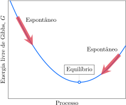

# A energia livre de Gibbs

Um dos problemas com o uso da segunda lei da termodinâmica para verificar se uma reação é espontânea é que, para avaliar a variação de entropia total, a variação de entropia do sistema e a variação de entropia da vizinhança precisam ser calculadas e somadas. Grande parte desse trabalho poderia ser evitada se uma única propriedade reunisse os cálculos de entropia do sistema e da vizinhança. Mas é possível simplificar empregando a energia livre de Gibbs, uma função de estado nova que é, provavelmente, a propriedade mais usada e mais útil nas aplicações da termodinâmica em química. Ela tem este nome em homenagem ao físico norte-americano do século XIX Josiah Willard Gibbs, responsável pela transformação da termodinâmica de uma mera teoria abstrata em um tema de grande relevância.

## Um olhar sobre o sistema

A variação total de entropia, $\Delta S_\mathrm{tot}$, é a soma das variações no sistema, $\Delta S$, e sua vizinhança, $\Delta S_\mathrm{viz}$, com $\Delta S_\mathrm{tot} = \Delta S + \Delta S_\mathrm{viz}$. Em um processo em temperatura e pressão constantes, a variação de entropia da vizinhança é dada por $\Delta S_\mathrm{viz} = -\Delta H/T$. Portanto,
$$
   \Delta S_\mathrm{tot} = \Delta S + \Delta S_\mathrm{viz} = \Delta S - \dfrac{ \Delta H }{T}
\tag{1}
$$
Essa equação permite calcular a variação total de entropia usando informações somente do sistema. A limitação é que a equação só é válida em pressão e temperatura constantes.

A próxima etapa é introduzir a **energia livre de Gibbs**, $G$, definida como
$$
   G = H - TS
\tag{2a}
$$
Essa quantidade, comumente conhecida como energia livre e, mais formalmente, como energia livre de Gibbs, é definida somente em termos de funções de estado, logo, $G$ é uma função de estado. Em um processo que ocorre em temperatura constante, a variação de energia livre é
$$
   \Delta G = \Delta H - T \Delta S
\tag{2b}
$$
Comparando essa expressão com a Equação 1, em que existe a restrição adicional da pressão constante, vemos que 
$$
   \Delta G = - T \Delta S_\mathrm{tot}
\tag{3}
$$
O sinal negativo dessa equação significa que, em pressão e temperatura constantes, um aumento na entropia total corresponde a uma diminuição da energia livre de Gibbs. Portanto (Figura 1),

- Em temperatura e pressão constantes, a direção da mudança espontânea é a direção da diminuição da energia livre de Gibbs.

A grande importância da introdução da energia livre de Gibbs é que, *se a pressão e a temperatura permanecem constantes, é possível predizer se um processo é espontâneo somente em termos das propriedades termodinâmicas do sistema*.

A Equação 2b resume os fatores que determinam a direção da mudança espontânea em temperatura e pressão constantes: para uma variação espontânea, procuramos valores de $\Delta H$, $\Delta S$ e $T$ que levam a um valor negativo de $\Delta G$. Uma condição que pode levar a um $\Delta G$ negativo é um grande valor negativo de $\Delta H$, como em uma reação de combustão. Um grande valor negativo de $\Delta H$ corresponde a um grande aumento de entropia da vizinhança. Entretanto, um valor negativo de $\Delta G$ pode ocorrer mesmo se $\Delta H$ for positivo (uma reação endotérmica), quando $T\Delta S$ é grande e positivo. Neste caso, a força condutora da reação, a origem da espontaneidade, é o aumento de entropia do sistema.

O critério do equilíbrio é $\Delta S_\mathrm{tot} = 0$. Da Equação 3, resulta que, para um processo em temperatura e pressão constantes, a condição do equilíbrio é
$$
   \text{No equilíbrio: } \Delta G = 0
\tag{4}
$$
Se $\Delta G = 0$ para o processo, então fica claro que o sistema está em equilíbrio. Por exemplo, quando gelo e água estão em equilíbrio em uma determinada temperatura e pressão, sabemos que a energia livre de Gibbs de $\pu{1 mol}$ de $\ce{H2O(l)}$ deve ser igual à energia livre de Gibbs de $\pu{1 mol}$ de $\ce{H2O(s)}$. Em outras palavras, a energia livre de Gibbs por mol de água em cada fase é a mesma.

:::example

### Determinar se um processo é espontâneo

**Verifique** se a fusão da água é espontâneo a $\pu{10 \degree C}$.

- $\Delta H_\mathrm{fus}(\ce{H2O}) = \pu{6 kJ.mol-1}$
- $\Delta S_\mathrm{fus}(\ce{H2O}) = \pu{22 J.K-1.mol-1}$

#### Calcule a energia livre de fusão da água.

De $\Delta G = \Delta H - T \Delta S$
$$
\begin{aligned}
   \Delta G_\mathrm{fus} 
      &= (\pu{6 kJ.mol-1}) + (\pu{283}) \times (\pu{22e-3 kJ.K-1.mol-1}) \\
      &= \boxed{ \pu{-0,22 kJ.mol-1} }
\end{aligned}
$$

Como esperado, como a variação de energia livre de Gibbs molar é negativa em $\pu{10 \degree C}$, a fusão é espontânea nessa temperatura.

:::

> A variação de energia livre de Gibbs de um processo é uma medida da variação da entropia total de um sistema e sua vizinhança quando a temperatura e a pressão são constantes. Os processos espontâneos, em temperatura e pressão constantes, são acompanhados pela diminuição da energia livre de Gibbs.

# Os equilíbrios de fase

A energia livre de Gibbs de uma substância diminui (isto é, se torna menos positiva ou mais negativa) quando a temperatura aumenta em pressão constante. Esta conclusão é uma consequência da definição $G = H - TS$ e do fato de que a entropia de uma substância pura é sempre positiva. Quando $T$ aumenta, $TS$ também aumenta e uma quantidade maior é subtraída de $H$. Outra importante conclusão é que a energia livre de Gibbs diminui mais rapidamente com a temperatura na fase gás de uma substância do que na fase líquido. O mesmo acontece com a energia livre de Gibbs do líquido, que diminui mais rapidamente do que a energia livre de Gibbs do sólido (Figura 2).

Agora você tem condições de entender a origem termodinâmica das transições de fase. Em temperaturas baixas, a energia livre molar do sólido é a mais baixa, logo, existe a tendência para que o líquido congele e reduza sua energia livre. Acima de uma determinada temperatura, a energia livre do líquido torna-se menor do que a do sólido e a substância tem a tendência espontânea de fundir. Em temperaturas ainda mais altas, a energia livre molar da fase gás fica abaixo da linha do líquido e a substância tende espontaneamente a vaporizar. A temperatura de cada mudança de fase corresponde ao ponto de interseção das linhas das duas fases, como mostrado na Figura 2.

As posições relativas das três linhas da Figura 2 são diferentes para cada substância. Uma possibilidade – que depende da energia das interações intermoleculares nas fases condensadas – é o líquido ficar na posição mostrada na Figura 3. Neste caso, o estado líquido nunca é a linha mais baixa, em qualquer temperatura. Quando a temperatura sobe acima do ponto de interseção das linhas do sólido e do gás, a transição direta do sólido ao vapor, chamada de sublimação, torna-se espontânea. Este é o tipo de gráfico esperado para uma substância como o dióxido de carbono, que sublima na pressão atmosférica.

A vaporização é um tipo importante de transição de fase, o congelamento é
outro. Um líquido solidifica quando a energia das moléculas é tão baixa que elas não são capazes de afastar-se muito de suas vizinhas. No sólido, as moléculas vibram em torno de suas posições médias, mas raramente se movem de um ponto a outro. A **temperatura de congelamento**, a temperatura em que as fases sólido e líquido estão em equilíbrio dinâmico, varia ligeiramente quando a pressão é alterada. O **ponto de congelamento normal**, $T_\mathrm{f}$, de um líquido é a temperatura na qual ele congela, em $\pu{1 atm}$. Na prática, um líquido às vezes só congela quando a temperatura está alguns graus abaixo do ponto de congelamento, especialmente se o esfriamento é rápido. Um líquido que sobrevive abaixo de seu ponto de congelamento é chamado de super-resfriado. A **fusão** é o processo oposto ao congelamento, quando um sólido se transforma em líquido. O **ponto normal de fusão** de um sólido é igual ao ponto normal de congelamento do líquido. Ele também é representado por $T_\mathrm{f}$. 

Para a maior parte das substâncias, a densidade da fase sólido é maior do que a da fase líquido, porque as moléculas têm empacotamento mais compacto na fase sólido. A pressão aplicada ajuda a manter as moléculas juntas, logo uma temperatura mais alta deve ser alcançada antes que elas possam separar-se. Em consequência, a maior parte dos sólidos funde em temperaturas mais elevadas quando sob pressões altas. Entretanto, exceto em pressões extremamente altas, o efeito da pressão no ponto de congelamento normalmente é muito pequeno. O ferro, por exemplo, funde em $\pu{1800 K}$ em $\pu{1 atm}$, e o ponto de fusão é somente alguns graus mais alto quando a pressão é mil vezes maior. No centro da Terra, porém, a pressão é suficientemente alta para que o ferro seja sólido apesar das temperaturas elevadas. Por isso, acredita-se que o centro da Terra seja sólido. 

No ponto de fusão do gelo, o volume molar da água líquida é inferior ao do gelo. Como resultado, o gelo funde-se a uma temperatura ligeiramente mais baixa sob alta pressão, e o ponto de fusão da água diminui com o aumento da pressão. Esse comportamento anômalo é devido às ligações hidrogênio do gelo, que provocam uma estrutura muito aberta. Quando o gelo derrete, muitas dessas ligações hidrogênio se rompem e isso permite que as moléculas de água se aproximem.

> Os pontos de congelamento dos líquidos aumentam, em geral, com a pressão. As ligações hidrogênio da água a tornam anômala: seu ponto de congelamento diminui com a pressão.

## Os diagramas de fase de um componente

Como conseguimos monitorar as condições nas quais as diferentes fases de uma substância são estáveis? Como avaliamos o efeito da pressão na mudança de fase? Um diagrama de fases é um gráfico que mostra as fases mais estáveis em pressões e temperaturas diferentes. Os diagramas de fase são muito usados para representar os estados da matéria e são muito úteis quando a amostra é uma mistura e suas propriedades dependem da composição dela (as misturas são discutidas no Tópico 2D).

A Figura 4 mostra o diagrama de fases da água e a Figura 5 mostra o do dióxido de carbono. Esses gráficos são exemplos de diagramas de fases de uma única substância e, por isso, são chamados de diagramas de fases de um componente. Qualquer ponto da região marcada *sólido* (mais especificamente *gelo*, no caso da água) corresponde a condições nas quais a fase sólido da substância é a mais estável. O mesmo acontece nas regiões marcadas *líquido* e *vapor* (ou *gás*), que indicam as condições em que a fase líquido e a fase vapor são as mais estáveis. Por exemplo, o diagrama de fases do dióxido de carbono mostra que uma amostra da substância, em $\pu{10 \degree C}$ e $\pu{2 atm}$, é um gás, mas se a pressão aumentar, em temperatura constante, até $\pu{10 atm}$, o dióxido de carbono se transformará em um líquido. 

O enxofre tem duas fases sólido (Figura 6), rômbico e monoclínico, correspondendo aos dois modos de empacotamento das moléculas de $\ce{S8}$ em forma de coroa. O sólido formado quando o enxofre cristaliza varia em função da temperatura e da pressão. Muitas substâncias têm várias fases sólido. A água forma pelo menos dez tipos de gelo diferentes, dependendo de como as moléculas de $\ce{H2O}$ se acomodam, porém só um deles é estável nas pressões ordinárias.

As linhas que separam as regiões dos diagramas de fases são chamadas de **limites de fase**. Cada ponto da linha que limita duas regiões representa a temperatura e a pressão específicas nas quais duas fases vizinhas coexistem em equilíbrio dinâmico.

O limite sólido-líquido, a linha quase vertical nas Figuras 4 e 5, mostra as pressões e as temperaturas em que a água sólida e a água líquida coexistem em equilíbrio. Em outras palavras, ele mostra como o ponto de fusão do sólido (ou, de modo equivalente, o ponto de congelamento do líquido) varia com a pressão. A inclinação das linhas mostra que mesmo grandes mudanças de pressão resultam em variações muito pequenas do ponto de fusão. A inclinação do limite sólido-líquido depende das densidades do sólido e do líquido. 

:::derivation

### Como isso é feito?

Para encontrar a relação entre a pressão e a temperatura de transição de fase, comece com a Equação 2. No equilíbrio entre as fases, em temperatura constante:
$$
   \Delta H = T \Delta S
$$
Use a definição de entalpia ($H = U + PV$) para expressar a variação de entalpia em pressão constante em termos da variação de energia interna e do volume:
$$
   \Delta H = \Delta U + P \Delta V
$$
Substitua esta expressão na anterior:
$$
  \Delta U + P \Delta V = T \Delta S
$$
Rearranjando,
$$
   P = - \dfrac{ \Delta U }{ \Delta V } + T \dfrac{ \Delta S }{ \Delta V }
$$
A equação de $P$ em função de $T$ representa um limite de fase. A inclinação dessa linha é dada por:
$$
   \dfrac{ \Delta P }{ \Delta T } = \dfrac{ \Delta S }{ \Delta V }
$$
Assim, a inclinação depende da entropia de transição de fase e da diferença de densidade entre as fases.

:::

Uma inclinação negativa, como no diagrama de fases da água, indica que o sólido funde a uma temperatura inferior à medida que a pressão aumenta. A explicação física é que as moléculas conseguem reagir ao aumento de pressão compactando-se no líquido, como discutido na introdução deste tópico. Como a Figura 4 deixa claro, se a pressão sobre o gelo aumenta, ele acaba se liquefazendo. Se a inclinação é positiva, como no caso do dióxido de carbono (Figura 5), o aumento da pressão eleva a temperatura antes de o sólido sofrer fusão. Nesse caso, as moléculas se compactam a exemplo do que ocorre em um sólido. Se a pressão aumenta sobre o dióxido de carbono líquido, ele solidifica. Esse comportamento pode ser resumido como:

- Se o líquido é mais denso do que o sólido (como na água), então o ponto de fusão cai à medida que a pressão sobe.
- Se o sólido é mais denso do que o líquido (como na maioria dos materiais), então o ponto de fusão sobe com a pressão.

:::example

### Comparação da densidade do sólido e do líquido usando o diagrama de fases.

Um determinado metal funde em $\pu{1650 K}$ em $\pu{1 atm}$, e em $\pu{1700 K}$ em $\pu{100 atm}$.

**Compare** a densidade das fases sólida e líquida desse metal.

#### Determina o sinal da inclinação do limite de fase sólido-líquido é positiva ou negativa.

O limite das fases sólido-líquido se inclina para a direita,
mostrando que o sólido é a fase estável em pressões mais altas. O sólido é mais denso.

:::

Um **ponto triplo** é um ponto em que três limites de fase se encontram em um diagrama de fase. No caso da água, o ponto triplo das fases sólido, líquido e vapor está em $\pu{4,6 Torr}$ e $\pu{0,01 \degree C}$ (veja a Figura 2). No ponto triplo, as três fases (gelo, líquido e vapor) coexistem em equilíbrio dinâmico. O sólido está em equilíbrio com o líquido, o líquido com o vapor e o vapor com o sólido. A localização do ponto triplo de uma substância é uma propriedade característica da substância e não pode ser mudada alterando-se as condições. O ponto triplo
da água é usado para definir a unidade kelvin. Por definição, existem exatamente $\pu{273,16}$ kelvins entre o zero absoluto e o ponto triplo da água. Como o ponto de congelamento normal da água encontra-se $\pu{0,01 K}$ abaixo do ponto triplo, $\pu{0 \degree C}$ corresponde a $\pu{273,15 K}$.

A Figura 6 mostra que o enxofre pode existir em qualquer uma de quatro fases: dois sólidos (enxofre rômbico e monoclínico), um líquido e um vapor. Existem três pontos triplos no diagrama, em que podem coexistir em equilíbrio as várias combinações dessas fases como o sólido rômbico, o sólido monoclínico e o vapor em $\pu{96 \degree C}$, o sólido monoclínico, o líquido e o vapor em $\pu{120 \degree C}$, e em $\pu{151 \degree C}$ e pressões muito mais elevadas, o sólido monoclínico, o sólido rômbico e o líquido. A existência simultânea de quatro fases, em um sistema de um compo- nente (enxofre rômbico, enxofre monoclínico, enxofre líquido e vapor de enxofre, todos em equilíbrio), porém, nunca foi observada, e a termodinâmica pode ser usada para provar que um ponto quádruplo não pode existir.

:::example

### Interpretação do diagrama de fases

Considere o diagrama de fases do benzeno.

**Descreva** os estados físicos e as mudanças de fase quando uma amostra de benzeno sofre a transformação $ABCDE$.

#### Descreva as mudanças de fase.

- $A \to B$: fusão.
- $B \to C$: não há mudança de fase.
- $C \to D$: condensação e solidificação.
- $D \to E$: sublimação.

:::

> Um diagrama de fases resume as regiões de pressão e temperatura em que cada fase de uma substância é a mais estável. As linhas que limitam as fases mostram as condições nas quais duas fases podem coexistir em equilíbrio dinâmico. Três fases coexistem em equilíbrio em um ponto triplo.

## As propriedades críticas

Uma característica do diagrama da Figura 7 é que a linha líquido-vapor termina no ponto $C$. Para ver o que acontece naquele ponto, imagine que um tubo contenha água líquida e vapor de água em $\pu{25 \degree C}$ e $\pu{24 Torr}$ (a pressão de vapor da água em $\pu{25 \degree C}$). As duas fases estão em equilíbrio e o sistema está no ponto A, na curva líquido-vapor. Agora aumente a temperatura, o que move o sistema da esquerda para a direita sobre a linha limite das fases. Em $\pu{100 \degree C}$, a pressão de vapor é $\pu{760 Torr}$, e em $\pu{200 \degree C}$, ela chega a $\pu{11,7 kTorr}$ ($\pu{15,4 atm}$, ponto $B$). O líquido e o vapor ainda estão em equilíbrio dinâmico, mas agora o vapor é mais denso porque está sob pressão muito alta.

Quando a temperatura subir até $\pu{374 \degree C}$ (ponto $C$), a pressão de vapor alcançará $\pu{218 atm}$
– o recipiente tem de ser muito resistente! A densidade do vapor agora é muito grande, igual à do líquido restante. Nesse ponto, a superfície de separação entre o líquido e o vapor desaparece, e uma única fase uniforme preenche o recipiente. Como uma substância que enche completamente o recipiente que ocupa é, por definição, um gás, temos de concluir que esta fase única uniforme é um gás, a despeito de sua alta densidade. Desde que a temperatura permaneça em $\pu{374 \degree C}$ ou acima, verifica-se que, mesmo que a pressão aumente por compressão da amostra, não se observa a superfície característica da separação das fases. Isto é, $\pu{374 \degree C}$ é a temperatura crítica, $T_\mathrm{c}$, da água, a temperatura acima da qual o vapor não pode condensar em líquido, independentemente da pressão aplicada. Considerações semelhantes se aplicam a outras substâncias. A temperatura crítica do dióxido de carbono, por exemplo, é $\pu{31 \degree C}$. A pressão de vapor que corresponde ao fim da linha limite das fases é chamada de pressão crítica, $P_\mathrm{c}$, da substância. A pressão crítica da água é $\pu{218 atm}$ e a do dióxido de carbono é $\pu{73 atm}$. A temperatura crítica e a pressão crítica definem o ponto crítico de uma substância.

Um gás só pode ser liquefeito pela aplicação de pressão se ele estiver abaixo da temperatura crítica (Figura 7). Assim, por exemplo, o dióxido de carbono só pode ser liquefeito pelo aumento da pressão se sua temperatura for inferior a $\pu{31 \degree C}$. A temperatura crítica do oxigênio é $\pu{2118 \degree C}$, logo, ele não pode existir na fase líquida na temperatura normal qualquer que seja a pressão.

:::info

### Nota de boa prática

Em termos formais, um *vapor* é a fase gás de uma substância abaixo de sua temperatura crítica que, portanto, pode ser condensado em um líquido mediante a aplicação de pressão. Um *gás* é uma substância que está acima de sua temperatura crítica e não pode ser liquefeito apenas aplicando-se pressão. gás, tem a densidade de uma fase líquida e pode agir como solvente de líquidos e sólidos. 

:::

O fluido denso que existe acima da temperatura e pressão críticas é chamado de **fluido
supercrítico**. Ele pode ser tão denso que, embora seja formalmente um gás, tem a densidade de uma fase líquida e pode agir como solvente de líquidos e sólidos. Existe um interesse crescente nos fluidos supercríticos como solventes para reações químicas, um aspecto importante da *química verde*. O uso do dióxido de carbono supercrítico, por exemplo, evita a contaminação por solventes potencialmente perigosos e permite a extração rápida em função da alta mobilidade das moléculas no fluido. Por exemplo, como o dióxido de carbono supercrítico pode dissolver compostos orgânicos, ele é usado para remover cafeína de grãos de café, para separar fármacos de fluidos biológicos para posterior análise e para extrair perfumes de flores e produtos fitoquímicos de ervas. Hidrocarbonetos supercríticos são usados para extrair compostos úteis de carvão e cinzas, e vários fluidos supercríticos estão sendo investigados para uso na extração de óleo de areias ricas em óleo.

> A fase gás de uma substância só pode ser convertida em líquido pela aplicação apenas de pressão se ela estiver abaixo da temperatura crítica.

# A espontaneidade das reações

A diminuição da energia livre como um indicador de mudança espontânea e $\Delta G = 0$ como critério de equilíbrio aplicam-se a qualquer tipo de processo, desde que ele ocorra em pressão e temperatura constantes.

## A energia livre de Gibbs de reação

A função termodinâmica usada como critério de espontaneidade para uma reação química é a **energia livre de Gibbs de reação**, $\Delta G_\mathrm{r}$ (comumente chamada de *energia livre de reação*). Esta quantidade é definida como a diferença entre as energias livres de Gibbs molares, $G_\mathrm{m}$, de produtos e reagentes.
$$
    \Delta G_\mathrm{r} 
        = \sum_\text{produtos} n G_\mathrm{m} 
        - \sum_\text{reagentes} n G_\mathrm{m}
\tag{6}
$$
Nessa expressão, os valores de $n$ são os coeficientes estequiométricos da equação química. Por exemplo, para a formação da amônia,
$$
   \ce{ N2(g) + 3 H2(g) -> 2 NH3(g) }
$$
A energia livre de Gibbs de reação é
$$
   \Delta G_\mathrm{r} 
      = 2 G_{\mathrm{m}, \ce{NH3}} 
         - G_{\mathrm{m}, \ce{N2}} 
         - 3 G_{\mathrm{m}, \ce{H2}}
$$

A energia livre de Gibbs molar de uma substância em uma mistura depende de que moléculas ela tem como vizinhos, logo, as energias livres de Gibbs molares de $\ce{NH3}$, $\ce{N2}$ e $\ce{H2}$ mudam quando a reação prossegue. No início da reação, por exemplo, uma molécula de $\ce{NH3}$ tem como vizinhos principalmente moléculas de $\ce{N2}$ e $\ce{H2}$, mas, em um estágio avançado da reação, a maior parte dos vizinhos é de moléculas de $\ce{NH3}$. Como as energias livres de Gibbs mudam quando a reação prossegue, a energia livre de Gibbs da reação também muda. Se $\Delta G < 0$ em uma determinada composição, então a reação direta é espontânea. Se $\Delta G > 0$ em uma determinada composição, então a reação inversa (a decomposição da amônia em nosso exemplo) é espontânea.

A **energia livre de Gibbs padrão de reação**, $\Delta G_\mathrm{r}^\circ$, é definida da mesma forma que a energia livre de Gibbs da reação, mas em termos das energias livres de Gibbs molares padrão dos reagentes e produtos.
$$
    \Delta G_\mathrm{r}^\circ
        = \sum_\text{produtos} n G_\mathrm{m}^\circ
        - \sum_\text{reagentes} n G_\mathrm{m}^\circ
\tag{7}
$$
Em outras palavras, a energia livre de Gibbs padrão de reação é a diferença de energia livre de Gibbs entre os produtos nos seus estados padrão e os reagentes nos seus estados padrão (na temperatura especificada). Como o estado padrão de uma substância é sua forma pura em $\pu{1 bar}$, a energia livre de Gibbs padrão de reação é a diferença de energia livre de Gibbs entre os produtos puros e os reagentes puros: é uma quantidade fixa para uma dada reação e não varia quando a reação prossegue. Lembre-se desses dois pontos importantes:

- $\Delta G^\circ_\mathrm{r}$ é fixo para uma dada reação e temperatura e, por isso, não varia durante a reação.
- $\Delta G_\mathrm{r}$ depende da composição da mistura de reação; logo, varia – e pode até trocar de
sinal – quando a reação prossegue.

As Equações 6 e 7 não são muito úteis na prática porque só as variações das energias livres de Gibbs das substâncias são conhecidas, não os seus valores absolutos. Entretanto, a mesma técnica usada para encontrar a entalpia padrão de reação pode ser empregada, em que uma entalpia padrão de formação, $\Delta H_\mathrm{f}^\circ$, é atribuída a cada componente. De modo análogo, a **energia livre de Gibbs padrão de formação**, $\Delta G_\mathrm{f}^\circ$ (a *energia livre padrão de formação*), de uma substância é a *energia livre de Gibbs padrão de reação por mol de formação de um composto a partir de seus elementos na forma mais estável*.

As energias livres padrão de formação podem ser determinadas de várias maneiras.
A maneira mais simples e direta é combinar os dados de entalpia e entropia.

:::example

### Cálculo da energia livre padrão de formação a partir de dados de entalpia e entropia

**Calcule** a energia livre de Gibbs padrão de formação de $\ce{HI(g)}$ em $\pu{25 \degree C}$.

|                                            | $\ce{I2(s)}$ | $\ce{H2(s)}$ | $\ce{HI(g)}$ |
| :----------------------------------------- | -----------: | -----------: | -----------: |
| $\Delta H_{\mathrm{f}}^\circ/\pu{kJ//mol}$ |              |              | $\pu{+26,5}$ |
| $S_{\mathrm{m}}^\circ/\pu{J//K.mol}$       |   $\pu{116}$ |   $\pu{131}$ |   $\pu{207}$ |

#### Escreva a reação de formação do $\ce{HI(g)}$

$$
   \ce{ 1/2 H2(g) + 1/2 I2(s) -> HI(g) }
$$

#### Calcule a entalpia padrão de formação.

$$
\begin{aligned}
   \Delta H_\mathrm{f}^\circ = \pu{+26,5 kJ.mol-1}
\end{aligned}
$$

#### Calcule a entropia padrão de formação.

De $\Delta S_\mathrm{r}^\circ = \sum_\text{produtos} n S^\circ_\mathrm{m} - \sum_\text{reagentes} n S^\circ_\mathrm{m}$ 
$$
   \Delta S_\mathrm{f}^\circ 
      = S^\circ_{\mathrm{m}, \ce{HI(g)}} 
         - \dfrac{1}{2} S^\circ_{\mathrm{m}, \ce{H2(g)}} 
         - \dfrac{1}{2} S^\circ_{\mathrm{m}, \ce{I2(g)}} 
$$
logo,
$$
\begin{aligned}
   \Delta S_\mathrm{f}^\circ
      &= \Big\{ (\pu{207}) - \dfrac{1}{2} (\pu{131}) - \dfrac{1}{2} (\pu{116}) \Big\}\,\pu{J//K.mol} \\
      &= \pu{+83,5 J.K-1.mol-1}
\end{aligned}
$$

#### Calcule a energia livre padrão de reação.

De $\Delta G = \Delta H - T \Delta S$
$$
\begin{aligned}
   \Delta G^\circ_\mathrm{f} 
      &= (\pu{+26,5 kJ//mol}) - (\pu{298 K}) \times (\pu{+83,5e-3 kJ//K.mol}) \\
      &= \boxed{ \pu{1,62 kJ.mol-1} }
\end{aligned}
$$

:::

A energia livre de Gibbs padrão de formação de um composto, em uma dada temperatura, é uma medida de sua estabilidade em relação a seus elementos em condições padrão. Se $\Delta G_\mathrm{f}^\circ < 0$ em uma certa temperatura, o composto tem energia livre menor do que seus elementos puros e os elementos tendem espontaneamente a formar o composto nesta temperatura. Dizemos que o composto é *mais estável* nas condições padrão do que seus elementos. Se $\Delta G_\mathrm{f}^\circ > 0$, a energia livre do composto é maior do que a de seus elementos e o composto tende espontaneamente a se decompor nos elementos puros. Neste caso, dizemos que os elementos são “mais estáveis” do que o composto puro. Por exemplo, a energia livre padrão de formação do benzeno é $\pu{+124 kJ.mol-1}$, em $\pu{25 \degree C}$, e o benzeno é instável em relação a seus elementos em condições padrão em $\pu{25 \degree C}$. Logo:

- Um composto **termodinamicamente estável** é um composto cuja energia livre de Gibbs padrão de formação é negativa (a água é um exemplo).
- Um composto **termodinamicamente instável** é um composto cuja energia livre de Gibbs padrão de formação é positiva (o benzeno é um exemplo).

A tendência de decomposição pode não ser observada na prática porque a decomposição pode ser muito lenta. Na verdade, o benzeno pode ser guardado por um tempo infinito sem que ocorra decomposição. Substâncias termodinamicamente instáveis, mas que sobrevivem por longos períodos, são chamadas de **não lábeis** ou, até mesmo, de **inertes**. Por exemplo, o benzeno é termodinamicamente instável, mas é não lábil. Substâncias que se decompõem ou reagem rapidamente são chamadas de **lábeis**. A maior parte dos radicais é lábil. É importante perceber a diferença entre estabilidade e labilidade:

- *Estável* e *instável* são termos que se referem à tendência termodinâmica de uma substância em se decompor em seus elementos.
- *Lábil*, não *lábil* e inerte são termos que se referem à velocidade na qual essa tendência é concretizada.

Assim como as entalpias padrão de formação podem ser combinadas para obter entalpias padrão de reação, é possível combinar energias livres de Gibbs padrão de formação para obter energias livres de Gibbs padrão de reação:
$$
   \Delta G_\mathrm{r}^\circ = \sum_\text{produtos} n \Delta G^\circ_\mathrm{f} - \sum_\text{reagentes} n \Delta G^\circ_\mathrm{f}
\tag{8}
$$ 
em que, como de hábito, $n$ são os coeficientes estequiométricos das equações químicas.

:::example

### Cálculo da energia livre padrão de uma reação

A amônia tem estabilidade por tempo indefinido no ar. Um agrônomo estuda a estabilidade da amônia no solo e precisa saber se o composto se mantém estável porque sua oxidação não é espontânea ou porque ela é espontânea, mas muito lenta.
$$
   \ce{ 4 NH3(g) + 5 O2(g) -> 4 NO(g) + 6 H2O(l) }
$$

a. **Calcule** a energia livre de Gibbs padrão de oxidação da amônia.
b. **Classifique** a reação quanto à espontaneidade.

|                                            | $\ce{NH3(g)}$ | $\ce{NO(g)}$ | $\ce{H2O(g)}$ |
| :----------------------------------------- | ------------: | -----------: | ------------: |
| $\Delta G_{\mathrm{f}}^\circ/\pu{kJ//mol}$ |  $\pu{-16,5}$ | $\pu{+86,5}$ |   $\pu{-229}$ |

#### Calcule a energia livre padrão de reação.

De $\Delta G_\mathrm{r}^\circ = \sum_\text{produtos} n \Delta G^\circ_\mathrm{f} - \sum_\text{reagentes} n \Delta G^\circ_\mathrm{f}$ 
$$
   \Delta G_\mathrm{r}^\circ 
      = 4 \Delta G^\circ_{\mathrm{f}, \ce{NO(g)}} 
         6 \Delta G^\circ_{\mathrm{f}, \ce{H2O(g)}} 
         - 4 \dfrac{1}{2} \Delta G^\circ_{\mathrm{f}, \ce{NH3(g)}} 
         - 5 \dfrac{1}{2} \Delta G^\circ_{\mathrm{f}, \ce{O2(g)}} 
$$
logo,
$$
\begin{aligned}
   \Delta S_\mathrm{f}^\circ
      &= \Big\{ 4 (\pu{86,5}) + 6 (\pu{-229}) - 4 (\pu{-16,5}) - 5 (0) \Big\}\,\pu{kJ//mol} \\
      &= \pu{-962 kJ.mol-1}
\end{aligned}
$$

Como a energia livre de Gibbs padrão é negativa, você pode concluir que a combustão da amônia é espontânea em $\pu{25 \degree C}$ em condições padrão. Esta reação espontânea é simplesmente muito lenta em condições normais.

:::

> A energia livre de Gibbs padrão de formação de uma substância é a energia livre de Gibbs padrão de reação por mol do composto quando ele é formado a partir de seus elementos na forma mais estável. O sinal de $\Delta G_\mathrm{f}^\circ$ nos diz se um composto é estável ou instável em relação a seus elementos. As energias livres de Gibbs padrão de formação são
usadas no cálculo das energias livres de Gibbs padrão de reação por meio da Equação 8.

## A energia livre de Gibbs e o trabalho de não expansão
 
A variação de energia livre de Gibbs que acompanha um processo permite predizer o trabalho máximo de não expansão que um processo pode realizar em temperatura e pressão constantes. Em outras palavras, a energia livre de Gibbs é uma medida da energia que está livre para realizar o trabalho de não expansão (daí seu nome, *energia livre*). O trabalho de não expansão, $w_\mathrm{e}$, é qualquer tipo de trabalho que não seja devido à expansão contra uma pressão e inclui o trabalho elétrico e o trabalho mecânico (como o alongamento de uma mola ou o carregamento de um peso ladeira acima). O trabalho de não expansão também inclui o trabalho de atividade muscular, o trabalho envolvido na ligação dos amino-ácidos para formar as moléculas de proteínas e o trabalho de enviar sinais nervosos através dos neurônios. Assim, o conhecimento das variações na energia livre é fundamental para a compreensão da **bioenergética**, o desenvolvimento e a utilização da energia nas células vivas.

O desafio consiste em obter uma relação quantitativa entre a energia livre e o trabalho de não expansão máximo que um sistema consegue realizar.

:::derivation

### Como isso é feito?

Para encontrar a relação entre a energia livre e o trabalho de não expansão máximo, comece com a Equação 2. Em temperatura constante:
$$
   \Delta G = \Delta H - T \Delta S
$$
Use a definição de entalpia ($H = U + PV$) para expressar a variação de entalpia em pressão constante em termos da variação de energia interna e do volume:
$$
   \Delta H = \Delta U + P \Delta V
$$
Substitua esta expressão na anterior:
$$
   \Delta G = \Delta U + P \Delta V - T \Delta S
$$
Agora, use a primeira lei da termodinâmica, $\Delta U = Q - W$, (Tópico 2A) e obtenha:
$$
   \Delta G = Q - W + P \Delta V - T \Delta S
$$
Para que um processo realize o máximo de trabalho, ele precisa ocorrer de forma reversível. Para uma mudança reversível, esta equação assume a forma:
$$
   \Delta G = Q_\mathrm{rev} - W_\mathrm{rev} + P \Delta V - T \Delta S
$$
Agora, de $\Delta S = Q_\mathrm{rev}/T$ (Tópico 2B) para substituir $Q_\mathrm{rev}$ por $T\Delta S$ e cancelar os dois termos $T\Delta S$:
$$
   \Delta G = - W_\mathrm{rev} + P \Delta V
$$
Neste ponto, observe que o sistema pode realizar trabalho tanto de expansão como de não expansão:
$$
   W_\mathrm{rev} = W_\text{rev, não exp.} + W_\text{rev, exp.} = W_\text{rev, não exp.} + P\Delta V
$$
Substituindo $W_\mathrm{rev}$ por essa expressão, os termos $P\Delta V$ se cancelam e temos:
$$
   \Delta G = - W_\text{rev, não exp.} \quad (T, P\; \text{constantes})
$$
Como $W_\text{rev, não exp.}$ é a quantidade máxima de trabalho de não expansão que o sistema pode realizar (porque foi atingido reversivelmente), obtém-se
$$
   \Delta G = - W_\text{max, não exp.} \quad (T, P\; \text{constantes})
$$

:::

Para uma variação da energia livre de Gibbs
$$
   \Delta G 
      = - W_\text{max, não exp.} \quad (T, P\; \text{constantes})
\tag{8}
$$
Essa importante relação diz que, se a variação de energia livre de um processo que acontece em temperatura e pressão constantes é conhecida, então você imediatamente sabe quanto trabalho de não expansão ele pode realizar.

A Equação 8 também é importante na prática, porque permite considerar as relações energéticas dos processos biológicos de forma quantitativa. Por exemplo, a energia livre de Gibbs padrão da oxidação da glicose,
$$
   \ce{ C6H12O6(s) + 6 O2(g) -> 6 CO2(g) + 6 H2O(l) }
$$
é $\pu{-2879 kJ.mol-1}$. Portanto, em $\pu{1 bar}$, o trabalho máximo de não expansão que se pode obter de $\pu{1 mol}$ de $\ce{C6H12O6}$, isto é, $\pu{180 g}$ de glicose, é $\pu{2879 kJ}$. Como cerca de $\pu{17 kJ}$ de trabalho precisam ser realizados para formar um mol de ligações peptídicas (uma ligação entre amino-ácidos) em uma proteína, a oxidação de $\pu{180 g}$ de glicose pode ser usada para formar cerca de $\pu{170 mol}$ dessas ligações. Em outras palavras, a oxidação de uma molécula de glicose é necessária para formar cerca de 170 ligações peptídicas. Na prática, a biossíntese ocorre indiretamente, há perdas de energia, e somente 10 ligações peptídicas se formam. Uma proteína típica tem várias centenas de ligações peptídicas, então, muitas moléculas de glicose precisam ser sacrificadas para construir uma molécula de proteína.

> A variação de energia livre de Gibbs de um processo é igual ao trabalho máximo de não expansão que o sistema pode realizar em temperatura e pressão constantes.

## A energia livre e a temperatura

As entalpias dos reagentes e produtos dependem da temperatura, mas a *diferença* entre as variações de entalpia varia pouco com a temperatura. O mesmo vale para a entropia. Como resultado, os valores de $\Delta H^\circ$ e $\Delta S^\circ$ não variam muito com a temperatura. Entretanto, $\Delta G^\circ$ depende da temperatura (lembre-se de $T$ em $\Delta G^\circ = \Delta H^\circ = T \Delta S^\circ$) e pode mudar de sinal quando a temperatura se altera. Temos de considerar quatro casos (Tabela 1):

:::displaytable

#### Critérios para espontaneidade

| $\Delta H^\circ$ | $\Delta S^\circ$ | **Espontâneo**             |
| :--------------: | :--------------: | :------------------------- |
|       $-$        |       $+$        | Sempre                     |
|       $+$        |       $-$        | Nunca                      |
|       $-$        |       $-$        | Se $T < \Delta H/\Delta S$ |
|       $+$        |       $+$        | Se $T > \Delta H/\Delta S$ |

:::

- No caso de uma reação exotérmica ($\Delta H^\circ < 0$) com uma entropia de reação negativa ($\Delta S^\circ < 0$), $-T\Delta S^\circ$ contribui como termo positivo para $\Delta G^\circ$. Em temperaturas elevadas, $T\Delta S^\circ$ prevalece sobre $\Delta H^\circ$, e $\Delta G^\circ$ é positivo (e a reação inversa, a decomposição dos produtos puros, é espontânea). Em temperaturas baixas, $\Delta H^\circ$ prevalece sobre $-T\Delta S^\circ$ e, por isso, $\Delta G^\circ$ é negativo (e a formação de produtos é espontânea). A temperatura na qual $\Delta G^\circ$ muda de sinal é $T = \Delta H^\circ/\Delta S^\circ$.
- No caso de uma reação endotérmica ($\Delta H^\circ > 0$) com uma entropia de reação positiva ($\Delta S^\circ > 0$), o inverso é verdadeiro. Neste caso, $\Delta G^\circ$ é positivo em temperaturas baixas, mas pode tornar-se negativa quando a temperatura cresce e $T\Delta S^\circ$ supera $\Delta H^\circ$. A formação de produtos a partir dos reagentes puros torna-se espontânea quando a temperatura é suficientemente alta. Na reação exotérmica, a temperatura na qual $\Delta G^\circ$ muda de sinal é $T = \Delta H^\circ/\Delta S^\circ$.
- Para uma reação endotérmica ($\Delta H^\circ > 0$) com uma entropia de reação negativa ($\Delta S^\circ < 0$), $\Delta G^\circ > 0$ em todas as temperaturas, e a reação direta não é espontânea qualquer que seja a temperatura porque as entropias do sistema e da vizinhança diminuem durante o processo.
- Para uma reação exotérmica ($\Delta H^\circ < 0$) com uma entropia de reação positiva ($\Delta S^\circ > 0$), $\Delta G^\circ < 0$ e a formação de produtos a partir dos reagentes puros é espontânea em qualquer temperatura porque as entropias do sistema e da vizinhança aumentam durante o processo.

:::example

### Cálculo da temperatura na qual uma reação endotérmica torna-se espontânea

A produção de cal a partir do carbonato de cálcio é endotérmica. Para reduzir a quantidade de calor que deve ser fornecida, os engenheiros precisam descobrir a menor temperatura em que as reações são espontâneas.
$$
   \ce{ CaCO3(s) -> CaO(s) + CO2(g) }
$$

**Calcule** a temperatura mínima na qual a reação é espontânea.

|                                            | $\ce{CaCO3(s)}$ | $\ce{CaO(s)}$ | $\ce{CO2(g)}$ |
| :----------------------------------------- | --------------: | ------------: | ------------: |
| $\Delta H_{\mathrm{f}}^\circ/\pu{kJ//mol}$ |    $\pu{-1210}$ |   $\pu{-635}$ |   $\pu{-394}$ |
| $S_{\mathrm{m}}^\circ/\pu{J//K.mol}$       |       $\pu{93}$ |     $\pu{40}$ |    $\pu{214}$ |

#### Calcule a entalpia padrão de reação.

De $\Delta H_\mathrm{r}^\circ = \sum_\text{produtos} n \Delta H^\circ_\mathrm{f} - \sum_\text{reagentes} n \Delta H^\circ_\mathrm{f}$ 
$$
   \Delta H_\mathrm{r}^\circ 
      = \Delta H^\circ_{\mathrm{f}, \ce{CO2(g)}} 
         + \Delta H^\circ_{\mathrm{f}, \ce{CaO(s)}}
         - \Delta H^\circ_{\mathrm{f}, \ce{CaCO3(s)}}
$$
logo,
$$
\begin{aligned}
   \Delta H_\mathrm{r}^\circ
      &= \Big\{ (\pu{-394}) + (\pu{-635}) - (\pu{-1210}) \Big\}\,\pu{kJ//mol} \\
      &= \pu{+181 kJ.mol-1}
\end{aligned}
$$

#### Calcule a entropia padrão de reação.

De $\Delta S_\mathrm{r}^\circ = \sum_\text{produtos} n S^\circ_\mathrm{m} - \sum_\text{reagentes} n S^\circ_\mathrm{m}$ 
$$
   \Delta S_\mathrm{r}^\circ 
      = S^\circ_{\mathrm{m}, \ce{CO2(g)}} 
         + S^\circ_{\mathrm{m}, \ce{CaO(s)}} 
         - S^\circ_{\mathrm{m}, \ce{CaCO3(s)}} 
$$
logo,
$$
\begin{aligned}
   \Delta S_\mathrm{r}^\circ
      &= \Big\{ (\pu{214}) + (\pu{40}) - (\pu{93}) \Big\}\,\pu{J//K.mol} \\
      &= \pu{+161 J.K-1.mol-1}
\end{aligned}
$$

#### Calcule a temperatura na qual a energia livre de reação torna-se negativa.

De $\Delta G = \Delta H - T \Delta S = 0$
$$
   T = \dfrac{ \Delta H }{ \Delta S }
$$
logo,
$$
   T = \dfrac{ (\pu{181e3 J//mol}) }{ (\pu{161 J//K.mol}) } = \boxed{ \pu{1120 K} }
$$

:::

> A energia livre de Gibbs cresce com a temperatura em reações em que $\Delta S^\circ$ é negativo e
decresce com a temperatura em reações em que $\Delta S^\circ$ é positivo.