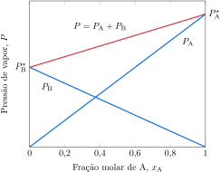

# A pressão de vapor

Uma substância pode existir em diferentes fases, isto é, diferentes formas físicas. As fases de uma substância incluem as formas sólido, líquido e gás. Elas também incluem as diferentes formas de sólido, como as fases diamante e grafita do carbono. Em apenas um caso --- o do hélio --- existem duas formas líquido da mesma substância. A conversão de uma substância de uma fase em outra, como a fusão do gelo, a vaporização da água ou a conversão da grafita em diamante, é chamada de **transição de fase**.

## A origem da pressão de vapor

Um experimento simples mostra que, em um recipiente fechado, as fases líquido e vapor entram em equilíbrio. Primeiro, você vai precisar de um barômetro de mercúrio. O mercúrio dentro do tubo cai até uma altura proporcional à pressão atmosférica externa, ficando em torno de $\pu{760 mm}$ no nível do mar. O espaço acima do mercúrio é quase um vácuo (os traços de vapor de mercúrio presente são desprezíveis). Agora, injete uma pequena gota de água ao espaço acima do mercúrio. A água adicionada evapora imediatamente e enche o espaço com vapor de água. Esse vapor exerce pressão e empurra a superfície do mercúrio alguns milímetros para baixo. A pressão exercida pelo vapor --- medida pela mudança da altura do mercúrio --- depende da quantidade de água adicionada. Suponha, porém, que foi adicionada água suficiente para que reste uma pequena quantidade de líquido na superfície do mercúrio. Nessa situação, a pressão de vapor permanece constante, independentemente da quantidade de água líquida presente. Você pode concluir que, em uma temperatura fixa, o vapor exerce uma pressão característica que não depende da quantidade de água líquida presente. Por exemplo, em $\pu{20 \degree C}$, o mercúrio cai $\pu{18 mm}$, logo, a pressão exercida pelo vapor é $\pu{18 Torr}$. A pressão do vapor de água é a mesma se estiver presente $\pu{0,1 mL}$ ou $\pu{1 mL}$ de água líquida. Essa pressão característica é a pressão de vapor do líquido na temperatura do experimento (Tabela 1).

:::displaytable

#### Pressão de vapor a $\pu{25 \degree C}$

| **Substância** | $P_\mathrm{vap}/\pu{Torr}$ |
| :------------- | -------------------------: |
| metanol        |                 $\pu{120}$ |
| benzeno        |                  $\pu{95}$ |
| etanol         |                  $\pu{59}$ |
| tolueno        |                  $\pu{30}$ |
| água           |                  $\pu{24}$ |
| mercúrio       |              $\pu{1,7e-3}$ |

:::

Líquidos cuja pressão de vapor é alta nas temperaturas comuns são chamados de **voláteis**. O metanol (pressão de vapor $\pu{98 Torr}$, em $\pu{20 \degree C}$) é volátil, o mercúrio ($\pu{1,4 mTorr}$), não. Os sólidos também exercem pressão de vapor, mas sua pressão de vapor é, normalmente, muito mais baixa do que a dos líquidos, porque as moléculas do sólido se atraem mais fortemente do que as do líquido. Por exemplo, mesmo em $\pu{1000 K}$ a pressão de vapor do ferro é apenas $\pu{7e-17 Torr}$, um valor muito baixo para sustentar uma coluna de mercúrio de um átomo de altura! Contudo, alguns sólidos irritantes como o mentol e o iodo, por exemplo, sofrem sublimação (são convertidos diretamente em vapor) e podem ser detectados pelo odor. A pressão de vapor do iodo é $\pu{0,3 Torr}$ em $\pu{25 \degree C}$.

> A pressão de vapor de uma substância é a pressão exercida pelo vapor que está em equilíbrio dinâmico com a fase condensada. No equilíbrio, a velocidade de vaporização é igual à velocidade de condensação, e nenhum dos dois fenômenos é espontâneo.

## A volatilidade e as forças intermoleculares

A pressão de vapor é alta quando as moléculas de um líquido são mantidas por forças intermoleculares fracas, ao passo que a pressão de vapor é baixa quando as forças intermoleculares são fortes. Por isso, você deveria esperar que os líquidos formados por moléculas capazes de formar ligações hidrogênio (que são mais fortes do que outras interações intermoleculares) sejam menos voláteis do que outros de massa molecular comparável, porém incapazes de formar ligações hidrogênio.

Pode-se ver claramente o efeito das ligações hidrogênio ao comparar dimetil-éter e etanol, cujas fórmulas moleculares são iguais, $\ce{C2H6O}$. Como esses compostos têm o mesmo número de elétrons, espera-se que eles tenham interações de London semelhantes e, portanto, pressões de vapor semelhantes. Porém, a molécula de etanol tem um grupo $\ce{-OH}$ que pode formar ligações hidrogênio com outras moléculas de álcool. As moléculas do éter não podem formar ligações hidrogênio umas com as outras, porque os átomos de hidrogênio estão ligados a átomos de carbono e a ligação $\ce{C-H}$ não é muito polar. A pressão de vapor do etanol em $\pu{295 K}$ é $\pu{6,6 kPa}$, enquanto o valor para o dimetil-éter é $\pu{538 kPa}$. Como resultado dessas diferenças, o etanol é um líquido na temperatura e pressão normais e o dimetil-éter é um gás.

:::think

### Ponto para pensar

Por que o mercúrio tem pressão de vapor tão baixa na temperatura normal?

:::

:::example

### Comparação da pressão de vapor de dois líquidos

**Compare** a pressão de vapor dos pares de líquidos.

a. Tetrabromometano, $\ce{CBr4}$, e tetraclorometano, $\ce{CCl4}$.
b. Acetaldeído, $\ce{CH3CHO}$, e propano, $\ce{CH3CH2CH3}$.

#### Compare as forças intermoleculares.

O tetrabromometano e o tetracolorometano ligam-se predominantemente por interações dipolo induzido-diplo induzido na fase líquida. Entretanto, o tetrabromometano é mais pesado e, por isso, possui menor pressão de vapor.

#### Compare as forças intermoleculares.

O acetaldeído liga-se predominantemente por ligações dipolo-dipolo na fase líquida, enquanto o propano liga-se por ligações dipolo induzido-dipolo induzido, mais fracas. Assim, o propano possui maior pressão de vapor.

:::

> A pressão de vapor de um líquido, em uma determinada temperatura, deve ser baixa se as forças que atuam entre suas moléculas forem fortes.

## A variação da pressão de vapor com a temperatura

A pressão de vapor de um líquido depende da facilidade que as moléculas do líquido encontram para escapar das forças que as mantêm juntas. Em temperaturas mais elevadas, mais energia está disponível para isso do que em temperaturas mais baixas; logo, a pressão de vapor de um líquido deve aumentar quando a temperatura aumenta. A Figura 1 mostra como a pressão de vapor de alguns líquidos varia com a temperatura.

Em um diagrama de fases, se uma das fases é um vapor, a pressão que corresponde a este equilíbrio é a pressão de vapor da substância. Portanto, o limite das fases líquido-vapor mostra como a pressão de vapor do líquido varia com a temperatura. Por exemplo, o ponto em $\pu{80 \degree C}$ e $\pu{0,47 atm}$ no diagrama de fases da água está na linha que limita as fases líquido e vapor (Figura 2), logo, sabemos que a pressão de vapor da água líquida em $\pu{80 \degree C}$ é $\pu{0,47 atm}$. Da mesma forma, a linha que limita as fases sólido-vapor mostra como a pressão de vapor do sólido varia com a temperatura.

Tanto os argumentos cinéticos apresentados quanto as relações termodinâmicas  podem ser usados para encontrar uma expressão para a dependência entre pressão de vapor e temperatura.

:::derivation

### Como fazemos isso?

Para encontrar a relação entre a pressão de vapor e a temperatura, note que, no equilíbrio, $P$ é a pressão de vapor e $\Delta G_\mathrm{vap} = 0$, logo:
$$
   G_\mathrm{líquido} = G_\mathrm{vapor}
$$

:::

O resultado desse cálculo é a **equação de Clausius-Clapeyron** para a pressão de vapor de um líquido em duas temperaturas diferentes:
$$
   \ln\left( \dfrac{ P_2 }{ P_1 } \right) 
      = \dfrac{ \Delta H_\mathrm{vap} }{ R } \left( \dfrac{ 1 }{ T_2 } - \dfrac{ 1 }{ T_1 } \right)
\tag{1}
$$

:::info

### O que esta equação revela?

Quando $T_2 > T_1$, o termo entre parênteses é negativo. Logo, como existe um sinal negativo no membro direito e a entalpia de vaporização é positiva, este lado é positivo. Isso significa que $\ln(P_2/P_1)$ também é positivo, e que $P_2$ é maior do que $P_1$. Em outras palavras, a equação diz que a pressão de vapor aumenta quando a temperatura aumenta. Como $\Delta H^\circ_\mathrm{vap}$ ocorre no numerador, o aumento é maior para substâncias com alta entalpia de vaporização (interações intermoleculares fortes).

:::

:::example

### Cálculo da pressão de vapor de um líquido a partir de seu valor em outra temperatura

A entalpia de vaporização do $\ce{CCl4}$ é $\pu{33 kJ.mol-1}$ e sua pressão de vapor em $\pu{60 \degree C}$ é $\pu{410 Torr}$. 

**Calcule** a pressão de vapor do tetraclorometano em $\pu{25 \degree C}$.

#### Use a equação de Clausius-Clapeyron.

De $\ln(\frac{P_2}{P_2}) = - \frac{\Delta H_\mathrm{vap}}{R} (\frac{1}{T_2} - \frac{1}{T_1})$
$$
\begin{aligned}
   \ln\left( \dfrac{ P }{ \pu{410 Torr} } \right) 
      &= \dfrac{ \pu{33e3 J//mol} }{ \pu{8,31 J//K.mol} } \left( \dfrac{1}{ \pu{333 K} } - \dfrac{1}{ \pu{298 K} } \right) \\
      &= \pu{-1,4}
\end{aligned}
$$
logo
$$
   P
      = (\pu{410 Torr}) \times e^{ \pu{-1,4} } 
      = \boxed{ \pu{100 Torr} }
$$

:::

Uma forma mais simples da Equação 1, normalmente usada para calcular a dependência da pressão de vapor com a temperatura, é obtida escrevendo-se $\ln(P_2/P_1) = \ln P_2 - \ln P_1$, e descartando o subscrito 2, quando ela se torna
$$
   \ln P = \overbrace{ \ln P_1 + \dfrac{ \Delta H_\mathrm{vap} }{ RT_1 } }^{a} - \overbrace{ \dfrac{ \Delta H_\mathrm{vap} }{ R } }^{b} \times \dfrac{1}{T}
$$
Esta expressão tem a forma
$$
   \ln P = a - b \times \dfrac{1}{T}
$$
em que $a$ e $b$ são constantes que dependem da identidade da substância. Por isso, para determinada substância, um gráfico de $\ln P$ em função de $1/T$ deve ser uma linha reta com inclinação dada por $b = \Delta H_\mathrm{vap}/R$.

:::example

### Cálculo da entalpia de vaporização usando o gráfico $\ln P \times 1/T$

A pressão de vapor de um líquido foi metida em várias temperaturas, com os seguintes resultados:

**Calcule** a entalpia de vaporização desse líquido.

#### Calcule o coeficiente angular da reta usando dois pontos no gráfico.

Tomando os pontos $A$ e $B$:
$$
    \text{coef. angular} = \dfrac{ 14 - 5 }{ \pu{3,5} - \pu{2,0}  } \times \pu{1000 K} 
    = \pu{-6e3 K}
$$

#### Calcule a energia de ativação.

Como o coeficiente angular é igual a $-\Delta H_\mathrm{vap}/R$,
$$
\begin{aligned}
   \Delta H_\mathrm{vap} 
      &= - \pu{8,31 J.K-1.mol-1} \times (\pu{-6e3 K}) \\
      &= \boxed{ \pu{50 kJ.mol-1} }
\end{aligned}
$$

:::

> A pressão de vapor de um líquido aumenta com o aumento da temperatura. A equação de Clausius‑Clapeyron estabelece a dependência quantitativa da pressão de vapor com a temperatura.

## A ebulição

Observe o que acontece quando um líquido é aquecido em um recipiente aberto à atmosfera --- água aquecida em uma chaleira, por exemplo. Quando a temperatura alcança o ponto em que a pressão de vapor é igual à pressão atmosférica (por exemplo, quando a água é aqueci- da em $\pu{100 \degree C}$ e a pressão externa é $\pu{1 atm}$), ocorre vaporização em todo o líquido, não só na superfície, e o líquido ferve. Nessa temperatura, o vapor formado pode afastar a atmosfera e criar espaço para si mesmo. Assim, bolhas de vapor formam-se no líquido e sobem rapidamente até a superfície. O ponto de ebulição normal, $T_\mathrm{b}$, de um líquido é a temperatura na qual um líquido ferve quando a pressão atmosférica é $\pu{1 atm}$. Para encontrar o ponto de ebulição dos compostos na Figura XXXXX, trace uma linha horizontal em $P = \pu{1 atm}$ ($\pu{101,325 kPa}$) e observe a temperatura na qual a linha intercepta as curvas.

:::think

### Ponto para pensar

Um líquido pode ferver em um vaso rígido selado?

:::

A ebulição acontece em uma temperatura superior ao ponto de ebulição normal quando a pressão é superior a $\pu{1 atm}$, como ocorre em uma panela de pressão. Uma temperatura mais alta é necessária para elevar a pressão de vapor do líquido até a pressão do interior da panela. A ebulição acontece em uma temperatura mais baixa quando a pressão é inferior a $\pu{1 atm}$, porque a pressão de vapor alcança a pressão externa em uma temperatura mais baixa. No alto do Monte Everest --- onde a pressão é aproximadamente $\pu{253 Torr}$ ---, a água ferve em $\pu{70 \degree C}$.

Quanto menor for a pressão de vapor, maior será o ponto de ebulição. Assim, um ponto de ebulição normal alto é um sinal da ação de forças intermoleculares fortes.

:::example

### Estimativa do ponto de ebulição de um líquido

O ponto de ebulição normal do etanol é $\pu{352 K}$ e sua pressão de vapor em $\pu{35 \degree C}$ é $\pu{13 kPa}$.

**Calcule** o ponto de ebulição normal do etanol em $\pu{2 atm}$.

**Dados**

- $\Delta H_\mathrm{vap}(\ce{etanol}) = \pu{43,5 kJ.mol-1}$

#### Use a equação de Clausius-Clapeyron.

De $\ln(\frac{P_2}{P_2}) = - \frac{\Delta H_\mathrm{vap}}{R} (\frac{1}{T_2} - \frac{1}{T_1})$
$$
   \ln\left( \dfrac{ \pu{200 kPa} }{ \pu{13 kPa} } \right) 
      = \dfrac{ \pu{43,5e3 J//mol} }{ \pu{8,31 J//K.mol} } \left( \dfrac{1}{T_2} - \dfrac{1}{ \pu{308 K} } \right)
$$
logo,
$$
   \boxed{ T_2 = \pu{370 K} }
$$

:::

> A ebulição ocorre quando a pressão de vapor de um líquido é igual à pressão externa (atmosférica). Forças intermoleculares intensas normalmente causam pontos de ebulição normais elevados.

# Os equilíbrios de fase em sistemas de dois componentes

O petróleo bruto é uma mistura de muitos compostos, que precisam ser separados nos componentes de combustíveis e em substâncias usadas como matéria-prima na indústria química. Como as diferentes pressões de vapor dos componentes são usadas para separá-los, é essencial saber como a pressão de vapor total de uma mistura depende de sua composição.

## A pressão de vapor das misturas

O cientista francês François-Marie Raoult, que passou grande parte da vida medindo pressões de vapor de solutos e misturas, descobriu que a pressão de vapor de um líquido é proporcional a sua fração molar. Essa declaração, chamada de lei de Raoult, normalmente é escrita como
$$
   P_{\ce{A}} = x_{\ce{A}} P_{\ce{A}}^\star
\tag{2}
$$
em que $P_{\ce{A}}$ é a pressão de vapor do líquido $\ce{A}$, $x_{\ce{A}}$ é sua fração molar e $P_{\ce{A}}^\star$ é a pressão de vapor do solvente líquido puro (Figura 4). 

A Equação 2 também se aplica a misturas de líquidos voláteis (por exemplo, o benzeno e o tolueno, Figura 4). Neste caso, $\ce{A}$ é o benzeno.

:::info

### O que esta equação revela?

A pressão de vapor do líquido é diretamente proporcional à fração molar de suas moléculas na solução. Por exemplo, se somente 9 em cada 10 moléculas de uma solução são moléculas de $\ce{A}$, então a pressão de vapor do solvente é só nove décimos da pressão de vapor de A puro na temperatura de interesse. Como em uma mistura $x_{\ce{A}} < 1$, um soluto sempre reduz a pressão de vapor do solvente, desde que a lei de Raoult seja obedecida.

:::

:::example

### Cálculo da pressão de vapor usando a lei de Raoult

Uma solução é preparada pela dissolução de $\pu{40 g}$ do não eletrólito sacarose, $\ce{C12H22O11}$, em $\pu{100 g}$ de água em $\pu{20 \degree C}$.

**Calcule** a pressão de vapor da água nessa solução.

- $P_{\ce{H2O}}^\star = \pu{18 Torr}$

#### Calcule a quantidade de cada espécie

De $n = m/M$
$$
\begin{aligned}
   n_{\ce{C11H22O11}} &= \dfrac{ \pu{10 g} }{ \pu{342 g//mol} } = \pu{0,12 mol} \\
   n_{\ce{H2O}} &= \dfrac{ \pu{100 g} }{ \pu{18 g//mol} } = \pu{5,56 mol}
\end{aligned}
$$

#### Calcule a fração molar do solvente.

$$
   x_{\ce{H2O}} = \dfrac{ \pu{5,56 mol} }{ \pu{5,56 mol} + \pu{0,12 mol} } = \pu{0,98}
$$

#### Calcule a pressão de vapor do solvente.

Da lei de Raoult, $P_{\ce{H2O}} = x_{\ce{H2O}} P_{\ce{H2O}}^\star$
$$
   P_{\ce{H2O}} = \pu{0,98} \times \pu{18 Torr} = \boxed{ \pu{17,6 Torr} }
$$

:::

A redução da pressão de vapor de um solvente acarretada pela presença de um soluto pode ser explicada da perspectiva cinética (em termos das velocidades) ou da perspectiva termodinâmica.

:::derivation

### Como explicar esse fenômeno?

No equilíbrio e na ausência de solutos, a energia livre de Gibbs molar do vapor é igual à do solvente líquido puro (Tópico 5A). Um soluto aumenta a desordem e, portanto, a entropia da fase líquida. Como a entropia da fase líquida é aumentada pelo soluto, mas a entalpia permanece inalterada, ocorre, no todo, diminuição da energia livre de Gibbs molar do solvente. Como a energia livre do solvente diminuiu, para que as duas fases permaneçam em equilíbrio a energia livre do vapor tem de diminuir também. Como a energia livre de Gibbs de um gás depende da pressão, segue-se que a pressão de vapor também deve diminuir.

:::

Uma mistura líquida hipotética de dois componentes voláteis que obedecem à lei de Raoult em todas as concentrações é chamada de **solução ideal** (Figura 4). Em uma solução ideal, as interações entre os dois tipos de moléculas são iguais às interações entre cada tipo de molécula no estado puro. Isto é, as interações $\ce{A-A}$, $\ce{B-B}$ e $\ce{A-B}$ são iguais em uma solução ideal. Consequentemente, os dois tipos de moléculas se misturam facilmente entre si. Como as interações são iguais em uma solução ideal, não há liberação de energia na forma de calor quando os componentes se misturam. Em linguagem termodinâmica, a *entalpia de solução* é zero:
$$
   \text{Solução ideal: } \Delta H_\mathrm{sol} = 0
$$
As moléculas de solutos que formam soluções quase ideais são, frequentemente, muito semelhantes, em composição e estrutura, às moléculas de solvente. Por exemplo, o tolueno, $\ce{C6H5CH3}$, forma soluções quase ideais com o benzeno ($\ce{C6H6}$). As soluções reais não obedecem à lei de Raoult em todas as concentrações, contudo, quanto menor a concentração de um componente, mais a solução real se aproxima do comportamento ideal. Como na lei dos gases ideais (Tópico 3A), a lei de Raoult é um exemplo de uma lei limite, que, neste caso, torna-se crescentemente válida quando a concentração de um componente se aproxima de zero. Uma solução que não obedece à lei de Raoult em um intervalo de composições é chamada de solução real. As soluções reais se aproximam do comportamento ideal em concentrações abaixo de $\pu{0,1 mol.L-1}$. A menos que se afirme o contrário, todas as misturas discutidas são consideradas ideais.

O solvente em uma solução de eletrólito (como o sal em água) obedece à lei de Raoult, desde que a concentração do soluto seja muito baixa, abaixo de $\pu{0,01 mol.L-1}$, na maior parte das vezes. A diferença maior no caso das soluções de eletrólitos decorre das interações entre íons, que ocorrem em distâncias maiores e, portanto, têm efeito mais pronunciado.

:::example

### Classificar soluções como ideais ou não ideais.

Classifique...

:::

> A pressão de vapor de um líquido diminui com a presença de um soluto. Em uma solução ideal de líquidos voláteis, a pressão de vapor de cada componente é proporcional a sua fração molar. Em uma solução de um soluto não volátil, a pressão de vapor do solvente é proporcional a sua fração molar.

## As misturas binárias líquidas

Uma mistura binária líquida é uma solução de dois líquidos. Como os dois líquidos são voláteis, ambos podem contribuir para a pressão de vapor da solução. Assim como os diagramas de fase de um componente (Tópico 2C), os diagramas de fase de misturas binárias indicam a fase mais estável, contudo, além da pressão e da temperatura, existe mais uma variável, a composição. Para simplificar, consideraremos apenas pares de líquidos miscíveis em todas as proporções e que a pressão seja constante em $\pu{1 atm}$. Isso faz com que a temperatura e a composição sejam as variáveis usadas no diagrama de fases (Figura 5). Somente duas fases serão consideradas: líquido e vapor. Como a pressão está fixa em $\pu{1 atm}$, o limite entre elas no diagrama é um gráfico do ponto de ebulição em função da composição. A área sobre a curva mostra as temperaturas nas quais o vapor é estável para dada composição da mistura líquida e a área sob a curva mostra as temperaturas e as composições nas quais o líquido é a fase mais estável.

O diagrama de fases pode ser adaptado para fornecer mais informações. Imagine uma mistura binária ideal de dois líquidos voláteis, $\ce{A}$ e $\ce{B}$. Um exemplo seria $\ce{A}$ como benzeno,
$\ce{C6H6}$, e $\ce{B}$ como tolueno, $\ce{C6H5CH3}$, porque esses dois compostos têm estruturas moleculares semelhantes e formam soluções quase ideais. Como a mistura pode ser tratada como ideal, cada componente tem a pressão de vapor dada pela lei de Raoult:
$$
   P_{\ce{A}} = x_{\ce{A}} P_{\ce{A}}^\star \qquad P_{\ce{B}} = x_{\ce{B}} P_{\ce{B}}^\star
$$
Nessas equações, $x_{\ce{A}}$ é a fração molar de $\ce{A}$ na mistura líquida e $P_{\ce{A}}^\star$ é a pressão de vapor de $\ce{A}$ puro. Semelhantemente, $x_{\ce{B}}$ é a fração molar de $\ce{B}$ no líquido e $P_{\ce{B}}^\star$ é a pressão de vapor de $\ce{B}$ puro (ambas as pressões de vapor dependem da temperatura). De acordo com a lei de Dalton (Tópico 3C), a pressão de vapor total, $P$, é a soma destas duas pressões parciais:
$$
   P_\text{total} = P_{\ce{A}} + P_{\ce{B}} = x_{\ce{A}} P_{\ce{A}}^\star + x_{\ce{B}} P_{\ce{B}}^\star
$$
Portanto, a pressão de vapor de uma mistura ideal de dois líquidos voláteis está entre os valores de pressão parcial dos dois componentes puros. A pressão de vapor total (a linha superior na Figura 5) pode ser predita se forem conhecidas as pressões de vapor individuais na temperatura dada e as frações molares da mistura. Da mesma forma, o ponto de ebulição de uma mistura com determinada composição pode ser predito considerando-se a temperatura necessária para que a pressão de vapor total seja $\ce{1 atm}$.

:::example

### Cálculo da pressão de vapor de uma mistura de dois líquidos

Considere uma mistura de benzeno e tolueno em $\pu{25 \degree C}$ na qual um terço das moléculas é de benzeno (logo, $x_{\ce{C6H6}} = 1/3$ e $x_{\ce{C7H8}} = 2/3$).

a. **Calcule** a pressão de vapor de cada componente.
b. **Calcule** a pressão de vapor total da mistura.

- $P_{\ce{C6H6}}^\star = \pu{90 Torr}$
- $P_{\ce{C7H8}}^\star = \pu{30 Torr}$

#### Calcule a pressão de vapor de cada componente.

Da lei de Raoult, $P_{\ce{A}} = x_{\ce{A}} P_{\ce{A}}^\star$
$$
\begin{aligned}
   P_{\ce{C6H6}} &= \dfrac{1}{3} \times \pu{90 Torr} = \pu{30 Torr} \\
   P_{\ce{C7H8}} &= \dfrac{2}{3} \times \pu{30 Torr} = \pu{20 Torr} 
\end{aligned}
$$

#### Calcule a pressão de vapor total da mistura.

Da lei de Dalton, $P_\text{total} = P_{\ce{C6H6}} + P_{\ce{C7H8}}$
$$
   P_\text{total} = \pu{30 Torr} + \pu{20 Torr} = \boxed{ \pu{50 Torr} }
$$

:::

Agora considere a composição do vapor. Ele provavelmente é mais rico no componente mais volátil (o componente com a maior pressão de vapor) do que o líquido. O benzeno, por exemplo, é mais volátil do que o tolueno, logo o vapor em equilíbrio com a mistura líquida será mais rico em benzeno do que o líquido (Figura 6). Se a composição do vapor pode ser expressa em termos da composição do líquido, então essa expectativa pode ser confirmada.

:::example

### Cálculo da composição do vapor em equilíbrio com uma mistura líquida binária

Considere uma mistura de benzeno e tolueno em $\pu{25 \degree C}$ na qual um terço das moléculas é de benzeno (logo, $x_{\ce{C6H6}} = 1/3$ e $x_{\ce{C7H8}} = 2/3$).

**Calcule** a fração de benzeno na fase gasosa.

- $P_{\ce{C6H6}}^\star = \pu{90 Torr}$
- $P_{\ce{C7H8}}^\star = \pu{30 Torr}$

#### Calcule a pressão de vapor de cada componente.

Da lei de Raoult, $P_{\ce{A}} = x_{\ce{A}} P_{\ce{A}}^\star$
$$
\begin{aligned}
   P_{\ce{C6H6}} &= \dfrac{1}{3} \times \pu{90 Torr} = \pu{30 Torr} \\
   P_{\ce{C7H8}} &= \dfrac{2}{3} \times \pu{30 Torr} = \pu{20 Torr} 
\end{aligned}
$$

#### Calcule a pressão de vapor total da mistura.

Da lei de Dalton, $P = P_{\ce{C6H6}} + P_{\ce{C7H8}}$
$$
   P_\text{total} = \pu{30 Torr} + \pu{20 Torr} = \pu{50 Torr}
$$

#### Calcule a fração de benzeno na fase gasosa.

De $P_{\ce{C6H6}} = y_{\ce{C6H6}} P_\text{total}$
$$
   y_{\ce{C6H6}} = \dfrac{ \pu{30 Torr} }{ \pu{50 Torr} } = \boxed{ \pu{0,6} }
$$

:::

## A destilação

A linha superior na Figura 6 mostra a composição do vapor em equilíbrio com a mistura líquida no ponto de ebulição. Ela foi elaborada utilizando-se o mesmo tipo de cálculo empregado no Exemplo 7, mas com um número diferente de temperaturas. Para encontrar a composição do vapor em equilíbrio com o líquido em ebulição basta seguir a linha de amarração, isto é, a linha horizontal no ponto de ebulição, e ver onde ela intercepta a curva superior. Assim, se uma mistura líquida com a composição dada pela linha vertical que passa por $A$ na Figura 6 ($x_\text{benzeno} = \pu{0,30}$) for aquecida na pressão
constante de $\pu{1 atm}$, a mistura ferve na temperatura que corresponde ao ponto $A$ ($\pu{95 \degree C}$). Nessa temperatura, a composição do vapor em equilíbrio com o líquido é dada pelo ponto $B$ ($y_\text{benzeno} = \pu{0,70}$).

Quando uma mistura de moléculas de benzeno e de tolueno com $x_\text{benzeno} = \pu{0,05}$ começa a ferver (ponto $A$, Fig. 7), a composição inicial do vapor formado é dada pelo ponto $B$ ($x_\text{benzeno} = \pu{0,30}$). Se o vapor esfria e condensa, a primeira gota de vapor condensado, o destilado, terá a mesma composição do vapor e, portanto, será mais rica em benzeno do que a mistura original. O líquido que permanece no recipiente será mais rico em tolueno porque parte do benzeno deixou a mistura. A separação não é muito boa, porque o vapor ainda é rico em tolueno. Entretanto, se aquela gota de destilado for reaquecida, o líquido condensado ferverá na temperatura representada pelo ponto $C$, e o vapor acima da solução que está fervendo terá a composição $D$ ($x_\text{benzeno} = \pu{0,70}$), como indicado pela linha de amarração. Note que o destilado desta segunda etapa da destilação é mais rico em benzeno do que o destilado da primeira etapa. Se essas etapas de ebulição, condensação e nova ebulição continuarem, vamos obter uma pequena quantidade de benzeno quase puro.

O processo chamado de destilação fracionada usa o método de redestilação contínua para separar misturas de líquidos que têm pontos de ebulição próximos, como benzeno e tolueno. A mistura é aquecida e o vapor passa por uma coluna empacotada com material que tem área superficial alta, como contas de vidro. O vapor começa a condensar nas esferas próximas do fundo da coluna. Porém, conforme o aquecimento continua, o vapor condensa e vaporiza mais e mais, à medida que sobe na coluna. O líquido retorna à mistura que ferve. O vapor fica progressivamente mais rico no componente cujo ponto de ebulição é menor, à medida que sobe pela coluna e chega ao condensador. O destilado final é benzeno quase puro, o mais volátil dos componentes, e o líquido no recipiente é tolueno quase puro.

Se a amostra original for constituída por vários líquidos voláteis, os componentes aparecerão no destilado, sucessivamente, em uma série de frações, ou amostras de destilado, que fervem em determinados intervalos de temperatura. Colunas de fracionamento gigantescas são usadas na indústria para separar misturas complexas, como o petróleo bruto. As frações voláteis são usadas na forma de gás natural (ferve abaixo de $\pu{0 \degree C}$), gasolina (ferve na faixa de $\pu{30 \degree C}$ a $\pu{200 \degree C}$) e querosene (de $\pu{180 \degree C}$ a $\pu{325 \degree C}$). As frações menos voláteis são usadas como óleo diesel (acima de $\pu{275 \degree C}$). O resíduo que permanece depois da destilação é usado na forma de asfalto em rodovias.

> O vapor de uma mistura ideal de dois líquidos voláteis é mais rico no componente mais volátil. Os líquidos voláteis podem ser separados por destilação fracionada.

## Os azeótropos

A maior parte das misturas de líquidos não é ideal, logo suas pressões de vapor não seguem a lei de Raoult. Nesses casos, as curvas de temperatura-composição são determinadas experimentalmente pela análise da composição do vapor.

A direção do desvio da lei de Raoult pode ser correlacionada com a entalpia de mistura, $\Delta H_\mathrm{mix}$, a diferença de entalpia molar entre a mistura e os componentes puros. A entalpia de mistura do etanol com o benzeno é positiva --- o processo de mistura é endotérmico porque as interações entre as moléculas de etanol e benzeno são menos favoráveis do que a interação entre as moléculas dos líquidos puros ---, e essa mistura tem pressão de vapor maior do que o predito pela lei de Raoult (um **desvio positivo**). A entalpia da mistura da acetona com o clorofórmio é negativa --- o processo de mistura é exotérmico porque as interações entre as moléculas de acetona e clorofórmio são mais favoráveis do que as interações na acetona e clorofórmio puros ---, e essa mistura tem pressão de vapor menor do que o previsto pela lei de Raoult (um **desvio negativo**)

Alguns desvios da lei de Raoult podem dificultar a separação completa de líquidos por destilação. O diagrama de temperatura-composição de misturas de etanol e benzeno é mostrado na Figura 8. O ponto mais baixo na curva do ponto de ebulição indica a existência de um azeótropo de ponto de ebulição mínimo. Seus componentes não podem ser  separados por destilação: em uma destilação fracionada, a mistura com a composição do azeótropo ferve primeiro, não o líquido puro mais volátil.

O comportamento oposto é encontrado na mistura de acetona com clorofórmio (Figura 9). Esse azeótropo de ponto de ebulição máximo ferve em temperatura mais alta do que qualquer constituinte e é a última de ponto fração a ser coletada, não o líquido puro menos volátil.

> As misturas binárias em que as forças intermoleculares são mais fracas na solução do que nos componentes puros têm desvios positivos da lei de Raoult. As soluções em que as forças intermoleculares são mais fortes na solução do que nos componentes puros têm desvios negativos da lei de Raoult.