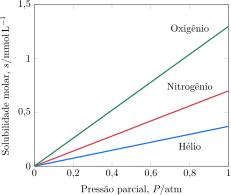
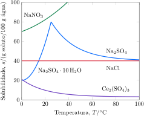

# A solubilidade

As maiores soluções encontradas na Terra são os oceanos, que representam $\pu{1,4e21 kg}$ da água superficial da Terra. Essa massa corresponde a aproximadamente $\pu{2,3e8 ton}$ de água por cada habitante, mais do que suficiente para suprir toda a água necessária a um mundo sedento. Entretanto, a água do mar pode ser fatal, por causa das altas concentrações de sais dissolvidos, em particular, íons $\ce{Na^+}$ e $\ce{Cl^-}$. Os métodos de remoção de sais dissolvidos poderiam ser usados para produzir água potável, mas a natureza das soluções precisa ser compreendida para que esta operação seja realizada com eficiência. Muitas reações químicas também ocorrem em solução, o que mostra a importância de compreender por que algumas substâncias se dissolvem, mas outras não.

## Os limites da solubilidade

Como introdução a este tópico, imagine o que ocorre quando um cristal de glicose, $\ce{C6H12O6}$, é jogado na água. Quando os átomos de água se aproximam da superfície do cristal, ligações hidrogênio começam a se formar entre as moléculas de água e as de glicose. Como resultado, as moléculas de glicose da superfície são puxadas para a solução por moléculas de água, mas são simultaneamente atraídas para o cristal por outras moléculas de glicose. Quando as interações com as moléculas de água forem comparáveis às interações com outras moléculas de glicose, essas últimas se soltam do cristal e passam para o solvente, onde ficam cercadas por moléculas de água. Um processo semelhante acontece quando um sólido iônico se dissolve. As moléculas de água polares hidratam os íons (envolvem os íons forman- do uma *camada de solvente* bastante estável) e os retiram do retículo cristalino. Remexer ou agitar acelera o processo, porque coloca mais molé- culas de água livres na superfície do sólido e retira os íons hidratados das proximidades do sólido.

Se uma quantidade pequena --- digamos, $\pu{2 g}$ --- de glicose é adicionada a $\pu{100 mL}$ de água, na tempera- tura normal, toda a glicose dissolve. Porém, se forem adicionados $\pu{200 g}$, parte da glicose permanece sem dissolver. Dizemos que uma solução está **saturada** quando o solvente dissolve todo o soluto possível e ainda resta uma parte do soluto, que não dissolveu. A concentração de soluto sólido na solução saturada alcançou o maior valor possível e mais nenhum soluto pode se dissolver. A **solubilidade molar**, $s$, de uma substância é a concentração molar de uma solução saturada. Em outras palavras, a solubilidade molar de uma substância é o limite de sua capacidade de se dissolver em uma dada quantidade de solvente.

Em uma solução saturada, qualquer soluto sólido presente continua a dissolver, mas a velocidade com a qual ele dissolve é exatamente igual à velocidade com que ele volta ao sólido, e a concentração permanece no valor de equilíbrio. Em uma solução saturada, o soluto dissolvido e o soluto não dissolvido estão em equilíbrio dinâmico, conforme o conceito definido no Tópico 2D.

> A solubilidade molar de uma substância é a concentração molar de uma solução saturada. Uma solução saturada é aquela na qual o soluto dissolvido e o soluto não dissolvido estão em equilíbrio dinâmico, e nenhuma quantidade adicional de soluto consegue se dissolver nela.

## A pressão e a solubilidade dos gases

Quase todos os organismos aquáticos dependem do oxigênio dissolvido para a respiração. Ainda que as moléculas de oxigênio não sejam polares, pequenas quantidades do gás dissolvem em água. A quantidade de oxigênio dissolvido depende da pressão sobre a superfície do líquido. A pressão de um gás é o resultado de choques das moléculas. Quando um gás está presente em um recipiente com um líquido, suas moléculas penetram o líquido como meteoritos que mergulham no oceano. Como o número de impactos aumenta com a pressão do gás, a solubilidade do gás --- a concentração molar do gás dissolvido em equilíbrio dinâmico com o gás livre --- aumenta com o aumento da pressão. Se o gás sobre o líquido é uma mistura (como, por exemplo, o ar), então a solubilidade de cada componente depende de sua pressão parcial (Figura 1).

As linhas retas na Figura 1 mostram que a solubilidade de um gás é diretamente proporcional a sua pressão parcial, $P$. Essa observação foi feita primeiramente, em 1801, pelo químico inglês William Henry e é agora conhecida como a **lei de Henry**. Ela normalmente é escrita como
$$
    s = k_\mathrm{H} P
\tag{1}
$$
A constante $k_\mathrm{H}$, que é chamada de constante de Henry, depende do gás, do solvente e da temperatura (Tabela 1).

:::displaytable

#### Constante de Henry para gases em água em $\pu{20 \degree C}$.

|  **Gás**   | $k_\mathrm{H}/\pu{M//atm}$ |
| :--------: | :------------------------: |
| $\ce{Ar}$  |       $\pu{7,9e-4}$        |
| $\ce{CO2}$ |       $\pu{1,5e-3}$        |
| $\ce{He}$  |       $\pu{3,7e-4}$        |
| $\ce{H2}$  |       $\pu{8,5e-4}$        |
| $\ce{Ne}$  |       $\pu{5,0e-4}$        |
| $\ce{N2}$  |       $\pu{7,0e-4}$        |
| $\ce{O2}$  |       $\pu{1,3e-3}$        |

:::

:::example

### Cálculo da solubilidade de um gás em um líquido

A concentração de oxigênio na água adequada para sustentar a vida aquática, deve ser superior a $\pu{0,13 mmol.L-1}$.

**Calcule** a concentração de oxigênio dissolvida em um lago sob atmosfera em $\pu{20 \degree C}$ e $\pu{1 atm}$.

- $k_\mathrm{H}(\ce{O2}) = \pu{1,3e-3 mol.L-1.atm-1}$

#### Calcule a pressão parcial de oxigênio.

De $P_{\ce{O2}} = x_{\ce{O2}} P$
$$
    P_{\ce{O2}} 
        = (\pu{0,2}) \times (\pu{1 atm}) = \pu{0,2 atm}
$$

#### Use a lei de Henry

De $s = k_\mathrm{H} P$
$$
    s = (\pu{1,3e-3 mol//L.atm}) \times (\pu{0,2 atm})
        = \boxed{ \pu{0,27 mmol.L-1} }
$$

:::

> A solubilidade de um gás é proporcional a sua pressão parcial, porque um aumento de pressão corresponde a um aumento na velocidade com a qual as moléculas de gás se chocam com a superfície do solvente.

## A temperatura e a solubilidade

A maior parte das substâncias dissolve mais depressa em temperaturas elevadas do que em temperaturas baixas. Porém, isso não significa necessariamente que elas sejam mais solúveis --- isto é, que atinjam uma concentração mais alta de soluto --- em temperaturas mais altas. Em alguns casos, a solubilidade é mais baixa em temperaturas mais elevadas. É importante distinguir o efeito da temperatura na *velocidade* de um processo de seu efeito no resultado final.

A maior parte dos gases fica menos solúvel quando a temperatura aumenta. A baixa solubilidade de gases em água morna é responsável pelas pequenas bolhas que aparecem quando um copo com água gelada é colocado em uma sala quente. As bolhas são provocadas pelo gás que estava dissolvido quando a água estava gelada e que sai da solução quando a temperatura aumenta. Ao contrário, a maior parte dos sólidos iônicos e moleculares é mais solúvel em água quente do que em água fria (Figura 2). Essa característica é usada no laboratório para dissolver uma substância e fazer crescer cristais, deixando uma solução saturada esfriar lentamente. Porém, alguns sólidos que contêm íons muito hidratados, como o carbonato de lítio, são menos solúveis em temperaturas altas do que em temperaturas baixas. Um pequeno número de compostos tem comportamento misto. Por exemplo, a solubilidade do sulfato de sódio deca-hidratado aumenta até 32°C, mas decresce quando a temperatura ultrapassa esse valor.

> A velocidade de dissolução, mas não necessariamente a solubilidade, de uma substância aumenta com a temperatura. A solubilidade da maior parte dos gases é menor em temperaturas mais altas. Os sólidos têm comportamento mais variado.

## A termodiâmica da dissolução

A variação da entalpia molar quando uma substância dissolve é chamada de **entalpia de solução**, $\Delta H_\mathrm{sol}$. A variação de entalpia pode ser medida calorimetricamente a partir do calor liberado ou absorvido quando a substância dissolve em pressão constante. Entretanto, como as partículas de soluto interagem umas com as outras e com o solvente, para isolar as interações soluto-solvente, é necessário se concentrar na entalpia de solução limite, isto é, a variação de entalpia que acompanha a formação de uma solução muito diluída em que as interações soluto-soluto podem ser desprezadas. Os dados mostram que alguns sólidos, como o cloreto de lítio, dissolvem exotermicamente, ou seja, com liberação de calor. Outros, como o nitrato de amônio, dissolvem endotermicamente (absorvem calor).

Para entender os valores de entalpia de solução, pense na dissolução como um processo hipotético em duas etapas. Na primeira etapa, a formação de uma solução de um sal em água, imagine que os íons se separam do sólido para formar um gás de íons. A variação de entalpia que acompanha esta etapa altamente endotérmica é a entalpia de rede ou entalpia reticular, $\Delta H_\mathrm{rede}$, do sólido (Tópico 1E). A entalpia de rede do cloreto de sódio ($\pu{787 kJ.mol-1}$), por exemplo, é a variação de entalpia molar do processo
$$
    \ce{ NaCl(s) -> Na^+(g) + Cl^-(g) }
$$
O Tópico 1E mostrou que compostos formados por íons pequenos com muita carga (como $\ce{Mg^{2+}}$ e $\ce{O^{2-}}$) ligam-se fortemente e que muita energia é necessária para quebrar a rede. Esses compostos têm entalpias de rede altas. Compostos formados por íons grandes com carga baixa, como o iodeto de potássio, têm forças atrativas fracas e, correspondentemente, entalpias de rede baixas.

Na segunda etapa hipotética, imagine que os íons gasosos mergulham na água e formam a solução final. A entalpia molar desta etapa é chamada de **entalpia de hidratação**, $\Delta H_\mathrm{hid}$, do composto. As entalpias de hidratação são negativas e comparáveis em valor às entalpias de rede dos compostos. No caso do cloreto de sódio, por exemplo, a entalpia de hidratação, isto é, a variação de entalpia molar do processo 
$$
    \ce{ Na^+(g) + Cl^-(g) -> Na^+(aq) + Cl^-(aq) }
$$
é $\pu{-784 kJ.mol-1}$. A hidratação dos compostos iônicos é sempre exotérmica, por causa da formação de interações atrativas íon-dipolo entre as moléculas de água e os íons. Ela também é exotérmica para moléculas que podem formar ligações hidrogênio com a água, como a sacarose, a glicose, a acetona e o etanol.

Agora, reúna as duas etapas do processo de dissolução e calcule a mudança de energia total: 
$$
    \Delta H_\mathrm{sol} 
        = \Delta H_\mathrm{rede} + \Delta H_\mathrm{hid}
\tag{2}
$$
Quando os valores são incluídos, a entalpia limite de solução do cloreto de sódio, isto é, a variação de entalpia do processo:
$$
    \ce{ NaCl(s) -> Na^+(aq) + Cl^-(aq) }
$$
é calculada como:
$$
    \Delta H_\mathrm{sol} 
        = (\pu{787 kJ.mol-1}) + (\pu{-784 kJ.mol-1})
        = \pu{+3 kJ.mol-1}
$$
Como a entalpia de solução é positiva, existe um influxo líquido de energia, na forma de calor, quando o sólido dissolve. A dissolução do cloreto de sódio é, portanto, endotérmica, mas só até o limite de $\pu{3 kJ.mol-1}$. Como este exemplo mostra, a mudança total de entalpia depende de um equilíbrio muito delicado entre a entalpia de rede e a entalpia de hidratação.

:::think

### Ponto para pensar

Por que o cloreto de sódio dissolve espontaneamente em água, apesar de a dissolução ser endotérmica?

:::

Carga alta e raio iônico pequeno contribuem para as entalpias de hidratação elevadas. Porém, as mesmas características também contribuem para as entalpias de rede altas. É, então, muito difícil fazer predições seguras sobre a solubilidade com base na carga e no raio do íon. O melhor que pode ser feito é usar essas características para racionalizar o que é observado. Com essa limitação em mente, você pode começar a entender o comportamento de algumas substâncias comuns e as propriedades de alguns minerais. Os nitratos, por exemplo, têm ânions grandes com carga um e, consequentemente, baixas entalpias de rede. As entalpias de hidratação, entretanto, são bastante grandes, porque a água pode formar ligações hidrogênio com os ânions nitrato. Como resultado, eles raramente são achados em depósitos minerais porque são solúveis na água do solo, e a água que escorre pelo terreno carrega as substâncias solúveis. Os íons carbonato têm aproximadamente o mesmo tamanho dos íons nitrato, mas carga dois. Como resultado, eles têm, comumente, entalpias de rede maiores do que os nitratos e é muito mais difícil retirá-los de sólidos como a pedra calcária (carbonato de cálcio). Os hidrogenocarbonatos (íons bicarbonato, $\ce{HCO3^-}$) têm carga um e são mais solúveis do que os carbonatos.

A diferença de solubilidade entre os carbonatos e os hidrogenocarbonatos é responsável pelo comportamento da **água dura**, isto é, da água que contém sais de cálcio e magnésio dissolvidos. A água dura é originada da água da chuva que dissolve dióxido de carbono do ar e forma uma solução muito diluída de ácido carbônico:
$$
    \ce{ CO2(g) + H2O(l) -> H2CO3(aq) }
$$
Quando a água escorre pelo solo e o penetra, o ácido carbônico reage com o carbonato de cálcio da pedra calcária ou giz e forma o hidrogenocarbonato, mais solúvel:
$$
    \ce{ CaCO3(s) + H2CO3(aq) -> Ca^{2+}(aq) + 2 HCO3^-(aq) }
$$
Essas duas reações se invertem quando a água que contém $\ce{Ca(HCO3)2}$ é aquecida em uma chaleira ou caldeira:
$$
    \ce{ Ca^{2+}(aq) + 2 HCO3^-(aq) -> CaCO3(s) + H2O(l) + CO2(g) }
$$
O dióxido de carbono é liberado, e o carbonato de cálcio forma um depósito duro chamado de *escama*.

Entalpias de solução negativas indicam que energia é liberada, na forma de calor, quando uma substância dissolve. Entretanto, para decidir se a dissolução é espontânea, em temperatura e pressão constantes, é necessário analisar a variação de energia livre, $\Delta G = \Delta H - T\Delta S$. Em outras palavras, as variações de entropia do sistema precisam ser levadas em conta, não somente a entalpia.

A desordem usualmente aumenta quando um sólido ordenado se dissolve. Portanto, na maior parte dos casos é possível imaginar que a entropia do sistema aumente na formação de uma solução. Como $T\Delta S$ é positivo, o aumento de desordem dá uma contribuição negativa para $\Delta G$. Se $\Delta H$ também é negativo, você pode ter certeza de que $\Delta G$ é negativo. Pode-se esperar, então, que a maior parte das substâncias com entalpias de solução negativas seja solúvel.

Em alguns casos, a entropia do sistema diminui no processo de dissolução  porque as moléculas de solvente formam estruturas semelhantes a gaiolas em torno do soluto. Como resultado, $\Delta S$ é negativo e o termo $-T\Delta S$ dá uma contribuição positiva para $\Delta G$. Mesmo se $\Delta H$ for negativo, $\Delta G$ pode ser positivo. Em outras palavras, mesmo se energia é liberada para a vizinhança, o consequente aumento de entropia pode não ser suficiente para superar a diminuição de entropia do sistema, que é formado pelo soluto e pelo solvente. Neste caso, a substância não dissolve. Por essa razão, alguns hidrocarbonetos, como o heptano, são insolúveis em água, embora tenham entalpias de solução ligeiramente negativas.

Se $\Delta H$ é positivo, $\Delta G = \Delta H - T\Delta S$ só pode ser negativo se $\Delta S$ for positivo e maior do que $\Delta H$. Uma substância com entalpia de solução fortemente positiva é provavelmente insolúvel, porque a entropia da vizinhança diminui tanto que a dissolução corresponde a uma diminuição total da desordem.

Entender as contribuições para a energia livre de Gibbs da dissolução ajuda a explicar a dependência da solubilidade com a temperatura. A energia livre de Gibbs só fica mais negativa e mais favorável à dissolução, quando a temperatura aumenta, se $\Delta S$ for positivo. Para muitas substâncias iônicas, a dissolução resulta no aumento da entropia do sistema, e essas substâncias são mais solúveis em temperaturas mais elevadas. Entretanto, quando um gás dissolve em um líquido, suas moléculas ocupam muito menos espaço, e ocorre uma redução considerável da entropia do sistema. Neste caso, $-T\Delta S$ é positivo. Consequentemente, o aumento da temperatura faz $\Delta G$ aumentar, e a dissolução é menos favorável.

Como o $\Delta G$ da dissolução de um soluto depende da concentração do soluto, mesmo se $\Delta G$ for negativo em concentrações baixas, ele pode tornar-se positivo em concentrações altas (Figura 3). Um soluto dissolve espontaneamente somente até $\Delta G = 0$. Neste ponto, o soluto dissolvido está em equilíbrio com o soluto que não dissolveu --- a solução está saturada.

> As entalpias de solução em soluções diluídas podem ser expressas como a soma da entalpia de rede e da entalpia de hidratação do composto. A dissolução depende do balanço entre a variação de entropia da solução e a variação de entropia da vizinhança.

# As propriedades coligativas

Quando os químicos começaram a estudar quantitativamente as propriedades das soluções, eles descobriram que algumas delas dependem somente das quantidades relativas de soluto e solvente. Elas são independentes da identidade química do soluto. As propriedades desse tipo são chamadas de propriedades coligativas. As três propriedades coligativas que estudaremos neste tópico são o aumento do ponto de ebulição, a redução do ponto de congelamento e a osmose. As três envolvem o equilíbrio entre duas fases de um solvente ou (no caso da osmose) entre duas soluções de diferentes concentrações.

## A elevação do ponto de ebulição

A Figura 4 mostra como as energias livres de Gibbs molares das fases líquido e vapor de um solvente puro variam com a temperatura. O gráfico representa a equação $G_\mathrm{m} = H_\mathrm{m} - T S_\mathrm{m}$, tratando $H_\mathrm{m}$ e $S_\mathrm{m}$ como constantes.

![A energia livre de Gibbs molar de um líquido e de seu vapor decrescem com o aumento da temperatura, mas a do vapor decresce mais rapidamente. O vapor é a fase mais estável em temperaturas mais altas do que o ponto de interseção das duas linhas (o ponto de ebulição). Quando um soluto não volátil está presente, a energia livre molar do solvente é abaixada (um efeito da entropia), mas a do vapor permanece inalterada. O ponto de interseção das duas linhas move‑se para uma temperatura ligeiramente mais alta.](2E-4P.svg)

- Em temperaturas baixas, $G_\mathrm{m} \approx H_\mathrm{m}$, logo a linha que representa $G_\mathrm{m}$ do vapor fica bem acima da linha do líquido porque a entalpia molar de um vapor é consideravelmente maior do que a de um líquido.
- A inclinação da linha é $-S_\mathrm{m}$. Como a entropia molar do vapor é muito maior do que a do líquido, a inclinação da linha do vapor cai mais rapidamente do que a do líquido.

A presença de um soluto na fase líquida do solvente aumenta a entropia do soluto e, portanto (devido novamente a $G_\mathrm{m} = H_\mathrm{m} - T S_\mathrm{m}$), abaixa a energia livre de Gibbs. Como mostra a Figura 4, as linhas que representam as energias livres da solução líquida e do vapor cruzam-se em uma temperatura mais alta do que no caso do solvente puro. O resultado é que o ponto de ebulição é maior na presença do soluto. Este aumento é chamado de **elevação do ponto de ebulição** e normalmente é muito pequeno, tendo pouca importância prática.

:::derivation

### Como fazemos isso?

:::

A elevação do ponto de ebulição de uma solução ideal é proporcional à molalidade, $w$, do soluto. Para uma solução de um não eletrólito, a elevação do ponto de ebulição é:
$$
    \Delta T_\mathrm{b} = k_\mathrm{b} \times w
\tag{1}
$$
A constante $k_\mathrm{b}$ é chamada de **constante do ponto de ebulição** do solvente. Ela é diferente para cada solvente e deve ser determinada experimentalmente (Tabela XXXX).

:::example

### Cálculo do ponto de ebulição de uma solução de soluto não volátil

**Calcule** o ponto de ebulição de uma solução $\pu{0,1 mol.kg-1}$ em sacarose, $\ce{C11H22O11}$.

- $k_\mathrm{b}(\ce{H2O}) = \pu{0,51 K.kg.mol-1}$

#### Calcule a elevação do ponto de ebulição.

De $\Delta T_\mathrm{b} = k_\mathrm{b} \times w$
$$
    \Delta T_\mathrm{b} = (\pu{0,51 K.kg//mol}) \times (\pu{0,1 mol//kg}) = \boxed{ \pu{0,05 K} }
$$

#### Calcule o ponto de ebulição.

O ponto de ebulição da água pura é $\pu{100 \degree C}$ a $\pu{1 atm}$, logo,
$$
    T_\mathrm{f} = \pu{100 \degree C} + \pu{0,05 \degree C} = \boxed{ \pu{100,05 \degree C} }
$$
Como esperado, a elevação do ponto de ebulição é muito pequena.

:::

> Se o soluto não é volátil, sua presença aumenta o ponto de ebulição da solução.

## O abaixamento do ponto de congelamento

A Figura 5 mostra a variação com a temperatura das energias livres de Gibbs molares padrão das fases líquido e sólido de um solvente puro. A explicação da aparência das linhas é semelhante à do líquido e seu vapor, mas as diferenças e inclinações são menos pronunciadas:

- Em temperaturas baixas, $G_\mathrm{m} \approx H_\mathrm{m}$, logo, a linha que representa Gm do líquido fica acima da do sólido (porém não muito, porque as entalpias não são tão diferentes como entre um líquido e um vapor).
- Como a entropia molar do líquido é maior do que a do sólido, a linha do líquido é mais inclinada do que a do sólido (porém não muito, porque as entropias das duas fases são semelhantes).

Como mostra a ilustração, as linhas que representam as energias livres de Gibbs molares das fases líquido e sólido do solvente cruzam-se em uma temperatura mais baixa do que no solvente puro e, assim, o ponto de congelamento é mais baixo na presença do soluto. O **abaixamento do ponto de congelamento**, isto é, a diminuição do ponto de congelamento do solvente causada pelo soluto é mais significativa do que a elevação do ponto de ebulição. Por exemplo, a água do mar congela $\pu{1 \degree C}$ abaixo da água pura, aproximadamente. As pessoas que vivem em regiões em que o inverno é frio utilizam o abaixamento do ponto de congelamento quando espalham sal nas rodovias e calçadas para fundir o gelo. O sal abaixa o ponto de congelamento da água ao formar uma solução salina. No laboratório, os químicos usam esse efeito para avaliar o grau de pureza de um composto sólido: se o composto estiver impuro, seu ponto de fusão é mais baixo do que o valor registrado na literatura.

:::warning

### Atenção

Diz-se comumente que o anticongelante colocado nos motores de veículos é um exemplo de abaixamento do ponto de congelamento. Ele é, mas não se trata de um efeito coligativo porque as concentrações são muito elevadas. As moléculas de etileno-glicol ($\ce{HOCH2CH2OH}$, o composto ativo comum) se colocam entre as moléculas de água e evitam a formação de gelo.

:::

O abaixamento do ponto de congelamento de uma solução ideal é proporcional à molalidade, $w$, do soluto. Para uma solução de um não eletrólito, o abaixamento do ponto de congelamento é:
$$
    \Delta T_\mathrm{f} = k_\mathrm{f} \times w
\tag{2a}
$$
A constante $k_\mathrm{f}$ é chamada de constante do ponto de congelamento do solvente. Ela é diferente para cada solvente e deve ser determinada experimentalmente (Tabela XXXX).

:::example

### Cálculo do ponto de congelamento de uma solução de não eletrólito

**Calcule** o ponto de congelamento de uma solução $\pu{0,2 mol.kg-1}$ de codeína, $\ce{C18H21NO3}$, em benzeno.

- $k_\mathrm{f}(\ce{C6H6}) = \pu{5,1 K.kg.mol-1}$
- $T_\mathrm{f}(\ce{C6H6}) = \pu{5,5 \degree C}$

#### Calcule o abaixamento do ponto de congelamento.

De $\Delta T_\mathrm{f} = k_\mathrm{f} \times w$
$$
    \Delta T_\mathrm{f} = (\pu{5,1 K.kg//mol}) \times (\pu{0,2 mol//kg}) = \pu{1 K}
$$

#### Calcule o ponto de congelamento.

O ponto de ebulição da água pura é $\pu{5,5 \degree C}$ a $\pu{1 atm}$, logo,
$$
    T_\mathrm{f} = \pu{5,5 \degree C} - \pu{1 \degree C} = \boxed{ \pu{4,5 \degree C} }
$$

:::

Em uma solução de eletrólito, cada fórmula unitária contribui com dois ou mais íons. O cloreto de sódio, por exemplo, dissolve para dar íons $\ce{Na^+}$ e $\ce{Cl^-}$, e ambos contribuem para o abaixamento do ponto de congelamento. Em soluções muito diluídas, os cátions e ânions contribuem quase independentemente, logo a molalidade total do soluto é duas vezes a molalidade em termos das fórmulas unitárias de $\ce{NaCl}$.
$$
    \Delta T_\mathrm{f} = k_\mathrm{f} \times w i
\tag{2b}
$$
Aqui, $i$, o **fator $i$ de van't Hoff**, é determinado experimentalmente. Em soluções duluídas, $i = 2$ para sais do tipo $\ce{MX}$, como $\ce{NaCl}$, e $i = 3$ para sais do tipo $\ce{MX2}$, como $\ce{CaCl2}$, e assim por diante. Para soluções diluídas de não eletrólitos, $i = 1$.

:::example

### Cálculo do ponto de congelamento de uma solução de eletrólito forte

**Calcule** o ponto de congelamento de uma solução $\pu{0,1 mol.kg-1}$ de sulfato de sódio, $\ce{NaCl}$.

- $k_\mathrm{f}(\ce{H2O}) = \pu{1,8 K.kg.mol-1}$

#### Determine o fator $i$.

Como cada célula unitária de sulfato de sódio se dissocia em três íons em solução (dois íons sódio e um íon sulfato) o fator $i$ é igual a $3$, supondo dissociação completa.

#### Calcule o abaixamento do ponto de congelamento.

De $\Delta T_\mathrm{f} = k_\mathrm{f} \times w i$
$$
    \Delta T_\mathrm{f} = (\pu{1,8 K.kg//mol}) \times (\pu{0,1 mol//kg}) \times 3 = \pu{0,54 K}
$$

#### Calcule o ponto de congelamento.

O ponto de congelamento da água pura é $\pu{0 \degree C}$ a $\pu{1 atm}$, logo,
$$
    T_\mathrm{f} = \pu{0 \degree C} - \pu{0,54 \degree C} = \boxed{ \pu{-0,54 \degree C} }
$$

:::

O fator $i$ pode ser usado na determinação do grau de ionização de uma substância em solução. Por exemplo, em solução diluída, $\ce{HCl}$ tem um fator $i = 1$ em tolueno e $i = 2$ em água. Esses valores sugerem que $\ce{HCl}$ retém a forma molecular no tolueno, mas está totalmente desprotonado em água. A força de um ácido fraco em água (a extensão em que é desprotonado) pode ser estimada dessa maneira. Em uma solução de um ácido fraco em água que está $5\%$ desprotonado ($5\%$ das moléculas de ácido perderam seus prótons), cada molécula desprotonada produz dois íons e $i = \pu{0,95} + (\pu{0,05} \times 2) = \pu{1,05}$.

:::example

### Cálculo do grau de ionização de um ácido a partir do ponto de congelamento da solução

Uma solução $\pu{0,11 mol.kg-1}$ em ácido tricloroacético, $\ce{CCl3COOH}$, tem ponto de congelamento igual a $\pu{-0,38 \degree C}$.

**Calcule** o grau de ionização do ácido.

- $k_\mathrm{f}(\ce{H2O}) = \pu{1,8 K.kg.mol-1}$

#### Calcule o abaixamento do ponto de congelamento.

O ponto de congelamento da água pura é $\pu{0 \degree C}$ a $\pu{1 atm}$, logo,
$$
    \Delta T_\mathrm{f} =  \pu{0 \degree C} - (\pu{-0,38 \degree C}) = \pu{0,38 \degree C}
$$

#### Calcule o fator $i$.

De $\Delta T_\mathrm{f} = k_\mathrm{f} \times w i$
$$
    i = \dfrac{ \pu{-0,38 K} }{ (\pu{1,8 K.kg//mol}) \times (\pu{0,11 mol//kg}) } = \pu{1,9}
$$

#### Calcule grau de ionização, $\alpha$.

De $i = 1 + \alpha$
$$
    \alpha = i - 1 = \pu{1,9} - 1 = \boxed{ \pu{0,9} }
$$
O ácido está $90\%$ ionizado em solução.

:::

A **crioscopia** é a determinação da massa molar de um soluto pela medida do abaixamento do ponto de congelamento que ele provoca quando está dissolvido em um solvente. A cânfora é frequentemente usada como solvente para compostos orgânicos porque tem constante de ponto de congelamento grande e, assim, os solutos provocam um significativo abaixamento do ponto de congelamento. Esse procedimento, porém, raramente é usado nos laboratórios modernos, porque técnicas como a espectrometria de massas dão resultados mais confiáveis.

:::example

### Cálculo da massa molar por crioscopia

A adição de $\pu{0,26 g}$ de enxofre a $\pu{100 g}$ de tetracloreto de carbono abaixa o ponto de congelamento do solvente em $\pu{0,3 \degree C}$. O enxofre ocorre em sua forma molecular.

a. **Calcule** a massa molar das moléculas de enxofre.
b. **Determine** a fórmula molecular do enxofre.

- $k_\mathrm{f}(\ce{CCl4}) = \pu{30 K.kg.mol-1}$

#### Calcule a molalidade da solução.

De $\Delta T_\mathrm{f} = k_\mathrm{f} \times w i$, com $i = 1$
$$
    w = \dfrac{ \pu{0,3 \degree K} }{ \pu{30 K.kg//mol} } = \pu{0,01 mol.kg-1}
$$

#### Calcule a quantidade de soluto na amostra.

De $n_\mathrm{soluto} = w \times m_\mathrm{solvente}$
$$
    n_{\ce{S_x}} = (\pu{0,01 mol.kg-1}) \times (\pu{0,1 kg}) = \pu{1e-3 mol}
$$

#### Calcule a massa molar do soluto.

De $M = n/m$
$$
    M_{\ce{S_x}} = \dfrac{ \pu{0,26 g} }{ \pu{1e-3 mol} } = \boxed{ \pu{260 g.mol-1} }
$$

#### Calcule o número de átomos de enxofre em uma molécula de enxofre.

De $x = M_{\ce{S_x}}/M_{\ce{S}}$
$$
    x = \dfrac{ \pu{260 g//mol} }{ \pu{32 g//mol} } = \boxed{ 8 }  
$$
A fórmula molecular é $\ce{S8}$.

:::

DIAGRAMA DE FASES

> A presença de um soluto abaixa o ponto de congelamento de um solvente. O abaixamento do ponto de congelamento pode ser usado para calcular a massa molar do soluto. Se o soluto for um eletrólito, a extensão de sua dissociação ou (para um ácido) a desprotonação também deve ser levada em conta.

## A Osmose

A **osmose** é o fluxo de solvente através de uma membrana para uma solução mais concentrada. O fenômeno pode ser demonstrado em laboratório separando-se uma solução e o solvente puro com uma membrana semipermeável, uma membrana que só permite a passagem de certos tipos de moléculas ou íons (Figura 7). O acetato de celulose, por exemplo, permite a passagem de moléculas de água, mas não a de moléculas de soluto ou íons com camadas de moléculas de água de hidratação volumosas. Inicialmente, as alturas da solução e do solvente puro são as mesmas. Porém, o nível da solução que está dentro do tubo começa a subir com a passagem de solvente puro pela membrana para a solução. No equilíbrio, a pressão exercida pela coluna de solução é suficientemente grande para que o fluxo de moléculas através da membrana seja o mesmo nas duas direções, tornando zero o fluxo total. A pressão necessária para deter o fluxo de solvente é chamada de **pressão osmótica**, $\Pi$. Quanto maior for a pressão osmótica, maior será a altura da solução necessária para reduzir o fluxo a zero. Quando o fluxo líquido for zero, as soluções são chamadas de **isotônicas** (têm a mesma pressão osmótica).

A vida depende da osmose. As paredes das células biológicas agem como membranas semipermeáveis que permitem a passagem de água, de moléculas pequenas e de íons hidratados. Elas bloqueiam, porém, a passagem de enzimas e proteínas que foram sintetizadas dentro da célula. A diferença das concentrações de soluto dentro e fora de uma célula dá origem a uma pressão osmótica, e a água passa para a solução mais concentrada no interior da célula, levando moléculas pequenas de nutrientes. Esse influxo de água também mantém a célula túrgida (inchada). Quando a provisão de água é cortada, a turgidez se perde e a célula fica desidratada. Em uma planta, essa desidratação se manifesta como murchidão. A carne salgada é preservada do ataque bacteriano pela osmose. Neste caso, a solução concentrada de sal desidrata --- e mata --- as bactérias, fazendo a água fluir para fora delas. A pressão osmótica é um fator importante nos projetos de sistemas de administração de fármacos que funcionam automaticamente segundo as necessidades do organismo.

A origem termodinâmica da osmose é que o solvente tende a fluir através de uma membrana até a energia livre de Gibbs do solvente ficar igual nos dois lados. Um soluto reduz a energia livre de Gibbs molar da solução, que fica abaixo da energia livre molar do solvente puro (aumentando a entropia), e o solvente, assim, tem tendência a passar para a solução. 

O mesmo van't Hoff responsável pelo fator $i$ mostrou que a pressão osmótica de uma solução de não eletrólito está relacionada com a molaridade, $c$, do soluto na solução:
$$
    \Pi = i RT c
$$
em que $i$ é o fator $i$, $R$ é a constante dos gases e $T$ é a temperatura. Essa expressão é agora conhecida como equação de van't Hoff. Note que a pressão osmótica depende somente da temperatura e da concentração molar total do soluto. Ela não depende das identidades do soluto e do solvente. Entretanto, a altura da coluna de solvente depende do solvente, porque ela depende de sua densidade.

:::example

### Cálculo da pressão osmótica

Considere uma solução $\pu{0,01 mol.L-1}$ de cloreto de potássio, $\ce{KCl}$ em $\pu{30 \degree C}$.

**Calcule** a pressão osmótica da solução.

#### Determine o fator $i$.

Como cada célula unitária de cloreto de potássio se dissocia em dois íons em solução (um íon cloreto e um íon potássio) o fator $i$ é igual a $2$, supondo dissociação completa.

#### Calcule a pressão osmótica

De $\Pi = i RT c$
$$
    \Pi = 2 \times (\pu{0,082 atm.L//mol.K}) \times (\pu{303 K}) \times (\pu{0,01 mol//L}) = \boxed{ \pu{0,5 atm} }
$$

:::

A equação de van't Hoff é usada para determinar a massa molar do soluto a partir de medidas da pressão osmótica. Esta técnica, chamada de **osmometria**, é muito sensível, até mesmo em baixas concentrações, e é comumente usada na determinação de massas molares muito grandes, como as de polímeros e proteínas.

:::example

### Cálculo da massa molar por osmometria

A pressão osmótica devido a $\pu{2,2 g}$ de polietileno (PE) dissolvido em benzeno necessário para produzir $\pu{100 mL}$ de solução foi $\pu{1,1e-2 atm}$ em $\pu{25 \degree C}$.

**Calcule** a massa molar média do polímero.

#### Calcule a concentração molar do soluto.

De $\Pi = i RT c$, com $i = 1$
$$
    c = \dfrac{ \pu{1,1e-2 atm} }{ (\pu{0,082 atm.L//mol.K}) \times (\pu{298 K}) } = \pu{4,5e-4 M}
$$

#### Calcule a quantidade de soluto na amostra.

De $c = n/V$
$$
    n = (\pu{4,5e-4 mol//L}) \times (\pu{0,1 L}) = \pu{4,5e-5 mol}
$$

#### Calcule a massa molar do soluto.

De $M = n/m$
$$
    M_{\ce{PE}} = \dfrac{ \pu{2,2 g} }{ \pu{4,5e-5 mol} } = \boxed{ \pu{4,9 kg.mol-1} }
$$

:::

Na **osmose reversa**, uma pressão maior do que a pressão osmótica é aplicada no lado da solução da membrana semipermeável. A aplicação de pressão aumenta a velocidade com que as moléculas de solvente deixam a solução e, assim, inverte o fluxo de solvente, forçando as moléculas do solvente a fluírem da solução para o solvente puro. A osmose reversa é usada para remover sais da água do mar e produzir água potável e para a irrigação. A água é quase literalmente empurrada para fora da solução salgada através da membrana. O desafio tecnológico é fabricar novas membranas que sejam fortes o bastante para resistir a pressões altas e que não entupam facilmente. As indústrias usam membranas de acetato de celulose em pressões de até $\pu{70 atm}$.

:::think

### Ponto para pensar

A osmose reversa usa muita energia. Por quê?

:::

> Osmose é o fluxo de solvente através de uma membrana semipermeável para uma solução. A pressão osmótica é proporcional à concentração molar do soluto na solução. A osmometria é usada para determinar a massa molar de polímeros e macromoléculas naturais. A osmose reversa é usada na purificação de água.