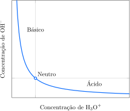

# A natureza dos ácidos e bases

Quando os químicos percebem que as reações de muitas substâncias têm características comuns, eles tentam definir uma classe de substâncias que caracterize esse padrão. Quando uma substância pertence a essa classe, eles imediatamente inferem muito de seu comportamento. Classificações desse tipo abrem a porta para a compreensão, reduzindo a necessidade de memorizar propriedades de cada substância encontrada. As reações das substâncias chamadas de *ácidos* e *bases* são uma excelente ilustração dessa abordagem. O comportamento dessas reações foi inicialmente identificado nos estudos de soluções de ácidos e bases em água que levaram às definições de Arrhenius de ácidos e bases (Tópico 3F). Entretanto, como reações semelhantes ocorrem em soluções não aquosas e mesmo na ausência de um solvente, os químicos perceberam que as definições originais deveriam ser substituídas por definições mais gerais.

## Os ácidos e bases de Brønsted-Lowry

Em 1923, o químico dinamarquês Johannes Brønsted propôs que

- Um **ácido** é um doador de prótons.
- Uma **base** é um aceitador de prótons.

O termo *próton* nessas definições refere-se ao íon hidrogênio, $\ce{H^+}$. Um ácido é uma espécie que contém um **átomo de hidrogênio ácido**, isto é, um átomo de hidrogênio que pode ser transferido na forma do núcleo, o próton, a outra espécie, que age como base. As mesmas definições foram propostas independentemente pelo químico inglês Thomas Lowry, e a teoria nelas baseada é chamada de **teoria de Brønsted-Lowry** de ácidos e bases. Um doador de prótons é conhecido como **ácido de Brønsted** e um aceitador de prótons, como **base de Brønsted**. Sempre que nos referirmos, aqui, a um *ácido* ou uma *base*, queremos dizer ácido de Brønsted ou base de Brønsted.

Uma substância só pode agir como um ácido na presença de uma base que possa aceitar os prótons ácidos. Um ácido não cede, simplesmente, seu hidrogênio ácido; o próton é transferido para a base. Na fase gás, a molécula de $\ce{HCl}$ permanece intacta. Quando, entretanto, a água dissolve o cloreto de hidrogênio, cada molécula de $\ce{HCl}$ transfere imediatamente um íon $\ce{H+}$ para uma molécula de $\ce{H2O}$ vizinha, que, aqui, age como base.
$$
   \ce{ \underset{ \text{ácido} }{ \ce{HCl(aq)} } + \underset{ \text{base} }{ \ce{H2O(l)} } -> H3O^+(aq) + Cl^-(aq) }
$$
Esse processo é uma **reação de transferência de próton**, uma reação em que um próton se transfere de uma molécula para outra. Dizemos que a molécula de $\ce{HCl}$ fica **desprotonada**. Como no equilíbrio praticamente todas as moléculas de $\ce{HCl}$ doam seus prótons para a água, o $\ce{HCl}$ é classificado como um ácido forte. Nesse caso, a reação de transferência de elétrons avança até se completar. O íon $\ce{H3O+}$ é chamado de íon hidrônio. 

:::info

### Nota de boa prática

O íon hidrônio é fortemente hidratado em solução, e existem algumas evidências de que a espécie é mais bem representada por $\ce{H9O4^+}$ (ou mesmo *clusters* maiores com moléculas de água ligadas a um próton). Um íon hidrogênio em água é algumas vezes representado por $\ce{H^+(aq)}$, mas você precisa lembrar sempre que $\ce{H^+}$ livre não existe em água e que $\ce{H3O^+}$ é uma representação melhor porque indica que uma base de Brønsted ($\ce{H2O}$) aceitou um próton.

:::

Outro exemplo de ácido é o cianeto de hidrogênio, $\ce{HCN}$, que pode transferir seu próton para a água ao formar a solução conhecida como ácido cianídrico, $\ce{HCN(aq)}$. Entretanto, somente uma pequena fração das moléculas de $\ce{HCN}$ doa seus prótons e, portanto, como vimos no Tópico 3F, o $\ce{HCN}$ é classificado como um ácido fraco em água. A reação de transferência de um próton é escrita como um equilíbrio:
$$
   \ce{ HCN(aq) + H2O(l) <=> H3O^+(aq) + CN^-(aq) }
$$
Como todos os equilíbrios químicos, esse é dinâmico, e deveríamos pensar que os prótons trocam incessantemente de posição entre as moléculas de $\ce{HCN}$ e de $\ce{H2O}$, fornecendo uma concentração baixa, porém constante, de íons $\ce{CN^-}$ e $\ce{H3O^+}$. A reação de transferência de próton de um ácido forte, como $\ce{HCl}$, para a água também é dinâmica, mas o equilíbrio está tão próximo da formação dos produtos, que é representado somente pela reação direta, com uma seta simples.

No Tópico 3F, um ácido de Arrhenius foi definido como um composto que produz íons hidrônio em água e uma base de Arrhenius, como um composto que produz íons hidróxido em água. A definição de Brønsted é mais geral porque inclui a possibilidade de que um íon seja um ácido (uma opção não permitida pela definição de Arrhenius). Por exemplo, um íon hidrogenocarbonato, $\ce{HCO3^-}$, uma das espécies presentes em águas naturais, pode agir como um doador de prótons e doar um próton para uma molécula de $\ce{H2O}$:
$$
   \ce{ HCO3^-(aq) + H2O(l) <=> H3O^+(aq) + CO3^{2-}(aq) }
$$
A distinção entre ácidos fortes e fracos pode ser sumariada como:

- **Ácido forte**: quase todas as moléculas estão desprotonadas em solução.
- **Ácido fraco**: somente uma pequena fração das moléculas ou dos íons está desprotonada em solução.

A força de um ácido depende do solvente, e um ácido que é forte em água pode ser fraco em outro solvente e vice-versa. Como, porém, praticamente todas as reações e 
organismos vivos e muitas reações de laboratório ocorrem em água, a menos que seja especificado o contrário, o solvente citado aqui é a água.

Uma base de Brønsted tem um par de elétrons livres a que o próton pode se ligar. Por exemplo, o íon óxido, $\ce{O^{2-}}$, é uma base de Brønsted. Na dissolução de $\ce{CaO}$ em água, o forte campo elétrico do pequeno íon $\ce{O^{2-}}$, com muita carga, retira um próton de uma molécula de $\ce{H2O}$ vizinha. Nesse processo, uma ligação covalente coordenada se forma entre o próton e um par isolado de elétrons do íon óxido. Ao aceitar o próton, o íon óxido fica protonado. Cada íon óxido presente aceita um próton da água e, portanto, $\ce{O^{2-}}$ é um exemplo de uma base forte em água, uma espécie totalmente protonada. A seguinte reação ocorre quase completamente:
$$
   \ce{ O^{2-}(aq) + H2O(l) <=> 2 OH^-(aq) } 
$$
Outro exemplo de base de Brønsted é a amônia. Quando uma molécula de $\ce{NH3}$ está em água, o par de elétrons do átomo de nitrogênio aceita um próton da molécula de $\ce{H2O}$:
$$
   \ce{ NH3(aq) + H2O(l) <=> NH4^+(aq) + OH^-(aq) } 
$$
Como a molécula de $\ce{NH3}$ é eletricamente neutra, ela tem um poder de retirar elétrons muito menor do que o do íon óxido. Como resultado, somente uma pequena porção das moléculas de $\ce{NH3}$ converte-se em íons $\ce{NH4^+}$. A amônia é, portanto, um exemplo de base fraca. Todas as aminas, derivados orgânicos da amônia, como a metilamina, $\ce{CH3NH2}$, são bases fracas em água. Como o equilíbrio de transferência de prótons em uma solução de amônia em água é dinâmico, os prótons são incessantemente trocados entre as moléculas de $\ce{NH3}$ e $\ce{H2O}$ com uma pequena concentração constante de íons $\ce{NH4^+}$ e $\ce{OH^-}$. A transferência de próton para a base forte $\ce{O^{2-}}$ também é dinâmica, mas como o equilíbrio está fortemente deslocado na direção dos produtos, como no caso do ácido forte, ele é representado pela reação direta, com uma única seta.

A distinção entre bases fortes e fracas pode ser sumariada como:

- **Base forte**: quase todas as moléculas ou íons estão protonados em solução.
- **Base fraca**: somente uma pequena fração das moléculas ou íons está protonada em solução.

Como no caso dos ácidos, a força da base depende do solvente: uma base forte em água pode ser fraca em outro solvente e vice-versa.

:::warning

### Atenção

Os óxidos e hidróxidos dos metais alcalinos e alcalino-terrosos não são bases de Brønsted: os íons óxido e hidróxido que os formam é que são as bases (os cátions são íons espectadores). Contudo, por conveniência os químicos normalmente se referem a esses compostos como bases.

:::

O produto formado a partir da molécula de um ácido quando ela transfere um próton para a água também pode aceitar um próton dela e, com isso, ser classificado como base. Por exemplo, o íon $\ce{CN^-}$, produzido quando $\ce{HCN}$ perde um próton, pode aceitar um próton de uma molécula vizinha de $\ce{H2O}$ para formar $\ce{HCN}$ novamente. Assim, de acordo com a definição de Brønsted, $\ce{CN^-}$ é uma base. Ela é chamada de **base conjugada** do ácido $\ce{HCN}$. Em geral, a base conjugada de um ácido é a espécie produzida quando ele doa um próton:
$$
   \ce{ \text{Ácido} ->[doa H^+] \text{base conjugada} }
$$
Como $\ce{HCN}$ é o ácido que se forma quando um próton se transfere para um íon cianeto, ele é **ácido conjugado** da base $\ce{CN^-}$. Em geral, o ácido conjugado é a espécie produzida quando uma base aceita um próton:
$$
   \ce{ \text{Base} ->[aceita H^+] \text{ácido conjugado} }
$$

:::example

### Escrevendo as fórmulas de ácidos e bases conjugados

:::

As definições de Brønsted de ácidos e bases também se aplicam a espécies em outros solventes que não a água e mesmo à fase gás, em que não há solvente. Por exemplo, quando ácido acético puro é adicionado a amônia líquida, ocorre transferência de prótons e o seguinte equilíbrio é atingido:
$$
   \ce{ CH3COOH(am) + NH3(l) -> CH3COO^-(am) + NH4^+(am) }
$$
(O símbolo $\ce{am}$ indica que a espécie está dissolvida em amônia líquida.) Um exemplo de transferência de próton em fase gás é a reação entre os gases cloreto de hidrogênio e amônia. Eles produzem um pó fino de cloreto de amônio, que é frequentemente encontrado cobrindo superfícies em laboratórios de química:
$$
   \ce{ HCl(g) + NH3(g) -> NH4Cl(g) }
$$

> Um ácido de Brønsted é um doador de prótons e uma base de Brønsted é um aceitador de prótons. A base conjugada de um ácido é a base formada quando o ácido doou o próton. O ácido conjugado de uma base é o ácido que se formou quando a base aceitou o próton. Um ácido forte está completamente desprotonado em solução; um ácido fraco está parcialmente desprotonado em solução. Uma base forte está completamente protonada em solução; uma base fraca está parcialmente protonada em solução.

## Os ácidos e bases de Lewis

A teoria de Brønsted-Lowry tem o foco na transferência de prótons de uma espécie para outra. Entretanto, os conceitos de ácido e base são mais amplos do que a simples transferência de prótons. Muitas outras substâncias podem ser classificadas como ácidos ou bases pela definição desenvolvida por G. N. Lewis:

- Um **ácido de Lewis** é um aceitador de par de elétrons.
- Uma **base de Lewis** é um doador de par de elétrons.

Quando uma base de Lewis doa um par de elétrons a um ácido de Lewis, as duas espécies partilham um par de elétrons a partir de uma ligação covalente coordenada. Um próton ($\ce{H^+}$) é um aceitador de par de elétrons. Portanto, ele é um ácido de Lewis, porque ele pode unir-se a (*aceitar*) um par de elétrons isolados de uma base de Lewis. Em outras palavras, um ácido de Brønsted é o fornecedor de um ácido de Lewis particular, o próton.

A teoria de Lewis é mais geral do que a teoria de Brønsted-Lowry. Por exemplo, átomos e íons de metais podem agir como ácidos de Lewis, como na formação de $\ce{Ni(CO)4}$ a partir de átomos de níquel (o ácido de Lewis) e monóxido de carbono (a base de Lewis), mas eles não são ácidos de Brønsted. Contudo, toda base de Brønsted é um tipo especial de base de Lewis, uma substância que pode utilizar um par de elétrons isolado para formar uma ligação covalente com um próton. Por exemplo, o íon óxido é uma base de Lewis. Ele forma uma ligação covalente coordenada com o próton, um ácido de Lewis, fornecendo o par de elétrons da ligação:

> Um ácido de Lewis é um aceitador de par de elétrons. Uma base de Lewis é um doador de par de elétrons. Um próton atua como um ácido de Lewis que se liga a um par isolado de elétrons fornecido por uma base de Lewis.

## Os óxidos ácidos, básicos e anfotéricos

> Os metais formam óxidos básicos e os não metais formam óxidos ácidos. Os elementos da linha diagonal, do berílio ao polônio, e vários metais do bloco d formam óxidos anfóteros.

## A troca de prótons entre moléculas de água

Uma importante consequência das definições de Brønsted de ácidos e bases é que a mesma substância pode funcionar como ácido e como base. Por exemplo, você viu que uma molécula de água aceita um próton de uma molécula de ácido (como $\ce{HCl}$ ou $\ce{HCN}$) para formar um íon $\ce{H3O^+}$. Logo, a água é uma base. Entretanto, uma molécula de água pode doar um próton a uma base (como $\ce{O^{2-}}$ ou $\ce{NH3}$) e tornar-se um íon $\ce{OH^-}$. Assim, a água é, também, um ácido. Portanto, a água é **anfiprótica**, isto é, ela pode agir como doadora e como aceitadora de prótons.

:::warning

### Atenção

Atente para a distinção entre *anfotérico* e *anfiprótico*. O metal alumínio é anfotérico (reage com ácidos e com bases), mas não tem átomos de hidrogênio para doar como prótons, logo não é anfiprótico.

:::

A transferência de prótons entre moléculas de água ocorre até mesmo em água pura, com uma molécula agindo como doador de prótons e outra como aceitador de prótons:
$$
   \ce{ \underset{ \text{ácido} }{ \ce{H2O(l)} } + \underset{ \text{base} }{ \ce{H2O(l)} } <=> H3O^+(aq) + OH^-(aq) }
$$
Mais detalhadamente, a reação direta, mostrada com as setas curvas que ilustram como os elétrons migram e o íon hidrogênio transferido sinalizado em vermelho, é

A reação é muito rápida em ambas as direções, e o equilíbrio está sempre presente na água e em suas soluções. Em cada copo de água, prótons dos átomos de hidrogênio migram incessantemente de uma molécula para outra. Esse tipo de reação, em que uma molécula transfere um próton para outra molécula idêntica, é chamado de **autoprotólise**.

A constante de equilíbrio da reação de autoprotólise é
$$
   K_\mathrm{w} = \dfrac{ a_{\ce{H3O^+}} a_{\ce{OH^-}} }{ (a_{\ce{H2O}})^2 }
$$
Em soluções diluídas em água, o solvente está quase puro, logo sua atividade pode ser considerada como igual a $a_{\ce{H2O}} = 1$. A expressão resultante é chamada de constante de autoprotólise da água e é escrita como $K_\mathrm{w}$:
$$
   K_\mathrm{w} = a_{\ce{H3O^+}} a_{\ce{OH^-}}
$$
Como vimos no Tópico 2G, a atividade de um soluto $\ce{J}$ em uma solução diluída é aproximadamente igual à concentração molar relativa à concentração molar padrão, $\ce{[J]}/c^\circ$, com $c^\circ = \pu{1 mol.L-1}$, logo uma forma prática dessa expressão é:
$$
   K_\mathrm{w} = \ce{ [H3O^+] [OH^-] }
$$
em que, como no Tópico 2G, a expressão é simplificada pela substituição de $\ce{[J]}/c^\circ$ por $\ce{[J]}$, interpretando-a como o valor da concentração molar em mols por litro, sem as unidades.

Em água pura, em $\pu{25 \degree C}$, as concentrações molares de $\ce{H3O^+}$ e $\ce{OH^-}$ são iguais (o líquido é eletricamente neutro) e têm o valor experimental $\pu{1e-7 mol.L-1}$. Portanto, em $\pu{25 \degree C}$ (a única temperatura usada aqui, a menos que seja afirmado o contrário),
$$
   K_\mathrm{w} = (\pu{1e-7}) \times (\pu{1e-7}) = \pu{1e-14}
$$
As concentrações de $\ce{H3O^+}$ e $\ce{OH^-}$ são muito pequenas em água pura, o que explica por que a água pura é tão má condutora de eletricidade.

:::think

### Ponto para pensar

A reação de autoprotólise é endotérmica. Você espera que $K_\mathrm{w}$ aumente ou diminua com a temperatura crescente?

:::

É importante lembrar que $K_\mathrm{w}$ não é fundamentalmente diferente das constantes de equilíbrio estudadas no Tópico 2F. *Como $K_\mathrm{w}$ é uma constante de equilíbrio, o produto das concentrações dos íons $\ce{H3O^+}$ e $\ce{OH^-}$ é sempre igual a $K_\mathrm{w}$*. Quando a concentração de íons $\ce{H3O^+}$ é aumentada com a adição de ácido, a concentração de íons $\ce{OH^-}$ decresce imediatamente, para manter o valor de $K_\mathrm{w}$. Alternativamente, quando a concentração de íons $\ce{OH^-}$ é aumentada com a adição de base, a concentração de íons $\ce{H3O^+}$ diminui. O equilíbrio de autoprotólise interliga as concentrações de $\ce{H3O^+}$ e $\ce{OH^-}$ como uma gangorra; quando uma sobe, a outra desce (Figura 1).

:::example

### Cálculo da concentração de íons em uma solução de um hidróxido de metal

:::

> Nas soluções em água, as concentrações dos íons $\ce{H3O^+}$ e $\ce{OH^-}$ estão relacionadas pelo equilíbrio de autoprotólise. Se uma concentração aumenta, a outra diminui para manter o valor de $K_\mathrm{w}$.

# A escala de pH

Uma dificuldade em descrever quantitativamente as concentrações de ácidos e bases é que a concentração de íons $\ce{H3O^+}$ pode variar em muitas ordens de grandeza: em algumas soluções, pode ser maior do que $\pu{1 mol.L-1}$ e, em outras, menor do que $\pu{1e-14 mol.L-1}$. Os químicos evitam a dificuldade de lidar com essa faixa extensa de valores indicando a concentração do íon hidrônio em termos do **pH** da solução, isto é, o logaritmo negativo (na base 10) da atividade do íon hidrônio:
$$
   \mathrm{pH} = - \log a_{\ce{H3O^+}}
$$
em que (para soluções suficientemente diluídas para serem tratadas como ideais) e, como no Tópico 2G, a expressão é simplificada fazendo $\ce{[H3O1]}$ igual à concentração de $\ce{H3O^+}$ em mols por litro e retirando as unidades e escrevendo
$$
   \mathrm{pH} = - \log \ce{[H3O^+]}
$$
Assim, o pH da água pura, em que a concentração dos íons $\ce{H3O^+}$ é $\pu{1e-7}$, em $\pu{25 \degree C}$, é
$$
   \mathrm{pH} = - \log (\pu{1e-7}) = 7
$$

:::think

### Ponto para pensar

Você espera que o pH da água pura aumente ou diminua com o aumento da temperatura?

:::

## A interpretação do pH

O sinal negativo na definição do pH significa que, quanto maior for a concentração molar de $\ce{H3O^+}$, menor será o pH. Por exemplo, se a concentração do $\ce{H3O^+}$ for $\pu{1e-7}$, o pH será $7$, mas se ela aumentar para $\pu{1e-6}$, o pH cairá para $6$. Como mostra o exemplo, uma mudança de uma unidade de pH significa que a concentração dos íons $\ce{H3O^+}$ varia 10 vezes. É importante lembrar que (em $\pu{25 \degree C}$):

- O pH de uma solução básica é maior do que 7.
- O pH de uma solução neutra, como a água pura, é 7.
- O pH de uma solução ácida é menor do que 7.

A maior parte das soluções usadas em química está na faixa de pH entre 0 e 14, mas valores fora dessa faixa são possíveis.

:::think

### Ponto para pensar

Um pH pode ser negativo? Se sim, o que isso significaria?

:::

:::example

### Cálculo do pH a partir de uma concentração

:::

O pH aproximado de uma solução em água pode ser estimado com rapidez com um papel indicador universal, que muda de cor em diferentes valores de pH. Medidas mais precisas são feitas com um *medidor de pH*. Este instrumento é um voltímetro ligado a dois eletrodos que mergulham na solução. A diferença de potencial elétrico nos eletrodos é proporcional ao pH (como será explicado no Tópico 2L). Logo, como a escala do medidor está calibrada, o pH pode ser lido diretamente. 

Para converter o pH em concentração de íons $\ce{H3O^+}$, inverta o sinal do pH e tome o antilogaritmo.
$$
   \ce{[H3O^+]} = 10^{-\mathrm{pH}} \; \pu{mol.L-1}
$$

:::example

### Cálculo da concentração de íons hidrônio a partir do pH

Uma solução tem $\mathrm{pH} = \pu{4,3}$.

**Calcule** a concentração de íons hidrônio nessa solução.

#### Use a definição de $\mathrm{pH}$.

De $\ce{[H3O^+]} = 10^{-\mathrm{pH}} \; \pu{mol.L-1}$
$$
   \ce{[H3O^+]} = 10^{-\mathrm{4,5}} \; \pu{mol.L-1} = \boxed{ \pu{5e-5 mol.L-1} }
$$

:::

O suco fresco de limão tem $\mathrm{pH} = \pu{2,2}$, que corresponde à concentração de íons $\ce{H3O^+}$ igual a $\pu{6 mmol.L-1}$. A chuva natural (não poluída), cuja acidez é decorrente principalmente do dióxido de carbono dissolvido, tem pH em torno de $\pu{5,7}$. Um rejeito em água é definido como *corrosivo* se o pH for inferior a $\pu{2}$ (muito ácido) ou superior a $\pu{11,5}$ (muito básico).

> A escala de pH é usada para indicar a concentração molar dos íons $\ce{H3O^+}$: $\mathrm{pH} = - \log \ce{[H3O^+]}$. Um $\mathrm{pH} > 7$ indica que a solução é básica e um $\mathrm{pH} < 7$ indica que ela é ácida. Uma solução neutra tem $\mathrm{pH} = 7$.

## O pOH de soluções

Muitas expressões quantitativas que envolvem ácidos e bases são extremamente simplificadas quando usamos logaritmos. A quantidade $\mathrm{pX}$ é uma generalização de $\mathrm{pH}$:
$$
   \mathrm{pX} = - \log \mathrm{X}
$$
Por exemplo, pOH é definido como
$$
   \mathrm{pOH} = - \log a_{\ce{OH^-}}
$$
que, pela mesma razão do pH, é simplificada como
$$
   \mathrm{pOH} = - \log \ce{[OH^-]}
$$
O $\mathrm{pOH}$ é conveniente para expressar as concentrações dos íons $\ce{OH^-}$ em solução. Por exemplo, na água pura, em que a concentração dos íons $\ce{OH^-}$ é $\pu{1e-7 mol.L-1}$, o $\mathrm{pOH}$ é $7$. Do mesmo modo, entendemos para $\mathrm{p}K_\mathrm{w}$, que
$$
   \mathrm{p}K_\mathrm{w} = -\log K_\mathrm{w} = 14
$$
Os valores de $\mathrm{pH}$ e $\mathrm{pOH}$ de uma solução aquosa estão relacionados. Para encontrar a relação, comece com a expressão da constante de autoprotólise da água, $K_\mathrm{w} = \ce{[H3O^+][OH^-]}$. Tome os logaritmos dos dois lados:
$$
   \log (\ce{[H3O^+][OH^-]}) = \log K_\mathrm{w}
$$
Agora use $\log ab = \log a + \log b$ para obter
$$
   \log \ce{[H3O^+]} + \log \ce{[OH^-]} = \log K_\mathrm{w}
$$
A multiplicação dos dois lados da equação por $-1$ dá
$$
   ( \overbrace{ - \log \ce{[H3O^+]} }^{ \mathrm{pH} } ) 
   + ( \overbrace{ - \log \ce{[OH^-]} }^{ \mathrm{pOH} } ) 
   = ( \overbrace{ - \log K_\mathrm{w} }^{ \mathrm{p}K_\mathrm{w} } )
$$
que é o mesmo que
$$
   \mathrm{pH} + \mathrm{pOH} = \mathrm{p}K_\mathrm{w}
$$
Como $\mathrm{p}K_\mathrm{w} = 14$ em $\pu{25 \degree C}$, nesta temperatura
$$
   \mathrm{pH} + \mathrm{pOH} = 14
$$
A Equação XXXX mostra que o $\mathrm{pH}$ e o $\mathrm{pOH}$ de uma solução têm valores complementares: se um aumenta, o outro diminui, para que a soma permaneça constante.

:::example

### Cálculo do pH a partir do pOH

:::

> O pH e o pOH de uma solução relacionam‑se pela expressão $\mathrm{pH} + \mathrm{pOH} = \mathrm{p}K_\mathrm{w}$.

# Os ácidos e bases fracos

## As constantes de acidez e 

## A gangorra da conjugação

## A estrutura molecular e a acidez
