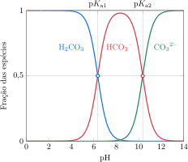
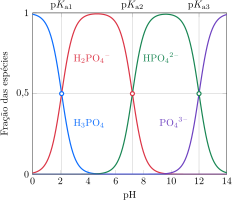

# O pH das soluções em água

A transferência de prótons é um processo muito rápido: assim que um ácido ou uma base entra em solução na água, um equilíbrio dinâmico é estabelecido. Portanto, a composição da solução e a concentração dos íons hidrônio expressa como pH podem ser calculadas usando-se as técnicas explicadas nos Tópicos 2F e 2G.

## As soluções de ácidos fracos

A **concentração inicial** (ou *concentração analítica*) de um ácido é a concentração em que ele foi preparado, como se as moléculas ácidas não tivessem doado prótons. No caso de um ácido forte, $\ce{HA}$, a concentração molar dos íons $\ce{H3O^+}$ em solução é igual à concentração inicial do ácido forte, porque quase todas as moléculas do ácido estão desprotonadas. Entretanto, para encontrar a concentração dos íons $\ce{H3O^+}$ nas soluções de um ácido fraco $\ce{HA}$, o equilíbrio
$$
   \ce{ HA(aq) + H2O(l) <=> H3O^+(aq) + A^-(aq) }
$$
entre o ácido $\ce{HA}$, sua base conjugada $\ce{A^-}$ e a água, com
$$
   K_\mathrm{a} 
      = \ce{ \frac{[H3O^+][A^-]}{[HA]} }
$$
tem de ser levado em conta. O pH será um pouco mais alto (isto é, a concentração de $\ce{H3O^+}$ será menor) do que seria para um ácido forte na mesma concentração inicial. Para calcular o pH de uma solução de um ácido fraco, você pode usar uma tabela de equilíbrio como a apresentada no Tópico 2F. O cálculo também permite predizer o **grau de desprotonação**, $\alpha$, isto é, a fração de moléculas $\ce{HA}$ que estão desprotonadas em solução:
$$
   \alpha 
      = \dfrac{ \ce{[A^-]}   }{ \ce{[HA]}_\text{inicial} }
      = \dfrac{ \ce{[H3O^+]} }{ \ce{[HA]}_\text{inicial} }
$$
A igualdade $\ce{[H3O^+]} = \ce{[A^-]}$, que vem da relação estequiométrica para a reação de desprotonação. Uma fração pequena de moléculas desprotonadas indica que o ácido $\ce{HA}$ é muito fraco.

:::think

### Ponto para pensar

Como a magnitude da desprotonação de um ácido fraco pode ser afetada por sua concentração?

:::

:::example

### Cálculo do pH de uma solução de ácido fraco

Considere uma solução $\pu{0,18 mol.L-1}$ de ácido acético, $\ce{CH3COOH}$, $K_\mathrm{a} = \pu{1,8e-5}$.

**Calcule** o pH da solução.

#### Escreva a expressão da constante de equilíbrio.

$$
\begin{gathered}
   \ce{ CH3COOH(aq) + H2O(l) <=> H3O^+(aq) + CH3CO2^-(aq) } \\
   K_\mathrm{a} = \ce{ \frac{[H3O^+][CH3CO2^-]}{[CH3COOH]} }
\end{gathered}
$$

####  Elabore uma tabela de equilíbrio.

| $c/\pu{mol.L-1}$ |    $\ce{CH3CCOOH}$     |    $\ce{H3O^+}$     |   $\ce{CH3CO2^-}$   |
| :--------------- | :--------------------: | :-----------------: | :-----------------: |
| início           |      $\pu{0,18}$       |         $0$         |         $0$         |
| reação           |  $-\pu{0,18} \alpha$   | $+\pu{0,18} \alpha$ | $+\pu{0,18} \alpha$ |
| equilíbrio       | $\pu{0,18} (1-\alpha)$ | $\pu{0,18} \alpha$  | $\pu{0,18} \alpha$  |

#### Insira os valores da tabela na expressão do $K_\mathrm{a}$.

$$
   K_\mathrm{a} 
      = \dfrac{ (\pu{0,18} \alpha)^2 }{ \pu{0,18} (1-\alpha) }
      = \pu{0,18} \times \dfrac{\alpha^2}{1-\alpha}
$$

#### Hipótese: $1 - \alpha \approx 1$.

Substituindo a hipótese na expressão da constante de equilíbrio:
$$
   K_\mathrm{a}  
      = \pu{1,8e-5} 
      = \pu{0,18} \times \alpha^2
$$
Resolvendo a equação para $\alpha$ obtemos
$$  
   \alpha = \pu{0,01} 
$$
O valor de $\alpha$ é muito menor que 1 (menor que $\pu{0,05}$), e a aproximação é válida.

#### Calcule a concentração de $\ce{H3O^+}$.

De $\ce{[H3O^+]} = \pu{0,18 mol//L} \alpha$
$$
   \ce{[H3O^+]} 
      = \pu{0,18 mol//L} \times (\pu{0,01})
      = \pu{1,8e-3 mol.L-1}
$$

#### Calcule o pH.

De $\mathrm{pH} = -\log \ce{H3O^+}$
$$
   \mathrm{pH} = -\log(\pu{1,8e-3}) = \boxed{ \pu{2,74} }
$$

:::

Embora muitas tabelas mostrem os valores de $\mathrm{p}K_\mathrm{a}$ de ácidos fracos, talvez você precise conhecer o valor da constante para um ácido desconhecido ou em uma temperatura diferente das consideradas. Nesses casos, você pode adotar um procedimento como o dado abaixo para calcular $K_\mathrm{a}$ e $\mathrm{p}K_\mathrm{a}$.

:::example

### Cálculo da constante de um ácido fraco a partir do pH

Uma solução $\pu{0,01 mol.L-1}$ de um ácido carboxílido tem pH $\pu{3}$.

**Calcule** o $\ce{K_\mathrm{a}}$ do ácido.

#### Escreva a expressão da constante de equilíbrio.

$$
\begin{gathered}
   \ce{ HA(aq) + H2O(l) <=> H3O^+(aq) + A^-(aq) } \\
   K_\mathrm{a} = \ce{ \frac{[H3O^+][A^-]}{[HA]} }
\end{gathered}
$$

####  Elabore uma tabela de equilíbrio.

| $c/\pu{mol.L-1}$ |       $\ce{HA}$        |    $\ce{H3O^+}$     |     $\ce{A^-}$      |
| :--------------- | :--------------------: | :-----------------: | :-----------------: |
| início           |      $\pu{0,01}$       |         $0$         |         $0$         |
| reação           |  $-\pu{0,01} \alpha$   | $+\pu{0,01} \alpha$ | $+\pu{0,01} \alpha$ |
| equilíbrio       | $\pu{0,01} (1-\alpha)$ | $\pu{0,01} \alpha$  | $\pu{0,01} \alpha$  |

#### Calcule a concentração de $\ce{H3O^+}$.

De $\mathrm{pH} = -\log \ce{[H3O^+]}$
$$
   \ce{[H3O^+]} = \pu{1e-3 mol.L-1}
$$

#### Calcule o grau de ionização do ácido.

De $\ce{[H3O^+]} = \pu{0,01} \alpha$
$$
   \alpha = \dfrac{  \pu{1e-3 mol.L-1} }{ \pu{0,01 mol.L-1} } = \pu{0,1}
$$

#### Calcule a concentração de ácido não desprotonado.

De $\ce{[HA]} = \pu{0,01} (1-\alpha)$
$$
   \alpha = \pu{0,01 mol//L} (1 - \pu{0,1}) = \pu{9e-3 mol.L-1}
$$

#### Insira os valores da tabela na expressão do $K_\mathrm{a}$.

$$
   K_\mathrm{a} 
      = \dfrac{ (\pu{1e-3}) }{ \pu{9e-3} }
      = \boxed{ \pu{1,1e-4} }
$$

:::

> Para calcular o pH e a percentagem de desprotonação de uma solução de ácido fraco, construa uma tabela de equilíbrio e determine a concentração de $\ce{H3O^+}$ usando a constante de acidez.

## As soluções de bases fracas

Como nos ácidos fracos, quando uma base fraca, $\ce{B}$, dissolve-se em água, o equilíbrio da transferência de prótons é estabelecido muito rapidamente:
$$
   \ce{ B(aq) + H2O(aq) <=> HB^+(aq) + OH^-(aq) }
$$
com
$$
   K_\mathrm{b} 
      = \ce{ \frac{ [HB^+] [OH^-] }{ [B] } }
$$
Muitas vezes, é importante conhecer o **o grau de protonação**, isto é, a fração de moléculas de base que foram protonadas:
$$
   \alpha 
      = \dfrac{ \ce{[BH^+]} }{ \ce{[B]}_\text{inicial} }
      = \dfrac{ \ce{[OH^-]} }{ \ce{[B]}_\text{inicial} }
$$
Aqui, $\ce{[B]}_\text{inicial}$ é a concentração molar inicial (ou analítica) da base, isto é, sua concentração imaginando-se que não ocorreu protonação. O procedimento para determinar o pH de uma solução de uma base fraca e sua porcentagem de desprotonação é análogo ao usado para ácidos fracos.

:::example

### Cálculo do pH de uma solução de base fraca

Considere uma solução $\pu{0,4 mol.L-1}$ de metilamina, $\ce{CH3NH2}$, $K_\mathrm{b} = \pu{3,6e-4}$.

**Calcule** o pH da solução.

#### Escreva a expressão da constante de equilíbrio.

$$
\begin{gathered}
   \ce{ CH3NH2(aq) + H2O(l) <=> CH3NH3^+(aq) + OH^-(aq) } \\
   K_\mathrm{a} = \ce{ \frac{[CH3NH3^+][OH^-]}{[CH3NH2]} }
\end{gathered}
$$

####  Elabore uma tabela de equilíbrio.

| $c/\pu{mol.L-1}$ |     $\ce{CH3NH2}$     |  $\ce{CH3NH3^+}$   |    $\ce{OH^-}$     |
| :--------------- | :-------------------: | :----------------: | :----------------: |
| início           |      $\pu{0,4}$       |        $0$         |        $0$         |
| reação           |  $-\pu{0,4} \alpha$   | $+\pu{0,4} \alpha$ | $+\pu{0,4} \alpha$ |
| equilíbrio       | $\pu{0,4} (1-\alpha)$ | $\pu{0,4} \alpha$  | $\pu{0,4} \alpha$  |

#### Insira os valores da tabela na expressão do $K_\mathrm{a}$.

$$
   K_\mathrm{a} 
      = \dfrac{ (\pu{0,4} \alpha)^2 }{ \pu{0,4} (1-\alpha) }
      = \pu{0,4} \times \dfrac{\alpha^2}{1-\alpha}
$$

#### Hipótese: $1 - \alpha \approx 1$.

Substituindo a hipótese na expressão da constante de equilíbrio:
$$
   K_\mathrm{a}  
      = \pu{3,6e-4} 
      = \pu{0,4} \times \alpha^2
$$
Resolvendo a equação para $\alpha$ obtemos
$$  
   \alpha = \pu{0,03} 
$$
O valor de $\alpha$ é muito menor que 1 (menor que $\pu{0,05}$), e a aproximação é válida.

#### Calcule a concentração de $\ce{OH^-}$.

De $\ce{[OH^-]} = \pu{0,4 mol//L} \alpha$
$$
   \ce{[H3O^+]} 
      = \pu{0,4 mol//L} \times (\pu{0,03})
      = \pu{1,2e-2 mol.L-1}
$$

#### Calcule o pOH.

De $\mathrm{pOH} = -\log \ce{OH^-}$
$$
   \mathrm{pOH} = -\log(\pu{1,2e-2}) = \boxed{ \pu{1,9} }
$$

#### Calcule o pH.

De $\mathrm{pH} + \mathrm{pOH} = \mathrm{p}K_\mathrm{w} = 14$
$$
   \mathrm{pH} = \pu{14} - \pu{1,92} = \boxed{ \pu{12,1} }
$$

:::

> Para calcular o pH de uma solução de base fraca, construa a tabela de equilíbrio e calcule o pOH a partir do valor de $K_\mathrm{b}$.

## O pH das soluções de sais

Um sal é produzido pela neutralização de uma base por um ácido. Contudo, se o pH de uma solução de um sal é medido, nem sempre ele tem valor *neutro* ($\mathrm{pH} = \pu{7}$). Por exemplo, se uma solução $\pu{0,3 mol.L-1}$ de $\ce{NaOH}$ for neutralizada com uma solução $\pu{0,3 mol.L-1}$ de $\ce{CH3COOH}$, a solução de acetato de sódio resultante terá $\mathrm{pH} = \pu{9}$. Como isso pode ocorrer? A teoria de Brønsted-Lowry dá uma explicação. De acordo com essa teoria, um íon pode ser um ácido ou uma base. O íon acetato, por exemplo, é uma base e o íon amônio é um ácido. O pH de uma solução de um sal depende da acidez e da basicidade relativas de seus íons.

Alguns cátions são ácidos em água. Eles caem em quatro categorias gerais:

- Todos os cátions que são ácidos conjugados de bases fracas produzem soluções ácidas.

Os ácidos conjugados de bases fracas, como $\ce{NH4^+}$, agem como doadores de prótons, logo espera-se que eles formem soluções ácidas.

- Cátions de metais, com carga elevada e raio pequeno que podem agir como ácidos de Lewis em água, como, por exemplo, $\ce{Al^{3+}}$ e $\ce{Fe^{3+}}$, produzem soluções ácidas, mesmo que os cátions não tenham íons hidrogênio para doar.

Os prótons vêm das moléculas de água que hidratam esses cátions de metais em solução. As moléculas de água agem como bases de Lewis e compartilham elétrons com o cátion de metal em ligações covalentes coordenadas (Tópico 3F). Essa perda parcial de elétrons enfraquece as ligações $\ce{O-H}$ e permite que um ou mais prótons sejam eliminados das moléculas de água. Cátions pequenos e com carga elevada exercem maior atração sobre os elétrons, enfraquecendo ao máximo as ligações $\ce{O-H}$, formando as soluções mais ácidas.

- Os cátions dos metais dos Grupos 1 e 2 e os de carga $+1$ de outros grupos são ácidos de Lewis tão fracos que os íons hidratados não agem como ácidos de Brønsted.

Esses cátions de metal são muito grandes e têm carga muito baixa para ter um efeito polarizante apreciável sobre as moléculas de água de hidratação que os rodeiam, logo as moléculas de água não perdem facilmente seus prótons. Esses cátions são, às vezes, chamados de *cátions neutros*, porque eles têm efeito muito pequeno sobre o pH.

- Nenhum cátion é básico.

Os cátions não aceitam um próton facilmente porque a carga positiva do cátion repele a carga positiva dos prótons que se aproximam.

:::example

### Cálculo do pH de uma solução de um sal com cátion ácido

Considere uma solução $\pu{0,15 mol.L-1}$ de cloreto de amônio, $\ce{NH4Cl}$.

A constante de basicidade da amônia é $K_\mathrm{b} = \pu{1,8e-5}$.

**Calcule** o pH da solução.

#### Escreva a expressão da constante de equilíbrio.

$$
\begin{gathered}
   \ce{ NH4^+(aq) + H2O(l) <=> H3O^+(aq) + NH3(aq) } \\
   K_\mathrm{a} = \ce{ \frac{[H3O^+][NH3]}{[NH4^+]} }
\end{gathered}
$$

#### Calcule a constante de acidez a partir da constante de basicidade da base conjugada ($\ce{NH3}$).

De $K_\mathrm{a} = K_\mathrm{w}/K_\mathrm{b}$
$$
   K_\mathrm{a} 
      = \dfrac{ \pu{1e-14} }{ \pu{1,8e-5} } 
      = \pu{5,5e-10}
$$

####  Elabore uma tabela de equilíbrio.

| $c/\pu{mol.L-1}$ |      $\ce{NH4^+}$      |    $\ce{H3O^+}$     |     $\ce{NH3}$      |
| :--------------- | :--------------------: | :-----------------: | :-----------------: |
| início           |      $\pu{0,15}$       |         $0$         |         $0$         |
| reação           |  $-\pu{0,15} \alpha$   | $+\pu{0,15} \alpha$ | $+\pu{0,15} \alpha$ |
| equilíbrio       | $\pu{0,15} (1-\alpha)$ | $\pu{0,15} \alpha$  | $\pu{0,15} \alpha$  |

#### Insira os valores da tabela na expressão do $K_\mathrm{a}$.

$$
   K_\mathrm{a} 
      = \dfrac{ (\pu{0,15} \alpha)^2 }{ \pu{0,15} (1-\alpha) }
      = \pu{0,15} \times \dfrac{\alpha^2}{1-\alpha}
$$

#### Hipótese: $1 - \alpha \approx 1$.

Substituindo a hipótese na expressão da constante de equilíbrio:
$$
   K_\mathrm{a}  
      = \pu{5,5e-10} 
      = \pu{0,15} \times \alpha^2
$$
Resolvendo a equação para $\alpha$ obtemos
$$  
   \alpha = \pu{6e-5}
$$
O valor de $\alpha$ é muito menor que 1 (menor que $\pu{0,05}$), e a aproximação é válida.

#### Calcule a concentração de $\ce{H3O^+}$.

De $\ce{[H3O^+]} = \pu{0,15 mol//L} \alpha$
$$
   \ce{[H3O^+]} 
      = \pu{0,15 mol//L} \times (\pu{6e-5})
      = \pu{9e-6 mol.L-1}
$$

#### Calcule o pH.

De $\mathrm{pH} = -\log \ce{H3O^+}$
$$
   \mathrm{pH} = -\log(\pu{9e-6}) = \boxed{ \pu{5,0} }
$$

:::

Alguns ânions são básicos em água. Eles caem em três categorias gerais:

- Pouquíssimos ânions que têm hidrogênio produzem soluções ácidas.

É difícil para um próton, com sua carga positiva, deixar um ânion, com sua carga negativa. Os poucos ânions que atuam como ácidos fracos incluem $\ce{H2PO4^-}$ e $\ce{HSO4^-}$.

- Todos os ânions que são bases conjugadas de ácidos fracos produzem soluções básicas.

Por exemplo, o ácido fórmico, $\ce{HCOOH}$, o ácido do veneno das formigas, é um ácido fraco, logo o íon formato age como uma base em água:
$$
   \ce{ H2O(l) + HCO2^-(aq) <=> HCOOH(aq) + OH^-(aq) }
$$

- Os ânions de ácidos fortes --- que incluem $\ce{Cl^-}$, $\ce{Br^-}$, $\ce{I^-}$, $\ce{NO3^-}$ e $\ce{ClO4^-}$ --- são bases tão
fracas que não têm efeito significativo sobre o pH de uma solução.

Esses ânions são considerados *neutros* em água.

Para determinar se uma solução de um sal é ácida, básica ou neutra, deve-se levar em conta o cátion e o ânion. Primeiramente, examine o ânion para ver se ele é a base conjugada de um ácido fraco. Se o ânion não é ácido ou básico, então examine o cátion para ver se ele é um íon de metal com caráter ácido ou se é o ácido conjugado de uma base fraca. Se um íon é um ácido e o outro é uma base, como em $\ce{NH4F}$, então o pH é afetado pelas reações dos dois íons com a água, e ambos os equilíbrios devem ser levados em conta.

:::example

### Cálculo do pH de uma solução de um sal com cátion ácido

Considere uma solução $\pu{0,15 mol.L-1}$ de acetato de cálcio, $\ce{Ca(CH3CO2)2}$.

A constante de acidez do ácido acético é $K_\mathrm{a} = \pu{1,8e-5}$.

**Calcule** o pH da solução.

#### Escreva a expressão da constante de equilíbrio.

$$
\begin{gathered}
   \ce{ H2O(l) + CH3CO2^-(aq) <=> CH3COOH(aq) + OH^-(aq) } \\
   K_\mathrm{b} = \ce{ \frac{[H3O][CH3CO2^-]}{[CH3COOH]} }
\end{gathered}
$$

#### Calcule a constante de acidez a partir da constante de basicidade da base conjugada ($\ce{NH3}$).

De $K_\mathrm{b} = K_\mathrm{w}/K_\mathrm{a}$
$$
   K_\mathrm{b} 
      = \dfrac{ \pu{1e-14} }{ \pu{1,8e-5} } 
      = \pu{5,5e-10}
$$

####  Elabore uma tabela de equilíbrio.

A concentração inicial de $\ce{CH3CO2^-}$ é $2 \times \pu{0,15 mol//L} = \pu{0,30 mol//L}$, porque cada fórmula unitária do sal fornece dois íons $\ce{CH3CO2^-}$.

| $c/\pu{mol.L-1}$ |      $\ce{NH4^+}$      |    $\ce{H3O^+}$     |     $\ce{NH3}$      |
| :--------------- | :--------------------: | :-----------------: | :-----------------: |
| início           |      $\pu{0,30}$       |         $0$         |         $0$         |
| reação           |  $-\pu{0,30} \alpha$   | $+\pu{0,30} \alpha$ | $+\pu{0,30} \alpha$ |
| equilíbrio       | $\pu{0,30} (1-\alpha)$ | $\pu{0,30} \alpha$  | $\pu{0,30} \alpha$  |

#### Insira os valores da tabela na expressão do $K_\mathrm{a}$.

$$
   K_\mathrm{a} 
      = \dfrac{ (\pu{0,30} \alpha)^2 }{ \pu{0,30} (1-\alpha) }
      = \pu{0,30} \times \dfrac{\alpha^2}{1-\alpha}
$$

#### Hipótese: $1 - \alpha \approx 1$.

Substituindo a hipótese na expressão da constante de equilíbrio:
$$
   K_\mathrm{a}  
      = \pu{5,5e-10} 
      = \pu{0,30} \times \alpha^2
$$
Resolvendo a equação para $\alpha$ obtemos
$$  
   \alpha = \pu{4,3e-5}
$$
O valor de $\alpha$ é muito menor que 1 (menor que $\pu{0,05}$), e a aproximação é válida.

#### Calcule a concentração de $\ce{OH^-}$.

De $\ce{[OH^-]} = \pu{0,30 mol//L} \alpha$
$$
   \ce{[OH^-]} 
      = \pu{0,30 mol//L} \times (\pu{4,3e-5})
      = \pu{1,3e-5 mol.L-1}
$$

#### Calcule o pOH.

De $\mathrm{pOH} = -\log \ce{OH^-}$
$$
   \mathrm{pOH} = -\log(\pu{1,3e-5}) = \boxed{ \pu{4,9} }
$$

#### Calcule o pH.

De $\mathrm{pH} + \mathrm{pOH} = \mathrm{p}K_\mathrm{w} = 14$
$$
   \mathrm{pH} = \pu{14} - \pu{4,9} = \boxed{ \pu{9,1} }
$$

:::

> Os sais que contêm ácidos conjugados de bases fracas produzem soluções ácidas em água. O mesmo fazem os sais que contêm cátions de metal pequenos e com carga elevada. Os sais que contêm bases conjugadas de ácidos fracos produzem soluções básicas em água.

# Os ácidos e bases polipróticos

Um ácido poliprótico é um composto que pode doar mais de um próton. Muitos ácidos comuns são polipróticos, dentre eles o ácido sulfúrico, $\ce{H2SO4}$, e o ácido carbônico, $\ce{H2CO3}$, que podem doar dois prótons, e o ácido fosfórico, $\ce{H3PO4}$, que pode doar três prótons. Os ácidos polipróticos têm papel importante em sistemas biológicos, já que muitas enzimas podem ser consideradas como ácidos polipróticos que desempenham suas funções vitais doando um próton após o outro. Uma base poliprótica é uma espécie que pode aceitar mais de um próton. Exemplos incluem os ânions $\ce{CO3^{2-}}$ e $\ce{SO3^{2-}}$, que podem aceitar dois prótons, e o ânion $\ce{PO4^{3-}}$, que pode aceitar três prótons.

:::think

### Ponto para pensar

As desprotonações sucessivas de um ácido poliprótico resultarão em ácidos mais fortes ou em ácidos mais fracos?

:::

## O pH de uma solução de ácido polipróticos

O ácido carbônico é um componente natural importante do ambiente que se forma toda vez que o dióxido de carbono se dissolve na água. Na verdade, os oceanos garantem um dos mecanismos críticos para a manutenção da concentração constante do dióxido de carbono na atmosfera. O ácido carbônico participa de dois equilíbrios sucessivos de transferência de prótons:
$$
\begin{aligned}
   \ce{ H2CO3(aq)  + H2O(l) &<=> H3O^+(aq) + HCO3^- } && K_\mathrm{a1} = \pu{4,3e-7} \\
   \ce{ HCO3^-(aq) + H2O(l) &<=> H3O^+(aq) CO3^{2-} } && K_\mathrm{a2} = \pu{5,6e-11}
\end{aligned}
$$
A base conjugada de $\ce{H2CO3}$ no primeiro equilíbrio, o íon $\ce{HCO3^-}$, age como um ácido no segundo equilíbrio. Esse íon, por sua vez, produz sua própria base conjugada, $\ce{CO3^{2-}}$.

Os prótons são doados sucessivamente pelos ácidos polipróticos, e a constante de acidez decresce significativamente, em geral por um fator de cerca de $10^3$ ou mais, em cada perda de próton. Essa diminuição está ligada à atração entre cargas opostas: é mais difícil para um íon de carga negativa (como $\ce{HCO3^-}$) perder um próton, que tem carga positiva, do que para a molécula neutra original ($\ce{H2CO3}$). O ácido sulfúrico, por exemplo, é um ácido forte, mas sua base conjugada, $\ce{HSO4^-}$, é um ácido fraco.

O ácido sulfúrico é o único ácido poliprótico comum para o qual a primeira desprotonação pode ser considerada completa. A segunda desprotonação aumenta ligeiramente a concentração de $\ce{H3O^+}$, logo o pH é ligeiramente menor do que o devido somente à primeira desprotonação.

:::example

### Cálculo do pH de uma solução de ácido sulfúrico

Considere uma solução $\pu{0,01 mol.L-1}$ de ácido sulfúrico, $\ce{H2SO4}$.

A constante de acidez do ácido sulfúrico é $K_\mathrm{a2} = \pu{0,012}$.

**Calcule** o pH da solução.

#### Escreva a reação da primeira desprotonação.

$$
   \ce{ H2SO4(aq) + H2O(l) -> HSO4^-(aq) + H3O^+(aq) }
$$

####  Elabore uma tabela de reação para a primeira desprotonação (completa).

| $c/\pu{mol.L-1}$ | $\ce{H2SO4}$ | $\ce{HSO4^-}$ | $\ce{H3O^+}$ |
| :--------------- | :----------: | :-----------: | :----------: |
| início           | $\pu{0,01}$  |      $0$      |     $0$      |
| reação           | $-\pu{0,01}$ | $+\pu{0,01}$  | $+\pu{0,01}$ |
| final            | $\pu{0,01}$  |  $\pu{0,01}$  | $\pu{0,01}$  |

#### Escreva a expressão da constante de equilíbrio para a segunda desprotonação.

$$
\begin{gathered}
   \ce{ HSO4^-(aq) + H2O(l) <=> SO4^{2-}(aq) + H3O^+(aq) } \\
   K_\mathrm{a2} = \ce{ \frac{[H3O^+][HSO4^{2-}]}{[HSO4^-]} }
\end{gathered}
$$

####  Elabore uma tabela de equilíbrio para a segunda desprotonação.

| $c/\pu{mol.L-1}$ |  $\ce{HSO4^-}$  | $\ce{SO4^{2-}}$ |  $\ce{H3O^+}$   |
| :--------------- | :-------------: | :-------------: | :-------------: |
| início           |   $\pu{0,01}$   |       $0$       |   $\pu{0,01}$   |
| reação           |      $-x$       |      $+x$       |      $+x$       |
| equilíbrio       | $\pu{0,01} - x$ |       $x$       | $\pu{0,01} + x$ |

#### Insira os valores da tabela na expressão do $K_\mathrm{a2}$.

$$
   K_\mathrm{a2} 
      = \dfrac{ (\pu{0,01} + x) \times x }{ \pu{0,01} - x }
$$
Resolvendo a equação para $x$ obtemos:
$$
   x = \pu{4,3e-3 mol.L-1}
$$

#### Calcule a concentração de $\ce{H3O^+}$.

De $\ce{[OH^-]} = \pu{0,01 mol//L} + x$
$$
   \ce{[OH^-]} 
      = \pu{0,01 mol//L} + \pu{4,3e-3 mol.L-1}
      = \pu{0,014 mol.L-1}
$$

#### Calcule o pH.

De $\mathrm{pH} = -\log \ce{H3O^+}$
$$
   \mathrm{pH} = -\log(\pu{0,014}) = \boxed{ \pu{1,9} }
$$

:::

À exceção do ácido sulfúrico (e alguns outros casos raros), para calcular o pH de um ácido poliprótico use $K_\mathrm{a1}$ e só leve em conta a primeira desprotonação. Em outras palavras, trate o ácido como se fosse um ácido monoprótico fraco. As desprotonações subsequentes ocorrem, mas, desde que $K_\mathrm{a2}$ seja inferior a $K_\mathrm{a1}/1000$, não afetam significativamente o pH e podem ser ignoradas.

:::warning

### Atenção

Se os valores de $K_\mathrm{a1}$ e $K_\mathrm{a2}$ de um ácido poliprótico forem muito próximos, os cálculos são mais complicados porque os dois equilíbrios têm de ser considerados.

:::

> Estime o pH de um ácido poliprótico para o qual todas as desprotonações são fracas usando somente o primeiro equilíbrio de desprotonação e considere insignificantes as demais desprotonações. Uma exceção é o ácido sulfúrico, o único ácido poliprótico comum que é um ácido forte em sua primeira desprotonação.

## As soluções de sais de ácidos polipróticos

A base conjugada de um ácido poliprótico é anfiprótica: ela pode agir como um ácido ou como uma base porque pode doar seu átomo de hidrogênio ácido ou aceitar um próton e voltar ao ácido original. 

:::warning

### Atenção

São exceções $\ce{HSO4^-}$, que é uma base muito fraca, e $\ce{HPO3^{2-}}$, que não atua como ácido porque o próton não é acido

:::

Por exemplo, um íon hidrogenossulfeto, $\ce{HS^-}$, em água, age como um ácido ou como uma base:
$$
\begin{aligned}
   \ce{ HS^-(aq) + H2O(l) &<=> H3O^+(aq) + S^{2-}(aq) } 
      && K_\mathrm{a2} = \pu{7,1e-15}\\
   \ce{ HS^-(aq) + H2O(l) &<=> H2S(aq) + OH^-(aq) } 
      && K_\mathrm{b1} = \pu{7,7e-8}
\end{aligned}
$$
Como $\ce{HS^-}$ é anfiprótico, não é imediatamente aparente se uma solução de $\ce{NaHS}$ em água é ácida ou básica. Entretanto, podemos usar os valores de $K_\mathrm{a}$ e $K_\mathrm{b}$ do íon $\ce{HS^-}$ para concluir que:

- O $K_\mathrm{a2}$ de $\ce{H2S}$ (o $K_\mathrm{a}$ de $\ce{HS^-}$) é pequeno ($\pu{7,1e-15}$), o que implica que $\ce{HS^-}$ é um ácido muito fraco; por isso, sua base conjugada, $\ce{S^{2-}}$, é razoavelmente forte e o seu caráter básico provavelmente dominará. Como resultado, $\mathrm{pH} > 7$.
- O $K_\mathrm{a1}$ de $\ce{H2S}$ tem um valor intermediário, o que sugere que $K_\mathrm{b} = K_\mathrm{w}/K_\mathrm{a2}$ do $\ce{HS^-}$ também tem um valor intermediário ($\pu{7,7e-8}$), indicando que esse íon é uma base razoavelmente fraca; logo $\mathrm{pH} > 7$, novamente.

Esse raciocínio sugere que o $\mathrm{pH}$ será alto se $\mathrm{p}K_\mathrm{a1}$ e $\mathrm{p}K_\mathrm{a2}$ forem relativamente altos. Na verdade, se algumas hipóteses razoáveis forem feitas, então, em geral,
$$
   \mathrm{pH} = \dfrac{ \mathrm{p}K_\mathrm{a1} + \mathrm{p}K_\mathrm{a2} }{2}
\tag{1}
$$
em que, para um ânion de fórmula $\ce{HA^-}$ (como $\ce{HS^-}$), $K_\mathrm{a1}$ é a primeira constante de acidez do ácido original $\ce{H2A}$ ($\ce{H2S}$, neste exemplo) e $K_\mathrm{a2}$ é a segunda constante de acidez do $\ce{H2A}$, que é a constante de acidez do $\ce{HA^-}$ em si. Essa fórmula é confiável se $c_0 \gg K_\mathrm{w}/K_\mathrm{a2}$ e $c_0 \gg K_\mathrm{a1}$ (como para outros sais), em que $c_0$ é a concentração inicial do sal (isto é, a concentração analítica). Se esses critérios não forem atendidos, uma expressão muito mais complexa precisa ser usada.

:::example

### Cálculo do pH de uma solução de sal anfiprótico.

Considere uma solução $\pu{0,3 mol.L-1}$ de dihidrogenofosfato de sódio, $\ce{NaH2PO4}$.

As constantes de acidez do ácido fosfórico são $\mathrm{p}K_\mathrm{a1} = \pu{2,1}$, $\mathrm{p}K_\mathrm{a2} = \pu{7,2}$, $\mathrm{p}K_\mathrm{a3} = \pu{12}$.

**Calcule** o pH da solução.

#### Solução de sal anfiprótico. Verifique se $c_0 \gg K_\mathrm{w}/K_\mathrm{a2}$ e $c_0 \gg K_\mathrm{a1}$.

$$
\begin{aligned}
   c_0 
      &\gg K_\mathrm{w}/K_\mathrm{a2} 
      = \dfrac{ \pu{1e-14} }{ \pu{6,2e-8} } 
      = \pu{1,6e-7} \\
   c_0 
      &\gg K_\mathrm{a2} 
      = \pu{7,6e-3}
\end{aligned}
$$
Portanto, o uso da Equação 1 é válido.

#### Use a fórmula do pH de soluções de sal anfiprótico.

De $\mathrm{pH} = \tfrac{1}{2}(\mathrm{p}K_\mathrm{a1} + \mathrm{p}K_\mathrm{a2})$
$$
   \mathrm{pH} 
      = \dfrac{ \pu{2,1} + \pu{7,2} }{2}
      = \boxed{ \pu{4,65} }
$$

:::

Suponha que você precise calcular o pH de uma solução em água do sal de um ácido poliprótico totalmente desprotonado. O ânion pode ser tratado como a base conjugada de um ácido monoprótico fraco, desde que $K_\mathrm{b2}$ seja menor do que $K_\mathrm{b1}/1000$. Protonações sucessivas ocorrem, mas em extensão tão pequena que o impacto no $\mathrm{pH}$ pode ser desprezado. Um exemplo é uma solução de sulfeto de sódio, na qual íons sulfeto, $\ce{S^{2-}}$, estão presentes. Outro exemplo é uma solução de fosfato de potássio, que contém íons $\ce{PO4^{3-}}$. Em soluções desse tipo, os ânions agem como bases, isto é, eles aceitam prótons da água. Para essas soluções, é preciso usar a técnica de cálculo do pH de um ânion básico ilustrada no Exemplo 5. Para encontrar o valor de $K_\mathrm{b}$ para usar no cálculo, use o $K_\mathrm{a}$ da desprotonação que produz o íon estudado. Para $\ce{S^{2-}}$, use o $K_\mathrm{b2} = K_\mathrm{w}/K_\mathrm{a2}$ de $\ce{H2S}$, e para $\ce{PO4^{3-}}$, o $K_\mathrm{b3} = K_\mathrm{w}/K_\mathrm{a3}$ de $\ce{H3PO4}$.

> O pH da solução de um sal anfiprótico em água é igual à média dos pKa do sal e de seu ácido conjugado. O pH de uma solução de um sal da base conjugada final de um ácido poliprótico é obtido a partir da reação do ânion com a água.

## As concentrações de solutos

Os químicos ambientais, que estudam a poluição causada por fertilizantes arrastados pela água em plantações, ou os mineralogistas, que estudam a formação de rochas sedimentares pela percolação dos lençóis freáticos a partir de formações rochosas, precisam conhecer, além do pH, as concentrações de cada um dos íons presentes na solução. Por exemplo, eles podem precisar conhecer a concentração dos íons sulfito em uma solução de ácido sulfuroso ou as concentrações de íons fosfato e hidrogenofosfato em uma solução de ácido fosfórico. Os cálculos descritos no Exemplo 6 nos fornecem o pH --- a concentração de íons hidrônio ---, mas não nos dão as concentrações de todos os solutos em solução, que podem incluir $\ce{H3PO4}$, $\ce{H2PO4^-}$, $\ce{HPO4^{2-}}$ e $\ce{PO4^{3-}}$. Para calculá-las, é preciso levar em conta todos os equilíbrios simultâneos de transferência de prótons na solução.

Para simplificar os cálculos, comece por julgar a concentração relativa de cada espécie em solução, identificando termos que possam ser desprezados. Neste caso, use a regra geral de que as concentrações das espécies presentes em grande quantidade não são significativamente afetadas pelas concentrações das espécies presentes em pequena quantidade, especialmente se as diferenças forem grandes. Contudo, todas as hipóteses devem ser avaliadas e confirmadas nos término dos cálculos.

:::example

### Cálculo das concentrações de todas as espécies em uma solução de um ácido poliprótico

Considere uma solução $\pu{0,1 mol.L-1}$ de ácido fosfórico, $\ce{H2SO4}$.

A constante de acidez do ácido fosfórico são $K_\mathrm{a1} = \pu{7,6e-3}$, $K_\mathrm{a2} = \pu{6,2e-8}$, $K_\mathrm{a3} = \pu{2,1e-13}$.

**Calcule** a concentração de todas as espécies em solução.

#### Escreva a expressão da constante de equilíbrio para a primeira desprotonação.

$$
\begin{gathered}
   \ce{ H3PO4(aq) + H2O(l) <=> H2PO4^-(aq) + H3O^+(aq) } \\
   K_\mathrm{a1} = \ce{ \frac{[H3O^+][H2PO4^-]}{[H3PO4]} }
\end{gathered}
$$

####  Elabore uma tabela de reação para a primeira desprotonação.

| $c/\pu{mol.L-1}$ |     $\ce{H2SO4}$     |   $\ce{HSO4^-}$   |   $\ce{H3O^+}$    |
| :--------------- | :------------------: | :---------------: | :---------------: |
| início           |      $\pu{0,1}$      |        $0$        |        $0$        |
| reação           |  $-\pu{0,1}\alpha$   | $+\pu{0,1}\alpha$ | $+\pu{0,1}\alpha$ |
| final            | $\pu{0,1}(1-\alpha)$ | $\pu{0,1}\alpha$  | $\pu{0,1}\alpha$  |

#### Insira os valores da tabela na expressão do $K_\mathrm{a1}$.

$$
   K_\mathrm{a1} 
      = \dfrac{ (\pu{0,1} \alpha)^2 }{ \pu{0,1} (1-\alpha) }
      = \pu{0,1} \times \dfrac{\alpha^2}{1-\alpha}
$$
Resolvendo a equação para $\alpha$ obtemos
$$  
   \alpha = \pu{0,24} 
$$

#### Calcule a concentração de $\ce{H3O^+}$ e $\ce{H2PO4^-}$.

De $\ce{[H3O^+]} = \ce{[H2PO4^-]} = \pu{0,1 mol//L} \alpha$
$$
   \ce{[H3O^+]} = \ce{[H2PO4^-]}
      = \pu{0,1 mol//L} \times (\pu{0,24})
      = \boxed{ \pu{2,4e-2 mol.L-1} }
$$

#### Calcule a concentração de $\ce{H3PO4}$.

De $\ce{[H3PO4]} = \pu{0,1 mol//L} (1-\alpha)$
$$
   \ce{[H3PO4]}
      = \pu{0,1 mol//L} \times (1 - \pu{0,24})
      = \boxed{ \pu{7,6e-2 mol.L-1} }
$$

#### Escreva a expressão da constante de equilíbrio para a segunda desprotonação.

$$
\begin{gathered}
   \ce{ H2PO4^-(aq) + H2O(l) <=> HPO4^{2-}(aq) + H3O^+(aq) } \\
   K_\mathrm{a2} = \ce{ \frac{[H3O^+][HPO4^{2-}]}{[H2PO4^-]} }
\end{gathered}
$$

#### Insira as concentrações de $\ce{H3O^+}$ e $\ce{H2PO4^-}$ na expressão do $K_\mathrm{a2}$.

Como $K_\mathrm{a2} \ll K_\mathrm{a1}$, podemos seguramente considerar que as concentrações de $\ce{H3O^+}$ e $\ce{H2PO4^-}$ calculadas não mudam na segunda desprotonação.
$$
   K_\mathrm{a2} 
      = \dfrac{ (\pu{2,4e-2}) \times \ce{[HPO4^{2-}]} }{ \pu{2,4e-2} }
$$
logo,
$$
   \ce{[HPO4^{2-}]} = \boxed{ \pu{6,2e-8 mol.L-1} }
$$
A concentração de $\ce{HPO4^{2-}}$ é muito menor que $\pu{2,4e-2 mol.L-1}$, e a aproximação é válida.

#### Escreva a expressão da constante de equilíbrio para a terceira desprotonação.

$$
\begin{gathered}
   \ce{ HPO4^{2-}(aq) + H2O(l) <=> PO4^{3-}(aq) + H3O^+(aq) } \\
   K_\mathrm{a3} = \ce{ \frac{[H3O^+][PO4^{3-}]}{[HPO4^{2-}]} }
\end{gathered}
$$

#### Insira as concentrações de $\ce{H3O^+}$ e $\ce{HPO4^{2-}}$ na expressão do $K_\mathrm{a3}$.

Como $K_\mathrm{a3} \ll K_\mathrm{a2} \ll K_\mathrm{a1}$, podemos supor que as concentrações de $\ce{H3O^+}$ e $\ce{HPO4^{2-}}$ calculadas não mudam na segunda desprotonação.
$$
   K_\mathrm{a3} 
      = \dfrac{ (\pu{2,4e-2}) \times \ce{[PO4^{3-}]} }{ \pu{6,2e-8} }
$$
logo,
$$
   \ce{[PO4^{3-}]} = \pu{5,4e-19 mol.L-1}
$$
A concentração de $\ce{PO4^{3-}}$ é muito menor que $\pu{6,2e-8 mol.L-1}$, e a aproximação é válida.

:::

> As concentrações de todas as espécies de uma solução de um ácido poliprótico podem ser calculadas imaginando‑se que as espécies presentes em pequenas quantidades não afetam as concentrações das espécies presentes em grandes quantidades.

## A composição e o pH

Em alguns casos, é necessário saber como as concentrações dos íons de uma solução de um ácido poliprótico variam de acordo com o pH. Essa informação é particularmente importante no estudo das águas naturais, como as de rios e lagos. Por exemplo, se você estivesse examinando o ácido carbônico na água da chuva, deveria esperar que, em pH baixo (em que íons hidrônio são abundantes), a espécie totalmente protonada ($\ce{H2CO3}$) predomine. Já em pH alto, podemos esperar que a espécie completamente desprotonada ($\ce{CO3^{2-}}$) predomine e que, em pH intermediário, a espécie intermediária ($\ce{HCO3^-}$, neste caso) predomine (Figura 1). Essas expectativas podem ser confirmadas quantitativamente.

:::derivation

### Como isso é feito?

Para mostrar como as concentrações das espécies presentes em uma solução variam de acordo com o pH, use, como exemplo, o sistema do ácido carbônico. Considere o seguinte equilíbrio de transferência de prótons:
$$
\begin{aligned}
   \ce{ H2CO3(aq) + H2O(l) &<=> H3O^+(aq) + HCO3^-(aq) } 
      && K_\mathrm{a1} \\
   \ce{ HCO3^-(aq) + H2O(l) &<=> H3O^+(aq) + CO3^{2-}(aq) } 
      && K_\mathrm{a2}
\end{aligned}
$$
Expresse a composição da solução em termos da fração, $x_\ce{J}$, de cada espécie $\ce{J}$ presente, em que $\ce{J}$ pode ser $\ce{H2CO3}$, $\ce{HCO3^-}$ ou $\ce{CO3^{2-}}$ e
$$
   x_{\ce{J}} 
      = \dfrac{ \ce{[J]} }{ \ce{[H2CO3]} + \ce{[HCO3^-]} + \ce{[CO3^{2-}]} }
$$
Será útil expressar $x_{\ce{J}}$ em termos da razão entre cada espécie e a espécie intermediária $\ce{[HCO3^-]}$. Por isso, divida o numerador e o denominador por $\ce{[HCO3^-]}$ para obter
$$
   x_{\ce{J}} 
      = \dfrac{ \dfrac{\ce{[J]}}{\ce{[HCO3^-]}} }{ \dfrac{\ce{[H2CO3]}}{\ce{[HCO3^-]}} + 1 + \dfrac{\ce{[CO3^{2-}]}}{\ce{[HCO3^-]}} }
$$
As três razões de concentrações podem ser escritas em termos da concentração do íon hidrônio. Para isso, simplesmente rearranje a expressão para a primeira e a segunda constante de acidez:
$$
   \dfrac{\ce{[H2CO3]}}{\ce{[HCO3^-]}}
      = \dfrac{\ce{[H3O^+]}}{K_\mathrm{a1}}
   \qquad
   \dfrac{\ce{[CO3^{2-}]}}{\ce{[HCO3^-]}}
      = \dfrac{K_\mathrm{a2}}{\ce{[H3O^+]}}
$$
substituindo na expressão de $x_{\ce{J}}$ e rearranjando para obter:
$$
\begin{aligned}
   x_{\ce{H2CO3}} 
      &= \dfrac{ \ce{[H3O^+]}^2 }{ \ce{[H3O^+]}^2 + \ce{[H3O^+]} K_\mathrm{a1} + K_\mathrm{a1} K_\mathrm{a2} } \\
   x_{\ce{HCO3^-}} 
      &= \dfrac{ \ce{[H3O^+]} K_\mathrm{a1} }{ \ce{[H3O^+]}^2 + \ce{[H3O^+]} K_\mathrm{a1} + K_\mathrm{a1} K_\mathrm{a2} } \\
   x_{\ce{CO3^{2-}}} 
      &= \dfrac{ K_\mathrm{a1} K_\mathrm{a2} }{ \ce{[H3O^+]}^2 + \ce{[H3O^+]} K_\mathrm{a1} + K_\mathrm{a1} K_\mathrm{a2} }
\end{aligned}
$$

:::

A expressão obtida fornece as frações, $x$, das espécies em uma solução de ácido carbônico. Elas podem ser generalizadas para qualquer ácido diprótico $\ce{H2A}$:
$$
   x_{\ce{H2A}} 
      = \dfrac{ \ce{[H3O^+]}^2 }{ H }
   \qquad
   x_{\ce{HA^-}} 
      = \dfrac{ \ce{[H3O^+]} K_\mathrm{a1} }{ H }
   \qquad
   x_{\ce{A^{2-}}} 
      = \dfrac{ K_\mathrm{a1} K_\mathrm{a2} }{ H }
\tag{2a}
$$
onde
$$
   H =\ce{[H3O^+]}^2 + \ce{[H3O^+]} K_\mathrm{a1} + K_\mathrm{a1} K_\mathrm{a2} 
\tag{2b}
$$

:::info

### O que esta equação revela?

Em pH elevado, a concentração de íons hidrônio é muito baixa e, portanto, os numeradores em $x_{\ce{H2A}}$ e $x_{\ce{HA^-}}$ são muito pequenos, logo essas espécies estão em abundância muito baixa, como esperado. Quando o pH é baixo, a concentração de íons hidrônio é alta e, portanto, o numerador em $x_{\ce{H2A}}$ é grande e essa espécie predomina.

:::

A forma das curvas previstas pela Equação 2 são mostradas para $\ce{H2CO3}$ na Figura 1. Você pode perceber que $x_{\ce{HCO3^-}} \approx 1$ em pH intermediário. O valor máximo de $x_{\ce{HCO3^-}}$ ocorre em
$$
   \mathrm{pH} 
      = \dfrac{ \mathrm{p}K_\mathrm{a1} + \mathrm{p}K_\mathrm{a2} }{2}
\tag{3}
$$

Observe que a forma totalmente protonada ($\ce{H2CO3}$) predomina quando $\mathrm{pH} < \mathrm{p}K_\mathrm{a1}$ e a forma totalmente desprotonada ($\ce{CO3^{2-}}$), quando $\mathrm{pH} > \mathrm{p}K_\mathrm{a1}$. Cálculos semelhantes podem ser feitos para sais de ácidos tripróticos em água (Figura 2).

:::think

### Ponto para pensar

As expressões da Equação 2 têm simetria. Você pode identificá-la e usá-la para escrever as expressões correspondentes para um ácido triprótico?

:::

> A fração de espécies desprotonadas aumenta quando o pH aumenta.
