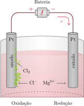

# As células galvânicas

A natureza da eletricidade era desconhecida até a segunda metade do século XVIII, quando o cientista italiano Luigi Galvani descobriu que ao tocar os músculos de animais mortos, principalmente sapos, com cilindros com cargas elétricas, eles reagiam. Ele acreditava que a eletricidade provinha dos músculos. No fim daquele século, porém, outro cientista italiano, Alessandro Volta, sugeriu que a eletricidade era gerada devido à condição de os músculos estarem entre dois metais diferentes quando tocados pelos cilindros. Ele provou que a eletricidade provinha dos metais construindo uma torre de discos de diferentes metais alternados, separados por folhas de papel embebidas com uma solução de cloreto de sódio. Esta aparelhagem, a *pilha voltaica*, foi o primeiro dispositivo de armazenamento de eletricidade, uma bateria simples.

## A estrutura das células galvânicas

Uma **célula eletroquímica** é um dispositivo em que uma corrente elétrica --- o fluxo de elétrons através de um circuito --- é produzida por uma reação química espontânea ou é usada para forçar a ocorrência de uma reação não espontânea. Uma **célula galvânica** é uma célula eletroquímica em que uma reação química espontânea é usada para gerar uma corrente elétrica. Tecnicamente, uma **bateria** é uma coleção de células galvânicas unidas em série para que a voltagem produzida --- sua capacidade de forçar uma corrente elétrica através de um circuito --- seja a soma das voltagens de cada célula.

Para ver como uma reação espontânea pode ser usada para gerar uma corrente elétrica, uma camada do metal cobre começa a se depositar entre o metal zinco e os íons cobre(II):
$$
    \ce{ Zn(s) + Cu^{2+}(aq) -> Zn^{2+} + Cu(s) }
$$
Quando um pedaço do metal zinco é colocado em uma solução de sulfato de cobre(II) em água, uma camada do metal começa a se depositar sobre a superfície do zinco. Se a reação pudesse ser observada em nível atômico, você veria que elétrons se transferem dos átomos de $\ce{Zn}$ para os íons $\ce{Cu^{2+}}$ que estão próximos na solução. Esses elétrons reduzem os íons $\ce{Cu^{2+}}$ a átomos de $\ce{Cu}$, que permanecem na superfície do zinco ou formam um depósito sólido finamente dividido no bécher. O pedaço de zinco desaparece lentamente, e a solução perde sua cor azul à medida que seus átomos doam elétrons e formam íons $\ce{Zn^{2+}}$ incolores que passam para a solução, substituindo os íons $\ce{Cu^{2+}}$ azuis.

Suponha, porém, que os reagentes estejam separados, mas que exista um caminho que permite que os elétrons passem do metal zinco para os íons cobre(II). Os elétrons podem, agora, passar da espécie que se oxida para a espécie que se reduz. Uma célula galvânica faz uso desse efeito. Ela é formada por dois **eletrodos**, ou condutores metálicos, que fazem o contato elétrico (mas estão separados por) um **eletrólito**, um meio condutor iônico dentro da célula. Em um condutor iônico, uma corrente elétrica é carregada pelo movimento dos íons. O eletrólito em geral é uma solução de um composto iônico em água. A oxidação ocorre em um eletrodo, onde a espécie que está sendo oxidada cede elétrons para o condutor metálico que então fluem para o circuito externo. A redução acontece no outro eletrodo, onde a espécie que está sendo reduzida coleta elétrons do condutor metálico ligado ao circuito externo (Figura 1). A reação química global pode ser vista como um fluxo de elétrons que são empurrados para um eletrodo devido ao processo de oxidação e são puxados do outro eletrodo devido à redução. Esse processo provoca um fluxo de elétrons no circuito externo que une os dois eletrodos, e essa corrente pode ser usada para realizar trabalho elétrico.

O eletrodo em que a oxidação ocorre é chamado de anodo. O eletrodo em que ocorre a redução é chamado de catodo. Os elétrons são liberados pela semi-reação de oxidação no anodo, passam pelo circuito externo e reentram na célula no catodo, no qual eles são usados na semi-reação de redução. Uma célula galvânica comercial tem o catodo marcado com o sinal $+$ e o anodo com o sinal $-$. 

:::warning

### Atenção

Pense no sinal $+$ como indicando o eletrodo em que os elétrons entram e se *adicionam* à célula e o sinal $-$ como representando o eletrodo em que os elétrons saem da célula.

:::

A *célula de Daniell* é um exemplo antigo de célula galvânica que usa a oxidação do
cobre pelos íons zinco, como na reação entre cobre e zinco. Ela foi inventada pelo químico britânico John Daniell em 1836, quando o avanço da telegrafia criou a necessidade urgente de uma fonte de corrente elétrica barata, confiável e estável. Daniell montou o arranjo mostrado na Figura 1, no qual os dois reagentes estão separados: o metal zinco fica imerso em uma solução de sulfato de zinco e o eletrodo de cobre, em uma solução de sulfato de cobre. Para que os elétrons passem dos átomos de $\ce{Zn}$ para os íons $\ce{Cu^{2+}}$ e permitam que a reação espontânea ocorra, eles têm de passar por um fio que serve de circuito externo e depois pelo eletrodo de $\ce{Cu}$ até a solução de cobre(II). Os íons $\ce{Cu^{2+}}$ convertem-se em átomos de $\ce{Cu}$ no catodo por meio da semi-reação de redução
$$
    \ce{ Cu^{2+}(aq) + 2 e^- -> Cu(s) }
$$
Ao mesmo tempo, os átomos de $\ce{Zn}$ se convertem em íons $\ce{Zn^{2+}}$ no anodo a partir da semi-reação de oxidação
$$
    \ce{ Zn(s) -> Zn^{2+}(aq) + 2 e^- }
$$
À medida que os íons $\ce{Cu^{2+}}$ se reduzem, a solução no catodo adquire carga negativa, e a solução no anodo começa a desenvolver carga positiva quando os íons $\ce{Zn^{2+}}$ entram na solução. Para evitar esse processo, que faria cessar rapidamente o fluxo de elétrons, as duas soluções ficam em contato por meio de uma parede porosa: os íons fornecidos pelo eletrólito movimentam-se entre os dois compartimentos e completam o circuito elétrico.

Os eletrodos da célula de Daniell são feitos com os metais envolvidos na reação. Entretanto, nem todas as reações de eletrodo envolvem diretamente um sólido condutor. Por exemplo, para usar a redução
$$
    \ce{ 2 H^+(aq) + 2 e^- -> H2(aq) }
$$
em um eletrodo, é necessário usar um condutor metálico quimicamente inerte, como um metal não reativo ou a grafita, para fornecer ou remover os elétrons do compartimento do eletrodo. A platina é costumeiramente usada para o eletrodo, e o gás hidrogênio é borbulhado sobre o metal imerso em uma solução que contém íons hidrogênio. Este arranjo é conhecido como eletrodo de hidrogênio. O compartimento com o metal condutor e a solução de eletrólito é comumente chamado de *o eletrodo* ou, mais formalmente, de **semi-célula**.

> Em uma célula galvânica, uma reação química espontânea retira elétrons da célula através do catodo, o sítio de redução, e os libera no anodo, o sítio de oxidação.

## O potencial de célula e energia livre de reação

Uma reação com muito poder de empurrar e puxar elétrons gera um alto potencial de célula (coloquialmente, uma *voltagem alta*). Uma reação com pequeno poder de empurrar e puxar elétrons só gera um pequeno potencial (uma *voltagem baixa*). Uma bateria descarregada é uma célula em que a reação atingiu o equilíbrio, perdeu o poder de mover elétrons e tem potencial igual a zero. 

:::info

### Unidades

A unidade SI de carga elétrica é o **coulomb**. Um coulomb é a carga liberada por uma corrente de um ampère, $\pu{1 A}$, fluindo durante um segundo: $\pu{1 C} = \pu{1 A.s}$. A unidade SI de potencial é o **volt**, $\pu{V}$. Um volt é definido de forma que uma carga igual a um coulomb, $\pu{1 C}$, atravessando uma diferença de potencial igual a um volt, $\pu{1 V}$, libere um joule, $\pu{1 J}$, de energia: $\pu{1 C.V} = \pu{1 J}$.

:::

Para expressar a capacidade de uma célula de gerar uma diferença de potencial quantitativamente, é interessante lembrar de dois fatores. O primeiro é que o potencial elétrico é análogo ao potencial gravitacional. O trabalho máximo que um peso que cai pode realizar é igual a sua massa vezes a diferença de potencial gravitacional. Do mesmo modo, o trabalho máximo que um elétron pode realizar é igual a sua carga vezes a diferença de potencial elétrico que ele experimenta. Portanto, o trabalho que pode ser realizado por um elétron enquanto migra entre eletrodos permite estimar a diferença de potencial entre eles. O segundo é que o trabalho elétrico é um tipo de trabalho de não expansão, porque ele envolve a movimentação de elétrons sem variação do volume do sistema. Como vimos no Tópico 2C, em temperatura e pressão constantes, o trabalho máximo de não expansão que um sistema pode executar é igual à energia livre de Gibbs. Logo, isso permitiria relacionar a diferença de potencial causada por uma reação (uma propriedade elétrica) à energia livre de Gibbs (uma propriedade termodinâmica).

:::derivation

### Como isso é feito?

A variação de energia livre de Gibbs é o trabalho máximo de não expansão que uma reação pode realizar em pressão e temperatura constantes (Tópico 2C):
$$
   \Delta G 
      = - W_\text{max, não exp.} \quad (T, P\; \text{constantes})
\tag{8}
$$
O trabalho realizado quando uma quantidade $n$ de elétrons (em mols) atravessa uma diferença de potencial é sua carga total vezes a diferença de potencial. A carga de um elétron é $-e$. A carga por mol de elétrons é $-eN_\mathrm{A}$, em que $N_\mathrm{A}$ é a constante de Avogadro. Logo, a carga total é $-neN_\mathrm{A}$ e o trabalho realizado é
$$
    W_\text{não exp.} = (-neN_\mathrm{A}) \times E_\text{célula}
$$
O potencial da célula, $E_\text{célula}$, é a diferença de potencial associada.  Essa expressão normalmente é escrita em termos da constante de Faraday, $F$, a magnitude da carga por mol de elétrons (o produto da carga elementar e pela constante de Avogadro $N_\mathrm{A}$):
$$
    F = eN_\mathrm{A} = (\pu{1,6e-19 C}) \times (\pu{6e23 C})
        = \pu{96500 C}
$$
Logo
$$
    W_\text{max, não exp.} =  - nF E_\text{célula}
$$
em que $n$ é a quantidade de elétrons sendo transferidos. Desde que a célula opere reversivelmente (como explicado no Tópico 2C, em um processo reversível a força que age sobre o sistema é balanceada por uma força igual e contrária), ela produz uma diferença de potencial e a quantidade de trabalho máximo, $W_\text{não exp.}$. Neste caso, portanto,
$$
    \Delta G = - nF E_\mathrm{célula}
$$

:::

O **potencial da célula**, $E_\text{célula}$, é a diferença de potencial associada com uma célula galvânica em operação reversível. Em notação molar,
$$
    \Delta G_\mathrm{r} = - n_\mathrm{r} F E_\text{célula}
\tag{1}
$$
Uma célula opera no modo reversível quando seu poder de empurrar elétrons de uma célula é balanceado por uma fonte externa de potencial. Na prática, isso significa usar um voltímetro com resistência suficientemente alta para que a diferença de potencial seja medida sem retirar corrente. Uma célula de trabalho, isto é, uma célula que produz, de fato, corrente, como a bateria de um gravador de discos compactos, produzirá um potencial menor do que o previsto por essa expressão.

A Equação 1 relaciona as informações termodinâmicas às informações eletroquímicas desenvolvidas neste tópico. As unidades de $\Delta G_\mathrm{r}$ são joules (ou quilojoules) por mol, com um valor que depende de $E_\text{célula}$ também da quantidade $n_\mathrm{r}$ dos elétrons transferidos na reação. Assim, na reação
$$
    \ce{ Zn(s) + Cu^{2+}(aq) -> Zn^{2+} + Cu(s) }
$$
$n_\mathrm{r} = 2$. 

A diferença de potencial produzida em uma célula galvânica reversível, $E_\text{célula}$, é um critério experimental de espontaneidade da reação que ocorre em seu interior. Se a diferença de potencial for positiva, a energia livre de Gibbs na composição da célula naquele momento (como dada pela concentração de reagentes e produtos no eletrólito) será negativa, e a reação da célula terá uma tendência espontânea de formar produtos. Se a diferença de potencial for negativa, a reação inversa da célula será espontânea, e a reação da célula terá a tendência espontânea de formar reagentes.

:::example

### Cálculo da energia livre de uma reação a partir do potencial de célula

A diferença de potencial gerada célula *nicad* (níquel-cádmio), onde ocorre a reação
$$
    \ce{ Cd(s) + 2 Ni(OH)3(s) -> Cd(OH)2(s) + 2 Ni(OH)2(s) }
$$
é $\pu{+1,25 V}$ para uma determinada composição.

**Calcule** a energia de Gibbs de reação nessas condições.

#### Determine a quantidade de elétrons transferidos na reação.

Na reação que ocorre na célula, dois elétrons são transferidos do cádmio para o níquel. Assim, $n_\mathrm{r} = 2$.

#### Calcule a energia livre de reação.

De $\Delta G_\mathrm{r} = - n_\mathrm{r} F E_\text{célula}$
$$
\begin{aligned}
    \Delta G_\mathrm{r} 
        &= - 2 \times (\pu{96500 C//mol}) \times (\pu{+1,25 V}) \\
        &= \boxed{ \pu{-240 kJ.mol-1} }
\end{aligned}
$$

:::

O **potencial de célula padrão**, $E_\text{célula}^\circ$, é definido pela expressão
$$
    \Delta G^\circ_\mathrm{r} = - n_\mathrm{r} F E_\text{célula}^\circ
\tag{2}
$$
em que $\Delta G^\circ_\mathrm{r}$, a energia livre de Gibbs da reação (Tópico 2C), é definida como a diferença entre as energias molares de Gibbs dos produtos e dos reagentes em seus estados padrão. Conforme explicado naquele tópico, as condições padrão são:

- Todos os gases em $\pu{1 bar}$
- Todos os solutos participantes em $\pu{1 mol.L-1}$
- Todos os líquidos e sólidos são puros

Mais precisamente, todos os solutos devem ter atividade igual a um, não concentração molar igual a um. As atividades diferem apreciavelmente das molaridades em soluções de eletrólitos porque os íons interagem a distâncias maiores. Entretanto, essa complicação não é considerada neste ponto. Em alguns casos, é possível construir uma célula que gera o seu potencial padrão. Uma célula de Daniell na qual a semi-célula do cobre é composta por $\pu{1 mol.L-1}$ de $\ce{CuSO4}$ e um eletrodo de cobre puro e a semi-célula de zinco é composta por $\ce{1 mol.L-1}$ de $\ce{ZnSO4}$ e um eletrodo de zinco puro gera o seu potencial padrão. Contudo, na maioria dos casos, a célula não pode ser construída com os reagentes e produtos separados tão claramente e, de modo geral, é melhor considerar $E_\text{célula}^\circ$ como o valor de $\Delta G_\mathrm{r}$ expresso como diferença de potencial em volts a partir da Equação 2 na forma $E_\text{célula}^\circ = - \Delta G_\mathrm{r}^\circ/nF$.

É importante entender a diferença entre $\Delta G^\circ_\mathrm{r}$ e $\Delta G_\mathrm{r}$ (e, portanto, entre $E^\circ_\text{célula}$ e $E_\text{célula}$). A primeira é a diferença entre as energias livres de Gibbs (adequadamente ponderadas usando-se os coeficientes estequiométricos) dos produtos e dos reagentes em seus estados padrão. A segunda é a diferença (também ponderada do modo correto) entre as energias livres de Gibbs dos produtos e dos reagentes em um estágio intermediário da reação, quando estão cercados de moléculas que refletem a composição da mistura naquele momento. Logo, enquanto $\Delta G^\circ_\mathrm{r}$ tem valor fixo, característico da reação, $\Delta G_\mathrm{r}$ varia com o avanço dela. De modo análogo, $E_\text{célula}^\circ$ tem valor fixo característico de uma reação, ao passo que $E_\text{célula}$ varia com seu avanço.

Quando uma equação química de uma reação é multiplicada por um fator, $\Delta G_\mathrm{r}$ (e $\Delta G^\circ_\mathrm{r}$) aumentam de acordo com esse fator, mas $E_\text{célula}$ (e $E_\text{célula}^\circ$) permanecem inalterados. Para entender por que é assim, observe que, quando todos os coeficientes estequiométricos são multiplicados por $2$, o valor de $\Delta G_\mathrm{r}$ dobra. Entretanto, ao multiplicar todos os coeficientes por $2$, também dobramos o valor de $n_\mathrm{r}$, logo $E_\text{célula} = - \Delta G_\mathrm{r}/nF$ permanece constante. Em outras palavras, embora a energia livre de Gibbs da reação (e seu valor padrão) mude quando a equação química é multiplicada por um fator, $E_\text{célula}$ (e $E_\text{célula}^\circ$) não se altera:
$$
\begin{aligned}
    \ce{ Zn(s) + Cu^{2+}(aq) &-> Zn^{2+}(aq) + Cu(s) } && \pu{+1,1 V} \\
    \ce{ 2 Zn(s) + 2 Cu^{2+}(aq) &-> 2 Zn^{2+}(aq) + 2 Cu(s) } && \pu{+1,1 V}
\end{aligned}
$$
Uma consequência prática dessa conclusão é que o potencial de célula é independente do tamanho da célula. Para obter um potencial superior ao previsto pela Equação 1, você precisa construir uma bateria ligando as células em série. O potencial é, então, a soma dos potenciais das células isoladas.

> O potencial de célula e a energia livre de Gibbs de reação estão relacionados pela Equação 1 e seus valores padrão pela Equação 2. A magnitude do potencial de célula não depende de como a equação química é escrita.

## A notação das células

Os químicos usam uma notação especial para especificar a estrutura dos compartimentos dos eletrodos de células galvânicas. Os dois eletrodos na célula de Daniell, por exemplo, são descritos como $\ce{Zn(s)|Zn^{2+}(aq)}$ e $\ce{Cu^{2+}(aq)|Cu(s)}$. Cada linha vertical representa uma interface entre as fases, neste caso, entre o metal sólido e os íons em solução na ordem $\ce{reagente|produto}$.

Descrevemos simbolicamente a estrutura de uma célula com o auxílio de um **diagrama de célula**, a partir das convenções da IUPAC, usadas por cientistas de todo o mundo. O diagrama da célula de Daniell, por exemplo, é
$$
    \ce{ Zn(s) | Zn^{2+}(aq) | Cu^{2+}(aq) | Cu(s) }
$$
Na célula de Daniell, as soluções de sulfato de zinco e de sulfato de cobre(II) se encontram dentro da barreira porosa para completar o circuito. Entretanto, quando íons diferentes se misturam, eles podem afetar o potencial da célula. Para impedir a mistura das soluções, os químicos usam uma *ponte salina* para unir os dois compartimentos de eletrodo e completar o circuito elétrico. Uma **ponte salina** típica é um gel, colocado em um tubo em U invertido, que contém uma solução salina concentrada em água (Figura 2).

A ponte permite o fluxo de íons e completa o circuito elétrico, mas os íons são escolhidos de forma a não afetar a reação da célula (usa-se frequentemente $\ce{KCl}$). Em um diagrama de célula, a ponte salina é indicada por duas barras verticais ($||$), e o arranjo da Figura 2 é escrito como
$$
    \ce{ Zn(s) | Zn^{2+}(aq) || Cu^{2+}(aq) | Cu(s) }
$$

:::think

### Ponto para pensar

Existem sais que você, definitivamente, não usaria em uma ponte salina?

:::

No diagrama da célula, qualquer componente metálico inerte de um eletrodo é escrito como o componente mais externo daquele eletrodo. Por exemplo, um eletrodo de hidrogênio construído com platina é descrito como $\ce{H^+(aq)|H2(g)|Pt(s)}$ quando ele está à direita e como $\ce{Pt(s)|H2(g)|H^+(aq)}$ quando está à esquerda. Um eletrodo formado por um fio de platina mergulhado em uma solução contendo íons ferro(II) e ferro(III) é descrito como $\ce{Fe^{3+}(aq), Fe^{2+}(aq)|Pt(s)}$ ou $\ce{Pt(s)|Fe^{2+}(aq), Fe^{3+}(aq)}$. Nesse caso, as espécies oxidada e reduzida estão na mesma fase e usa-se uma vírgula, e não uma linha, para separá-las. Pares de íons em solução são normalmente escritos na ordem $\ce{Ox,Red}$.

O potencial de célula é medido com um voltímetro eletrônico. O catodo (o sítio de redução) é determinando identificando-se qual é o terminal positivo da célula. Se o catodo for o eletrodo à direita no diagrama da célula, então, por convenção, o potencial de célula será registrado como positivo, como em,
$$
    \ce{ Zn(s) | Zn^{2+}(aq) || Cu^{2+}(aq) | Cu(s) } \quad E_\text{célula} = \pu{+1,1 V}
$$
Neste caso, pode-se imaginar que os elétrons tendem a atravessar o circuito da esquerda da célula, como escrita (o anodo), para a direita (o catodo). Contudo, se o catodo for o eletrodo à esquerda no diagrama da célula, então o potencial de célula será registrado como negativo, como em
$$
    \ce{ Cu^{2+}(aq) | Cu(s) || Zn^{2+}(aq) | Zn(s) } \quad E_\text{célula} = \pu{-1,1 V}
$$

Em resumo, o sinal do potencial de célula registrado de acordo com o diagrama da célula é igual ao do eletrodo que está à direita no diagrama:

- Um potencial de célula positivo indica que o eletrodo à direita no diagrama é o catodo (o sítio de redução, onde os elétrons entram na célula).
- Um potencial de célula negativo indica que o eletrodo à direita no diagrama da célula é o
anodo (o sítio de oxidação, de onde os elétrons deixam a célula).

Um determinado diagrama de célula corresponde a uma forma específica da reação da célula correspondente. Somente para escrever a reação da célula que corresponde a um determinado diagrama de célula, o eletrodo que está à direita no diagrama é tomado como sendo o sítio de redução (o catodo) e que o eletrodo que está à esquerda, o sítio de oxidação (o anodo). As duas meias-reações são então escritas como uma redução e uma oxidação, respectivamente. Assim, para uma célula escrita como
$$
    \ce{ Zn(s) | Zn^{2+}(aq) || Cu^{2+}(aq) | Cu(s) }
$$
e em dada composição
$$
\begin{aligned}
    \text{Oxidação:} && \ce{ Zn(s) &-> Zn^{2+}(aq) + 2 e^- } \\
    \text{Redução:}  && \ce{ Cu^{2+}(aq) + 2 e^- &-> Cu(s) } \\[1ex] 
    \hline \\[-2ex]
    \text{Global:} && \ce{ Zn(s) + Cu^{2+}(aq) &-> Zn^{2+}(aq) + Cu(s) }
\end{aligned}
$$
Como $E_\text{célula} > 0$ e, portanto, $\Delta G_\mathrm{r} < 0$ para essa reação, a reação da célula, como escrita, é espontânea quando os eletrólitos têm aquela composição particular. Contudo, se o diagrama da célula for escrito como
$$
    \ce{ Cu^{2+}(aq) | Cu(s) || Zn^{2+}(aq) | Zn(s) }
$$
e a composição é idêntica à anterior,
$$
\begin{aligned}
    \text{Redução:}  && \ce{ Cu^{2+}(aq) + 2 e^- &-> Cu(s) } \\
    \text{Oxidação:} && \ce{ Zn(s) &-> Zn^{2+}(aq) + 2 e^- } \\[1ex] 
    \hline \\[-2ex]
    \text{Global:} && \ce{ Cu(s) + Zn^{2+}(aq) &-> Cu^{2+}(aq) + Zn(s) }
\end{aligned}
$$
Como $E_\text{célula} > 0$ e, portanto, $\Delta G_\mathrm{r} > 0$, o inverso da reação da célula, como escrita, é espontâneo nessas condições.

Um ponto importante precisa ser esclarecido, embora possa parecer surpreendente: a reação da célula não precisa ser uma reação redox. A única condição necessária é que a reação possa ser escrita como uma combinação de meias-reações de redução que ocorrem nos dois eletrodos. Por exemplo, a reação de célula para
$$
    \ce{ Pt | H2(g, $P_\mathrm{E}$) | HCl(aq) | H2(g, $P_\mathrm{D}$) | Pt }
$$
é simplesmente
$$
    \ce{ H2(g, $P_\mathrm{E}$) -> H2(g, $P_\mathrm{D}$) }
$$
a qual corresponde à expansão espontânea do gás (desde que $P_\mathrm{E} > P_\mathrm{D}$). A semi-reação de redução em cada eletrodo é
$$
    \ce{ 2 H^+(aq) + 2 e^- -> H2(g) }
$$
A reação de célula pode também ser uma reação de precipitação. Por exemplo, para a célula
$$
    \ce{ Ag(s) | AgCl(s) || Ag^+(aq) | Ag(s) }
$$
as reações são
$$
\begin{aligned}
    \text{Redução:}  && \ce{ Ag^+(aq) + e^- &-> Ag(s) } \\
    \text{Oxidação:} && \ce{ Ag(s) + Cl^-(aq) &-> AgCl(s) + e^- } \\[1ex] 
    \hline \\[-2ex]
    \text{Global:} && \ce{ Ag^+(aq) + Cl^-(aq) &-> AgCl(s) }
\end{aligned}
$$
e corresponde à precipitação do cloreto de prata.

> Descreve‑se um eletrodo representando‑se as interfaces entre as fases por uma linha vertical. Um diagrama de célula mostra o arranjo físico das espécies e interfaces, com a ponte salina sendo indicada por uma linha dupla vertical. O sinal do potencial de célula é igual ao do eletrodo que está à direita no diagrama de célula. O sinal positivo do potencial de célula indica que a reação, como está escrita, é espontânea nas condições dadas.

# A eletrólise

As reações redox que têm energia livre de Gibbs de reação positiva não são espontâneas, mas a corrente elétrica pode ser usada para direcioná-la no sentido direto. Por exemplo, o flúor não pode ser isolado mediante reações químicas comuns. Ele não foi isolado até 1886, quando o químico francês Henri Moissan encontrou um procedimento para formar o flúor ao passar uma corrente elétrica por uma mistura anidra fundida de fluoreto de potássio e fluoreto de hidrogênio. Ainda hoje, o flúor é preparado comercialmente por esse processo.

## As células eletrolíticas

A **célula eletrolítica** é a célula eletroquímica na qual ocorre a eletrólise. O arranjo dos componentes das células eletrolíticas é diferente do arranjo da célula galvânica. Em geral, os dois eletrodos ficam no mesmo compartimento, só existe um tipo de eletrólito e as concentrações e pressões estão longe das condições padrão. Como em toda célula eletroquímica, os íons presentes transportam a corrente pelo eletrólito. Por exemplo, quando o metal cobre é refinado eletroliticamente, o anodo é cobre impuro, o catodo é cobre puro e o eletrólito é $\ce{CuSO4}$. Quando íons $\ce{Cu^{2+}}$ migram para o catodo, eles são reduzidos e se depositam na forma de átomos de cobre. Outros íons $\ce{Cu^{2+}}$ são produzidos por oxidação do metal cobre no anodo.

:::think

Que impurezas dos metais não podem ser removidas do cobre durante o refino por eletrólise?

:::

A Figura 3 mostra o esquema de uma célula eletrolítica usada comercialmente na produção do metal magnésio a partir do cloreto de magnésio fundido (o processo Dow). Como em uma célula galvânica, a oxidação ocorre no anodo e a redução ocorre no catodo. Os elétrons completam o circuito deslocando-se por um cabo externo. Do anodo para o catodo, os cátions movem-se através do eletrólito na direção do catodo e, os ânions, na direção do anodo. Diferentemente de uma célula galvânica, entretanto, na qual a corrente é gerada de forma espontânea, em uma célula eletrolítica ela precisa ser fornecida por uma fonte de energia elétrica externa para que a reação ocorra. O resultado é forçar a oxidação em um eletrodo e a redução no outro. As seguintes meias-reações ocorrem no processo Dow:
$$
\begin{aligned}
    \text{Redução no catodo:}  && \ce{ Mg^{+2}(fund) + 2 e^- &-> Mg(l) } \\
    \text{Oxidação no anodo:} && \ce{ 2 Cl^-(fund) &-> Cl2(g) + 2 e^- }
\end{aligned}
$$
em que $\ce{fund}$ representa o sal fundido que atua como eletrólito. Uma bateria recarregável funciona como célula galvânica quando está realizando trabalho e como célula eletrolítica quando está sendo recarregada.

Para forçar uma reação em um sentido não espontâneo, a fonte externa deve gerar uma diferença de potencial maior do que a diferença de potencial que seria produzida pela reaçãoinversa. Por exemplo, como
$$
    \ce{ 2 H2(g) + O2(g) -> 2 H2O(l) } \quad E_\text{célula} = \pu{+1,23 V}
$$
para atingir a reação reversa não espontânea,
$$
    \ce{ 2 H2O(l) -> 2 H2(g) + O2(g) } \quad E_\text{célula} = \pu{-1,23 V}
$$
em condições padrão (exceto pela concentração de $\ce{H^+}$, que é $\pu{1e-7 mol.L-1}$ em água pura em $\pu{298 K}$) no mínimo $\pu{1,23 V}$ precisa ser disponibilizado pela fonte externa para superar o *poder de empurrar*, natural da reação, na direção oposta. Na prática, a diferença de potencial aplicada tem de ser significativamente superior à do potencial de célula, para inverter a reação espontânea e obter uma velocidade significativa de formação de produto. A diferença de potencial adicional, que varia de acordo com o tipo de eletrodo, é chamada de **sobrepotencial**. No caso dos eletrodos de platina, o sobrepotencial necessário para a produção de hidrogênio e oxigênio a partir da água é cerca de $\pu{0,6 V}$. Logo, é preciso empregar cerca de $\pu{1,8 V}$ ($\pu{0,6 V} + \pu{1,23 V}$) na eletrólise da água se os eletrodos usados forem de platina. O hidrogênio é uma fonte de energia limpa, e muitas pesquisas contemporâneas em células eletroquímicas buscam reduzir o sobrepotencial e, assim, aumentar a eficiência de processos eletrolíticos como a produção de hidrogênio.

> O potencial fornecido a uma célula eletrolítica deve ser no mínimo igual ao potencial da reação a ser invertida. Se existe na solução mais de uma espécie que pode ser reduzida, as espécies com os maiores potenciais de redução são, preferencialmente, reduzidas. O mesmo princípio é aplicado à oxidação.

## Os produtos da eletrólise

O cobre, por exemplo, é refinado eletroliticamente usando-se uma forma do metal impuro, conhecida como cobre vesiculado, como o anodo de uma célula eletrolítica. A corrente fornecida força a oxidação do cobre vesiculado a íons cobre(II), $\ce{Cu^{2+}}$, que são reduzidos no catodo ao metal puro na reação:
$$
    \ce{ Cu^{2+}(aq) + 2 e^- -> Cu(s) }
$$
Para calcular a quantidade de $\ce{Cu}$ produzida por determinada quantidade de elétrons, escreva a relação estequiométrica dessa semirreação:
$$
    \dfrac{n_{\ce{e^-}}}{2} =  \dfrac{n_\ce{Cu}}{1}
$$ 
e, então, converta a quantidade de elétrons em quantidade de átomos de $\ce{Cu}$. Por exemplo, se $\pu{4,0 mol}\, \ce{e^-}$ tivessem sido fornecidos, seriam formados $\pu{2,0 mol}$ de $\ce{Cu}$.

A quantidade de carga, $Q$, que passa pela célula eletrolítica é medida em coulombs. Ela é determinada pela medida da corrente, $I$, e do tempo, $t$, em que a corrente flui, e é calculada por
$$
    Q = It
$$
Para determinar a quantidade de elétrons fornecida por uma determinada carga, usamos a
constante de Faraday, $F$, a quantidade de carga por mol de elétrons, como fator de conversão. Como a carga fornecida é $Q = n_{\ce{e^-}} F$, segue-se que
$$
    n_{\ce{e^-}} = \dfrac{Q}{F} = \dfrac{It}{F}
$$
Assim, se a corrente e o tempo de aplicação são conhecidos, é possível determinar a quantidade de elétrons fornecidos. A razão molar da reação do eletrodo pode então ser usada para converter a quantidade de elétrons fornecida em quantidade de produto.

:::example

### Cálculo da quantidade de produto formado na eletrólise

Alumínio é produzido por eletrólise a partir de seu óxido dissolvido em criolita fundida. A célula opera continuamente com $\pu{1e5 A}$.

**Calcule** a massa de alumínio que pode ser produzida em um dia.

#### Escreva a semirreação de redução do alumínio.

$$
    \ce{ Al^{3+}(fund) + 3 e^- -> Al(l) }
$$

#### Calcule o número de elétrons fornecidos.

De $n_{\ce{e^-}} = It/F$
$$
    n_{\ce{e^-}} 
        = \dfrac{ (\pu{1e5 A}) \times (24 \times \pu{3600 s}) }{ \pu{96500 C//mol} }
        = \pu{ 90 kmol }
$$

#### Use a relação estequiométrica para converter a quantidade de $\ce{e^-}$ na quantidade de $\ce{Al}$.

$$
    n_{\ce{Al}}
        = \pu{90 kmol} \times \dfrac{ 1 }{ 3 }
        = \pu{30 mol}
$$

#### Converta a quantidade de $\ce{Al}$ em massa usando a massa molar.

De $m = nM$
$$
    m_{\ce{Al}}
        = \pu{30 kmol} \times \pu{27 g//mol}
        = \boxed{ \pu{810 kg} }
$$

:::

> A quantidade de produto em uma reação de eletrólise é calculada pela estequiometria da meia‑reação, pela corrente e pelo tempo que ela flui.

## As aplicações da eletrólise

O refino do cobre e a extração eletrolítica de alumínio, magnésio e flúor já foram descritos. Outra aplicação importante da eletrólise é a produção do metal sódio pelo processo de Downs, a eletrólise do sal-gema fundido:
$$
\begin{aligned}
    \text{Redução no catodo:}  && \ce{ 2 Na^+(aq) + 2 e^- &-> 2 Na(fund) } \\
    \text{Oxidação no anodo:} && \ce{ 2 Cl^-(fund) &-> Cl2(g) + 2 e^- }
\end{aligned}
$$
O cloreto de sódio é abundante na forma de sal-gema, mas o sólido não conduz eletricidade porque os íons estão presos em suas posições. Os eletrodos da célula são feitos de um material inerte como o carbono; a célula é projetada para armazenar, sem contato, o sódio e o cloro produzidos na eletrólise e, também, para que não haja contato com o ar. Em uma modificação do processo de Downs, o eletrólito é uma solução de cloreto de sódio em água. Os produtos desse processo cloro-álcali são cloro e hidróxido de sódio em água.

:::think

### Ponto para pensar

No processo de Downs, adiciona-se $\ce{CaCl2}$ ao $\ce{NaCl}$ para reduzir seu ponto de fusão. Por que, então, não se forma o metal cálcio no catodo?

:::

A **eletrodeposição** é a deposição eletrolítica de um filme fino de metal sobre um objeto. O objeto a ser recoberto (metal ou plástico coberto por grafita) é o catodo, e o eletrólito é uma solução, em água, de um sal do metal a ser depositado. O metal é depositado no catodo pela redução dos íons da solução de eletrólito. Esses cátions são fornecidos pelo sal adicionado ou pela oxidação do anodo, feito do metal de deposição.

> A eletrólise é usada industrialmente para extrair metais de seus sais, para preparar o cloro, o flúor e o hidróxido de sódio e para refinar o cobre. Ela é também usada na eletrodeposição.
