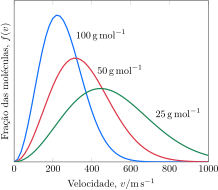
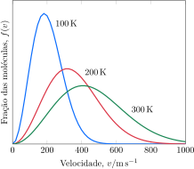
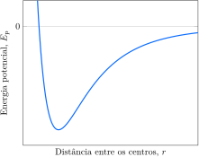

# As misturas de gases

Muitos dos gases que conhecemos no dia a dia, e nos laboratórios de química, são misturas. A atmosfera, por exemplo, é uma mistura de nitrogênio, oxigênio, argônio, dióxido de carbono e muitos outros gases (Tabela 1).  Muitos anestésicos gasosos são misturas cuidadosamente controladas. A descrição de um gás ideal precisa ser estendida para as misturas de gases.

## A pressão parcial

Em pressões baixas, todos os gases respondem da mesma maneira a mudanças de pressão, volume e temperatura. Por isso, nos cálculos  comuns sobre as propriedades físicas dos gases, não é essencial que todas as moléculas de uma amostra sejam iguais. *Uma mistura de gases que não reagem entre si comporta-se como um único gás puro.*

John Dalton foi o primeiro a mostrar como calcular a pressão de uma mistura de gases. Para entender seu raciocínio, imagine determinada quantidade de oxigênio em um recipiente na pressão de $\pu{0,6 atm}$. O oxigênio é, então, evacuado. Depois disso, uma quantidade de gás nitrogênio suficiente para chegar à pressão de $\pu{0,4 atm}$ é introduzida no recipiente, na mesma temperatura. Dalton queria saber qual seria a pressão total se as mesmas quantidades dos dois gases estivessem simultaneamente no recipiente. Ele fez algumas medidas pouco precisas e concluiu que a pressão total exercida pelos dois gases no mesmo recipiente era $\pu{1,0 atm}$, a soma das pressões individuais.

Dalton descreveu suas observações em termos do que chamou de **pressão parcial** de cada gás, isto é, a pressão que o gás exerceria se somente ele ocupasse o recipiente. Em nosso exemplo, as pressões parciais de oxigênio e nitrogênio na mistura são $\pu{0,6 atm}$ e $\pu{0,4 atm}$, respectivamente, porque essas são as pressões que os gases exercem quando cada um está sozinho no recipiente. Dalton resumiu suas observações na **lei das pressões parciais**: A pressão total de uma mistura de gases é a soma das  pressões parciais de seus componentes.

:::displaytable

#### Composição do ar seco ao nível do mar

| **Constituinte** | $x_{\ce{J}}$ | $P_{\ce{J}}/\pu{atm}$ |
| :--------------- | -----------: | --------------------: |
| $\ce{N2}$        |  $\pu{78}\%$ |           $\pu{0,78}$ |
| $\ce{O2}$        |  $\pu{21}\%$ |           $\pu{0,21}$ |
| $\ce{Ar}$        |   $\pu{1}\%$ |           $\pu{0,01}$ |

:::

Se escrevemos as pressões parciais dos gases $\ce{A}, \ce{B}, \ldots$ como $P_{\ce{A}}, P_{\ce{B}}, \ldots$ e a pressão total da mistura como $P$, então a lei de Dalton pode ser escrita como:
$$
    P = P_{\ce{A}} + P_{\ce{B}} + \ldots
\tag{1}
$$
A lei das pressões parciais só é exata para gases de comportamento ideal, mas é uma boa aproximação para quase todos os gases em condições normais.

A pressão total de um gás é o resultado do choque das moléculas contra as paredes do recipiente. Os choques ocorrem com todas as moléculas da mistura. As moléculas do gás $\ce{A}$ colidem com as paredes, assim como as do gás $\ce{B}$. Mas se essas colisões são independentes umas das outras, então a pressão resultante final é a soma das pressões individuais, como diz a lei de Dalton.

As pressões parciais servem para descrever a composição de um gás úmido. Por exemplo, a pressão parcial do ar úmido em seus pulmões é:
$$
    P = P_\text{ar seco} + P_{\ce{H2O}}
$$
Em um recipiente fechado, que é uma boa aproximação para um pulmão, a água se vaporiza até que sua pressão parcial alcance certo valor, chamado de pressão de vapor. A pressão parcial da água na temperatura normal do corpo é $\pu{47 Torr}$. Portanto, a pressão parcial do ar em seus pulmões é:
$$
    P_\text{ar seco} = P - P_{\ce{H2O}} = P - \pu{47 Torr}
$$
Em um dia típico, a pressão total ao nível do mar é $\pu{760 Torr}$. Logo, a pressão nos seus pulmões devida a todos os gases, exceto o vapor de água, é $\pu{760 Torr} - \pu{47 Torr} = \pu{713 Torr}$.

:::example

### Cálculo da pressão de gás coletado sobre água

O gás óxido nitroso, $\ce{N2O}$, gerado na decomposição térmica do nitrato de amônio, foi coletado sobre água.
$$
    \ce{ NH4NO3(g) -> N2O(g) + 2 H2O(l) }
$$
O gás úmido ocupou $\pu{126 mL}$ em $\pu{21 \degree C}$, quando a pressão era $\pu{755 Torr}$.

A pressão de vapor da água é $\pu{19 Torr}$ em $\pu{21 \degree C}$.

a. **Calcule** a pressão parcial do $\ce{N2O}$ coletado.
b. **Calcule** o volume que a mesma quantidade de óxido nitroso *seco* ocuparia se ele fosse coletado sob $\pu{755 Torr}$ e $\pu{21 \degree C}$.

#### Calcule a pressão parcial do $\ce{N2O}$.

De $P = P_{\ce{N2O}} + P_{\ce{H2O}}$
$$
    P_{\ce{N2O}} 
        = \pu{755 Torr} - \pu{19 Torr} = \boxed{ \pu{736 Torr} }
$$

#### Use a lei dos gases ideais.

A mesma quantidade de gás seco é coletada sob e mesma temperatura. 

De $PV = nRT$, para os mesmos $T$ e $n$
$$
    P_\text{úmido} V_\text{úmido} 
        = P_\text{seco} V_\text{seco}
$$
logo,
$$
    V_\text{seco} 
        = \dfrac{ (\pu{736 Torr}) \times (\pu{126 mL}) }{ (\pu{755 Torr}) }
        = \boxed{ \pu{123 mL} }
$$

:::

:::think

### Ponto para pensar

O ar úmido é mais denso ou menos denso do que o ar seco nas mesmas condições?

:::

Um modo útil de expressar a relação entre a pressão total de uma mistura e as pressões parciais de seus componentes é usar a **fração molar**, $x$, de cada componente $\ce{A}, \ce{B}, \ldots$, isto é, a fração do número total de mols de moléculas da amostra. Se a quantidade total de moléculas de gás presentes é $n$ e a quantidade de moléculas de cada gás $\ce{A}$, $\ce{B}$, etc. presente é $n_{\ce{A}}$, $n_{\ce{A}}$, e assim sucessivamente, a fração molar é:
$$
    x_{\ce{A}} = \dfrac{ n_{\ce{A}} }{ n } = \dfrac{ n_{\ce{A}} }{ n_{\ce{A}} + n_{\ce{B}} + \ldots }
$$
O mesmo acontece com as frações molares dos demais componentes. Em uma mistura binária (dois componentes) dos gases $\ce{A}$ e $\ce{B}$,
$$
    x_{\ce{A}} + x_{\ce{B}} = \dfrac{ n_{\ce{A}} }{ n_{\ce{A}} + n_{\ce{B}} } + \dfrac{ n_{\ce{B}} }{ n_{\ce{A}} + n_{\ce{B}} } = \dfrac{ n_{\ce{A}} + n_{\ce{B}} }{ n_{\ce{A}} + n_{\ce{B}} } = 1
$$
Quando $x_{\ce{A}} = 1$, a mistura é de $\ce{A}$ puro e, quando $x_{\ce{B}} = 1$, de $\ce{B}$ puro. Quando $x_{\ce{A}} = x_{\ce{B}} = \pu{0,5}$, metade das moléculas é do gás $\ce{A}$ e metade do gás $\ce{A}$. Estas definições e a lei dos gases ideais podem ser usadas para expressar a pressão parcial de um gás em termos de sua fração molar em uma mistura.

:::derivation

### Como isso é feito?

Para expressar a relação entre a pressão parcial de um gás $\ce{A}$ em uma mistura e sua fração molar, utilize a lei dos gases ideais para expressar a pressão parcial, $P_{\ce{A}}$, do gás em termos da quantidade de moléculas de $\ce{A}$ presentes, $n_{\ce{A}}$, do volume, $V$, ocupado pela mistura e da temperatura, $T$:
$$
    P_{\ce{A}} = \dfrac{ n_{\ce{A}} RT }{ V }
$$
Como $n_{\ce{A}} = n x_{\ce{A}}$ (em que $n$ é a quantidade total de todos os gases) e $P = nRT/V$,
$$
    P_{\ce{A}} = \dfrac{ n_{\ce{A}} RT }{ V } = x_{\ce{A}} \dfrac{ nRT }{ V } = x_{\ce{A}} P
$$

:::

O resultado é
$$
    P_{\ce{A}} = x_{\ce{A}} P
\tag{2}
$$
em que $P$ é a pressão total e $x_{\ce{A}}$ é a fração molar de $\ce{A}$ na mistura.

Um fator importante mas sutil é que, enquanto Dalton definiu pressão parcial como a pressão que um gás exerceria sozinho no interior de um recipiente, a abordagem moderna consiste em usar a equação $P_{\ce{A}} = x_{\ce{A}} P$ como definição da pressão parcial de *gases ideais e reais*. Por exemplo, para uma mistura binária de qualquer gás,
$$
    P_{\ce{A}} + P_{\ce{B}} = x_{\ce{A}} P + x_{\ce{B}} P = P
\tag{3}
$$

:::example

### Cálculo da pressão parcial

Uma amostra de $\pu{1 g}$ de ar seco compõe-se quase completamente de $\pu{0,78 g}$ de nitrogênio e $\pu{0,22 g}$ de oxigênio. A pressão total é $\pu{5 atm}$

**Calcule** as pressões parciais de nitrogênio e oxigênio.

#### Converta as massas em quantidade usando a massa molar.

De $n = m/M$
$$
\begin{aligned}
    n_{\ce{N2}} &= \dfrac{ \pu{0,78 g} }{ \pu{28 g.mol-1} } = \pu{28 mmol} \\
    n_{\ce{O2}} &= \dfrac{ \pu{0,22 g} }{ \pu{32 g.mol-1} } = \pu{7 mmol}
\end{aligned}   
$$

#### Calcule a quantidade total de moléculas de gás.

De $n = n_{\ce{N2}} + n_{\ce{O2}}$
$$
\begin{aligned}
    n = \pu{28 mmol} + \pu{7 mmol} = \pu{35 mmol}
\end{aligned} 
$$

#### Calcule as frações molares

De $x_{\ce{A}} = n_{\ce{A}}/n$
$$
\begin{aligned}
    n_{\ce{N2}} &= \dfrac{ \pu{28 mmol} }{ \pu{35 mmol} } = \pu{0,8} \\
    n_{\ce{O2}} &= \dfrac{  \pu{7 mmol} }{ \pu{35 mmol} } = \pu{0,2}
\end{aligned}   
$$

#### Calcule a pressão parcial usando a pressão total e a fração molar.

$P_{\ce{A}} = x_{\ce{A}} P$
$$
\begin{aligned}
    P_{\ce{N2}} &= \pu{0,8} \times \pu{5 atm} = \boxed{ \pu{4 atm} }\\
    P_{\ce{O2}} &= \pu{0,2} \times \pu{5 atm} = \boxed{ \pu{1 atm} }
\end{aligned}
$$

:::

> A pressão parcial de um gás é a pressão que ele exerceria se ocupasse sozinho o recipiente. A pressão total de uma mistura de gases é a soma das pressões parciais de seus componentes. A pressão parcial de um gás está relacionada à pressão total pela fração molar: $P_{\ce{A}} = x_{\ce{A}} P$.

# As reações de gases

Muitas reações químicas têm gases como reagentes ou produtos. Conhecer a lei dos gases ideais permite acompanhar as quantidades de gás produzidas ou consumidas ao monitorar sua temperatura, sua pressão e seu volume. Esses cálculos podem ser usados independentemente de o gás ser um componente de uma mistura gasosa ou o único gás no recipiente.

## A estequiometria dos gases em reações

Suponha que você precise conhecer o volume de dióxido de carbono produzido quando um combustível queima ou o volume de oxigênio necessário para reagir com uma determinada massa de hemoglobina nos glóbulos vermelhos do sangue. Para responder a esse tipo de pergunta, você pode combinar os cálculos de mol a mol com a conversão de mols de moléculas de gás ao volume que elas ocupam.

:::example

### Cálculo do volume de gás que pode ser obtido de uma dada massa de reagente

O superóxido de potássio, $\ce{KO2}$, pode ser usado como purificador de ar, porque esse composto reage com o dióxido de carbono e libera oxigênio
$$
    \ce{ 4 KO2(s) + 2 CO2(g) -> 2 K2CO3(s) + 3 O2(g) }
$$

**Calcule** a massa de $\ce{KO2}$ necessária para a obtenção de $\pu{168 L}$ de oxigênio em CNTP.

#### Converta o volume de oxigênio em quantidade utilizando o volume molar.

O volume molar em CNTP é $\pu{22,4 L.mol-1}$
$$
    n_{\ce{O2}} 
        = \dfrac{ \pu{168 L} }{ \pu{22,4 L//mol} } 
        = \pu{7,5 mol}
$$

#### Use a relação estequiométrica para converter a quantidade de $\ce{O2}$ na quantidade de $\ce{KO2}$.

$$
    n_{\ce{KO2}} 
        = \pu{7,5 mol} \times \dfrac{4}{3} 
        = \pu{10 mol}
$$

#### Converta a quantidade de $\ce{KO2}$ em massa utilizando sua massa molar.

De $m = nM$
$$
    m_{\ce{KO2}} 
        = \pu{10 mol} \times \pu{71 g//mol}
        = \boxed{ \pu{710 g} }
$$

:::

Quando líquidos ou sólidos reagem para formar um gás, o volume pode aumentar de forma considerável. Os volumes molares dos gases estão próximos de $\pu{25 L.mol-1}$ nas condições ambiente, ao passo que os líquidos e os sólidos só ocupam algumas dezenas de mililitros por mol. O volume molar da água líquida, por exemplo, é somente $\pu{18 mL.mol-1}$ a $\pu{25 \degree C}$. Em outras palavras, $\pu{1 mol}$ de moléculas de gás em $\pu{25 \degree C}$ e 1 atm ocupa um volume aproximadamente mil vezes maior do que $\pu{1 mol}$ de moléculas de um líquido ou sólido típico.

O aumento do volume durante a formação de produtos gasosos em uma reação química é ainda maior se várias moléculas de gás são produzidas por molécula de reagente, como no caso da formação de $\ce{CO}$ e $\ce{CO2}$ a partir de um combustível sólido. A azida de chumbo(II), $\ce{Pb(N3)2}$, um detonador para explosivos, libera um volume grande de gás nitrogênio quando sofre um golpe mecânico, produzindo a reação:
$$
    \ce{ Pb(N3)2(s) -> Pb(s) + 3 N2(g) }
$$
Uma explosão do mesmo tipo, com azida de sódio, $\ce{NaN3}$, é usada nos airbags de automóveis. A liberação explosiva de nitrogênio é detonada eletricamente quando o veículo desacelera abruptamente durante uma colisão.

> O volume molar (na temperatura e pressão especificadas) é usado para converter a quantidade de um reagente ou produto de uma reação química em um volume de gás.

## As predições volume a volume

Como o volume é proporcional à quantidade, os cálculos estequiométricos podem ser feitos diretamente com o volume quando os reagentes e produtos estão nas mesmas condições de temperatura e pressão.

:::example

### Cálculo do volume de reagente necessário para gerar um dado volume total de produto

Um volume de oxigênio e um volume de ácido sulfídrico, ambos nas mesmas condições de temperatura e pressão e totalizando $\pu{22 L}$, são misturados. Ocorre a reação:
$$
    \ce{ 2 H2S(g) + 3 O2(g) -> 2 SO2(g) + 2 H2O(l) }
$$
Após a reação completa, os produtos da reação, quando nas condições iniciais de pressão e temperatura, ocupam um volume de $\pu{10 L}$.

**Calcule** volume inicial de ácido sulfídrico.

#### Elabore uma tabela de reação.

|        | $\ce{H2S}$ |        $\ce{O2}$         | $\ce{SO2}$ |
| :----- | :--------: | :----------------------: | :--------: |
| início |    $V$     |      $\pu{22} - V$       |    $0$     |
| reação |    $-V$    |     $-\frac{3}{2}V$      |    $+V$    |
| final  |    $0$     | $\pu{22} - \frac{5}{2}V$ |    $V$     |

#### Insira os valores da tabela na expressão do volume total.

De $V_\mathrm{total} = V_{\ce{H2S}} + V_{\ce{O2}} + V_{\ce{SO2}}$
$$
    V_\mathrm{total} = \left(\pu{22 L} - \dfrac{5}{2}V\right) + V = \pu{22 L} - \dfrac{3}{2}V
$$

#### Calcule o volume inicial de ácido sulfídrico igualando o volume total a $\pu{10 L}$.

De $V_\mathrm{total} = \pu{22 L} - \frac{3}{2}V = \pu{10 L}$
$$
    V = \boxed{ \pu{8 L} }
$$

:::

> Em um cálculo volume a volume, elabore uma tabela de reação dos volumes, aplicando relação estequiométrica para obter a quantidade desejada.

## As predições pressão a pressão

Assim como nas predições volume a volume, como a pressão também é proporcional à quantidade, os cálculos estequiométricos podem ser feitos diretamente com a pressão quando os reagentes e produtos estão no mesmo volume e na mesma temperatura.

:::example

### Cálculo da pressão total de produtos obtida de uma dada pressão de reagente

O dióxido de nitrogênio, $\ce{NO2}$, sofre decomposição quando aquecido, formando óxido nítrico, $\ce{NO}$, e oxigênio.
$$
    \ce{ 2 NO2(g) -> 2 NO(g) + O2(g) }
$$
Um cilindro contendo $\pu{5 atm}$ de $\ce{NO2}$ e $\pu{1 atm}$ de argônio, um gás inerte, é aquecido e parte do $\ce{NO2}$ se decompõe. A pressão final no cilindro é $\pu{8 atm}$.

**Calcule** a fração de dióxido de nitrogênio que sofreu decomposição.

#### Elabore uma tabela de reação.

|        |  $\ce{NO2}$  | $\ce{NO}$ |    $\ce{O2}$    |
| :----- | :----------: | :-------: | :-------------: |
| início |   $\pu{5}$   |    $0$    |       $0$       |
| reação |     $-P$     |   $+P$    | $+\frac{1}{2}P$ |
| final  | $\pu{5} - P$ |    $P$    | $\frac{1}{2}P$  |

#### Insira os valores da tabela e do gás inerte na expressão da pressão total.

De $P_\mathrm{total} = P_{\ce{NO2}} + P_{\ce{NO}} + P_{\ce{O2}} + P_{\ce{Ar}}$
$$
    P_\mathrm{total} = (\pu{5 atm} - P) + P + \frac{1}{2}P + \pu{1 atm} = \pu{6 atm} + \frac{1}{2}P
$$

#### Calcule a quantidade de $\ce{NO2}$ que reagiu, $x$, igualando a pressão total a $\pu{8 atm}$.

De $P_\mathrm{total} = \pu{6 atm} + \frac{1}{2}P = \pu{8 atm}$
$$
    P = \boxed{ \pu{4 atm} }
$$

#### Calcule a fração de dióxido de nitrogênio que sofreu decomposição.

De $f = P/P_{\ce{NO2}, 0}$
$$
    f = \frac{ \pu{1 atm} }{ \pu{5 atm} } = \boxed{ \pu{80}\% }
$$

:::

> Em um cálculo pressão a pressão, elabore uma tabela de reação das pressões, aplicando relação estequiométrica para obter a quantidade desejada.

# O movimento das moléculas

Os resultados empíricos resumidos pelas leis dos gases sugerem um modelo em que um gás ideal é formado por moléculas muito espaçadas, que não interagem entre si e que estão em movimento incessante e aleatório, com velocidades médias que aumentam com a temperatura. Este modelo é detalhado em duas etapas neste tópico. Primeiramente, as medidas experimentais da velocidade com que os gases viajam de uma região para outra são usadas para obter informações sobre as velocidades médias das moléculas. Em seguida, essas informações são empregadas para expressar quantitativamente o modelo.

## A difusão e a efusão

A observação de dois processos, a difusão e a efusão, fornece resultados que mostram como as velocidades médias das moléculas dos gases se relacionam com a massa molar e a temperatura. 

- A **difusão** é a dispersão gradual de uma substância em outra substância

Ocorre difusão quando, por exemplo, um cilindro de criptônio é aberto em uma atmosfera de neônio. A difusão explica a expansão dos perfumes e dos feromônios (sinais químicos que os animais trocam entre si) pelo ar. Ela também ajuda a manter aproximadamente uniforme a composição da atmosfera. 

- A **efusão** é a fuga de um gás para o vácuo através de um orifício pequeno. 
 
Ocorre efusão sempre que um gás está separado do vácuo por uma barreira porosa --- uma barreira que contém orifícios microscópicos --- ou por uma única abertura muito pequena. O gás escapa pela abertura porque ocorrem mais colisões com o orifício do lado de alta pressão do que do lado de baixa pressão e, consequentemente, passam mais moléculas da região de alta pressão para a região de baixa pressão do que na direção oposta. A efusão é examinada nesta seção, mas os aspectos discutidos são válidos também para a difusão.

O químico escocês Thomas Graham, no século XIX, fez uma série de experiências sobrea velocidade de efusão dos gases. Ele descobriu que quando a temperatura é constante, a velocidade de efusão de um gás é inversamente proporcional à raiz quadrada de sua massa molar:
$$
    \text{velocidade de efusão}
        \propto \dfrac{1}{\sqrt{M}}
$$
Essa observação é hoje conhecida como a **lei da efusão de Graham**. A velocidade de efusão (em termos dos números ou das quantidades de moléculas) é proporcional à velocidade média das moléculas do gás porque ela determina a velocidade com que as moléculas se aproximam do furo. Portanto, podemos concluir que
$$
    \text{velocidade média} 
        \propto \dfrac{1}{\sqrt{M}}
$$

Se a lei de Graham fosse escrita para dois gases, $\ce{A}$ e $\ce{B}$, com massas molares $M_{\ce{A}}$ e $M_{\ce{B}}$ e uma equação fosse então dividida pela outra, as constantes de proporcionalidade se cancelariam e o resultado seria
$$
    \dfrac{ \text{velocidade de efusão de A} }{ \text{velocidade de efusão de B} }
        = \sqrt{ \dfrac{ 1/M_{\ce{A}} }{ 1/M_{\ce{B}} } }
        = \sqrt{ \dfrac{ M_{\ce{B}} }{ M_{\ce{A}} } }
$$
Como os tempos necessários para que as mesmas quantidades (em números ou mols de moléculas) das duas substâncias efundam por uma pequena abertura são inversamente proporcionais às velocidades com que efundem, o tempo necessário para determinada substância efundir através de um orifício é diretamente proporcional à raiz quadrada de sua massa molar. Portanto, a seguinte expressão é equivalente à Equação 2a:
$$
    \dfrac{ \text{tempo de efusão de A} }{ \text{tempo de efusão de B} }
        = \sqrt{ \dfrac{ M_{\ce{A}} }{ M_{\ce{B}} } }
$$
Esta relação pode ser usada para estimar a massa molar de uma substância comparando o tempo necessário para a efusão da substância desconhecida com o tempo necessário para a efusão da mesma quantidade de uma substância de massa molar conhecida.

:::think

### Ponto para pensar

Por que as moléculas mais pesadas difundem mais lentamente do que as moléculas leves na mesma temperatura?

:::

:::example

### Cálculo da massa molar por comparação de tempo de efusão

São necessários $\pu{40 s}$ para $\pu{30 mL}$ de argônio efundirem por uma barreira porosa. O mesmo volume de vapor de um composto volátil extraído de esponjas do Caribe
leva $\pu{120 s}$ para efundir pela mesma barreira nas mesmas condições. 

**Calcule** a massa molar do composto.

#### Use a lei de Graham.

De $t_{\ce{X}}/t_{\ce{Ar}} = \sqrt{ M_{\ce{X}}/M_{\ce{Ar}} }$
$$
    M_{\ce{X}}
        = M_{\ce{Ar}} \left( \dfrac{ t_{\ce{X}} }{ t_{\ce{Ar}} } \right)^2
$$
logo,
$$
    M_{\ce{X}} 
        = \pu{40 g//mol} \left( \dfrac { \pu{120 s} }{ \pu{40 s} } \right)^2 
        = \boxed{ \pu{360 g.mol-1} }
$$

:::

A Equação 1b mostra que a velocidade média das moléculas de um gás é inversamente proporcional à raiz quadrada da massa molar. Nos experimentos com efusão realizados em diferentes temperaturas, a velocidade de efusão aumenta com a raiz quadrada da temperatura:
$$
    \dfrac{ \text{velocidade de efusão em } T_2 }{ \text{velocidade de efusão em } T_1 }
        = \sqrt{ \dfrac{ T_2 }{ T_1 } }
$$
Como a velocidade de efusão é diretamente proporcional à velocidade média das moléculas,
pode-se deduzir que a velocidade média das moléculas de um gás é proporcional à raiz quadrada da temperatura,
$$
    \text{velocidade média} 
        \propto \sqrt{T}
$$
Essa relação muito importante começa a revelar o significado de um dos conceitos mais difíceis de compreender em ciência: a natureza da temperatura. Quando nos referimos a um gás, a temperatura é uma indicação da velocidade média das moléculas: quanto mais alta for a temperatura, maior será a velocidade média.

As Equações 1 e 3 podem ser combinadas. Como a velocidade média das moléculas de
um gás é proporcional à raiz quadrada da temperatura (Equação 3b) e inversamente proporcional à raiz quadrada da massa molar (Equação 1b), segue-se que:
$$
    \text{velocidade média} 
        \propto \sqrt{ \dfrac{T}{M} }
$$
Isto é, quanto mais alta é a temperatura e menor é a massa molar, maior é a velocidade média
das moléculas de um gás.

> A velocidade média das moléculas de um gás é diretamente proporcional à raiz quadrada da temperatura e inversamente proporcional à raiz quadrada da massa molar.

## O modelo cinético dos gases

O **modelo cinético**, também chamado de *teoria cinética molecular*, é um modelo de gás ideal que explica as leis dos gases e o comportamento da efusão e pode ser usado para fazer predições numéricas. Ele é baseado nas seguintes suposições:

1. Um gás é uma coleção de moléculas em movimento aleatório contínuo.
2. As moléculas de um gás são pontos muito pequenos.
3. As partículas se movem em linha reta até colidirem.
4. As moléculas não influenciam umas às outras, exceto durante as colisões.
5. As colisões são elásticas.

A quarta hipótese significa que o modelo exige que não existam forças de atração ou repulsão entre as moléculas do gás ideal, exceto durante as colisões instantâneas. Uma colisão é *elástica* se a energia cinética total das moléculas em colisão permanece invariável durante o fenômeno. 

No modelo cinético dos gases, as moléculas são consideradas sempre muito separadas e em movimento aleatório constante. Elas se deslocam sempre em linha reta, mudando de direção apenas quando colidem com a parede do recipiente ou com outra molécula. As colisões mudam a velocidade e a direção das moléculas, como bolas em um jogo de sinuca molecular tridimensional. O modelo cinético de um gás permite obter a relação quantitativa entre a pressão e as velocidades das moléculas. 
$$
    PV = \dfrac{1}{3} nMv_\mathrm{rms}^2
$$
em que $n$ é a quantidade (em mols) de moléculas de gás, $M$ é sua massa molar e
é a raiz $v_\mathrm{rms}$ quadrada da velocidade quadrática média das moléculas (a raiz quadrada da média dos quadrados das velocidades). Se existem $N$ moléculas na amostra cujas velocidades são, em algum momento, $v_1, v_2, \ldots, v_N$, a raiz quadrada da velocidade quadrática média é
$$
    v_\mathrm{rms} = \sqrt{ \dfrac{ v_1^2 + v_2^2 + \ldots + v_N^2 }{N} }
$$

A lei dos gases ideais pode agora ser usada para calcular a velocidade quadrática média
das moléculas de um gás.
$$
    v_\mathrm{rms} = \sqrt{ \dfrac{3RT}{M} }
\tag{1}
$$
Esta equação importante serve para encontrar a raiz quadrada da velocidade quadrática média das moléculas em fase gás em qualquer temperatura. Ela também pode ser reescrita para enfatizar que, para um gás, a temperatura é uma medida da velocidade média das moléculas. 
$$
    T = \dfrac{Mv_\mathrm{rms}^2}{3R}
$$
Isto é, *a temperatura de um gás é proporcional à velocidade média de suas moléculas*.

:::example

### Cálculo da raiz quadrada da velocidade quadrática média das moléculas de um gás

**Calcule** a raiz quadrada da velocidade quadrática média das moléculas de nitrogênio em $\pu{20 \degree C}$.

#### Use a equação da raiz quadrada da velocidade quadrática média das moléculas de um gás.

De $v_\mathrm{rms} = \sqrt{3RT/M}$
$$
    v_\mathrm{rms} 
        = \left( \dfrac{ 3 \times \pu{8,3 J//K.mol} \times \pu{293 K} }{ \pu{2,8e-2 kg//mol} } \right)^{1/2}
        = \boxed{ \pu{511 m.s-1} } 
$$

:::

> O modelo cinético dos gases é coerente com a lei dos gases ideais e produz uma expressão para a raiz quadrada da velocidade quadrática média das moléculas. A raiz quadrada da velocidade quadrática das moléculas de um gás é proporcional à raiz quadrada da temperatura.

## A distribuição das velocidades de Maxwell

Embora muito útil, a Equação 7a dá somente a raiz quadrada da velocidade quadrática média das moléculas de um gás. Como os automóveis no trânsito, as moléculas têm velocidades que podem variar muito. Além disso, como um automóvel que se envolve em uma colisão frontal, uma molécula pode quase parar quando colide com outra. No instante seguinte (mas agora diferentemente de um automóvel que colidiu), ela pode ser golpeada por outra molécula e mover-se na velocidade do som. Uma molécula sofre vários bilhões de mudanças de velocidade e direção a cada segundo.

A fórmula usada para calcular a fração de moléculas de gás que têm uma determinada velocidade, $v$, em um dado momento foi originalmente derivada do modelo cinético pelo cientista escocês James Clerk Maxwell. Ele obteve a **distribuição de velocidades de Maxwell**. 

A Figura 1 mostra um gráfico da distribuição de Maxwell em função da velocidade para vários gases. Pode-se ver que as moléculas pesadas (com massa molar $\pu{100 g.mol-1}$, por exemplo) viajam com velocidades próximas de seus valores médios. As moléculas leves ($\pu{20 g.mol-1}$, por exemplo) têm não somente velocidades médias maiores, como também uma faixa maior de velocidades. Algumas moléculas de gases que têm massas molares pequenas têm velocidades tão altas que podem escapar da força gravitacional de planetas pequenos e sair para o espaço. Consequentemente, moléculas de hidrogênio e átomos de hélio, que são muito leves, são muito raros na atmosfera da Terra, mas são abundantes em planetas de massa muito grande, como Júpiter.

Um gráfico da distribuição de Maxwell para o mesmo gás em várias temperaturas mostra que a velocidade média cresce quando a temperatura aumenta (Figura 2), conforme esperado com base nas observações do comportamento de difusão e efusão, mas as curvas também mostram que a distribuição de velocidades se amplia com o aumento da temperatura. Em baixas temperaturas, a maior parte das moléculas tem velocidades próximas de sua velocidade média. Em temperaturas altas, uma grande proporção delas tem velocidades muito diferentes de suas velocidades médias. Como a energia cinética de uma molécula em um gás é proporcional ao quadrado de sua velocidade, a distribuição das energias cinéticas moleculares é semelhante.

> As moléculas de todos os gases têm uma ampla faixa de velocidades. Quando a temperatura cresce, a raiz quadrada da velocidade quadrática média e a faixa de velocidades aumentam.

# Os gases reais

Sob algumas condições, a lei dos gases ideais falha. Na indústria e em muitos laboratórios de pesquisa, é necessário usar gases em pressões elevadas, mas a lei dos gases ideais é uma lei limitante, válida apenas quando $P \to 0$. Os gases comuns, que são chamados de gases reais, têm propriedades diferentes das preditas pela lei dos gases ideais. Estas diferenças podem ser usadas para sugerir modificações na descrição de um gás ideal de modo que sejam aplicadas em pressões mais elevadas.

## Os desvios da idealidade

O efeito das forças intermoleculares pode ser avaliado quantitativamente comparando o comportamento dos gases reais ao esperado de um gás ideal. Uma das melhores maneiras de mostrar esses desvios é medir o **fator de compressão**, $Z$, a razão entre o volume molar do gás real e o volume molar de um gás ideal nas mesmas condições:
$$
    Z = \dfrac{ V_\mathrm{m} }{ V_{\mathrm{m}, \text{ideal}} } 
$$
O fator de compressão de um gás ideal é 1, assim, desvios do valor $Z = 1$ significam não idealidade. A Figura 3 mostra a variação experimental de $Z$ para vários gases. Pode-se ver que todos os gases desviam do valor $Z = 1$ quando a pressão aumenta. Um modelo refinado dos gases ideais precisa explicar este comportamento.

Os desvios do comportamento ideal estão relacionados à existência de **forças intermoleculares**, isto é, atrações e repulsões entre moléculas. O Tópico 1F descreve a origem das forças intermoleculares. Aqui, tudo o que você precisa lembrar é que todas as moléculas se atraem mutuamente quando estão separadas por distâncias da ordem de alguns poucos diâmetros moleculares, mas (desde que não reajam) se repelem assim que suas nuvens de elétrons entram em contato. A Figura 4 mostra como a energia potencial de uma molécula varia com sua distância até uma segunda molécula. Quando a separação não é muito grande, sua energia potencial é mais baixa do que quando elas estão infinitamente separadas: a atração sempre reduz a energia potencial de um objeto. Quando as moléculas entram em contato e se repelem, a energia potencial começa a subir, porque a repulsão sempre aumenta a energia potencial de um objeto.

A existência de forças intermoleculares atrativas explica a observação de que, em temperaturas suficientemente baixas, os gases condensam a líquidos quando são comprimidos. A compressão aproxima as moléculas, e as moléculas vizinhas podem então ser capturadas pela atração mútua, desde que suas velocidades sejam suficientemente baixas (isto é, que a amostra esteja fria o suficiente). A baixa compressibilidade dos líquidos e sólidos é coerente com a presença de forças repulsivas intensas que agem quando as moléculas entram em contato. Outra maneira de descrever as forças repulsivas é dizer que as moléculas têm volumes definidos. Quando você toca um objeto sólido, sente seu tamanho e forma porque seus dedos não podem penetrar no objeto. A resistência à compressão oferecida pelo sólido se deve às forças de repulsão exercidas pelos seus átomos sobre os átomos dos dedos.

As forças intermoleculares também explicam a variação do fator de compressão. Assim, nos gases que estão sob condições de pressão e temperatura tais que $Z > 1$, as repulsões são mais importantes do que as atrações. Seus volumes molares são maiores do que o esperado para um gás ideal porque as repulsões tendem a manter as moléculas mais afastadas. Por exemplo, uma molécula de hidrogênio tem um número tão pequeno de elétrons que a atração entre suas moléculas é muito fraca. Nos gases que estão sob condições de pressão e temperatura tais que $Z < 1$, as atrações são mais importantes do que as repulsões e os volumes molares são menores do que o esperado para um gás ideal, porque as atrações tendem a manter as moléculas mais próximas. Para melhorar o modelo cinético de um gás, os efeitos das forças atrativas e repulsivas que as moléculas de um gás real exercem umas sobre as outras precisam ser incluídos.

> Os gases reais são formados por átomos ou moléculas sujeitos a atrações e repulsões intermoleculares. As atrações têm um alcance maior do que as repulsões. O fator de compressão é uma medida da intensidade e do tipo de forças intermoleculares. Quando $Z > 1$, as repulsões intermoleculares são dominantes e quando $Z < 1$, as atrações dominam.

## As equações de estado dos gases reais

O comportamento dos gases reais que não obedecem à lei dos gases ideais precisa ser descrito matematicamente para permitir predições mais precisas. Uma equação foi proposta pelo cientista holandês Johannes van der Waals. A equação de van der Waals é
$$
    \left( P + a\dfrac{n^2}{V^2} \right) (V - nb) = nRT
$$
Os **parâmetros de van der Waals** independentes da temperatura, $a$ e $b$, são característicos de cada gás e são determinados experimentalmente. O parâmetro $a$ representa o papel das atrações e, por isso, é relativamente grande para moléculas que se atraem fortemente e para moléculas grandes com muitos elétrons. Os valores de $a$ para gases com moléculas polares, como a água e a amônia, são maiores do que aqueles para moléculas não polares e átomos com massas molares semelhantes ou maiores, como o neônio e o oxigênio. O parâmetro $b$ representa o papel das repulsões. Pode-se imaginar que ele represente o volume de uma molécula (mais precisamente, o volume por mol de moléculas), porque são as forças repulsivas entre moléculas que impedem que uma molécula ocupe o espaço já ocupado por outra.

> A equação de van der Waals é uma equação de estado aproximada de um gás real. O parâmetro $a$ representa o papel das forças atrativas, e o parâmetro $b$, o papel das forças repulsivas.

## A liquefação dos gases

As moléculas de um gás movem-se tão lentamente em temperaturas baixas que, se for um gás real, as atrações intermoleculares podem levar à captura de uma molécula pela atração de outras e a sua aderência a elas, cessando o movimento livre. Quando a temperatura cai abaixo do ponto de ebulição da substância, o gás se condensa em um líquido.

Os gases também podem ser liquefeitos aproveitando a relação entre a temperatura e a velocidade molecular. Como velocidades médias baixas correspondem a temperaturas baixas, reduzir a velocidade das moléculas equivale a esfriar o gás. As moléculas de um gás real podem ter a velocidade reduzida aproveitando as atrações entre elas e permitindo que o gás se expanda, isto é, as moléculas têm de se separar, trabalhando contra as forças atrativas. Assim, quando se permite que o gás ocupe um volume maior, e, consequentemente, que a separação média das moléculas aumente, elas passam a ter velocidade média mais baixa. Em outras palavras, contanto que os efeitos de atração sejam dominantes, um gás real esfria ao se expandir. Esse comportamento é chamado de **efeito Joule-Thomson** em homenagem aos cientistas que primeiro o estudaram, James Joule e William Thomson (que mais tarde se tornou Lorde Kelvin), o inventor da escala de temperatura absoluta.

O efeito Joule-Thomson é usado em alguns refrigeradores comerciais para liquefazer gases. O gás a ser liquefeito é comprimido e depois sofre expansão ao passar por um orifício pequeno, chamado de regulador. O gás esfria quando se expande e circula pelo gás que entra em alta pressão. Esse contato esfria o gás que entra antes que ele se expanda e se esfrie ainda mais. Como o gás é comprimido continuamente e recirculado, a sua temperatura cai progressivamente até que ele finalmente condensa a líquido. Se o gás é uma mistura, como o ar, então o líquido que se forma pode ser destilado posteriormente para a separação de seus componentes. Essa técnica é usada para obter nitrogênio, oxigênio, neônio, argônio, criptônio e xenônio da atmosfera.

> Muitos gases podem ser liquefeitos aproveitando o efeito Joule‑Thomson, o resfriamento induzido pela expansão.
