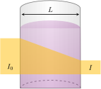

# Misturas e soluções

A maior parte dos materiais não é formada por elementos ou compostos puros. Por essa razão, elas não são *substâncias* no sentido técnico do termo: elas são misturas de várias substâncias. Assim, o ar, o sangue e a água do mar são misturas. Medicamentos, como os xaropes contra a tosse, são misturas de vários ingredientes, ajustados para conseguir um melhor efeito biológico. A mesma coisa pode ser dita em relação aos perfumes.

## A classificação de misturas

Um composto tem composição fixa, porém as misturas podem ter qualquer composição desejada. Existem sempre dois átomos de $\ce{H}$ para cada átomo de $\ce{O}$ em uma amostra de água, mas açúcar e areia, por exemplo, podem ser misturados em diferentes proporções. Como os componentes de uma mistura são meramente mesclados, eles retêm suas propriedades químicas na mistura. Por outro lado, um composto tem propriedades químicas que diferem das de seus componentes. A formação de uma mistura é uma mudança *física*, enquanto a formação de um composto exige uma mudança *química*.

Em algumas misturas, as partículas que as compõem são tão grandes que é possível reconhecê-las com a ajuda de um microscópio óptico ou mesmo a olho nu. Essas colchas de retalhos de diferentes substâncias são denominadas **misturas heterogêneas**. Muitas das rochas que formam a paisagem são misturas heterogêneas de cristais de minerais diferentes. Em algumas misturas, as moléculas ou íons componentes estão tão bem dispersos que a composição é a mesma em toda a amostra, independentemente do seu tamanho. Tal mistura é chamada de **mistura** ou **solução homogênea**. Uma solução típica contém uma substância dominante, o **solvente**. As demais substâncias presentes são denominadas **solutos**. A água do mar filtrada é uma solução de sal (cloreto de sódio) e muitas outras substâncias em água. Existem, também, **soluções sólidas**, nas quais o solvente é um sólido. Um exemplo é o bronze, que é uma solução de cobre em zinco. Embora uma solução pareça ter composição uniforme, seus componentes retêm suas identidades. A formação de uma solução é um processo físico, não um processo químico. Na prática, as misturas gasosas não são consideradas soluções, ainda que um gás possa ser a substância dominante (como o nitrogênio na atmosfera).

A **cristalização** é o processo em que um soluto lentamente se converte em cristais, às vezes por evaporação do solvente. Isso acontece, por exemplo, com os cristais de sal que se formam quando a água evapora nas salinas. Na **precipitação**, o soluto se separa tão rapidamente da solução, que não há tempo para que se formem cristais simples. Ao contrário, o soluto forma um pó fino (um conjunto de cristais muito pequenos) chamado de **precipitado**. Normalmente, a precipitação é quase instantânea, ocorrendo tão logo duas soluções são misturadas.

As bebidas e a água do mar são exemplos de **soluções aquosas**, soluções em que o solvente é a água. As soluções em água são muito comuns no nosso dia a dia e na rotina dos laboratórios e, por isso, a maior parte das soluções mencionadas neste texto é em água. As **soluções não aquosas** são as soluções em que o solvente não é a água. Embora sejam menos comuns do que as soluções em água, elas têm importantes aplicações. Na *lavagem a seco*, a gordura e a sujeira depositadas sobre os tecidos são dissolvidas em um solvente líquido não aquoso, como o tetracloroeteno, $\ce{C2Cl4}$.

> As misturas retêm as propriedades de seus constituintes e nisso elas diferem dos compostos. As misturas são classificadas como homogêneas ou heterogêneas. As soluções são misturas homogêneas de duas ou mais substâncias.

## As técnicas de separação

Para analisar a composição de qualquer amostra que é supostamente uma mistura, é preciso separar seus componentes por métodos físicos e identificar cada substância presente. As técnicas físicas comuns de separação são a decantação, a filtração, a cromatografia e a destilação.

A **decantação** aproveita a diferença de densidades. Um líquido que flutua sobre outro líquido ou está acima de um sólido pode ser decantado. A **filtração** é usada para separar substâncias quando existem diferenças de solubilidade (a capacidade de se dissolver em um dado solvente). Agita-se a amostra com o solvente que, então, passa por um filtro fino. Os componentes da mistura que são solúveis se dissolvem no líquido e passam pelo filtro, mas os componentes insolúveis ficam retidos. A técnica pode ser usada para separar açúcar de areia, porque o açúcar é solúvel em água e a areia, não. Uma técnica relacionada e que é uma das mais sensíveis de separação de misturas é a **cromatografia**, que usa a capacidade diferente das substâncias de adsorver-se, ou grudar-se, nas superfícies. O suporte seco que mostra os componentes da mistura separados é denominado **cromatograma**.

A **destilação** usa as diferenças de pontos de ebulição para separar as misturas. Na destilação, os componentes de uma mistura vaporizam-se em temperaturas diferentes e condensam-se em um tubo resfriado chamado de condensador. A técnica pode ser usada para remover água do sal comum (cloreto de sódio), que só se funde em $\pu{801 \degree C}$. O sal
permanece sólido quando a água evapora.

> A separação de misturas aproveita as diferenças de propriedades físicas dos componentes. As técnicas baseadas nas diferenças físicas incluem a decantação, a filtração, a cromatografia e a destilação.

# As propriedades das soluções

## A concentração

Uma das maneiras de expressar a composição de uma mistura é como a **percentagem em massa** de cada componente, isto é, a massa de cada componente em um total de $\pu{100 g}$ da mistura. Por exemplo, se $\pu{15 g}$ de $\ce{NaCl}$ são dissolvidos em $\pu{60 g}$ de água, a massa total da mistura é $\pu{75 g}$ e a percentagem de $\ce{NaCl}$ na solução é $(\pu{15 g}/\pu{75 g}) \times \pu{100}\% = \pu{20}\%$ de $\ce{NaCl}$. Se a amostra contém $\pu{30 g}$ daquela solução, ela terá a mesma composição, $\pu{20}\%$ de $\ce{NaCl}$ em massa e conterá $\pu{6 g}$ de $\ce{NaCl}$.

No estudo das soluções, três medidas de concentração são úteis. Para um soluto $\ce{J}$:

- A concentração molar, normalmente chamada de molaridade, representada por $c_{\ce{J}}$ ou $\ce{[J]}$.
- A fração molar, denotada por $x_{\ce{J}}$.
- A molalidade, denotada por $w_{\ce{J}}$.

Além disso, especialmente nas ciências ambientais, a concentração das substâncias muitas vezes é expressa em partes por milhão ($\pu{ppm}$) ou partes por bilhão ($\pu{ppb}$). Por exemplo, se existem 25 moléculas de um agente poluente em uma solução em água composta por milhões de moléculas, a propriedade seria expressa como $\pu{25 ppm}$. Quando a concentração é expressa em partes por milhão, é importante indicar as unidades usadas no cálculo. A concentração expressa em partes por milhão por volume (microlitros de soluto por litro) frequentemente é representada por $\pu{ppmv}$ ou $\pu{ppm} \mathrm{(v/v)}$. Quando a concentração é expressa em partes por milhão em massa (miligramas por quilogramas ou microgramas por grama), ela é representada por $\pu{ppm} \mathrm{(m/m)}$.

Com frequência, é importante em química saber a quantidade de soluto em um dado volume de solução. A **concentração molar**, $c$, de um soluto em uma solução, chamada comumente de **molaridade** do soluto, é a quantidade de moléculas do soluto ou de fórmulas unitárias (em mols) presente em um dado volume da solução (em litros):
$$
    c_{\ce{J}} 
        = \dfrac{ n_\text{soluto} }{ V_\text{solução} }
        = \dfrac{ n_{\ce{J}} }{ V }
\tag{1}
$$

Muitas vezes ela é expressa em mols por litro ($\pu{mol.L-1}$). É conveniente definir o seu *padrão* como $c^\circ = \pu{1 mol.L-1}$.

:::info

### Unidades

As unidades de molaridade são mols por litro ($\pu{mol.L-1}$), normalmente representado por:
$$
    \pu{1 M} = \pu{1 mol.L-1}
$$
O símbolo $\pu{M}$ é lido como *molar*. Não é uma unidade SI. Os químicos que trabalham com concentrações muito baixas de solutos também utilizam milimols por litro ($\pu{mmol.L-1}$) e micromols por litro ($\pu{\mu mol.L-1}$).

:::

Como a molaridade é definida em termos do *volume da solução*, e não do volume do solvente usado para preparar a solução, o volume deve ser medido depois que os solutos forem adicionados. O modo mais comum de preparar uma solução de uma dada molaridade é transferir uma massa conhecida do sólido para um **balão volumétrico**, um frasco calibrado para conter um dado volume, acrescentar um pouco de água para dissolver o soluto, encher o balão com água até a marca e, então, agitar o balão invertendo o frasco repetidamente.

:::example

### Cálculo da massa de soluto necessária para atingir uma dada concentração

Deseja-se preparar $\pu{250 mL}$ de uma solução $\pu{0,04 mol.L-1}$ de sulfato de cobre(II) usando sulfato de cobre(II) penta-hidratado, $\ce{CuSO4.5H2O}$.

**Calcule** a massa de sólido necessária para preparar a solução.

#### Calcule a quantidade de soluto.

De $c = n_\text{soluto}/V_\text{solução}$
$$
    n = (\pu{0,04 mol.L-1}) \times (\pu{0,25 L}) = \pu{10 mmol}
$$

#### Converta a quantidade de $\ce{CuSO4.5H2O}$ em massa usando a massa molar.

De $m = nM$
$$
    m = (\pu{10 mmol}) \times (\pu{249,5 g//mol}) = \boxed{ \pu{2,5 g} }
$$

:::

A molaridade também é usada para calcular o volume de solução, $V$, que contém uma determinada quantidade de soluto.

:::example

### Cálculo do volume de uma solução que contém uma dada quantidade de soluto

Deseja-se obter $\pu{0,8 mmol}$ de ácido acético, $\ce{CH3COOH}$, a partir de uma solução aquosa $\pu{0,05 mol.L-1}$.

**Calcule** o volume da solução que deve ser usado.

#### Calcule o volume da solução que contém a quantidade desejada de ácido acético.

De $c = n_\text{soluto}/V_\text{solução}$
$$
    V 
        = \dfrac{ \pu{0,8e-3 mol} }{ \pu{0,056 mol.L-1} } 
        = \boxed{ \pu{0,016 L} }
$$

:::

A fração molar e a molalidade são importantes porque se referem a números relativos de moléculas de soluto e de solvente. A fração molar é definida como sendo a razão entre a quantidade (em mols) de uma espécie e a quantidade de todas as espécies presentes em uma mistura:
$$
    x_{\ce{J}} 
        = \dfrac{ n_\text{soluto} }{ n_\text{total} } 
        = \dfrac{ n_{\ce{J}} }{ n_{\ce{A}} + n_{\ce{B}} + \ldots }
\tag{2}
$$

A **molalidade**, $b_{\ce{J}}$, de um soluto é definida como a quantidade de soluto (em mols) de uma solução dividida pela massa do solvente (em quilogramas):
$$
    w_{\ce{J}} 
        = \dfrac{ n_\text{soluto} }{ m_\text{solvente} }
        = \dfrac{ n_{\ce{J}} }{ m }
\tag{3}
$$

:::info

### Unidades

As unidades de molalidade são mols por quilograma ($\pu{mol.kg-1}$), normalmente representado por:
$$
    \pu{1 m} = \pu{1 mol.kg-1}
$$
O símbolo $\pu{m}$ é lido como *molal*. Assim, como o *molar*, o *molal* não é uma unidade SI.

:::

:::example

### Cálculo da molalidade de um soluto

Uma solução é preparada pela dissolução de $\pu{90 g}$ do açúcar frutose, $\ce{C6H12O6}$, em $\pu{250 g}$ de água.

**Calcule** a molalidade da frutose na solução.

#### Converta a massa de frutose em quantidade usando sua massa molar.

De $n = m/M$
$$
    n = \dfrac{ \pu{90 g} }{ \pu{180 g//mol} } = \pu{0,5 mol}
$$

#### Calcule a molalidade da frutose na solução.

De $w = n_\text{soluto}/m_\text{solvente}$
$$
    w = \dfrac{ \pu{0,5 mol} }{ \pu{0,25 kg} } = \boxed{ \pu{2 mol.kg-1} }
$$

:::

Como acontece com a fração molar, mas não com a molaridade, a molalidade independe da temperatura. Observe a ênfase no solvente na definição de molalidade, e na solução na definição de molaridade. Portanto, para preparar uma solução aquosa $\pu{1 m}$ em $\ce{NiSO4}$, dissolva $\pu{1 mol}$ de $\ce{NiSO4}$ em $\pu{1 kg}$ de água. Para preparar solução aquosa $\pu{1 M}$ em $\ce{NiSO4}$ dissolva $\pu{1 mol}$ de $\ce{NiSO4}$ em água suficiente para $\pu{1 L}$ de solução.

:::think

### Ponto para pensar

Por que a molaridade não é independente da temperatura?

:::

:::example

### Cálculo da molalidade a partir da fração molar

Considere uma solução de benzeno, $\ce{C6H6}$, em tolueno, $\ce{C7H8}$, em que a fração molar de benzeno é $\pu{0,25}$.

**Calcule** a molalidade do benzeno na solução.

#### Base de cálculo: $\pu{1 mol}$ total. Converta a quantidade de tolueno em massa usando sua massa molar.

De $m = nM$
$$
    m_\text{tolueno} 
        = (\pu{0,75 mol}) \times (\pu{92 g//mol})
        = \pu{69 g}
$$

#### Calcule a molalidade do benzeno na solução.

De $w = n_\text{soluto}/m_\text{solvente}$
$$
    w = \dfrac{ \pu{0,25 mol} }{ \pu{69e-3 kg} } = \boxed{ \pu{3,6 mol.kg-1} }
$$

:::

:::example

### Cálculo da molalidade a partir da molalidade

Considere uma solução aquosa de sacarose, $\ce{C12H22O11}$, na concentração $\pu{1,06 mol.L-1}$ cuja densidade é $\pu{1,14 g.mL-1}$.

**Calcule** a molalidade da solução.

#### Base de cálculo: $\pu{1 L}$ de solução. Converta a quantidade de sacarose em massa usando sua massa molar.

De $m = nM$
$$
    m_\text{sacarose} 
        = (\pu{1,06 mol}) \times (\pu{342 g//mol}) 
        = \pu{362,5 g}
$$

#### Calcule a massa total da solução a partir do volume da densidade.

De $d = m/V$
$$
    m = (\pu{1,14 g//mL}) \times (\pu{1000 mL}) = \pu{1140 g}
$$

#### Calcule a massa de solvente.

De $m = m_\text{solvente} + m_\text{soluto}$
$$
    m_\text{solvente}
        = \pu{1140 g} - \pu{362,5 g}
        = \pu{777,5 g}
$$

#### Calcule a molalidade do benzeno na solução.

De $w = n_\text{soluto}/m_\text{solvente}$
$$
    w 
        = \dfrac{ \pu{1,06 mol} }{ \pu{0,777 g} } 
        = \boxed{ \pu{1,36 mol.kg-1} }
$$

:::

> A molalidade de um soluto em uma solução é a quantidade (em mols) de soluto dividida pela massa do solvente usado para preparar a solução.

## A cor das soluções

A luz branca é uma mistura de todos os comprimentos de onda da radiação eletromagnética entre cerca de $\pu{400 nm}$ (violeta) e cerca de $\pu{700 nm}$ (vermelho). Quando alguns desses comprimentos de onda são removidos do feixe de luz branca que passa através de uma amostra, a luz que passa não é mais branca. Por exemplo, se a luz vermelha é retirada da luz branca por absorção, a luz que resta é de cor verde. Se a luz verde é removida, a luz que aparece é vermelha. O vermelho e o verde são chamados de **cores complementares** uma da outra --- cada uma é a cor que permanece depois que a outra é removida (Figura 1).

A roda de cores mostrada na ilustração pode ser usada para sugerir a faixa de comprimento de onda na qual uma substância tem absorção significativa (não necessariamente absorção máxima). Se uma substância parece azul (como no caso da solução de sulfato de cobre(II), por exemplo), é porque ela está absorvendo a luz laranja ($\pu{580 nm}$ a $\pu{620 nm}$). Igualmente, com base no comprimento de onda (e, portanto na cor) da luz absorvida pela substância, é possível predizer a cor da substância pela cor complementar na roda das cores. Como o $\ce{MnO4^-}$ absorve luz em $\pu{535 nm}$, que é a luz amarelo-esverdeada, o composto aparece violeta.

:::think

### Ponto para pensar

Que cor tem uma substância que absorve as luzes violeta e azul?

:::

A absorção da luz visível por substâncias pode ser usada para medir suas concentrações, usando-se um espectrômetro. Em determinado comprimento de onda, a absorbância, $A$, de uma solução é definida como o logaritmo comum (base $10$) da razão entre a intensidade da luz incidente, $I_0$, e a intensidade da luz transmitida através da amostra, $I$ (Figura 2):
$$
    A = \log\left( \dfrac{I_0}{I} \right)
$$

A solução é transferida para um tubo retangular transparente, chamado de *cubeta*. A absorbância é proporcional ao caminho óptico da luz na solução, $L$, e à concentração molar da substância, $c$ (isto é, $A \propto Lc$). O coeficiente de proporcionalidade é expresso por $\epsilon$ e é chamado de coeficiente de absorção molar:
$$
    A = \epsilon L c
$$
Essa relação normalmente é escrita em termos das intensidades, inserindo-se a definição de $A$ e extraindo-se os antilogaritmos ($10^x$, neste caso) de ambos os lados, como:
$$
    I = I_0 \times 10^{-\epsilon L c}
$$
Essa forma da relação é denominada **Lei de Beer**. Ela mostra que a intensidade transmitida cai rapidamente com o caminho óptico: se este for duplicado, tem-se uma redução de $100$ vezes na intensidade transmitida. O coeficiente de absorção molar é característico do composto e o comprimento de onda é típico da luz incidente.

:::example

### Cálculo da concentração por espectrofotometria

As concentrações das soluções do íon permanganato, $\ce{MnO4^-}$, que é púrpura, são frequentemente determinadas pela via espectrofotométrica. Uma célula com caminho óptico igual a $\pu{1 cm}$ contendo uma solução de $\ce{KMnO4}$ tem absorbância igual a $\pu{0,4}$ a $\pu{525 nm}$

O coeficiente de absorção molar do $\ce{MnO4^-}$ a $\pu{525 nm}$ é $\pu{2,5 L.mol-1.cm-1}$

**Calcule** a concentração de íons $\ce{MnO4^-}$ na solução.

#### Use a Lei de Beer.

De $A = \epsilon L c$
$$
    c = \dfrac{ \pu{0,4} }{ (\pu{2,5 L//mol.cm}) \times (\pu{1 cm}) } = \boxed{ \pu{1 mol.L-1} }
$$

:::

> A absorbância de um composto em solução é proporcional à sua concentração molar. A lei de Beer pode ser usada para se determinar a concentração de solutos.

# As operações com soluções

## A diluição

Uma prática comum em química para economizar espaço é armazenar uma solução na forma concentrada chamada de **solução-estoque** e, então, quando necessário, **diluí-la**, isto é, reduzir a concentração até a desejada. Os químicos usam técnicas como a diluição sempre que eles precisam ter um controle muito preciso sobre as quantidades das substâncias que estão manuseando, mesmo quando elas são muito pequenas. Por exemplo, pipetar $\pu{25 mL}$ de uma solução aquosa $\pu{1,5 mmol.L-1}$ de $\ce{NaOH}$ corresponde a transferir $\pu{37,5 \mu mol}$ de $\ce{NaOH}$, isto é, $\pu{1,5 mg}$ do composto. É difícil medir com precisão uma massa tão pequena, mas o volume pode ser adicionado com exatidão.

Para diluir uma solução-estoque até a concentração desejada, uma pipeta é usada para transferir o volume apropriado da solução para um balão volumétrico. Então, uma quantidade suficiente de solvente é adicionada para elevar o volume da solução até o valor final.

:::example

### Cálculo do volume de uma solução-estoque a diluir

Deseja-se preparar $\pu{250 mL}$ de uma solução aquosa $\pu{1,25 mmol}$ de $\ce{NaOH}$ e usando uma solução-estoque de concentração $\pu{0,027 mol.L-1}$ de $\ce{NaOH}$.

**Calcule** o volume da solução-estoque necessário.

#### Balanço em $\ce{NaOH}$. Calcule o volume da solução inicial.

De $n_\text{inicial} = n_\text{inicial}$ e $c = n/V$
$$
    c_\text{inicial} V_\text{inicial} = c_\text{final} V_\text{final}
$$
logo,
$$
    V_\text{inicial} 
        = \dfrac{ (\pu{1,25 mmol}) \times (\pu{0,25 L}) }{ \pu{0,027 mol.L-1} }
        = \boxed{ \pu{11,6 mL} }
$$

:::

> Quando um volume pequeno de uma solução é diluído até um volume maior, o número total de mols de soluto na solução não muda, mas a concentração do soluto diminui.

