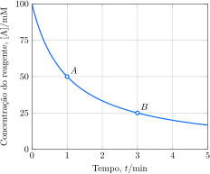

# As velocidade de reação

Informalmente, uma reação é considerada rápida quando os produtos são formados quase instantaneamente, como acontece em uma reação de neutralização ou em uma explosão. Uma reação é lenta se os produtos levam um tempo longo para se formar, como acontece na corrosão ou na decomposição de materiais orgânicos. Nos dois casos, é importante ser capaz de expressar e medir a velocidade de uma reação quantitativamente e detectar os padrões segundo os quais ela depende das condições. Uma vez definidos, esses parâmetros podem ser usados para descobrir detalhes sobre como as reações ocorrem em nível atômico e como seus rendimentos podem ser modificados.

## Concentração e velocidade de reação

Na vida diária, a velocidade é definida como a mudança do valor de uma propriedade dividida pelo tempo que ela leva para ocorrer. Por exemplo, a velocidade de um automóvel, isto é, a velocidade da mudança de posição, é definida como a distância percorrida dividida pelo tempo gasto. A *velocidade média* em determinado estágio do percurso é obtida dividindo-se o percurso percorrido em um intervalo de tempo pela duração deste intervalo. A *velocidade instantânea* é obtida lendo-se o velocímetro em determinado ponto do percurso. Na química, as velocidades são expressas de modo semelhante. A **velocidade de reação**, como a velocidade média de um carro, é definida como a variação da concentração de um dos reagentes ou produtos em determinado ponto da reação dividida pelo tempo que a mudança leva para ocorrer. Como a velocidade pode mudar com o tempo, a **velocidade média da reação** em um determinado intervalo é definida como a variação da concentração molar de um reagente $\ce{R}$, $\Delta[\ce{R}]$, dividida pelo intervalo de tempo $\Delta t$:
$$
    v_{\mathrm{m}, \ce{R}} = - \dfrac{ \Delta[\ce{R}] }{ \Delta t } \tag{1a}
$$
Como os reagentes são consumidos em uma reação, a concentração molar de $\ce{R}$ decresce com o tempo e $\Delta[\ce{R}]$ é negativo. O sinal negativo da Equação 1a torna a velocidade positiva, que é a convenção normal da cinética química. Porém, se a concentração de um produto $\ce{P}$ é monitorada, a velocidade média é expressa como
$$
    v_{\mathrm{m}, \ce{P}} = \dfrac{ \Delta[\ce{P}] }{ \Delta t } \tag{1b}
$$
Nesta expressão, $\Delta[\ce{P}]$ é a variação da concentração molar de $\ce{P}$ no intervalo $\Delta t$: uma quantidade positiva, porque o produto se acumula com o tempo.

Note que, quando registrar velocidades de reação, você precisará ter cuidado e especificar a que espécie tal velocidade se refere, porque as espécies são produzidas ou consumidas em velocidades relacionadas à estequiometria da reação. Por exemplo, na reação de formação do $\ce{HI}$, duas moléculas de $\ce{HI}$ são produzidas a partir de uma molécula de $\ce{H2}$ e, por isso, a velocidade de consumo do $\ce{H2}$ é metade da velocidade de formação do $\ce{HI}$; portanto,
$$
    \dfrac{ \Delta [\ce{H2}] }{ \Delta t } 
        = -\dfrac{1}{2} \dfrac{ \Delta [\ce{HI}] }{ \Delta t }
$$
Para evitar as ambiguidades associadas com as várias maneiras de registrar uma velocidade de reação, a velocidade média única de uma reação pode ser expressa sem especificar a espécie. A **velocidade média única** da reação $\ce{ a A + b B -> c D + d D }$ é qualquer uma das quatro quantidades iguais seguintes:
$$
    v_\mathrm{m} 
        = - \dfrac{1}{a} \dfrac{ \Delta [\ce{A}] }{ \Delta t }
        = - \dfrac{1}{b} \dfrac{ \Delta [\ce{B}] }{ \Delta t }
        =   \dfrac{1}{c} \dfrac{ \Delta [\ce{C}] }{ \Delta t }
        =   \dfrac{1}{d} \dfrac{ \Delta [\ce{D}] }{ \Delta t } 
    \tag{2a}
$$

:::think

### Ponto para pensar

Como a velocidade única de uma reação muda se os coeficientes da equação química forem dobrados?

:::

:::example

### Cálculo da velocidade média de uma reação

A velocidade média de formação de amônia segundo a reação

$$
    \ce{ N2(g) + 3 H2(g) -> 2 NH3(g) }
$$

No intervalo de $\pu{100 s}$, a concentração de $\ce{HI}$ aumentou de
$\pu{3,5 M}$ para $\pu{4,0 M}$.

a. **Calcule** velocidade média de formação de $\ce{NH3}$. 
b. **Calcule** velocidade média de consumo de $\ce{H2}$. 

#### Calcule a velocidade média de formação de $\ce{NH3}$. 

De $v_{\mathrm{m}, \ce{NH3}} = \Delta [\ce{NH3}]/ \Delta t$,
$$
    v_{\mathrm{m}, \ce{NH3}} = \dfrac{ (\pu{4,0} - \pu{3,5})\,\pu{mM} }{ \pu{100 s} } = \boxed{ \pu{4 mM.s-1} } \tag{a}
$$

#### Calcule a velocidade média de consumo de $\ce{H2}$. 

$$
    v_{\mathrm{m}, \ce{H2}} = \pu{2 mM.s-1} \times \dfrac{3}{2} = \boxed{ \pu{6 mM.s-1} } \tag{b}
$$

:::

> A velocidade média de uma reação é a variação da concentração de uma espécie dividida pelo tempo.

## A velocidade instantânea de reação

Assim como ocorre com a velocidade de um carro, em muitos casos é importante conhecer a velocidade instantânea de reação, não a média ao longo de determinado intervalo. A maior parte das reações desacelera à medida que os reagentes são consumidos. Para determinar a velocidade da reação em um determinado instante no decurso de uma reação, duas medidas de concentração muito próximas no tempo são necessárias. Quando dois pontos na curva são aproximados sucessivamente, a linha que os une se aproxima da tangente da curva, isto é, uma linha reta que toca a curva e indica a inclinação da curva nesse ponto. A inclinação da tangente da curva da concentração vs. tempo nesse momento é a velocidade naquele instante (Figura 1). 

A inclinação da tangente, que varia durante a evolução da reação, é chamada de velocidade instantânea da reação no ponto de interesse. Deste ponto em diante, quando falarmos de uma velocidade de reação, estaremos nos referindo sempre à velocidade instantânea. As definições das Equações 1a e 1b podem ser facilmente adaptadas para se referirem à velocidade instantânea de uma reação. Para um reagente $\ce{R}$,
$$
    v_{\ce{R}} = - \dfrac{ \mathrm{d} [\ce{R}] }{ \mathrm{d} t } \tag{1c}
$$
Para um produto $\ce{P}$, escreva
$$
    v_{\ce{P}} = \dfrac{ \mathrm{d} [\ce{P}] }{ \mathrm{d} t } \tag{1d}
$$
Do mesmo modo, a velocidade instantânea de uma reação é definida como na Equação 2,
$$
    v
        = - \dfrac{1}{a} \dfrac{ \mathrm{d} [\ce{A}] }{ \mathrm{d} t }
        = - \dfrac{1}{b} \dfrac{ \mathrm{d} [\ce{B}] }{ \mathrm{d} t }
        =   \dfrac{1}{c} \dfrac{ \mathrm{d} [\ce{D}] }{ \mathrm{d} t }
        =   \dfrac{1}{d} \dfrac{ \mathrm{d} [\ce{D}] }{ \mathrm{d} t }
    \tag{2b}
$$
Como é difícil traçar a olho nu uma tangente com exatidão, é melhor analisar os gráficos de concentração versus tempo.

> A velocidade instantânea de uma reação é a inclinação da tangente traçada no gráfico de concentração versus tempo no momento de interesse.

## As leis de velocidade e a ordem de reação

As tendências das velocidades de reações são comumente identificadas pelo exame da **velocidade inicial da reação**, a velocidade instantânea no início da reação. A vantagem de usar a velocidade inicial é que a presença de produtos durante a reação pode afetar a velocidade; assim, a interpretação dos resultados pode ficar muito complicada. Para entender como as velocidades iniciais são medidas, suponha, por exemplo, que diferentes quantidades de pentóxido de dinitrogênio, $\ce{N2O5}$, sólido, são medidas em diferentes balões de mesmo volume, colocados em um banho de água, em $\pu{65 \degree C}$, para vaporizar todo o sólido e, então, a espectrometria é usada para monitorar as concentrações de $\ce{N2O5}$ em cada frasco à medida que se decompõe:
$$
    \ce{ 2 N2O5(g) -> 4 NO2(g) + O2(g) }
$$
Cada frasco tem uma concentração inicial diferente de $\ce{N2O5}$. A velocidade inicial da reação em cada balão pode ser determinada colocando em gráfico a concentração em função do tempo para cada balão e traçando a tangente de cada curva em $t = 0$ (Figura 1). 

Valores maiores de velocidades iniciais de decomposição do vapor --- tangentes mais
inclinadas --- são encontrados nos balões em que as concentrações iniciais de $\ce{N2O5}$ são maiores. Esse padrão nos dados pode ser identificado colocando-se em gráfico as velocidades iniciais contra a concentração e examinando o tipo de curva encontrado. 

Nesse caso, a curva da velocidade inicial contra a concentração inicial de $\ce{N2O5}$ é uma linha reta, o que indica que a velocidade inicial é proporcional à concentração inicial:
$$
    v \propto [\ce{N2O5}]_\text{inicial}
$$
Se introduzirmos uma constante $k$, podemos escrever essa proporcionalidade como uma igualdade:
$$
    v = k [\ce{N2O5}]_\text{inicial}
$$
A constante $k$ é **chamada de constante de velocidade da reação** e é característica da reação (diferentes reações têm diferentes constantes de velocidade) e da temperatura na qual a reação ocorre. O valor experimental de $k$ nesta reação, isto é, a inclinação da reta da Figura 2, é $k = \pu{0,5 min-1}$.

A velocidade inicial é diretamente proporcional à concentração inicial. Se a velocidade da reação em um dos balões for monitorada à medida que a reação avança, veremos que, quando a concentração de $\ce{N2O5}$ cai, a velocidade também cai. Mais especificamente, a velocidade em qualquer instante é proporcional à concentração do $\ce{N2O5}$ que resta no balão naquele instante, com a mesma constante de proporcionalidade, $k$. Segue-se que, *em qualquer* estágio da reação,
$$
    v = k [\ce{N2O5}]
$$
Essa equação é um exemplo de **lei de velocidade,** a expressão da velocidade instantânea de reação em termos da concentração de um reagente em qualquer momento. Cada reação tem suas próprias lei e constante de velocidade, $k$. As leis de velocidade incluem as concentrações de produtos e de reagentes.

Outras reações têm leis de velocidade que podem depender da concentração dos reagen-
tes de modo diferente. Medidas semelhantes para a reação
$$
    \ce{ 2 NO2(g) -> 2 NO(g) + O2(g) }
$$
não dão uma reta quando a velocidade é lançada em um gráfico em função da concentração de $\ce{NO2}$ (Figura 3a). No entanto, o gráfico da velocidade em função do quadrado da concentração de $\ce{NO2}$ será uma linha reta (Figura 3b). 

Esse resultado mostra que a velocidade é proporcional ao quadrado da concentração e que, portanto, a velocidade em cada estágio da reação pode ser escrita como
$$
    v = k [\ce{NO}]^2
$$
As leis de velocidade das reações de decomposição de $\ce{N2O5}$ e $\ce{NO2}$ são diferentes, mas ambas têm a forma
$$
    \text{velocidade} = \text{constante} \times [\text{concentração}]^a
$$
com $a = 1$ para a reação do $\ce{N2O5}$ e $a = 2$ para a reação do $\ce{NO2}$. A decomposição do $\ce{N2O5}$ é um exemplo de uma **reação de primeira ordem**, porque sua velocidade é proporcional à primeira potência da concentração (isto é, $a = 1$). A decomposição do $\ce{NO2}$ é um exemplo de uma **reação de segunda ordem**, porque sua velocidade é proporcional à segunda potência da concentração (isto é, $a = 2$). Se dobrarmos a concentração de um reagente em uma reação de primeira ordem, a velocidade da reação dobra. Se dobrarmos a concentração de reagente em qualquer reação de segunda ordem, aumentamos a velocidade da reação por um fator de $2^2 = 4$.

A maior parte das reações é de primeira ou de segunda ordem em cada reagente, mas algumas reações têm ordens diferentes. A amônia, por exemplo, decompõe-se em nitrogênio e hidrogênio em um fio de platina quente:
$$
    \ce{ 2 NH3(g) -> N2(g) + 3 H2(g) }
$$
Os experimentos mostram que a decomposição ocorre com velocidade constante até toda a amônia ter desaparecido (Figura 4). 

A lei de velocidade é, portanto,
$$
    v = k
$$
Isto é, a velocidade não depende da concentração da amônia, desde que um pouco dela esteja presente. Essa decomposição é um exemplo de reação de ordem zero, uma reação em que a velocidade (enquanto houver reagente) não depende da concentração.

:::warning

### Atenção

A lei de velocidade de uma reação é determinada experimentalmente e não pode, em
geral, ser obtida a partir da equação química da reação. 

:::

Por exemplo, a decomposição de $\ce{N2O5}$ e a decomposição de $\ce{NO2}$ têm o coeficiente estequiométrico igual a $2$ para o reagente, mas uma é de primeira ordem e a outra, de segunda ordem.

Muitas reações têm leis de velocidade que dependem das concentrações de mais de um reagente. Um exemplo é a reação redox entre íons persulfato e iodeto:
$$
    \ce{ S2O8^{2-}(aq) + 3 I^-(aq) -> 2 SO4^{2-}(aq) + I3^-(aq) }
$$
A lei de velocidade dessa reação é
$$
    v = k [\ce{S2O8^{2-}}][\ce{I^-}]
$$
A reação é chamada de reação de primeira ordem com respeito a $\ce{S2O8^{2-}}$ e de primeira ordem em $\ce{I-}$. Dobrando a concentração do íon $\ce{S2O8^{2-}}$ ou a concentração do íon $\ce{I-}$, a velocidade da reação dobra. Dobrando ambas as concentrações, a velocidade de reação quadruplica. A ordem total dessa reação é a soma das duas ordens, ou $2$. Em geral, se
$$
    v = k [\ce{A}]^a [\ce{B}]^b \ldots
$$
então a **ordem total** é a soma dos expoentes $a + b + \ldots$

As leis de velocidade das reações são expressões empíricas estabelecidas experimentalmente, e não devemos nos surpreender se elas não forem números positivos inteiros. Por exemplo, as ordens podem ser números negativos. Como $[\ce{A}]^{-1} = 1/[\ce{A}]$, uma ordem negativa significa que a concentração aparece no denominador da lei de velocidade. O aumento da concentração desta espécie, normalmente um produto, desacelera a reação, porque ela participa da reação inversa. Um exemplo é a decomposição do ozônio, $\ce{O3}$, na estratosfera:
$$
    \ce{ 2 O3(g) -> 3 O2(g) }
$$
A lei de velocidade dessa reação, determinada experimentalmente, é
$$
    v = k \dfrac{[\ce{O3}]^2}{[\ce{O2}]} = k [\ce{O3}]^2 [\ce{O2}]^{-1}
$$

:::warning

### Atenção 

Note que uma lei de velocidade pode depender das concentrações dos produtos e dos reagentes.

:::

Esta lei diz que a reação é mais lenta nas regiões da alta atmosfera em que as moléculas de $\ce{O2}$ são abundantes do que nas regiões em que elas são mais escassas. Algumas reações podem ter ordens fracionárias. Por exemplo, a oxidação do dióxido de enxofre a trióxido de enxofre na presença de platina,
$$
    \ce{ 2 SO2(g) + O2(g) ->[\ce{Pt}] 2 SO3(g) }
$$
tem a seguinte lei de velocidade
$$
    v = \ce{ k \dfrac{[\ce{SO2}]}{[\ce{SO3}]^{1/2}} } = k [\ce{SO2}] [\ce{SO3}]^{-1/2}
$$
e uma ordem total igual a $1 - 1/2 = 1/2$. A presença de $[\ce{SO3}]$ no denominador significa que a reação sofre desaceleração quando a concentração de produto aumenta. Mais uma vez, a lei de velocidade dá uma pista sobre como a reação ocorre. Todas as reações consideradas neste tópico são homogêneas e, para reações de ordem zero, a velocidade depende da concentração de um ou mais reagentes. Para aumentar a velocidade, a concentração de um reagente pode ser aumentada. Do mesmo modo, a velocidade de uma reação heterogênea pode aumentar se a área superficial de um reagente também aumentar.

:::example

### Determinação das ordens de reação pelo método das velocidades iniciais

Foram conduzidos quatro experimentos para descobrir como a velocidade inicial de consumo de íons $\ce{BrO3^-}$ na reação 
$$
    \ce{ BrO3^-(aq) + 5 Br^-(aq) + 6 H3O^+(aq) -> 3 Br2(aq) + 9 H2O(l) }
$$
varia quando as concentrações dos reagentes variam.

| **Expt.** | $\dfrac{[\ce{BrO3^-}]}{\pu{M}}$ | $\dfrac{[\ce{Br^-}]}{\pu{M}}$ | $\dfrac{[\ce{H3O^+}]}{\pu{M}}$ | $\dfrac{v}{\pu{mM.s-1}}$ |
| :-------: | ------------------------------: | ----------------------------: | -----------------------------: | -----------------------: |
|   **1**   |                     $\pu{0,10}$ |                   $\pu{0,10}$ |                    $\pu{0,10}$ |               $\pu{1,2}$ |
|   **2**   |                     $\pu{0,20}$ |                   $\pu{0,10}$ |                    $\pu{0,10}$ |               $\pu{2,4}$ |
|   **3**   |                     $\pu{0,10}$ |                   $\pu{0,30}$ |                    $\pu{0,10}$ |               $\pu{3,6}$ |
|   **4**   |                     $\pu{0,20}$ |                   $\pu{0,10}$ |                    $\pu{0,15}$ |               $\pu{5,4}$ |

a. **Determine** a lei de velocidade da reação.
b. **Calcule** a ordem global da reação.
c. **Calcule** a contante cinética.

#### Escreva a lei de velocidade.

$$
    v = k [\ce{BrO3^-}]^a[\ce{Br^-}]^b[\ce{H3O^+}]^c
$$

#### Ordem em $\ce{BrO3^-}$. Compare os experimentos **1** e **2**.

$$
    \dfrac{v_2}{v_1} = \left( \dfrac{ \pu{0,20} }{ \pu{0,10} } \right)^a = \dfrac{ \pu{2,4} }{ \pu{1,2} }
$$
Logo, $a = 1$ e a reação é de primeira ordem em $\ce{BrO3^-}$.

#### Ordem em $\ce{Br^-}$. Compare os experimentos **1** e **3**.

$$
    \dfrac{v_3}{v_1} = \left( \dfrac{ \pu{0,30} }{ \pu{0,10} } \right)^b = \dfrac{ \pu{3,6} }{ \pu{1,2} }
$$
Logo, $b = 1$ e a reação é de primeira ordem em $\ce{Br^-}$.

#### Ordem em $\ce{H3O^+}$. Compare os experimentos **2** e **4**.

$$
    \dfrac{v_4}{v_2} = \left( \dfrac{ \pu{0,15} }{ \pu{0,10} } \right)^c = \dfrac{ \pu{5,5} }{ \pu{2,4} }
$$
Logo, $c = 2$ e a reação é de segunda ordem em $\ce{H3O^+}$. A lei de velocidade é
$$
    \boxed{ v = k [\ce{BrO3^-}][\ce{Br^-}][\ce{H3O^+}]^2 } \tag{a}
$$
A ordem total é $1 + 1 + 2 = 4$ (b).

#### Calcule a constante de velocidade.

De $k = v/([\ce{BrO3^-}][\ce{Br^-}][\ce{H3O^+}]^2)$, para o experimento **4**:
$$
    k = \dfrac{ \pu{5,4e-3 M.s-1} }{ (\pu{0,20 M}) \times (\pu{0,10 M}) \times (\pu{0,15 M})^2 } 
        = \boxed{ \pu{18 M-3.s-1} } \tag{c}
$$

:::

## As constantes de velocidade

As unidades da constante de velocidade dependem da ordem total da reação e garantem que $k \times (\text{concentração})^a$ tenha as mesmas unidades da velocidade, $\text{concentração}/\text{tempo}$. Assim, quando a concentração está expressa em mols por litro e a velocidade, em $\pu{M.s-1}$, as unidades de $k$ são:

| **Ordem total** |     1      |       2        |       3        |
| :-------------- | :--------: | :------------: | :------------: |
| Unidades de $k$ | $\pu{s-1}$ | $\pu{M-1.s-1}$ | $\pu{M-2.s-1}$ |

e assim sucessivamente. 

Para um gás ideal, $PV = nRT$ indica que $n/V = P/RT$, de modo que $n/V$, seja proporcional à pressão. Como $n/V$ é concentração (em $\pu{M}$), a concentração é proporcional à pressão e, portanto, esta pode ser usada como medida da concentração. Se as concentrações dos reagentes são expressas como pressões parciais em atmosferas e a velocidade em $\pu{atm.s-1}$, as unidades de $k$ são:

| **Ordem total** |     1      |        2         |        3         |
| :-------------- | :--------: | :--------------: | :--------------: |
| Unidades de $k$ | $\pu{s-1}$ | $\pu{atm-1.s-1}$ | $\pu{atm-2.s-1}$ |

:::think

### Ponto para pensar

Quais seriam as unidades de $k$ de uma reação de ordem total $3/2$ de se as concentrações fossem expressas em gramas por mililitro, $\pu{g.mL-1}$?

:::

# As leis de velocidade integradas

Em muitos casos, é útil saber como a concentração de um reagente ou produto varia com o tempo. Por exemplo, quanto tempo leva para um poluente se decompor? Que quantidade do combustível alternativo metanol pode ser produzida em uma hora a partir do carvão? Quanto de penicilina sobrará em uma formulação após 6 meses? Essas questões podem ser respondidas com o auxílio de fórmulas derivadas das leis de velocidade das reações medidas experimentalmente. Uma lei de velocidade integrada dá a concentração de reagentes ou produtos em qualquer instante após o início da reação. Encontrar a lei de velocidade integrada a partir da lei de velocidade é muito semelhante a calcular a distância que um carro viajou, conhecendo a velocidade em cada momento do percurso.

A lei de velocidade integrada de uma reação de ordem zero é muito fácil de obter. Como a velocidade é constante, a diferença das concentrações de um reagente entre o valor inicial, $[\ce{A}]_0$, e o instante de interesse é proporcional ao tempo da reação, e
$$
    [\ce{A}] = [\ce{A}]_0 - kt
$$
O gráfico de concentração contra o tempo é uma linha reta de inclinação $-k$. A reação termina quando $t = [\ce{A}]_0/k$, porque nesse ponto todo o reagente foi consumido ($[\ce{A}] = 0$).

## As leis de velocidade integradas de primeira ordem

O objetivo desta seção é encontrar a lei de velocidade integrada para uma reação de primeira ordem na forma de uma expressão para a concentração de um reagente $\ce{A}$ no instante $t$, sabendo que a concentração molar inicial de $\ce{A}$ é $[\ce{A}]_0$.

:::derivation

### Como isso é feito?

Para determinar a concentração de um reagente $\ce{A}$ em uma reação de primeira ordem em qualquer instante após o começo da reação, escreva a lei de velocidade para o consumo de $\ce{A}$, na forma
$$
    v = -\dfrac{ \mathrm{d}[\ce{A}] }{ \mathrm{d}t } 
        = k[\ce{A}]
$$
Rearranjando, a equação torna-se
$$
    \dfrac{ \mathrm{d}[\ce{A}] }{ [\ce{A}] } 
        = -k \mathrm{d} t
$$
Em seguida, integre ambos os lados entre os limites $t = 0$ (quando $[\ce{A}] = [\ce{A}]_0$) e o instante de interesse, $t$ (quando $[\ce{A}] = [\ce{A}]_t$):
$$
    \int_{[\ce{A}]_0}^{[\ce{A}]_t} \dfrac{ \mathrm{d}[\ce{A}] }{ [\ce{A}] } 
        = -k \int_0^t \mathrm{d}t = - kt
$$
Resolvendo a integral:
$$
    \int_{[\ce{A}]_0}^{[\ce{A}]_t} \dfrac{ \mathrm{d}[\ce{A}] }{ [\ce{A}] }  
        = \ln [\ce{A}]_t - \ln [\ce{A}]_0 
        = \ln \dfrac{ [\ce{A}]_t }{ [\ce{A}]_0 }
$$
Portanto,
$$
    \ln \dfrac{ [\ce{A}]_t }{ [\ce{A}]_0 } = -kt
$$
Agora tome os antilogaritmos (naturais) de ambos os lados e obtenha:
$$
    \boxed{ [\ce{A}]_t = [\ce{A}]_0 e^{-kt} }
$$

:::

A equação obtida,
$$
    [\ce{A}]_t = [\ce{A}]_0 e^{-kt} \tag{1}
$$
É a lei de velocidade integrada de uma reação de primeira ordem. Esse comportamento é chamado de **decaimento exponencial**, porque a concentração de $\ce{A}$ é uma função exponencial do tempo. A variação de concentração é inicialmente rápida e torna-se mais lenta à medida que o reagente é consumido.

:::example

### Cálculo da concentração usando a lei de velocidade integrada de primeira ordem

A $\pu{65 \degree C}$, a constante de velocidade da reação de primeira ordem
$$
    \ce{ 2 N2O5(g) -> 4 NO2(g) + O2(g) }
$$
é $k = \pu{5e-3 s-1}$. Em um experimento a concentração inicial de $\ce{N2O5}$ é $\pu{40 mM}$.

a. **Calcule** a concentração de $\ce{N2O5}$ que permanece após $\pu{100 min}$.
b. **Calcule** o tempo necessário para que a concentração de $\ce{N2O5}$ caia para $\pu{1 mM}$.

#### De $[\ce{A}]_t = [\ce{A}]_0 e^{-kt}$.

$$
    [\ce{N2O5}]_t = \pu{40 mM} \times e^{-\pu{5e-3 s-1} \times \pu{600 s}} = \boxed{ \pu{2 mM} } \tag{a}
$$

#### De $\ln([\ce{A}]_t/[\ce{A}]_0) = -kt$.

Rearranjando em $t = \frac{1}{k}\ln([\ce{A}]_t/[\ce{A}]_0)$,
$$
    t = \dfrac{1}{ \pu{5e-3 s-1} }\ln\left( \dfrac{ \pu{40 mM} }{ \pu{1 mM} } \right) = \boxed{ \pu{738 s} } \tag{b}
$$

:::

Uma aplicação importante da lei de velocidade integrada é a confirmação de que uma reação é efetivamente de primeira ordem e a obtenção da constante de velocidade sem precisar traçar tangentes a curvas. A Equação 1 pode se escrita na forma da equação de uma reta
$$
    \ln  [\ce{A}]_t = \ln  [\ce{A}]_0 - k t
$$
Portanto, para um processo de primeira ordem, um gráfico de $\ln [\ce{A}]_t$ em função de $t$ deve ser uma reta de coeficiente angular $-k$ e coeficiente linear igual a $\ln [\ce{A}]_0$.

:::example

### Cálculo da constante de velocidade de primeira ordem

Muitos compostos orgânicos podem sofrer isomerização. O isopropano, por exemplo, se converte em propeno quando aquecido a $\pu{500 \degree C}$. 

**Calcule** a constante de velocidade dessa reação.

#### Calcule o coeficiente angular da reta usando dois pontos no gráfico.

Tomando os pontos $A$ e $B$:
$$
    \text{coef. angular} = \dfrac{ -\pu{8,2} - (-\pu{8,6}) }{ \pu{15 h} - \pu{5 h} }
    = \pu{-0,04 min-1}
$$
Portanto, como $k = -\text{coef. angular}$, $\boxed{ k = \pu{0,04 min-1} }$.

:::

> Em uma reação de primeira ordem, a concentração do reagente decresce exponencialmente com o tempo. O gráfico do logaritmo da concentração em função do tempo e é uma reta de coeficiente angular $-k$.

## A meia vida de reações de primeira ordem

A **meia-vida**, $t_{1/2}$, de um reagente é o tempo necessário para que sua concentração caia à metade do valor inicial. O conhecimento das meias-vidas de poluentes como os clorofluorocarbonetos é importante para avaliar seu impacto ambiental. Se suas meias-vidas são curtas, eles podem não sobreviver o suficiente para atingir a estratosfera, onde poderiam destruir o ozônio. As meias-vidas são também importantes no planejamento de sistemas de armazenamento de materiais radioativos, porque o decaimento dos núcleos radioativos é um processo de primeira ordem.

Você já sabe que quanto maior for o valor de $k$, mais rápido é o desaparecimento de um reagente. Assim, você deve deduzir uma relação para uma reação de primeira ordem que mostre que, quanto maior for a constante de velocidade, menor será a meia-vida de uma substância.

Para determinar a relação entre a velocidade de reação e a meia-vida de um reagente, faça $t = t_{1/2}$ e $[\ce{A}]_t = \frac{1}{2} [\ce{A}]_0$ na Eq. XXX e então resolva para $t_{1/2}$. A expressão resultante,
$$
    t_{1/2} = \dfrac{ \ln 2 }{ k }
$$
Como antecipamos, quanto maior for o valor da constante de velocidade $k$, menor será a meia-vida da reação. Note que a meia-vida de uma reação de primeira ordem só depende da constante de velocidade, e não da concentração. Portanto, ela tem o mesmo valor em todos os estágios da reação: qualquer que seja a concentração do reagente em um dado momento, o mesmo tempo ($t_{1/2}$) é necessário para que aquela concentração caia à metade. 

Substituindo a equação XXXX na equação YYYY.
$$
    [\ce{A}]_t = [\ce{A}]_0 2^{-t/t_{1/2}}
$$

:::example

### Cálculo da concentração de reagente restante em reações de primeira ordem usando a meia-vida

Um paciente foi envenenado com vapor de mercúrio derramado. O nível de mercúrio determinado em sua urina, que é proporcional à concentração no organismo, foi de $\pu{1,6 mg.L-1}$. O mercúrio(II) é eliminado do organismo por um processo de primeira ordem e tem meia-vida de 6 dias

**Calcule** a concentração de mercúrio na urina do paciente após 30 dias.

#### De $[\ce{A}]_t = [\ce{A}]_0 2^{-t/t_{1/2}}$.

$$
    [\ce{Hg}]_t = \pu{1,6 mg.L-1} \times 2^{ -\pu{30 d} / \pu{6 d} } = \boxed{ \pu{0,05 mg.L-1} }
$$

:::

## As leis de velocidade integradas de segunda ordem

Como nas reações de primeira ordem, é importante saber predizer como a concentração de um reagente ou produto varia com o tempo em reações de segunda ordem. Para fazer essas predições, você precisa obter a forma integrada da lei de velocidade
$$
    v = k [\ce{A}]^2
$$

:::derivation

### Como isso é feito?

Para obter a lei de velocidade integrada de uma reação de segunda ordem, verificamos
que a lei de velocidade é uma equação diferencial e a escrevemos como
$$
    v = -\dfrac{ \mathrm{d}[\ce{A}] }{ \mathrm{d}t } = k[\ce{A}]^2
$$
Rearranjando, a equação torna-se
$$
    \dfrac{ \mathrm{d}[\ce{A}] }{ [\ce{A}]^2 } = -k \mathrm{d} t
$$
Para integrar essa equação, use os mesmos limites usados no caso da primeira ordem:
$$
    \int_{[\ce{A}]_0}^{[\ce{A}]_t} \dfrac{ \mathrm{d}[\ce{A}] }{ [\ce{A}]^2 } 
        = -k \int_0^t \mathrm{d}t = - kt
$$
Resolvendo a integral:
$$
    \int_{[\ce{A}]_0}^{[\ce{A}]_t} \dfrac{ \mathrm{d}[\ce{A}] }{ [\ce{A}]^2 }  
        = \dfrac{1}{[\ce{A}]_0} - \dfrac{1}{[\ce{A}]_t}
$$
Portanto,
$$
    \boxed{ \dfrac{1}{[\ce{A}]_t} = \dfrac{1}{[\ce{A}]_0} + kt }
$$

:::

:::example

### Cálculo da concentração usando a lei de velocidade integrada de segunda ordem

A $\pu{65 \degree C}$, a constante de velocidade da reação de primeira ordem
$$
    \ce{ 2 N2O5(g) -> 4 NO2(g) + O2(g) }
$$
é $k = \pu{5e-3 s-1}$. Em um experimento a concentração inicial de $\ce{N2O5}$ é $\pu{40 mM}$.

**Calcule** a concentração de $\ce{N2O5}$ que permanece após $\pu{100 min}$.

#### De $[\ce{A}]_t = [\ce{A}]_0 e^{-kt}$.

$$
    [\ce{N2O5}]_t = \pu{40 mM} \times e^{-\pu{5e-3 s-1} \times \pu{600 s}} = \boxed{ \pu{2 mM} } \tag{a}
$$

:::

A Equação XXXX mostra que, para uma reação de segunda ordem, um gráfico de $1/[\ce{A}]_t$ em função de $t$ deve ser uma reta de coeficiente angular $k$ e coeficiente linear igual a $1/[\ce{A}]_0$.

Portanto, para determinar se uma reação é de segunda ordem em um reagente, lance em gráfico o inverso da concentração em função do tempo para ver se o resultado é uma reta. Se for reta, então a reação é de segunda ordem e a inclinação da reta é igual a $k$.

:::example

### Cálculo da constante de velocidade de segunda ordem

Muitos compostos orgânicos podem sofrer isomerização. O isopropano, por exemplo, se converte em propeno quando aquecido a $\pu{500 \degree C}$. 

**Calcule** a constante de velocidade dessa reação.

#### Calcule o coeficiente angular da reta usando dois pontos no gráfico.

Tomando os pontos $A$ e $B$:
$$
    \text{coef. angular} = \dfrac{ -\pu{8,2} - (-\pu{8,6}) }{ \pu{15 h} - \pu{5 h} }
    = \pu{-0,04 min-1}
$$
Portanto, como $k = \text{coef. angular}$, $\boxed{ k = \pu{0,04 min-1} }$.

:::

A meia-vida de um reagente em uma reação de segunda ordem é obtida fazendo-se $t = t_{1/2}$ e $[\ce{A}] = \frac{1}{2} [\ce{A}]_0$ na Eq. XXX e então resolvendo para $t_{1/2}$. A expressão resultante,
$$
    t_{1/2} = \dfrac{1}{k [\ce{A}]_0}
$$
mostra que a meia-vida de um reagente em uma reação de segunda ordem é inversamente proporcional à concentração do reagente. A meia-vida aumenta com o avanço da reação e a redução da concentração dos reagentes. Devido a essa variação, a meia-vida não é muito útil para descrever reações com cinética de segunda ordem.

> Uma reação de segunda ordem mantém concentrações baixas de reagente em tempos longos de reação. A meia-vida de uma reação de segunda ordem é inversamente proporcional à concentração do reagente.

## O método das meias-vidas consecutivas

:::example

### Determinação da ordem da reação pelo método das meias-vidas consecutivas

A decomposição do composto $\ce{A}$ foi estudada.

**Calcule** a ordem da reação de decomposição de $\ce{A}$.

#### Identifique as meias-vidas do decaimento de $\ce{A}$.

A concentração de $\ce{A}$ cai a metade do valor inicial em $t = \pu{1 s}$ (ponto $A$) e a um quarto do valor inicial em $t = \pu{3 s}$ (ponto $B$). Assim, a primeira meia-vida de $\ce{A}$ é $t_{1/2} = \pu{1 s}$ e a segunda meia-vida é $t_{1/2} = \pu{2 s}$.

#### Calcule a ordem da reação de decomposição de $\ce{A}$.

De $t_{1/2}/t_{1/2} = 2^{a-1}$.
$$
    2^{a-1} = \dfrac{ \pu{4 s} }{ \pu{2 s} } = 2
$$
Logo, $\boxed{ a = 2 }$. A reação de decomposição de $\ce{A}$ é de segunda ordem.

:::
