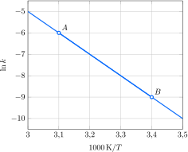
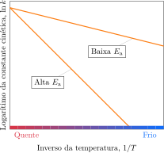
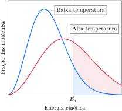

# Os modelos de reações

As leis de velocidade e as constantes de velocidade permitem a compreensão dos processos moleculares das mudanças químicas. Embora um mecanismo de reação possa ser estabelecido experimentalmente, algumas questões sobre as razões pelas quais as constantes de velocidade das etapas individuais têm os valores que têm e por que variam com a temperatura precisam ser respondidas.

## O efeito da temperatura

As velocidades das reações químicas dependem da temperatura. A observação qualitativa é que muitas reações acontecem mais rapidamente quando a temperatura aumenta. Um aumento de $\pu{10 \degree C}$ na temperatura normal dobra, em geral, a velocidade de reação de espécies orgânicas em solução. É por isso que os alimentos precisam ser cozidos. O aquecimento acelera os processos que levam à ruptura das membranas celulares e à decomposição das proteínas. Por outro lado, os alimentos são refrigerados para retardar as reações químicas naturais que levam à sua decomposição. 

A mudança da constante de velocidade em função da temperatura resume a variação da velocidade de reação com a temperatura. Se a constante de velocidade aumenta com a temperatura, então a reação avança mais rapidamente para determinada quantidade de reagentes. No final do século XIX, o químico sueco Svante Arrhenius investigou o efeito quantitativo da temperatura nas velocidades de reações e descobriu que o gráfico do logaritmo da constante de velocidade ($\ln k$) contra o inverso da temperatura absoluta ($1/T$) é uma linha reta. Ele mostrou que
$$
    \ln k = \ln A - \dfrac{ E_\mathrm{a} }{ RT } \tag{1a}
$$
Uma forma alternativa dessa expressão, obtida tomando-se os antilogaritmos de ambos os lados, é
$$
    k = A e^{ -E_\mathrm{a}/RT } \tag{1b}
$$
As duas constantes, $A$ e $E_\mathrm{a}$, são conhecidas como parâmetros de Arrhenius da reação e são determinadas experimentalmente. $A$ é chamado de **fator pré-exponencial**, e $E_\mathrm{a}$ é **a energia de ativação**. $A$ e $E_\mathrm{a}$ são praticamente independentes da temperatura, mas dependem da reação que está sendo estudada. A equação de Arrhenius é aplicável a reações de qualquer ordem.

:::example

### Cálculo da energia de ativação usando o gráfico $\ln k \times 1/T$

A constante de velocidade da reação de segunda ordem entre bromoetano e íons hidróxido em água, 
$$
    \ce{ C2H5Br(aq) + OH^-(aq) -> C2H5OH(aq) + Br^-(aq) }
$$
foi medida em várias temperaturas, com os seguintes resultados:

**Determine** a energia de ativação da reação.

#### Calcule o coeficiente angular da curva usando dois pontos no gráfico.

Tomando os pontos $A$ e $B$:
$$
    \text{coef. angular} = \dfrac{ -9 - (-6) }{ \pu{3,4} - \pu{3,1}  } \times \pu{1000 K} 
    = \pu{-1e4 K}
$$

#### Calcule a energia de ativação.

Como o coeficiente angular é igual a $-E_\mathrm{a}/R$,
$$
    E_\mathrm{a} = - \pu{8,31 J.K-1.mol-1} \times (\pu{-1e4 K}) = \boxed{ \pu{83 kJ.mol-1} }
$$

:::

Dizemos que as reações que dão uma linha reta em um gráfico de $\ln k$ contra $1/T$ têm comportamento de Arrhenius. Uma grande variedade de reações tem comportamento de Arrhenius. Por exemplo, os vaga-lumes piscam mais rapidamente em noites mais quentes do que em noites mais frias, e a velocidade dos pulsos é do tipo Arrhenius em uma faixa estreita de temperaturas. Essa observação sugere que as reações bioquímicas responsáveis pelos pulsos de luz têm constantes de velocidade que aumentam com a temperatura de acordo com a Equação ZZZZ. 

Como a inclinação do gráfico de Arrhenius é proporcional a $E_\mathrm{a}$, segue-se que, *quanto maior for a energia de ativação maior será a variação da constante de velocidade com a temperatura*. As reações que têm energias de ativação baixas (ao redor de $\pu{10 kJ.mol-1}$, com gráficos de Arrhenius não muito inclinados) têm velocidades que crescem muito pouco com a temperatura. As reações que têm energias de ativação altas (acima de $\pu{60 kJ.mol-1}$, aproximadamente, com gráficos de Arrhenius muito inclinados) têm velocidades que dependem fortemente da temperatura (Figura XXXXX).

A equação de Arrhenius é usada na predição do valor de uma constante de velocidade em uma temperatura a partir de seu valor em outra temperatura.

:::derivation

### Como isso é feito?

As equações de Arrhenius nas duas temperaturas, $T_1$ e $T_2$, quando as constantes de velocidade da reação têm os valores $k_1$ e $k_2$, respectivamente, são
$$
\begin{aligned}
    \text{Em $T_1$:} \quad \ln k_1 &= \ln A - \dfrac{ E_\mathrm{a} }{ RT_1 } \\
    \text{Em $T_2$:} \quad \ln k_2 &= \ln A - \dfrac{ E_\mathrm{a} }{ RT_2 }
\end{aligned}
$$
Elimine $\ln A$ subtraindo a primeira equação da segunda:
$$
    \overbrace{ \ln k_2 - \ln k_1 }^{ \ln (k_2/k_1) } = - \dfrac{ E_\mathrm{a} }{ RT_2 } + \dfrac{ E_\mathrm{a} }{ RT_1 }
$$

:::

A expressão obtida pode ser rearranjada como
$$
    \ln \left( \dfrac{k_2}{k_1} \right) 
        = -\dfrac{ E_\mathrm{a} }{ R } \left( \dfrac{1}{T_2} - \dfrac{1}{T_1} \right)
$$
Essa expressão tem a seguinte interpretação:

- Quando $T_2 > T_1$, o lado direito é positivo, logo $\ln (k_2/k_1)$ é positivo, isto é, $k_2 > k_1$. Isso significa que a constante de velocidade cresce com a temperatura.
- Para valores fixos de $T_1$ e $T_2$, $\ln(k_2/k_1)$ é grande quando $E_\mathrm{a}$ for grande. Logo, o aumento da constante de velocidade é grande quando a ativação for grande.

:::example

### Cálculo da constante de velocidade em uma nova temperatura usando a energia de ativação.

A constante de velocidade da reação de segunda ordem entre bromoetano e íons hidróxido em água, 
$$
    \ce{ C2H5Br(aq) + OH^-(aq) -> C2H5OH(aq) + Br^-(aq) }
$$
foi medida em várias temperaturas, com os seguintes resultados

:::

## As velocidades e o equilíbrio

No equilíbrio, as velocidades das reações totais diretas e inversas e as velocidades de cada par de reações individuais diretas e inversas em determinada etapa do mecanismo são idênticas. Como as velocidades são funções de constantes de velocidade e de concentrações, é possível encontrar uma relação entre as constantes de velocidade das reações elementares e as constantes de equilíbrio da reação total.

:::derivation

### Como isso é feito?

Para deduzir a relação entre as constantes de velocidade e as constantes de equilíbrio, devemos lembrar que a constante de equilíbrio de uma reação química em solução que tem a forma $\ce{A + B <=> C + D}$ é
$$
    K = \dfrac{ [\ce{C}][\ce{D}] }{ [\ce{A}][\ce{B}] }
$$
Suponha que os experimentos mostraram que as reações direta e inversa são reações elementares de segunda ordem. Neste caso, as leis da velocidade são
$$
\begin{aligned}
    \ce{ A + B &-> C + D } \quad v_1 = k_1 [\ce{A}][\ce{B}] \\
    \ce{ C + D &-> A + D } \quad v_{-1} = k_{-1} [\ce{C}][\ce{D}]
\end{aligned}
$$
No equilíbrio, as duas velocidades são iguais. Portanto
$$
    k_1 [\ce{A}][\ce{B}] = k_{-1} [\ce{C}][\ce{D}]
$$
Logo, no equilíbrio,
$$
    \dfrac{ [\ce{C}][\ce{D}] }{ [\ce{A}][\ce{B}] } = \dfrac{ k_1 }{ k_{-1} }
$$
A comparação dessa expressão com a expressão da constante de equilíbrio mostra que
$$
    \boxed{ K = \dfrac{ k_1 }{ k_{-1} } }
$$

:::

O cálculo mostra que, para uma reação em uma única etapa, a constante de equilíbrio da reação direta está relacionada às constantes cinéticas das reações elementares direta e inversa pela expressão
$$
    K = \dfrac{ k_1 }{ k_{-1} }
$$

A Equação XXX é válida quando a reação ocorre em uma única etapa em cada direção. Se uma reação tem um mecanismo complexo no qual as reações elementares diretas têm constantes de velocidade $k_1, k_2,\ldots$, e as reações elementares inversas têm constantes de velocidade $k_{-1}, k_{-2}, \ldots$ então um argumento semelhante ao da reação de etapa única permite concluir que a constante de equilíbrio total está relacionada às constantes de velocidade como:
$$
    K = \dfrac{ k_1 }{ k_{-1} } \times \dfrac{ k_2 }{ k_{-2} } \times \ldots
$$

> A constante de equilíbrio de uma reação elementar é igual à razão entre as constantes de velocidade direta e inversa da reação ou, no caso das reações em muitas etapas, à razão entre o produto das constantes de velocidade diretas e o produto das constantes de velocidade inversas.

## A teoria das colisões

## A teoria do estado de transição

Embora a teoria das colisões se aplique às reações em fase gás, alguns de seus conceitos podem ser ampliados para explicar por que a equação de Arrhenius também se aplica a reações em solução. Em solução, as moléculas não correm velozmente pelo espaço e colidem, mas se movem juntamente com as moléculas de solvente e permanecem nas vizinhanças umas das outras por períodos relativamente longos. A teoria mais geral que explica esse comportamento (e as reações em fase gás), é chamada de **teoria do estado de transição**. Essa teoria aperfeiçoa a teoria das colisões ao sugerir um modo de calcular a constante de velocidade mesmo quando as exigências estéricas são significativas.

Na teoria do estado de transição, duas moléculas se aproximam e se deformam quando chegam muito perto uma da outra. Na fase gás, o encontro e a deformação equivalem à *colisão* da teoria das colisões. Em solução, a aproximação é uma trajetória em zigue-zague entre moléculas de solvente, e a deformação pode não ocorrer até que as duas moléculas de reagentes tenham se encontrado e recebido um *chute* particularmente vigoroso das moléculas do solvente que estão ao redor. Nos dois casos, a colisão ou o *chute* não desfazem as moléculas imediatamente. Em vez disso, o encontro leva à formação de um **complexo ativado**, um arranjo das duas moléculas que pode prosseguir na direção dos produtos ou se separar para restabelecer os reagentes não modificados.

No complexo ativado, as ligações originais se esticaram e enfraqueceram, e as novas ligações só estão parcialmente formadas. Por exemplo, na reação de transferência de próton entre o ácido fraco $\ce{HCN}$ e a água, o complexo ativado pode ser representado como uma
molécula de $\ce{HCN}$, com o átomo de hidrogênio envolvido no processo de formação de uma ligação hidrogênio com o átomo de oxigênio de uma molécula de água e colocado a meio caminho entre as duas moléculas. Nesse ponto, o átomo de hidrogênio poderia voltar a formar $\ce{HCN}$ ou transformar-se em $\ce{H3O^+}$.

Na teoria do estado de transição, a energia de ativação é uma medida da energia do complexo ativado em relação à dos reagentes. O perfil de reação da Figura XXXX mostra como a energia potencial total varia à medida que os reagentes se aproximam, encontram-se, formam o complexo ativado e prosseguem na direção dos produtos. Um perfil de reação mostra a energia potencial dos reagentes e produtos, com a energia total dependendo de sua posição relativa, não de sua velocidade. Considere o que acontece quando os reagentes se aproximam com uma determinada energia cinética. Quando eles se aproximam, perdem energia cinética e sobem o lado esquerdo da barreira (em outras palavras, suas energias potenciais aumentam devido à repulsão resultante da aproximação e da distorção de suas ligações). Se os reagentes têm energia cinética inferior a $E_\mathrm{a}$, eles não atingem o topo da barreira de potencial e *rolam* de volta pelo lado esquerdo, separando-se. Se eles têm energia cinética no mínimo igual a $E_\mathrm{a}$, podem formar o complexo ativado, passar o topo da barreira, um arranjo específico de átomos conhecidos como **estado de transição**, e *rolar* pelo outro lado, onde se separam como produtos.

[FIGURA DO COMPLEXO ATIVADO]

Uma superfície de energia potencial pode ajudar a visualizar as mudanças de energia que ocorrem durante uma reação em função da posição dos átomos. Neste gráfico tridimensional, o eixo $z$ é uma medida da energia potencial total dos reagentes e produtos, e os eixos $x$ e $y$ representam distâncias interatômicas. Por exemplo, o gráfico da Fig. YYYY mostra as mudanças de energia potencial que ocorrem durante o ataque de um átomo de bromo a uma molécula de hidrogênio e o processo inverso, o ataque de um átomo de hidrogênio a uma molécula de $\ce{HBr}$:
$$
    \ce{ H2 + Br^. <--> HBr + H^. }
$$
As regiões de baixa energia que correspondem aos reagentes ou aos produtos estão separadas por uma barreira na qual há uma trajetória de energia potencial mínima que a energia cinética das moléculas que se aproximam deve ultrapassar. A trajetória real do encontro depende da energia total das partículas, mas é possível ter uma noção do processo da reação examinando apenas as mudanças de energia potencial. Suponha, por exemplo, que a ligação $\ce{H-H}$ mantém o mesmo comprimento à medida que o átomo de $\ce{Br}$ se aproxima. Isso levaria o sistema ao ponto A, um estado de energia potencial muito alta. Na verdade, em temperaturas normais, as espécies que colidem podem não ter energia cinética suficiente para atingir este ponto. A trajetória com a menor energia potencial é aquela que sobe do chão do vale, através do *ponto de sela* (uma região com formato de sela) até o topo da passagem e desce até o chão do vale do outro lado. Somente o caminho de menor energia está disponível, mas para segui-lo a ligação $\ce{H-H}$ deve aumentar à medida que a nova ligação $\ce{H-Br}$ começa a se formar.

Como na teoria das colisões, a velocidade da reação depende da frequência com que os reagentes podem formar o complexo ativado e entrar no estado de transição no topo da barreira. A expressão resultante para a constante de velocidade é muito semelhante à da Equação ZZZZ, de modo que essa teoria mais geral também explica a forma da equação de Arrhenius e a dependência observada da velocidade de reação com a temperatura.

> Na teoria do estado de transição, uma reação só ocorre se duas moléculas adquirem energia suficiente, talvez do solvente ao redor, para formar um complexo ativado e atravessar o estado de transição no topo de uma barreira de energia.

# A catálise

As velocidades de muitas reações aumentam se a concentração de reagentes ou a temperatura aumentam. Outra forma de aumentar a velocidade de uma reação é utilizando um catalisador, uma substância que aumenta a velocidade sem ser consumida na reação. Em muitos casos, apenas uma pequena quantidade de catalisador é necessária, porque ele não é consumido e age muitas e muitas vezes. É por isso que pequenas quantidades de clorofluorocarbonetos podem ter um efeito tão devastador na camada de ozônio da estratosfera – eles se decompõem em radicais que catalisam a destruição do ozônio.

## A atuação dos catalisadores

Um catalisador acelera uma reação fornecendo um caminho alternativo – um mecanismo de reação diferente – entre reagentes e produtos. Esse novo caminho tem energia de ativação mais baixa do que o caminho original. Na mesma temperatura, uma fração maior de moléculas de reagente pode cruzar a barreira mais baixa da trajetória catalisada e se converter em produtos do que ocorreria na ausência do catalisador. Embora a reação ocorra mais rapidamente, o catalisador não afeta a composição de equilíbrio. Ambas as reações, direta e inversa, são aceleradas no caminho catalisado, o que deixa a constante de equilíbrio inalterada.

Um **catalisador homogêneo** é um catalisador que está na mesma fase dos reagentes. Se os reagentes são gases, o catalisador homogêneo é também um gás. Se os reagentes são líquidos, o catalisador homogêneo se dissolve na solução. Bromo dissolvido é um catalisador homogêneo da decomposição de peróxido de hidrogênio em água:
$$
    \ce{ 2 H2O2(aq) ->[Br2] 2 H2O(l) + O2(g) }
$$
Na ausência de bromo ou de outro catalisador, uma solução de peróxido de hidrogênio pode ser armazenada por um longo tempo em temperatura normal. No entanto, bolhas de oxigênio formam-se rapidamente assim que uma gota de bromo é adicionada. Acredita-se que o papel do bromo nessa reação é a redução a $\ce{Br2}$ em uma primeira etapa, seguida por oxidação a Br2 em uma segunda etapa. As equações totais para cada etapa (não as reações elementares, as quais são numerosas em cada caso e não serão detalhadas aqui) são
$$
\begin{aligned}
    \ce{ Br2(aq) + H2O2(aq) &-> 2 Br^-(aq) + 2 H+(aq) + O2(g) } \\
    \ce{ 2 Br^-(aq) + H2O2(aq) + 2H^+ &-> Br2(aq) + 2 H2O(l) }
\end{aligned}
$$
Quando as duas equações são somadas, tanto o catalisador, $\ce{Br2}$, quanto o intermediário, $\ce{Br^-}$, se cancelam, e a equação total é $\ce{2 H2O2(aq) -> 2 H2O(l) + O2(g)}$. Assim, embora as moléculas de $\ce{Br2}$ tenham participado da reação, elas não são consumidas e podem atuar repetidas vezes.

Apesar do catalisador não aparecer na equação balanceada de uma reação, a concentração do catalisador homogêneo pode aparecer na lei de velocidade. Por exemplo, a reação entre íons triiodeto e íons azida é muito lenta, a não ser que um catalisador como o dissulfeto de carbono esteja presente:
$$
    \ce{ I3^-(aq) + 2 N3^-(aq) ->[CS2] 3 I^-(aq) + 3 N2(g) }
$$
A lei de velocidade experimental para essa reação é
$$
    v = k [\ce{CS2}][\ce{N3-}]
$$
Note que a lei de velocidade é de primeira ordem no catalisador, dissulfeto de carbono, mas de ordem zero no íon triiodeto.

Um catalisador heterogêneo é um catalisador que está em uma fase diferente da dos reagentes. Os catalisadores heterogêneos mais comuns são sólidos finamente divididos ou porosos, usados em reações em fase gás ou líquido. Eles são finamente divididos ou porosos para que tenham a grande área superficial necessária para as reações elementares que permitem o caminho catalisado. Um exemplo é o catalisador ferro usado no processo de Haber para a amônia, outro é o níquel finamente dividido, usado na hidrogenação do eteno:
$$
    \ce{ H2C=CH2(g) + H2(g) ->[Ni] H3C-CH3(g) }
$$
O reagente é adsorvido na superfície do catalisador. Quando uma molécula de reagente se liga à superfície do catalisador, suas ligações são enfraquecidas e a reação pode ocorrer mais rapidamente, porque as ligações são quebradas mais facilmente.

:::example

### Cálculo do efeito de um catalisador na velocidade de reação

A energia de ativação da decomposição do peróxido de hidrogênio é $\pu{75 kJ.mol-1}$. Na presença do catalisador óxido de ferro, a energia de ativação da decomposição foi $\pu{35 kJ.mol-1}$.

**Calcule** o aumento na velocidade de decomposição em $\pu{25 \degree C}$ na presença do catalisador se os outros parâmetros do processo se mantêm inalterados.

#### Calcule a razão entre as contantes cinéticas

De $k = A e^{-E_\mathrm{a}/RT}$:
$$
    \dfrac{ k_2 }{ k_1 } = \dfrac{ A e^{-E_\mathrm{a2}/RT} }{ A e^{-E_\mathrm{a1}/RT} } = e^{ -(E_\mathrm{a2} - E_\mathrm{a1})/RT }
$$
Logo, com
$$
    \dfrac{ E_\mathrm{a2} - E_\mathrm{a1} }{ RT } = \dfrac{ (\pu{35} - \pu{75})\times 10^3\,\pu{J.mol-1} }{ \pu{8,31 J.K-1.mol-1} \times \pu{298 K} } = \pu{-16,2}
$$
A razão das constantes de velocidade é
$$
    \dfrac{ k_2 }{ k_1 } = e^{16,2} = \boxed{ 10^7 }
$$
A velocidade é dez milhões de vezes maior.

:::

> Os catalisadores participam das reações, mas não são consumidos. Eles permitem um caminho de reação com energia de ativação mais baixa. Os catalisadores são classificados como homogêneos e heterogêneos.

## Os catalisadores industriais

Os conversores catalíticos de automóveis usam catalisadores para garantir a combustão rápida e completa do combustível que não foi queimado nos cilindros. A mistura de gases que sai de um motor inclui não apenas o dióxido de carbono e a água, como também monóxido de carbono, hidrocarbonetos não queimados e óxidos de nitrogênio designados coletivamente como $\ce{NO_x}$. A poluição do ar decresce se os compostos de carbono forem oxidados a dióxido de carbono e os NOx reduzidos, por outro catalisador, a nitrogênio. O desafio é encontrar um catalisador – ou uma mistura de catalisadores – que acelere as reações de oxidação e redução e seja ativo quando o carro for ligado e o motor estiver frio.

Os catalisadores microporosos são catalisadores heterogêneos que, devido à grande área superficial e especificidade, são usados em conversores catalíticos e muitas outras aplicações especializadas. As zeólitas, por exemplo, são aluminossilicatos microporosos com estruturas tridimensionais que contêm canais hexagonais ligados por túneis. Nesses conversores, eles retêm os óxidos de nitrogênio e os reduzem a nitrogênio, um gás inerte. Catalisadores com uma formulação diferente absorvem os hidrocarbonetos incompletamente queimados e os oxidam a dióxido de carbono. A natureza fechada dos sítios ativos das zeólitas lhes dá uma vantagem sobre outros catalisadores, porque os intermediários permanecem no interior dos canais até que os produtos se formem. Além disso, os canais só permitem o crescimento dos produtos até certo ponto. Uma aplicação bem-sucedida das zeólitas é o catalisador ZSM-5, usado na conversão de metanol em gasolina. Os poros da zeólita são grandes o suficiente para produzir hidrocarbonetos de cerca de oito átomos de carbono, e as cadeias não crescem muito.

Os catalisadores podem ser **envenenados** ou inativados. Uma causa comum de envenenamento é a adsorção de uma molécula tão fortemente ao catalisador que ela sela a superfície desse catalisador para reações posteriores. Alguns metais pesados, especialmente o chumbo, são venenos muito potentes para catalisadores heterogêneos, o que explica por que gasolina isenta de chumbo tem de ser usada em motores equipados com conversores catalíticos.

> Catalisadores microporosos são catalisadores heterogêneos como, por exemplo, as zeólitas que têm grande área superficial.

## Os catalisadores vivos: as enzimas

As células vivas contêm milhares de tipos diferentes de catalisadores, cada um dos quais é necessário à vida. Muitos desses catalisadores são proteínas chamadas de enzimas, moléculas muito grandes que têm um sítio ativo semelhante a uma cavidade onde a reação acontece. O **substrato**, a molécula sobre a qual a enzima age, encaixa-se na cavidade como uma chave se encaixa em uma fechadura. No entanto, ao contrário de uma fechadura comum, a molécula de proteína se distorce ligeiramente quando a molécula de substrato se aproxima, e sua capacidade em realizar a distorção correta também determina se a *chave* irá servir. Esse refinamento do modelo original chave-fechadura é conhecido como **mecanismo de ajuste induzido** da ação enzimática.

Uma vez no sítio ativo, o substrato reage. O produto é liberado para uso na etapa seguinte, que é controlada por outra enzima, e a molécula da enzima original fica livre para receber a próxima molécula de substrato. Um exemplo de enzima é a amilase, que existe na boca humana. A amilase da saliva ajuda a transformar o amido dos alimentos em glicose, que é mais facilmente digerida. Se você mastigar um biscoito por tempo suficiente, poderá notar que o sabor adocicado aumenta progressivamente.

A cinética das reações enzimáticas foi estudada pela primeira vez pelos químicos Leonor Michaelis e Maud Menten no início do século XX. Eles descobriram que, quando a concentração do substrato é baixa, a velocidade de uma reação catalisada por uma enzima aumenta com a concentração do substrato, como no gráfico da Figura XXXX No entanto, quando a concentração do substrato é alta, a velocidade da reação depende apenas da concentração da enzima. No **mecanismo de Michaelis-Menten** da reação enzimática, a enzima $\ce{E}$ se liga irreversivelmente ao substrato $\ce{S}$, formando o complexo ligado $\ce{ES}$. O complexo se decompõe com uma cinética de primeira ordem, liberando a enzima para
agir novamente:
$$
\begin{aligned}
    \ce{ E + S &<-->[$k_1$][$k_{-1}$] ES } \\
    \ce{ ES &<-->[$k_2$] E + P }
\end{aligned}
$$
Quando a lei de velocidade total é determinada, encontra-se
$$
    v = \dfrac{ k_2 [\ce{E}]_0[\ce{S}] }{ K_\mathrm{M} + [\ce{S}] } \tag{1a}
$$
em que $[\ce{E}]_0$ é a concentração total de enzima (ligada e não ligada) e a **constante de Michaelis**, $K_\mathrm{M}$, é
$$
    K_\mathrm{M} = \dfrac{ k_{-1} + k_2 }{ k_1 } \tag{1b}
$$
Quando a concentração de substrato é muito grande, $[\ce{S}] \gg K_\mathrm{M}$, a velocidade é máxima:
$$
    v_\mathrm{max} = k_2 [\ce{E}]_0
$$
Assim, a Equação 3 pode ser reescrita como:
$$
    v = \dfrac{ v_\mathrm{max} [\ce{S}] }{ K_\mathrm{M} + [\ce{S}] } \tag{1c}
$$

Uma forma de envenenamento biológico reproduz o efeito do chumbo em um conversor catalítico. A atividade das enzimas é destruída se um substrato estranho se liga muito fortemente ao sítio de reação, porque o sítio é bloqueado e deixa de estar disponível para o substrato. Como resultado, a cadeia de reações bioquímicas da célula para e a célula morre. Os **agentes nervosos** atuam bloqueando as reações controladas por enzimas que permitem a transmissão de impulsos nervosos pelos nervos. O arsênio age de modo semelhante. Após ingestão de Arsênio(V), na forma de íons arsenato ($\ce{AsO4^{2-}}$), ocorre redução a Arsênio(III), que se liga a enzimas e inibe suas ações. Contudo, nem toda intoxicação por enzimas é prejudicial. As enzimas da família das ciclo-oxigenases são responsáveis pela produção de prostaglandinas e tromboxanos, que são precursores de processos inflamatórios. Em pacientes com artrite crônica, essas enzimas são extremamente reativas, o que causa inflamações dolorosas nas articulações. A aspirina, (ácido
acetil-salicílico), reduz a inflamação reagindo irreversivelmente com as ciclo-oxigenases, interrompendo a atividade catalítica.

> As enzimas são catalisadores biológicos cuja função é modificar moléculas de substrato e promover reações