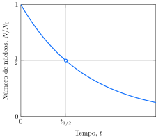

# A velocidade de decaimento nuclear
 
A equação do decaimento de um núcleo tem exatamente a mesma forma da reação elementar unimolecular, com um núcleo instável tomando o lugar de uma molécula de reagente. Esse tipo de decaimento é o esperado para um processo que não depende de fatores externos, somente da instabilidade intrínseca do núcleo. A velocidade de decaimento nuclear depende somente da identidade do isótopo, não de sua forma química ou da temperatura.

## A medida da velocidade de decaimento nuclear

Os **contadores Geiger** usam a ionização de um gás, normalmente o argônio, quando exposto à radiação nuclear. Os **contadores de cintilação** medem a radiação contando a centelha gerada quando a radiação incide sobre uma substância específica, chamada de fosforescente. Ambos são usados para medir a velocidade com a qual um núcleo radioativo decai. Cada estalo de um contador Geiger, ou centelha do fósforo de um **contador de cintilação**, indica que uma desintegração nuclear foi detectada. A **atividade** de uma amostra, $A$, é o número de desintegrações nucleares que ocorrem em um determinado intervalo de tempo dividido pela extensão do intervalo. A unidade SI de atividade é o **becquerel** ($\pu{Bq}$): $\pu{1 Bq}$ é igual a uma desintegração nuclear por segundo. Outra unidade de radioatividade de uso comum (não é SI) é o curie (Ci). Ela é igual a $\pu{3,7e10}$ desintegrações nucleares por segundo, a radioatividade emitida por $\pu{1 g}$ de rádio-226. Como o curie é uma unidade muito grande, as atividades são geralmente expressas em milicuries ($\pu{mCi}$) ou microcuries ($\pu{\mu Ci}$).

Assim como uma reação química unimolecular, a lei da velocidade de decaimento nuclear é de primeira ordem. Isto é, a relação entre a velocidade de decaimento e o número $N$ de núcleos radioativos presentes é dada pela **lei do decaimento radioativo**:
$$
    A = \text{velocidade de decaimento} = k \times N \tag{3}
$$
Nesse contexto, $k$ é chamado de **constante de decaimento**. A lei nos diz que a atividade de uma amostra radioativa é proporcional ao número de átomos da amostra. Uma lei de velocidade de primeira ordem implica um decaimento exponencial. Em consequência, o número, $N$, de núcleos restantes após um certo tempo, $t$, é dado por
$$
    N = N_0 e^{-kt}
$$
em que $N_0$ é o número de núcleos radioativos inicialmente presentes (em $t = 0$). A Figura 1 mostra um gráfico dessa expressão.

O decaimento radioativo é normalmente discutido em termos de **meia-vida**, $t_{1/2}$, isto é, o tempo necessário para que se desintegre a metade do número inicial dos núcleos. A meia-vida pode ser relacionado a $k$ fazendo $N = \frac{1}{2}N_0$ e $t = t_{1/2}$ na Equação 3:
$$
    t_{1/2} = \dfrac{\ln 2}{k}
$$
Essa equação mostra que quanto maior for o valor de $k$, mais curta será a meia-vida do nuclídeo. Os nuclídeos com tempos de meia-vida curtos são menos estáveis do que os nuclídeos com tempos de meia-vida longos. Eles decaem mais em um dado período de tempo e são mais *quentes* (mais intensamente radioativos) do que os nuclídeos com tempos de meia-vida longos.

:::example

### Uso da lei do decaimento radioativo

Uma das razões pelas quais as armas termonucleares têm de sofrer manutenção regular é que o trítio nelas contido sofre decaimento nuclear.
$$
    \ce{ ^3H -> ^3_2He + ^0_{-1}$\beta$ }
$$
A constante de decaimento do trítio é $\pu{0,056 a-1}$.

**Calcule** massa da amostra de trítio inicial com massa $\pu{1 g}$ permanecerá após 5 anos.

#### Calcule a massa remanescente.

De $m = m_0 e^{-kt}$:
$$
    m = \pu{1 g} \times e^{- \pu{0,056 a-1} \times \pu{5 a} } = \boxed{ \pu{0,75}{g} }
$$

:::

As meias-vidas de nuclídeos radioativos variam em um intervalo muito amplo (Tabela 1). 

:::displaytable

#### Meia-vidas

| Nuclídeo     | Meia-vida, $t_{1/2}$ |
| :----------- | -------------------: |
| trítio       |      $\pu{12,30  a}$ |
| carbono-14   |      $\pu{ 5,73 ka}$ |
| carbono-15   |      $\pu{ 2,40  s}$ |
| potássio-40  |      $\pu{ 1,26 Ga}$ |
| cobalto-60   |      $\pu{ 5,26  a}$ |
| estrôncio-90 |      $\pu{28,10  a}$ |
| iodo-131     |      $\pu{ 8,05  d}$ |
| césio-137    |      $\pu{30,17  a}$ |
| rádio-226    |      $\pu{ 1,60 ka}$ |
| urânio-235   |      $\pu{ 0,71 Ga}$ |
| urânio-238   |      $\pu{ 4,50 Ga}$ |
| férmio-244   |      $\pu{12,30  a}$ |

:::

Considere o estrôncio-90, cuja meia-vida é $\pu{28,1 a}$. Esse nuclídeo ocorre na **precipitação radioativa**, a poeira fina que se deposita das nuvens após a explosão de uma bomba nuclear, e pode ocorrer também na liberação acidental de materiais radioativos no ar. Como ele é quimicamente muito semelhante ao cálcio, o estrôncio acompanha esse elemento no ambiente e se incorpora aos ossos de animais. Uma vez lá, ele continua a emitir radiação por muitos anos. Aproximadamente dez meaias-vidas (para o estrôncio-90, $\pu{281 a}$) devem se passar antes que a atividade de uma amostra caia até $1/1000$ de seu valor inicial. O iodo-131 é um radioisótopo que foi liberado no incêndio acidental da usina nuclear de Chernobyl, em 1986, e na explosão do reator de Fukushima, no Japão, logo após o tsunami que atingiu o país em 2011. Sua meia-vida é de apenas $\pu{8,05 d}$, mas ele se acumula na glândula tireoide. Comprimidos de iodo foram distribuídos aos moradores das regiões afetadas pelo desastre para que suas glândulas tireoides se saturassem com o elemento, reduzindo portanto a quantidade de iodo radioativo absorvida. Apesar dessas precauções, diversos casos de câncer da tireoide foram ligadas à exposição de iodo-131 proveniente do acidente nuclear. O plutônio-239 tem meia-vida igual a $\pu{24 ka}$. Isso significa que são necessárias instalações próprias para o armazenamento dos resíduos de plutônio por longos períodos e que a terra contaminada com plutônio não poderá ser habitada novamente por milhares de anos sem enormes gastos com reparação.

> A lei de decaimento radioativo mostra que o número de núcleos radioativos decai exponencialmente com o tempo, com meia‑vida característica.

## A datação

A constante de meia-vida de um nuclídeo é usada, na prática, na determinação da idade de artefatos arqueológicos. Na datação isotópica, mede-se a atividade dos isótopos radioativos que eles contêm. Os isótopos radioativos usados para a datação incluem o urânio-238, o potássio-40 e o trítio ($\ce{^3H}$). Entretanto, o exemplo mais importante é a datação por carbono radioativo, que utiliza o decaimento $\beta$ do carbono-14, cuja meia-vida é $\pu{5730 a}$. 

O carbono-12 é o principal isótopo do carbono, mas existe uma proporção pequena de carbono-14 em todos os seres vivos. Seus núcleos são produzidos quando os núcleos de nitrogênio da atmosfera são bombardeados pelos nêutrons formados nas colisões de raios cósmicos com outros núcleos:
$$
    \ce{ ^{14}_{7}N + ^{1}_{0}n -> ^{14}_{6}C + ^{1}_{1}p }
$$
Os átomos de carbono-14 são produzidos na atmosfera em velocidade aproximadamente constante, e a proporção entre o carbono-14 e o carbono-12 na atmosfera é aproximadamente constante com o tempo. Os átomos de carbono-14 são incorporados aos organismos vivos como $\ce{^{14}CO2}$ por meio da fotossíntese e da digestão. Eles deixam os organismos vivos pelos processos normais de excreção e respiração e também por decaimento a uma velocidade determinada. Como resultado, todos os organismos vivos têm uma razão fixa (de cerca de $\pu{1 ppt}$) entre os átomos de carbono-14 e os átomos de carbono-12, e $\pu{1 g}$ de carbono natural tem a atividade de 15 desintegrações por minuto.

Quando o organismo morre, não ocorre mais troca do carbono com a vizinhança. Entretanto, os núcleos de carbono-14 que estão no organismo morto continuam a desintegrar-se com uma meia-vida constante; logo, a relação entre carbono-14 e carbono-12 decresce. A razão observada em uma amostra de tecido morto pode, portanto, ser usada para estimar o tempo decorrido desde a morte.

Na técnica desenvolvida por Willard Libby, em Chicago, no final dos anos 40, a proporção de carbono-14 é determinada pelo monitoramento da radiação $\beta$ proveniente do $\ce{CO2}$ obtido pela combustão da amostra. Na versão moderna da técnica, que só requer alguns poucos miligramas de amostra, os átomos de carbono são convertidos em íons $\ce{C^-}$ pelo bombardeamento da amostra com átomos de césio. Os íons $\ce{C^-}$ são acelerados por campos elétricos e os isotopos do carbono são separados e contatos em um espectômetro de massas.

:::example

### Interpretação da datação com carbono-14

Uma amostra de carbono de massa $\pu{1 g}$ da madeira produziu $\pu{7,9e3}$ desintegrações do carbono-14 em um período de $\pu{20 h}$. No mesmo período, $\pu{1 g}$ de carbono de uma fonte recente que você está usando produziu $\pu{1,84e4}$ desintegrações.

A meia-vida do $\ce{^{14}C}$ é $\pu{5,73 ka}$.

**Calcule** a idade da amostra arqueológica.

#### Calcule a constante de decaimento.

De $t_{1/2} = \ln 2/k$:
$$
    k = \dfrac{ \ln 2 }{ \pu{5730 a} } = \pu{1,2e-4 a-1}
$$

#### Calcule o tempo decorrido.

De $A = A_0 e^{-kt}$:
$$
    t = \frac{1}{k} \ln\left( \dfrac{A_0}{A} \right)
$$
Substituindo os dados,
$$
    t = \frac{1}{ \pu{1,2e-4 a-1} } \times \ln\left( \dfrac{18400}{7900} \right) = \boxed{ \pu{7000 a} }
$$

:::

Os isótopos também são usados na determinação das características do ambiente. Assim como o carbono-14 é utilizado para datar materiais orgânicos, os geólogos podem determinar a idade de rochas muito antigas usando materiais com meias-vidas mais longas. O urânio-238
($t_{1/2} = \pu{4,5 Ga}$, $\pu{1 Ga} = \pu{1e9 anos}$) e o potássio-40 ($t_{1/2} = \pu{1,26 Ga}$) são usados para datar rochas. O potássio-40 se desintegra por captura de um elétron para formar argônio-40. A rocha é colocada sob vácuo e esmagada, e um espectrômetro de massas mede a quantidade de gás argônio liberada. Essa técnica foi usada para determinar a idade de rochas da superfície da lua: elas tinham entre 3,5 e 4,0 bilhões de anos, mais ou menos a mesma idade das rochas da Terra.

:::example

### Interpretação da datação com urânio-238

Uma rocha contem $\pu{0,7 g}$ de chumbo-206 para cada grama de urânio-238. A massa de chumbo-206 no instante de formação da rocha é desprezível.

A media vida do $\ce{^{238}U}$ é $\pu{4,5 Ga}$.

**Calcule** a idade da rocha.

#### Calcule a massa de urânio que produziu $\pu{0,7 g}$ de chumbo.

$$
    \Delta m = \pu{238 g.mol-1} \times \dfrac{ \pu{0,7 g} }{ \pu{206 g.mol-1} } = \pu{0,8 g}
$$

#### Calcule a massa inicial de urânio

$$
    m_0 = \pu{1 g} + \pu{0,8 g} = \pu{1,8 g}
$$

#### Calcule a constante de decaimento.

De $t_{1/2} = \ln 2/k$:
$$
    k = \dfrac{ \ln 2 }{ \pu{4,5 Ga} } = \pu{1,5e-11 a-1}
$$

#### Calcule a idade da rocha

De $m = m_0 e^{-kt}$:
$$
    t = \dfrac{1}{k} \ln\left( \dfrac{m_0}{m} \right)
$$
Substituindo:
$$
    t = \dfrac{1}{\pu{1,5e-11 a-1}} \ln\left( \dfrac{ \pu{1,8 g} }{ \pu{1 g} } \right)
        = \pu{ 4 Ga }
$$

:::

> Isótopos radioativos são usados para determinar as idades de objetos.

## A determinação de volumes

::: example

### Cálculo do volume 

O volume de plasma sanguíneo de um paciente foi medido por injeção de $\pu{5,0 mL}$ de uma solução em água albumina do soro sanguíneo humano marcada com $\ce{^{125}I}$ ($t_{1/2} = \pu{59,4 d}$). A atividade da amostra era $\pu{5 \mu Ci}$. Após $\pu{20 min}$, sangue do paciente foi retirado e centrifugado para obter o plasma. A atividade de $\pu{10 mL}$ de plasma foi $\pu{10 nCi}$. 

**Calcule** o volume do plasma do sangue do paciente.

#### Escreva a equação 

$$
    A = A_0 e^{-kt}
$$

#### Calcule o tempo decorrido.

$$
    t = - \pu{1,2e-4 a-1} \times \ln\left( \dfrac{7900}{18400} \right) = \boxed{ \pu{7000 a} }
$$

:::

> Isótopos radioativos são usados para determinar volumes com precisão.

# A radioatividade

A radiação nuclear é algumas vezes chamada de radiação ionizante, porque sua energia é suficiente para ejetar elétrons dos átomos. Os hospitais usam a radiação nuclear para destruir tecidos indesejáveis, como as células cancerosas. Porém, os mesmos efeitos poderosos que facilitam o diagnóstico e a cura de doenças podem também provocar danos em tecidos sadios. O dano depende da intensidade da fonte, do tipo de radiação e do tempo de exposição. Os três tipos principais de radiação nuclear têm capacidade diferente de penetrar a matéria.

## Os efeitos biológicos da radiação

As partículas $\alpha$, pesadas e com carga elevada, interagem tão fortemente com a matéria que sua velocidade se reduz, elas capturam elétrons da matéria circundante e se transformam em volumosos átomos de hélio antes de viajar para muito longe. Elas só penetram a primeira camada da pele e podem ser freadas por vidro, pela roupa e até mesmo por uma folha de papel. A camada superficial da pele morta absorve a maior parte da radiação $\alpha$, e nela os danos são pequenos. Entretanto, as partículas $\alpha$ podem ser extremamente perigosas se inaladas ou ingeridas. A energia do impacto pode arrancar átomos de moléculas, o que pode levar a sérias doenças e causar a morte. Por exemplo, o plutônio, considerado um dos mais tóxicos materiais radioativos, é um emissor de partículas $alpha$ e pode ser manuseado com segurança com proteção mínima. Ele, porém, é facilmente oxidado a $\ce{Pu^{4+}}$, que tem propriedades químicas semelhantes às do $\ce{Fe^{3+}}$. Como resultado, o plutônio pode substituir o ferro no organismo e ser absorvido pelos ossos, dentro dos quais destrói a capacidade do organismo de produzir as células vermelhas do sangue. Os resultados são doenças da radiação, câncer e morte.

A radiação $\beta$ vem em seguida em poder de penetração. Esses elétrons rápidos podem penetrar até $\pu{1 cm}$ no corpo antes que as interações eletrostáticas com os elétrons e o núcleo das moléculas interrompam seu curso.

A radiação $\gamma$ é a mais penetrante de todas. Os fótons de raios $\gamma$ de alta energia podem atravessar edifícios e corpos, além de causar danos pela ionização das moléculas que estão em sua trajetória. As moléculas de proteínas e DNA danificadas dessa maneira perdem sua função, e o resultado inclui doenças da radiação e câncer. Fontes intensas de raios $\gamma$ devem ser blindadas com tijolos de chumbo ou por uma camada espessa de concreto, para absorver essa radiação penetrante.

:::displaytable

#### Proteção necessária contra radiação

| Radiação | Penetração relativa | Proteção necessária     |
| :------- | ------------------: | :---------------------- |
| $\alpha$ |            $\pu{1}$ | papel, pele             |
| $\beta$  |          $\pu{100}$ | $\pu{3 mm}$ de alumínio |
| $\gamma$ |        $\pu{10000}$ | concreto, chumbo        |

:::

A dose absorvida de radiação é a energia depositada em uma amostra (em particular, o corpo humano) exposta à radiação. A unidade SI da dose absorvida é o gray, $\pu{Gy}$, que corresponde a um depósito de energia igual a $\pu{1 J.kg-1}$. A energia de uma partícula de radiação nuclear é altamente localizada, como o impacto de uma bala subatômica. Como resultado, as partículas incidentes podem quebrar ligações químicas quando colidem com moléculas em sua trajetória.

A extensão do dano causado pela radiação em tecidos vivos depende do tipo de radiação e do tipo de tecido. Portanto, **a eficiência biológica relativa**, $Q$, deve ser considerada quando avaliamos o dano causado por uma determinada dose de cada tipo de radiação. Para as radiações $\beta$ e $\gamma$, $Q$ vale arbitrariamente $1$, mas para a radiação $\alpha$, $Q$ fica próximo de $20$. A dose de $\pu{1 Gy}$ de radiação $\gamma$ causa aproximadamente o mesmo dano que $\pu{1 Gy}$ de radiação $\beta$, mas $\pu{1 Gy}$ de partículas $\alpha$ é cerca de 20 vezes mais destruidor (mesmo ela sendo a menos penetrante). Os números precisos dependem da dose total, da velocidade com que a dose se acumula e do tipo de tecido, mas esses valores são típicos.

A **dose equivalente** é a dose real modificada para levar em conta os diferentes poderes de dano dos vários tipos de radiação, em combinação com vários tipos de tecido. Ela é obtida pela multiplicação da dose real (em grays) pelo valor de $Q$ do tipo de radiação. O resultado é expresso na unidade SI chamada sievert ($\ce{Sv}$):
$$
    \text{Dose equivalente (Sv)} = Q \times \text{dose absorvida (Gy)}
$$
Uma dose de $\pu{0,3 Gy}$ de radiação $\gamma$ corresponde à dose equivalente de $\pu{0,3 Sv}$, suficiente para causar a redução do número de células brancas do sangue (as células que combatem as infecções), mas $\pu{0,3 Gy}$ de radiação $\alpha$ correspondem a $\pu{6 Sv}$, suficientes para matar se ingerida ou inalada. A média anual típica de dose equivalente que você recebe de fontes naturais, chamada de radiação de fundo, é cerca de $\pu{2 mSv.a-1}$, mas esse número varia, dependendo de seu estilo de vida e do lugar onde vive. Cerca de $20\%$ da radiação de fundo provêm de seu próprio corpo. Cerca de $30\%$ vêm dos raios cósmicos (uma mistura de raios $\gamma$ e partículas subatômicas de alta energia provenientes do espaço) que continuamente bombardeiam a Terra e $40\%$ vêm do radônio do solo. Os $10\%$ remanescentes provêm principalmente de diagnósticos médicos (por exemplo, uma única fotografia de raios X de tórax fornece, em geral, uma dose equivalente a $\pu{0,07 mSv}$). As emissões provenientes de usinas nucleares e outras instalações nucleares contribuem com cerca de $\pu{0,1}\%$ nos países em que elas são muito utilizadas.

> A exposição humana na presença de radiação é medida pela dose absorvida e pela dose equivalente. Esta última leva em conta os efeitos dos diferentes tipos de radiação sobre os tecidos.

## Os usos dos radioisótopos

Os radioisótopos são isótopos radioativos. Eles são usados na cura de doenças e, também, na preservação de alimentos, no acompanhamento dos mecanismos das reações e como combustível de naves espaciais.

Os traçadores radioativos são isótopos usados para acompanhar mudanças e determinar posições. Por exemplo, uma amostra de açúcar pode ser marcada com carbono-14, isto é, alguns dos átomos de carbono-12 das moléculas do açúcar são substituídos por átomos de carbono-14, que podem ser detectados por contadores de radiação. Dessa forma, as alterações que um número muito pequeno de moléculas do açúcar, que não podem ser detectadas por outros meios, sofrem no organismo podem ser monitoradas. Os químicos e bioquímicos usam traçadores para estudar o mecanismo das reações. Por exemplo, se água contendo oxigênio-18 é usada na fotossíntese, o oxigênio produzido contém oxigênio-18 (vermelho):
$$
    \ce{ 6 CO2(g) + 6 H2{\color{red}O}(l) -> C6H12O6(s, glicose) + 3 O2(g) + 3 {\color{red}O}2(g) }
$$
Esse resultado mostra que o oxigênio produzido na fotossíntese vem das moléculas de água,
e não das moléculas de dióxido de carbono.

Os radioisótopos têm aplicações comerciais importantes. Por exemplo, o amerício-241 é usado em detectores de fumaça. Seu papel é ionizar todas as partículas da fumaça, o que permite a passagem de corrente que aciona o alarme. A exposição à radiação é usada também na esterilização de alimentos e na inibição da germinação de batatas. Os isótopos radioativos que liberam muita energia na forma de calor são usados para fornecer energia em regiões de difícil acesso, onde o abastecimento com geradores não seria possível. Naves espaciais não tripuladas, como a *Voyager 2*, que já saiu do sistema solar, são abastecidas por isótopos com meias-vidas longas como o plutônio.

:::think

### Ponto para pensar

Qual o tempo de meia-vida ideal para o abastecimento de uma nave espacial?

:::

:::example

### Investigação de mecanismo usando isótopos

Para estudar o mecanismo da reação de síntese de um éster orgânico, o acetato de metila:
$$
    \ce{ CH3COOH(l) + CH3OH(l) -> CH3COOCH3(l) + H2O(l) }
$$
Precisa-se saber se o átomo de $\ce{O}$ presente no acetato de etila produzido vem do ácido acético inicial ou do metalol adicionado. 

**Proponha** um experimento que use isótopos e permita determinar a origem do átomo de oxigênio.

#### Escolha a molécula para ser marcada com o radioisotopo.

Quando a reação é conduzida com metanol marcado com oxigênio-18:
$$
    \ce{ CH3COOH(l) + CH3{\color{red}O}H(l) -> CH3CO{\color{red}O}CH3(l) + H2O(l)  }
$$
Verifica-se que o átomo de $\ce{O}$ presente no acetato de etila vem do metanol.

:::

> Os radioisótopos são usados como fontes de energia de longa duração e desempenham importante papel no estudo do meio ambiente e do monitoramento de movimentos. Eles são usados na biologia como traçadores em caminhos do metabolismo, na química para acompanhar mecanismos de reação e na geologia para determinar a idade das rochas.
