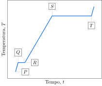

Considere a curva de aquecimento para uma substância sólida com apenas uma fase cristalina.

Considere as proposições.

1. [ ] Na região entre $P$ e $Q$ ocorre aumento da energia cinética.
2. [ ] Na região entre $Q$ e $R$ ocorre aumento da energia potencial.
3. [ ] O calor de fusão da substância é menor que o seu calor de vaporização.
4. [x] O  calor específico do sólido é maior que o calor específico do líquido.

**Assinale** a alternativa que relaciona as proposições *incorretas*.

