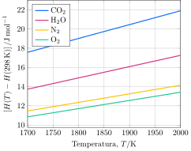

---
dados:
- Hf-H2O(g)
- Hf-CO2(g)
- Hf-metano(g)
---
Uma mistura ($1:15$) de metano e ar atmosférico, a $\pu{298 K}$ e $\pu{1 atm}$, entra em combustão em um reservatório adiabático, consumindo completamente o metano. O processo ocorre sob pressão constante e os produtos formados permanecem em fase gasosa.

- **Determine** a temperatura final do sistema.
- **Determine** a concentração final de vapor.

---

- $\pu{1733 K}$
- $\pu{5,2 mmol.L-1}$
