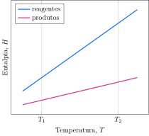

Considere a variação da entalpia com a temperatura para os reagentes e produtos de uma reação.

**Assinale** a alternativa *incorreta*.

- [ ] A reação ocorre com liberação de calor em $T_1$.
- [ ] A capacidade calorífica dos reagentes é maior que a dos produtos em $T_1$.
- [x] A reação ocorre com absorção de calor entre $T_1$ e $T_2$.
- [ ] O valor absoluto da entalpia de reação aumenta com o aumento de temperatura.
- [ ] A capacidade calorífica dos reagentes e dos produtos aumenta com o aumento da temperatura.   

