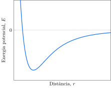

Moléculas diatômicas idênticas, na forma de um sólido cristalino, podem ser modeladas como um conjunto de osciladores.

1. [ ] À temperatura de $0 K$ a maioria dos osciladores estará no estado vibracional fundamental, cujo número quântico vibracional é zero.
2. [x] À temperatura de $0 K$ todos os osciladores estarão no estado vibracional fundamental, cujo número quântico vibracional é zero.
3. [ ] O movimento vibracional cessa a $0 K$.
4. [x] O princípio da incerteza de Heisenberg será violado se o movimento vibracional cessar.

**Assinale** a alternativa que relaciona as proposições *corretas*.
