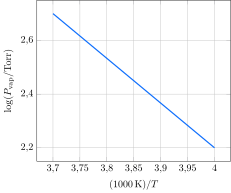

A dependência da pressão de vapor do dióxido de cloro foi medida em função da temperatura.

**Assinale** a alternativa que mais se aproxima da entropia de vaporização do $\ce{ClO2}$.

- [x] $\pu{100 J.K-1.mol-1}$
- [ ] $\pu{200 J.K-1.mol-1}$
- [ ] $\pu{300 J.K-1.mol-1}$
- [ ] $\pu{400 J.K-1.mol-1}$
- [ ] $\pu{500 J.K-1.mol-1}$