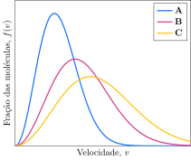

Considere a distribuição de velocidades de três amostras de hélio, **A**, **B** e **C**.

**Assinale** a alternativa com a temperatura de **A**, **B** e **C**, respectivamente.

- [ ] $\pu{300 K, 700 K, 1100 K}$
- [ ] $\pu{300 K, 1100 K, 700 K}$
- [ ] $\pu{700 K, 300 K, 1100 K}$
- [ ] $\pu{1100 K, 300 K, 700 K}$
- [x] $\pu{1100 K, 700 K, 300 K}$
