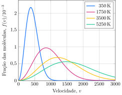

Considere duas garrafas, uma contendo $\pu{1 mol}$ de $\ce{He}$ e outra $\pu{1 mol}$ de $\ce{Ar}$ na mesma temperatura. Nessa temperatura, a raiz da velocidade quadrática média do Ar é $\pu{467 m.s-1}$. A distribuição de velocidades do argônio em diferentes temperaturas é apresentada a seguir.

- **Determine** a temperatura das garrafas.
- **Determine** a razão entre o número de átomos de hélio e de argônio com velocidade mais provável nessa temperatura.

> - $\pu{350 K}$
> - $0,32$
