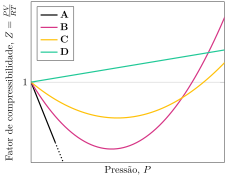

Considere o fator de compressibilidade.

**Assinale** a alternativa que relaciona as curvas para referentes às espécies $\ce{H2}$, $\ce{NH3}$, $\ce{CH4}$ e $\ce{C2H6}$ respectivamente.

- [ ] **A, B, C, D**
- [ ] **B, C, A, D**
- [ ] **D, A, B, C**
- [x] **D, A, C, B**
- [ ] **D, C, B, A**
