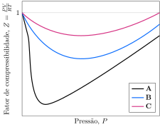

Considere a variação do fator de compressibilidade com a pressão para um mesmo gás.

**Assinale** a alternativa que relaciona as curvas em ordem crescente de temperatura.

- [ ] **A, B, C**
- [ ] **A, C, B**
- [ ] **B, C, A**
- [ ] **C, A, B**
- [ ] **C, B, A**

