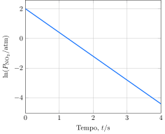

Considere  a reação de decomposição do $\ce{N2O}$ a $\pu{1000 K}$:

$$
\ce{2 N2O(g) -> 2 N2(g) + O2(g)}
$$

Os resultados a seguir foram obtidos no estudo da cinética dessa reação:

**Assinale** a alternativa que mais se aproxima da velocidade inicial de formação de oxigênio em um experimento em que a pressão parcial de $\ce{N2O}$ é $\pu{30 atm}$.

- [ ] $\pu{12 atm.s-1}$
- [ ] $\pu{24 atm.s-1}$
- [x] $\pu{72 atm.s-1}$
- [ ] $\pu{360 atm.s-1}$
- [ ] $\pu{720 atm.s-1}$
