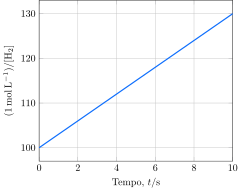

Considere  a reação de decomposição do $\ce{HI}$ a $\pu{800 K}$:

$$
\ce{H2(g) + I2(g) -> 2 HI(g)}
$$

Considere os resultados obtidos no estudo da cinética dessa reação com mesma concentração inicial de $\ce{H2}$ e $\ce{I2}$:

**Assinale** a alternativa que mais se aproxima da velocidade inicial de formação de $\ce{HI}$ em um experimento em que a concentração de $\ce{H2}$ e $\ce{I2}$ é $\pu{2 mol.L-1}$.

- [ ] $\pu{6 atm.s-1}$
- [ ] $\pu{12 atm.s-1}$
- [x] $\pu{24 atm.s-1}$
- [ ] $\pu{48 atm.s-1}$
- [ ] $\pu{72 atm.s-1}$
