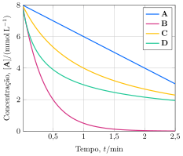

Considere os resultados obtidos no estudo cinético da decomposição de quatro substâncias, $\ce{\textbf{A}}$, $\ce{\textbf{B}}$, $\ce{\textbf{C}}$ e $\ce{\textbf{D}}$.

**Assinale** a alternativa com a substância que sofre decaimento com cinética de primeira ordem.

- [ ] Nenhuma
- [ ] $\ce{\textbf{A}}$
- [ ] $\ce{\textbf{B}}$
- [ ] $\ce{\textbf{C}}$
- [x] $\ce{\textbf{D}}$
