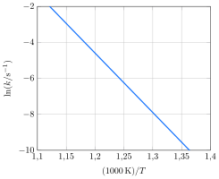

A constante de velocidade da conversão de ciclopropano em propeno foi medida em várias temperaturas, com os seguintes resultados:

**Assinale** a alternativa que mais se aproxima da constante cinética da reação a $\pu{600 \degree C}$.

- [ ] $\pu{7,5 e-3 s-1}$
- [ ] $\pu{8,0 e-3 s-1}$
- [x] $\pu{8,5 e-3 s-1}$
- [ ] $\pu{9,0 e-3 s-1}$
- [ ] $\pu{9,5 e-3 s-1}$
