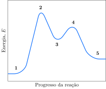

Considere a reação catalisada descrita pelo mecanismo:

$$
\begin{aligned}
\ce{\textbf{A} + \textbf{BC} \rightarrow \textbf{AC} + \textbf{B}} \\
\ce{\textbf{AC} + \textbf{D} \rightarrow \textbf{A} + \textbf{CD}}
\end{aligned}
$$

O perfil energético é:

**Assinale** a alternativa *correta*.

- [ ] Os intermediários de reação são representados por $\mathbf{2}$ e $\mathbf{3}$ e equivalem, respectivamente, aos compostos $\ce{\textbf{BC}}$ e $\ce{\textbf{AC}}$.
- [ ] Os reagentes, representados por $\mathbf{1}$, são os compostos $\ce{\textbf{A}}$ e $\ce{\textbf{D}}$.
- [x] O complexo ativado representado por $\mathbf{4}$ tem estrutura $\ce{\textbf{A}\bond{...}\textbf{C}\bond{...}\textbf{D}}$.   
- [ ] O produto, representado por $\mathbf{5}$, é único e equivale ao composto $\ce{\textbf{CD}}$.
- [ ] A presença do catalisador $\ce{\textbf{A}}$ torna a reação exotérmica. 
