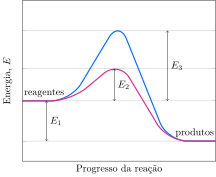

Considere o perfil energético de uma reação na presença e ausência de catalisador.

**Assinale** a alternativa *correta*.

- [ ] A curva **A** representa a reação catalisada, que ocorre com absorção de calor.   
- [ ] A curva **B** representa a reação catalisada, que ocorre com absorção de calor.   
- [ ] A curva **A** representa a reação catalisada com energia de ativação dada por $E_1 + E_2$.  
- [ ] A curva **B** representa a reação não catalisada, que ocorre com liberação de calor e a sua energia de ativação é dada por $E_3 + E_1$.
- [x] A curva **A** representa a reação catalisada, que ocorre com liberação de calor e a sua energia de ativação é dada por $E_2$.
