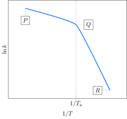

A constante de velocidade de uma reação foi medida em várias temperaturas, com os seguintes resultados:

Considere as proposições.

1. [ ] O trecho $P$-$Q$ é referente a reação direta, enquanto o trecho $Q$-$R$ se refere à reação inversa.
2. [x] Para temperaturas menores que $T_b$, o mecanismo controlador da reação em questão difere daquele para temperaturas maiores que $T_b$.
3. [x] A energia de ativação da reação no trecho $P$-$Q$ é menor que a no trecho $Q$-$R$.
4. [ ] A energia de ativação da reação direta é menor que a da reação inversa.

**Assinale** a alternativa que relaciona as proposições *corretas*.
