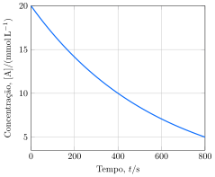

A constante de velocidade da reação de decomposição de um composto $\ce{\textbf{A}}$ foi medida em várias temperaturas, com os seguintes resultados:

| $T/\pu{\degree C}$  |    $\pu{25}$  |   $\pu{45}$   |    $\pu{55}$  |     $\pu{65}$ | 
|:--------------------|--------------:|--------------:|--------------:|--------------:|
| $k/\pu{s-1}$        | $\pu{3,2e-5}$ | $\pu{5,1e-4}$ | $\pu{1,7e-3}$ | $\pu{5,2e-3}$ |

Uma solução contendo 0,02 mol.L-1 de $\ce{\textbf{A}}$ foi adicionada a um reator em temperatura $T$, e a concentração de $\ce{\textbf{A}}$ foi monitorada.

- **Determine** a energia de ativação da reação.
- **Determine** a ordem da reação.
- **Determine** a constante cinética em temperatura $T$.

---

- $\pu{100 kJ.mol-1}$
- Primeira ordem
- $\pu{55 \degree C}$
