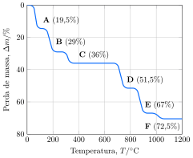

Uma amostra de sulfato de cobre pentahidratado foi submetiva à análise termogravimétrica.

O composto $\ce{\textbf{D}}$ é formado quando exatamente metade de $\ce{\textbf{C}}$ se decompõe para formar $\ce{\textbf{E}}$. O aquecimento de $\ce{\textbf{E}}$ leva a uma reação de oxirredução formando $\ce{\textbf{F}}$.

- **Determine** a fórmula molecular dos compostos $\ce{\textbf{A}}$, $\ce{\textbf{B}}$ e $\ce{\textbf{C}}$.
- **Apresente** a equação balanceada para esta reação de formação de $\ce{\textbf{E}}$.
- **Apresente** a equação balanceada para esta reação de formação de $\ce{\textbf{F}}$.
